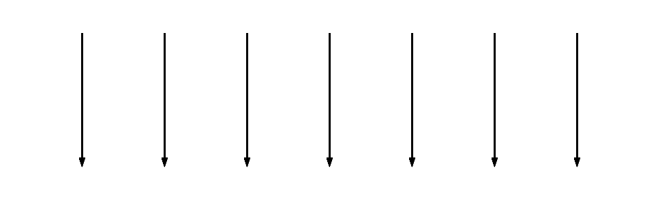

# 测试代码，而不是健全

> 原文：<https://medium.com/hackernoon/test-code-not-sanity-1e4c0ee51d06>

## 简单的测试变得简单

简单这个词有着漫长而肮脏的历史。随着时间的推移，这个意思已经淡化了，以至于今天 simple 被用作一个普通的无冒犯性的赞美词。让我们快速浏览一下 simple 的一些常用含义，看看它们如何应用于软件测试。

# 容易的

这是最常用的简单定义之一，也可能是最危险的定义之一。[里奇·希基](https://twitter.com/richhickey) (Clojure 的终身仁慈独裁者)做了一个关于[简单 vs 容易](https://youtu.be/rI8tNMsozo0?t=50s)的完整演讲，但总结一下:容易是主观的，简单是客观的。这个衡量标准更多地依赖于个人能力和经验，而不是任何可以普遍衡量的东西。任务的容易程度与完成任务所需的努力和痛苦成反比。

当应用到测试领域时，这种思维方式导致了[快照测试](https://facebook.github.io/jest/docs/en/snapshot-testing.html)和类似的方法。虽然这些肯定很容易设置和编写，但我个人认为它们的价值相当低。他们记录并盲目信任现有的软件实现，而不是指定软件*应该*的行为。

# 最小的

这个定义被被评估的软件的大小和/或数量所困扰。虽然这些方法可以代表简单性，但是还有其他更直接的方法来进行评估。这是第一个意义，有一个客观的衡量标准，可用于比较方法，这是一个积极的。

在测试领域，这将引导我们使用单个`assert`类型的函数，像 [Node.js 已经提供的](https://nodejs.org/api/assert.html#assert_assert_value_message)。用户将负责运行测试，并在出现故障时提供故障排除消息。诸如监视模式或代码覆盖率之类的其他特性肯定会被完全忽略。这种工具已经成为测试库广泛期待的工具。最终，用户将创建他们自己的特定测试运行程序代码，这些代码最好作为专用库的一部分来编写。

# 整顿

这个含义直接来源于单词 simple 的词源:

> 源自中古英语 simple，源自古法语和法语 simple，源自拉丁语 simplex(“simple”，字面意思为“onefold”)，源自 sim-(“the same”)+plica re(“to fold”)。

Rich Hickey 坚信 simple 的这种用法，并在我之前链接的他的演讲中详细阐述了这一点。为了理解我们的意思，我们从几条直线的图表开始:

想象这些线是软件依赖或执行的线程。显而易见的是，这些是没有缠结的，因此是简单的。

现在，如果我们增加线的数量，但没有线重叠，这仍然是简单的:

仍然可以独立考虑任何一条线。

然而，如果相同数量的线纠缠在一起，那么我们就引入了复杂性:

减少行数也不会使这变得简单:

如果不考虑第二线和第三线之间的相互影响，仍然不可能孤立地对它们进行推理。避免混乱是你的软件的一个很好的目标。这是简单的必要前提，但不是充分条件。为了填补空白，我们必须看看 simple 的原始定义，而不仅仅是它的词源。

# 非化合的

对于 simple 的最终用法，我们需要看一下[技术词典的定义](https://en.wiktionary.org/wiki/simple#Adjective):

1.  (*化学*)由单一物质组成的；**未复合**。
2.  (*数学*)群的:没有正规子群的。
3.  (*植物学* ) **不是** **复叶**，但可能有裂片。
4.  (*动物学*)由单个个体或动物群组成的；**非复合**。

这些定义的共同主题是明确的。如果一个东西可以被分解成独立有用的部分，那么这个意义上的它可以变得更简单。项目管理中的许多最佳实践都是围绕着将任务分解成可消化/可理解的部分，这些都有相关的动机。这个概念类似于术语*原子*，因为它涉及到计算机科学。Stuart hallo way(clo jure 的另一个主要贡献者)有他自己的关于简单性的[演讲](https://youtu.be/cidchWg74Y4?t=10m25s)，非常全面地涵盖了简单的这个和其他定义。

虽然 uncompounded 是相对客观的(类似于 untangled)，但确定评估简单性的适当级别是很重要的。一般来说，这种方法应用于软件，特别是应用于代码时，会有一些实际的限制。编译器和相关工具引入了复杂性，但避免在汇编、机器码甚至处理器背后的底层物理等层次上考虑太简单的程序。

达到这个目标需要重新思考应该用什么基本元素来构建软件。世界上的 Lisps 很久以前就通过将代码表示为数据解决了这个问题。很难想出一个比列表更不可分割的结构，以一种仍然是图灵完整的方式来表示代码。这将指针从命令式代码移向声明式代码。如果我们可以为我们的测试做一些类似的事情呢？

## 这个悬念的答案在我的下一篇文章中:

 [## 禁止软件缺陷

### 被认为有害的测试

hackernoon.com](https://hackernoon.com/ban-software-defects-c96cb4d015dc) 

欢迎给我留言或者发牢骚到 [@okwolf](http://twitter.com/okwolf) ！

# 🐺