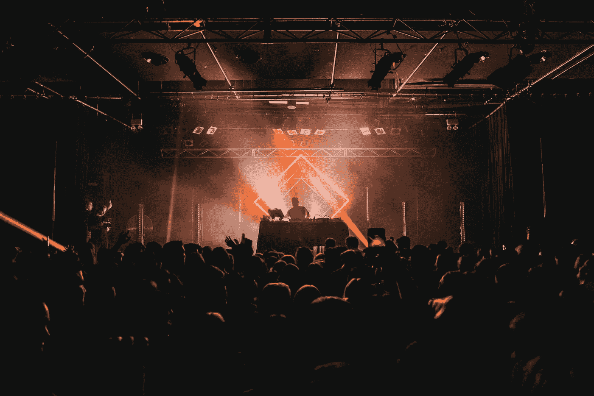

# “测试，1-2-3，麦克风检查”——作为一名专业 DJ，我学到了什么产品管理

> 原文：<https://medium.com/hackernoon/testing-1-2-3-mic-check-what-being-a-professional-dj-taught-me-about-product-management-e0ef1e0d34e5>

现在是晚上 9:30，扬声器在跳动。可以看到参加派对的人随着 50 美分的“In Da Club”振动和唱歌，因为烟雾机器通过激光表演喷出另一股烟雾，与博物馆的安全系统相媲美。

在房间的一个角落里，有一群人正在休息——在连续跳了一个小时的舞之后——明显地擦着额头上的汗水。舞台的前部是一群更专注的舞者，他们迷失在音乐中，完全无视其他人对他们的看法。

作为 DJ 和当晚娱乐节目的主要仲裁者以及一群音乐爱好者的提供者，当一首歌曲开始播放时，看到人群的反应会让人产生各种不同的感觉——满足感、成就感、自豪感，甚至是一种解脱感。

这与我后来担任 T2 产品经理时的感受类似。当功能改进、错误修复或全新产品上市时，为消费做好准备。当我回顾我为各种活动、人群和场所做 DJ 的经历时，有很多经验我可以借鉴，帮助我成为一名更成功的产品经理。

# **处理请求**

DJ 的主要角色之一是能够公开接受歌曲请求。我永远不会忘记有一次，有人在婚礼上要求唱重金属歌曲。虽然这种风格的音乐肯定有特定的时间和地点——可能满足了当天 1%的观众——但重要的是要反击并对它说不。另一方面，在很多情况下，歌曲请求正好符合集合列表，我们非常乐意考虑。类似地，作为产品经理，我总是处理产品特性请求，其中一些有意义，另一些没有意义。

> 关键是，我学会了如何区分这两者，并学会了如何选择是或不是。

如果你要拒绝一个功能请求，或者一个只适合你的用户群中很小一部分人的特殊更新，你需要在取悦其他用户之间取得平衡。

# **双倍下注安打**

几乎在每一个场合，无论是聚会、舞会、婚礼还是俱乐部，总有一组歌曲“令人窒息”。他们可以把成群结队的人带到舞池，让他们唱歌，尖叫，要求更多。我们总是利用这些歌曲，因为我们从在各种人群中演奏的经验中知道它们会起作用。在规划和执行产品路线图时，总是有一种强大的吸引力去挖掘历史数据——无论是 Confluence 中的事后分析文档，吉拉的项目交付绩效，甚至是发布后的客户反馈。

在搜索完这些数据后，我们可以将注意力集中在我们成功规划和执行某个项目的领域。当然，我们知道作为一个团队我们需要改进某些弱点。我们总是封锁时间，试图减少这些热点。但是，我们也知道我们在其他方面很强，如果我们发挥这些优势，在成功执行项目时会有很多积极的结果。

# **尽早、经常地走到顾客面前**

为婚礼策划一套清单总是一个非常详细的过程。在婚礼开始前的几个月，我会和婚礼派对上的人见面，专注地听他们想在婚礼上听到的东西——他们特别喜欢的歌曲，应该远离的音乐类型，等等。虽然我经常不得不满足他们的一些更具体的需求(比如[婚礼派对的入场歌曲](https://www.youtube.com/watch?v=bqGMVH7UkmY))，但他们通常让我来决定演奏什么。在婚礼期间，我会定期与他们联系，以确保事情进展顺利，以及他们是否有任何反馈。

对于产品发布来说，在发布之前整合早期的客户洞察是流程的一个重要部分。这通常包括花费大量时间进行用户测试、调查和打电话。无论我们正在构建和准备推出什么，让它出现在我们的用户群面前是至关重要的，以确保我们在自信地向大众发布之前与他们保持一致。在发布后阶段，我们将部署一个类似的流程，看看反馈和见解是否与我们最初的假设相符，最重要的是，我们是否在实现目标的正确轨道上。

# **永远保持沟通**

除了听到人群的欢呼或口哨声，我们还会更进一步，确保他们参与进来——“今晚大家都好吗？！”“我听不见，大声点！“这不仅仅是播放一首歌，看看人们的反应，我们想让他们知道我们在那里让事情走上正轨。在战壕里，准备好让它成为一次奇妙的经历。另一方面，如果一群人不是很热情，不喜欢某首特定的歌曲，或者来到 DJ 台表达他们的不屑，我们需要直面批评。

虽然我从未试图通过玩 [Whoomp 来召集项目规划会议。(在那里)](https://www.youtube.com/watch?v=ffCEr327W44)，与一组项目涉众沟通是确保发布按计划进行的不可或缺的一部分。设计团队没有从用户测试中获得足够的反馈吗？一个项目是否因为开发中的一些问题而延期？对于使用哪种布局有不同的意见吗？无论这是一个积极的更新，还是我们正面临着一些逆境，沟通和向利益相关者展示这一切是关键，也是项目成功的关键。

12 点。活动开始接近尾声，但弥漫在整个会场的能量仍然如火如荼。这个地方现在感觉像一个桑拿浴室。但是，是时候用最后几首歌来结束了，完成我们在晚上开始时计划要做的事情。回想今晚，确实有一些事情需要改进。也许我们该再做一次尸检了。

*上图由* [*丹尼豪*](https://unsplash.com/@dannyhowe) *上图* [*上图*](https://unsplash.com) *。*