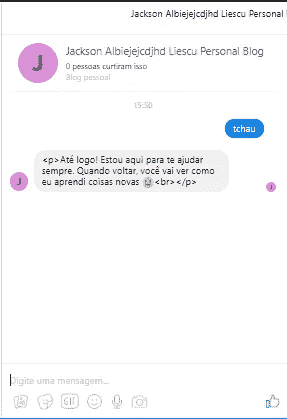

# 用 Nightmare.js 测试脸书聊天机器人。1]

> 原文：<https://medium.com/hackernoon/testing-a-facebook-chatbot-with-nightmare-js-pt-1-d2fc1501113e>


在本教程中，我们将看到如何用[nightman . js](https://github.com/segmentio/nightmare)创建一个端到端的测试来测试一个[脸书](https://hackernoon.com/tagged/facebook)聊天机器人。

假设你已经有一个脸书聊天机器人在运行，因为我们不会在这里看到如何建立一个。

在本文的第一部分**中，**我们将着重于在脸书上创建一个*测试用户*和一个*测试页面*。这个*测试用户*将有能力登录到脸书，并与我们的机器人聊天。为此，我们将使用一个*测试页面*，以便我们的聊天机器人可以通过它发送和接收消息。

可选地，在本教程的最后，我们将看到如何配置 Azure Bot 服务来连接 Bot 和*测试页面*。

等我写完**第二部**，我会把链接[贴在这里](#)。这将是最后一部分，我们将在 Nightmare.js 上编写一个简单的问题&答案 api 来测试聊天机器人。

## 索引:

1.  创建测试用户
2.  创建测试页面
3.  将测试页面与 BOT 应用程序链接起来
4.  (可选)将 BOT 与 Azure 上的测试页面连接起来

让我们开始吧…

# 创建测试用户

根据脸书，测试用户被描述为:

> 测试用户是可以用来测试你的应用的特殊用户。他们对真实用户账户是隐藏的[，你用测试用户生成的任何数据将只对该应用上的其他测试用户可见，或者对该应用上具有管理员、开发者或测试者角色的真实用户可见。测试用户也免受我们的垃圾邮件和虚假账户检测系统的影响，因此当您使用他们测试您的应用程序时，他们不会被禁用。](https://developers.facebook.com/docs/apps/test-users#rules)

*要了解更多关于测试用户的信息，您可以访问* [*这个链接。*](https://developers.facebook.com/docs/apps/test-users)

由于我们正在尝试测试我们的机器人，很可能我们必须设置一个脸书应用程序，以便机器人可以与 Messenger 交换消息。

我们可以在脸书应用页面上创建测试用户，该页面可以在[应用仪表板](https://developers.facebook.com/apps/)上访问。

在 App 页面，点击*功能*打开子菜单，然后点击*测试用户*。这将打开允许我们创建测试用户的页面，如图**图 1** 所示。


Figure 1 —Test Users page

点击添加打开一个模态，如图**图 2** 所示。然后，为“授权测试用户使用此应用程序”选择“是”。

有必要给测试用户正确的权限来创建和发送消息到我们将要创建的测试页面。登录权限有: *manage_pages* 、 *pages_show_list* 和 *pages_messaging* 。

我们可以保留其他选项的默认值。


Figure 2 — Creating the Test User

接下来我们需要设置一个密码。否则，我们无法使用测试用户登录脸书(或 Messenger)。在获取令牌之前设置密码非常重要，因为每次密码更改时，我们都需要生成一个新的令牌。

点击*编辑*打开一个小菜单，然后点击“更改该测试用户的名称或密码”，如图**图 3** 所示。


Figure 3 — Setting the test user password

更改用户密码后，再次点击*编辑*。这一次，点击“为这个测试用户获取一个访问令牌”，如图**图 4** 所示。不要忘记保存生成的令牌以备后用。


Figure 4— Getting an access token for the test user

既然测试用户已经设置好了。我们现在可以用他的电子邮件和密码登录 Facebook Messenger。试试吧，因为这就是我们如何登录**nightman . js**应用程序的。

请注意，该用户还不能发送消息。我们也不能和他一起给机器人发信息。这就是我们将在下一步创建测试页面的原因。

BOT 也需要配置为从测试页面发送和接收消息。最后，我们将有两个(或者更多)页面与我们的 BOT 应用程序相连接。

# **创建一个测试页面**

测试页面允许我们在不使用产品页面的情况下测试机器人的应用程序。创建一个测试页面非常简单，我们只需要使用[脸书图形 API](https://developers.facebook.com/tools/explorer) 发送一个 POST 请求。

```
POST /v3.1/:testUserId/accounts
```

**应用**:选择你的 BOT 应用名称

**访问令牌**:粘贴上一步得到的测试用户访问令牌。

**查询参数**(必填):

*   名称:页面名称。
*   category_enum:页面类别。
*   关于:这一页是关于。
*   图片:页面的一些有效图片。
*   封面照片:一些有效的封面照片

你可以在*链接*部分查看关于这个 API 的更多信息。现在，我们将使用以下查询参数来创建测试页面。

*   名字:杰克逊·阿尔比耶克德·里斯库个人博客
*   类别枚举:个人博客
*   关于:Jackson Albiejejcdjhd Liescu 测试页
*   图片:[https://avatars1.githubusercontent.com/u/149531?v=3&s = 460](https://avatars1.githubusercontent.com/u/149531?v=3&s=460)
*   cover _ photo:{ " URL ":" https://orig 00 . deviantart . net/7db 9/f/2016/303/7/5/nature _ beautiful _ wheat _ field _ _ _ Facebook _ cover _ by _ tweaker tea-dams gob . jpg " }

```
POST /v3.1/100470524281527/accounts?name=Jackson Albiejejcdjhd Liescu Personal Blog&category_enum=PERSONAL_BLOG&about=Jackson Albiejejcdjhd Liescu test page&picture=[https://avatars1.githubusercontent.com/u/149531?v=3&s=460&cover_photo={](https://avatars1.githubusercontent.com/u/149531?v=3&s=460&cover_photo={)"url":"[https://orig00.deviantart.net/7db9/f/2016/303/7/5/nature_beautiful_wheat_field___facebook_cover_by_tweakertea-damsgob.jpg](https://orig00.deviantart.net/7db9/f/2016/303/7/5/nature_beautiful_wheat_field___facebook_cover_by_tweakertea-damsgob.jpg)"}
```

**图 5** 显示了我们向脸书图形 API 发送 POST 请求后的结果。如果成功，将返回测试页面 ID。留着以后用。


Figure 5 — Creating a Test Page

# 将测试页面与 BOT 应用程序链接起来

为了让聊天机器人通过测试页面接收和发送消息，我们需要获取页面的访问令牌。但是，默认情况下注册到页面的访问令牌是短期访问令牌，这意味着它会在很短的时间内过期。

我们接下来要做的是将这个访问令牌“转换”成一个长期访问令牌，其生存期为 60 天。我们总是可以使用默认(短期)访问期限来刷新我们的长期访问令牌。

## 检索测试页面的*短期*页面访问令牌

```
GET /v3.1/me/accounts
```

**应用**:选择你的 BOT 应用名称

**访问令牌**:测试用户访问令牌


Figure 6

要订阅该页面，我们只需发送另一个 POST 请求。但是首先，用测试页面访问令牌更改访问令牌。这将在当前选定的应用程序上订阅应用程序。如果正确定义了所有权限，我们应该会收到一条*成功*消息。

```
POST /me/subscribed_apps
```


Figure 7

## 为测试页面获取一个长期页面访问令牌

我们可以通过另一个 API 调用来检索我们的长期访问令牌。然而，这次我们将使用 *CURL* 命令，因为这个 API 不能在 Graph API Explorer 上访问。

如果你没有 CURL，你可以选择任何你想要的可以发送 POST 请求的应用程序。

以下 **curl** 命令查询参数:

*   客户端标识:脸书应用标识
*   客户端秘密:脸书应用程序秘密
*   fb 交换令牌:页面令牌

```
curl -X GET "https://graph.facebook.com/oauth/access_token?grant_type=fb_exchange_token&client_id=&client_secret=&fb_exchange_token="----------------------------------------Response:
{
  "access_token": "EAAcJ5P3IBycBAEencptoDloIKrAfDP0WZCTl3zMKCSCUiZBD14hja7DhGczPWdDDXVYKesZABugggCrg0AkUYHiySb1dm3VzHRuwURxHIHM1373KFFiPPW7U6Xse3tAGOYYAecaaHjiKl0XmR5NxfE3v40vrZCKFtby253wvcotO8QueTLuEZBVVl38ZD",
  "token_type": "bearer",
  "expires_in": 5184000
}
```

现在，如果我们尝试登录 Facebook Messenger，我们可以看到可以向我们刚刚创建的测试页面发送消息。

为此，只需在搜索栏上搜索测试页面名称，该页面就会出现在结果中。**图 8** 显示了本教程的最终结果。


Figure 8 — Chatting with the Test Page

# (可选)将 BOT 与 Azure 上的测试页面连接起来

这一步假设您正在使用 Azure Bot 服务创建聊天机器人。

在 *Bot 频道注册*资源，点击*频道*>*Facebook Messenger*。在这个页面上，您可以将您的 BOT 应用程序链接到 Facebook Messenger。

要将 BOT 与测试页面连接，请单击“+ Add a new page”并插入测试页面 ID 和测试页面长期访问令牌。现在你应该有两个链接到你的机器人的页面:原始页面和测试页面。

聊天机器人现在应该链接到您的测试页面了。要检查这一点，请使用测试用户凭据登录 Messenger，并尝试向测试页面发送消息。如果一切正常，机器人会发回一个答案。图 9 给出了一个例子。



Figure 9 — BOT chatting with the Test Page

我们已经成功地创建了一个测试用户和一个测试页面。现在我们已经掌握了为聊天机器人创建端到端测试所需的一切:测试用户的电子邮件和密码，以及一个机器人可以与用户聊天的测试页面。

在本教程的第二部分，我们将看到如何使用我们在这里所做的来测试我们的聊天机器人集成。

回头见！

## 链接:

*   https://developers.facebook.com/docs/apps/test-users
*   【https://developers.facebook.com/docs/apps/test-pages 
*   [https://developers . Facebook . com/docs/graph-API/reference/page-category/](https://developers.facebook.com/docs/graph-api/reference/page-category/)
*   [https://developers.facebook.com/tools/explorer](https://developers.facebook.com/tools/explorer)
*   [https://www.messenger.com](https://www.messenger.com)
*   [https://azure.microsoft.com/pt-br/services/bot-service/](https://azure.microsoft.com/pt-br/services/bot-service/)