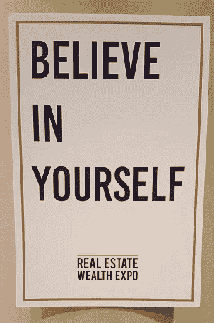
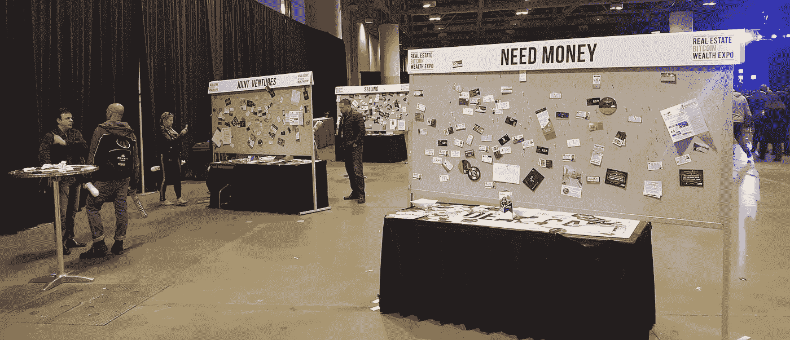
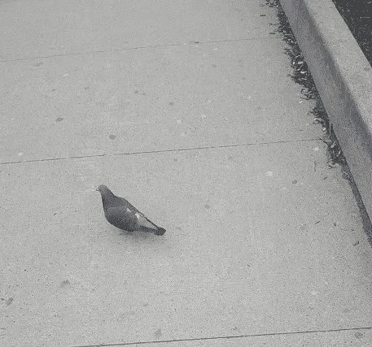

# 在多伦多的房地产比特币财富博览会上测试我对人性的信心

> 原文：<https://medium.com/hackernoon/testing-my-faith-in-humanity-at-torontos-real-estate-bitcoin-wealth-expo-fafa5bd9b688>

The vast nothingness of the Real Estate Bitcoin Wealth Expo.

作为一个非常喜欢超现实体验的人，我不能错过周六的机会，去看西尔维斯特·史泰龙和皮特保罗与一群一线明星和快速致富的骗子一起给成千上万不知所措的多伦多人做励志演讲。

地铁广告的车祸已经足够吸引我了。曾经不起眼的*房地产财富博览会*已经变成了*房地产* ***比特币*** *财富博览会*(就像飞蛾扑火一样)，并且由于 Sly 莫名其妙地同意参加演出，今年有了一位真正的超级明星。

学习如何成为百万富翁，贪婪的人群得到了承诺，带着可怕的预见性，他们涌向多伦多会议中心，梦想着轻松的财富，燃烧着物质的欲望。

组织者已经尽了相当大的努力来分散客人对活动险恶用心的注意力([多伦多房屋销售同比下降 40%](http://business.financialpost.com/real-estate/toronto-luxury-home-sales-tank-from-last-years-record-pace)，博览会战略性地参观了需要买家的城市，[麦克莱恩去年报道](http://www.macleans.ca/economy/realestateeconomy/a-day-of-insanity-that-typifies-torontos-housing-market/))，部署了一大批热情的工作人员在现场工作，并在每个角落张贴鼓舞人心的报价海报。

当我走下会议中心的自动扶梯进入地狱深渊时，我被一个威利·旺卡时代的吉恩·怀尔德模仿者击掌。当我在登记处拿起我的徽章时，我无意中听到一个男人在电话里说他在做“愚蠢的社交活动”，一个女人带着疯狂的笑容问我是否“兴奋”。

‘Bitcoin’ missing from the logo on the posters.

一进入巨大的主厅，大约三秒钟就能听到第一个大卫·布伦特主义，由布莱恩·艾伦和他的“房地产融资&翻转”演讲提供。“听说过房地产吗？没有？”他打趣道。“你们当中有多少人银行里还有钱？”我刚到那里两分钟，史蒂夫·乔布斯和他的座右铭“与众不同”已经出现在大屏幕上。

“你不需要房地产教育，”艾伦告诉观众，然后讲述了一个年轻人的故事，尽管他有“灯柱一样的智商”，但他从快速和肮脏的房屋投资中赚了足够的钱，足以购买自己的揽胜。

他叫一对尼亚加拉夫妇上台讲述他们的成功故事。“我不太怀疑”，丈夫笑着说。"我妻子把我从一些糟糕的交易中拯救了出来。"他的房地产致富秘诀是:“赶快行动吧！”

一种巨大的空虚感笼罩着我。房地产比特币财富博览会是一个悖论:它是如此完美的*虚无*，却又在某种程度上概括了现代社会中*的一切*弊病。这里的每一个细节，或大或小，似乎都被放大了；这个地方充斥着无头消费主义的警示故事——人类目的的恐怖被简化为屏幕上的数字。“像美国人一样思考！”艾伦命令他的死眼弟子观众。

“我被诊断患有多动症，我不太聪明，”他继续说道。但这并不能阻止他。“整个学校系统都坏了。他们教你如何让别人变得富有！”这个话题已经形成了一个熟悉的模式:好吧，你很笨，但是看，审查一处房产需要 10 分钟，甚至你也能做到。无所畏惧就好。恐惧这个词被一次又一次地利用，刺激人们撕开任何可能维系他们生活的怀疑的悬丝。

我看到一个女人穿着高跟鞋，她几乎不能走路。“我知道我看起来像是嗑药了，但我没有，”艾伦一边包东西一边向我们保证。“房地产是我的毒品。”演讲结束后，我看到人们真的在空中挥舞着他们的信用卡，吵着要报名参加他 1000 美元的 3 天课程。正如我所观察到的，我想知道这些人是如何在这种自发的混乱中日复一日地生活的。一天中这么早接受太多了。

是时候伸伸腿了。我漫步走出大厅，来到下一层寻找更多的疯狂。这里有七个小房间，全天都有会谈。我浏览了一下时间表，看看什么让我感兴趣——让我们试试马克·斯通的“电子商务”。我走进他的办公室，向他推销他健康的美国生活方式——棒球和苹果派之类的东西——这一切都是因为他价值数百万美元的亚马逊卖家业务，他发誓说，这些业务非常容易起步。

只字未提他多年来的辛勤工作和奉献精神，也没有提到他可能还会投入大量时间——这不是人们在这里想听到的。在斯通超级乐观的强健外表下，确实出现了一个漏洞:“我一度损失了很多钱，”他承认道。"我需要价值约 3000 美元的治疗费。"请注意，即使是他的精神健康，也是用修复它的花费来描述的。还不到中午，我的厌世情绪已经达到创纪录的高水平。

我从斯通的初级课程中走出来，就像一个几近崩溃的人在寻找什么——任何东西——来清洗我头脑中令人作呕的残余。许多讲座都是关于最新的投资时尚；不管他们用什么样的行话让人进门。不仅有几个是关于比特币的，还有关于以太坊和大麻的课程。所有房间外面都排起了长队，数百名失望的客人被留在走廊里，不知道自己该怎么办。

“Toke Biz”是我决心不要错过的一家，所以我提前 20 分钟排队。一个卖大麻的兄弟排在我后面，看起来好像想和我搭讪。我小心翼翼地不去看他的眼睛。幸运的是，两个看起来友好的绅士加入了他身后的队伍，他抓住了机会。“我要去园艺学校，”他热情地告诉他们。我真的想把它长出来，你知道吗？"

当我们拖着脚步走进会场时，须后水和口香糖的味道混合在一起，令人陶醉。一位名叫 Ted Ohashi(据我所知，是真名)的日本老人发言，向主要由千禧一代组成的人群发表演讲(我从未见过比在*房地产比特币大麻财富博览会*——孩子们的大麻和密码，婴儿潮一代的房地产)上更明显的代沟)。

当 Ohashi 非常缓慢地说出一些大家都知道的关于大麻的事实时，坐在我旁边的那个戴眼镜的家伙靠向他的朋友，低声说，“他现在肯定*在服用某种印度大麻”。他对自己的观察很满意，兴高采烈地卷了一根大麻烟，我真想把自己的头砸到面前的椅子上。*

在忍受了 15 分钟的“Toke Biz”后，我回到走廊，重新感受了一下这里的气氛，第三次走过这个看起来像吉恩·怀尔德的人。他还在击掌庆祝。我在大厅里听到了一场关于加密货币的小组讨论。一名男子穿着雨披，戴着饰有黄色羽毛的礼帽，用经济学语言向人们提供比特币投资建议(我后来知道那是前儿童演员布洛克·皮尔斯)。这就是我们现在生活的世界。

奇怪的是，被宣传为房地产和比特币事件的播客——另一个目前让人们眼中出现美元符号的词——也进入了议程。我排队听资深播客亚当·卡罗拉的“大师课”。一位工作人员兴奋地问我播客是不是我的百万富翁。Carolla 的演讲以一些婴儿潮一代的幽默开始，并穿插了一些名人的名字，无聊的轶事和陈腐的题外话。这群人中西装革履的人越来越少，更多的人相信他们的财富之路在于他们独特的个性。“播客应该有多长？”一位有抱负的互联网明星认真地问道。

A Real Estate Bitcoin Wealth Expo attendee outside the Convention Centre.

下午 3:30，是派对说唱歌手皮特保罗发表激情励志演讲的时候了，接下来是精心编排的四首歌曲表演。灯灭了，房间里的能量积聚起来。

你知道这是什么样的一天，当它留给皮特保罗来恢复你对人类被摧毁的信心。他是我听到的第一个说出“努力工作”这个词的演讲者，他告诉我们“在破碎的社区建立医院和学校”是让他快乐的事情，而不是金钱。随着人群的欢呼，我开始想，也许还有希望。也许这些人也有善良的一面。也许他们毕竟是人类。一位女士让我坐在她旁边的贵宾席上，也许她也被他的话打动了。

史泰龙定于下午 6 点出发。当房间里的人满怀期待地等待时，我环顾四周，看到一张张疲惫、困惑的脸。我想象他们会如何按照今天给他们的所有建议行事，这些人中是否有人会根据这些骗子站不住脚的指导做出毁掉一生的财务决定。

不过现在，让他们享受洛奇吧。“我在 12 年里被 13 所学校开除了，”他告诉被明星迷住的观众。"那时他们不知道 ADD 是什么."(精神状态和这个事件有什么关系？)“记住，你只有一次机会。该死的。生活。每人！"当人群的狂热达到白热化时，他兴奋起来。"继续跳舞吧，伙计们！"

这是激动人心的一天，到处都是笑容。我觉得自己戴着固定的冷笑是个扫兴的人，所以当我终于在死亡时刻露出第一个假笑时，这是一种解脱，这是由一个似乎没有人注意到的美味的畏缩喜剧带来的。一位特殊教育教师问史泰龙，有“学习困难”的孩子如何克服挑战。“你是说有‘问题’的孩子，对吗？”他澄清道。

尽管如此，39 美元和 10 个小时的生命换来了一个肮脏的微笑。可能不是那些在房地产比特币大麻播客财富博览会上的大师们所说的我投资的良好回报。

***免费阅读我的中篇小说***[***——下多伦多***](/@adamwinfield/under-toronto-6d457338408d) ***。***

**推特:**[**@ Adam winfield**](https://twitter.com/adamwinfield)

**博客:** [**重写本**](https://palimpsestaw.wordpress.com/)