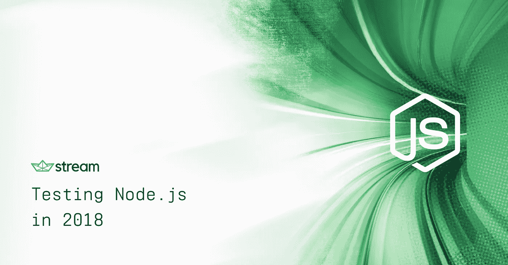
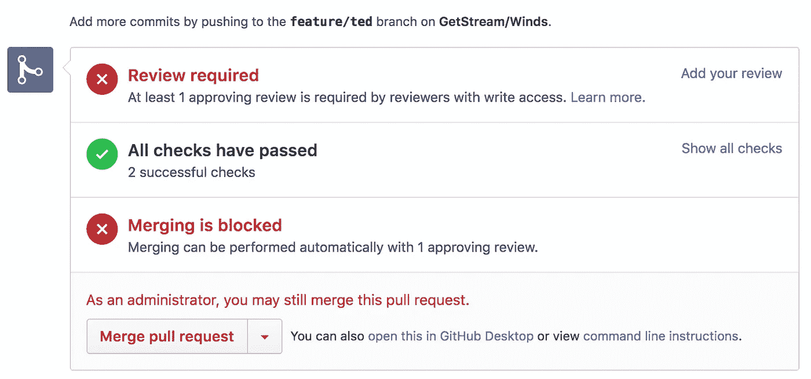
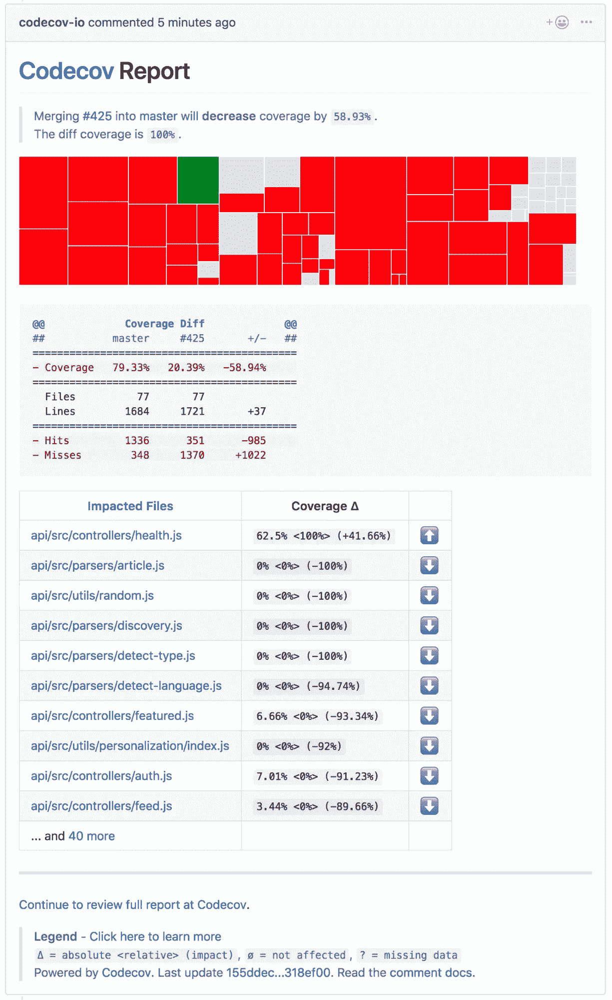
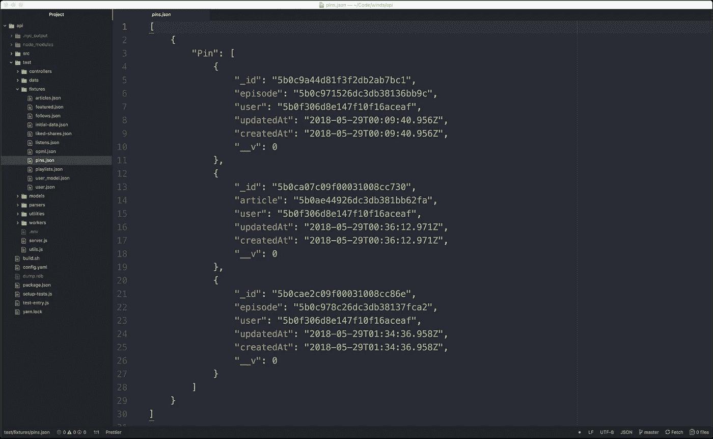

# 2018 年测试 Node.js

> 原文：<https://medium.com/hackernoon/testing-node-js-in-2018-10a04dd77391>

[Stream](https://getstream.io) 为 3 亿多终端用户提供信息。由于所有这些用户都依赖于我们的基础设施，我们非常擅长测试投入生产的所有东西。我们的主要代码库是用 Go 编写的，还有一些 Python 的剩余代码。

我们最近的展示应用程序 [Winds 2.0](https://getstream.io/winds) 是用 Node.js 构建的，我们很快发现我们在 Go 和 Python 中常用的测试方法不太合适。此外，创建适当的测试套件需要在 Node.js 中做一些前期工作，因为我们使用的框架不提供任何类型的内置测试功能。

不管使用什么语言，建立一个好的测试框架都是很棘手的。在这篇文章中，我们将揭示 Node.js 测试的难点，这是我们决定在 Winds 2.0 中使用的各种工具，并为您指出编写下一组测试的正确方向。

# 为什么测试如此重要

我们都曾将错误的承诺推向生产，并承担后果。发生这种事可不好玩。编写一个可靠的测试套件不仅是一个很好的健全性检查，而且它允许您完全重构代码，并对您的代码库仍然有效充满信心。如果您刚刚启动，这一点尤为重要。

如果你和一个团队一起工作，拥有测试覆盖率是非常重要的。没有它，团队中的其他开发人员几乎不可能知道他们的贡献是否会导致突破性的变化(哎哟)。

编写测试也鼓励你和你的队友将代码分成更小的部分。这使得理解你的代码变得更加容易，并且在这个过程中修正错误。生产率的提高甚至更大，因为你在早期就发现了错误。

最后，如果没有测试，你的代码库也可能是一个纸牌屋。你的代码绝对不可能是稳定的。

# 困难的部分

在我看来，我们在 Winds 上遇到的大多数测试问题都是针对 Node.js 的。比如你在 macOS 上运行“brew upgrade”(安装了 homebrew)，你看到 Node.js 新版本的几率相当高。随着 Node.js 的快速发展，库也紧随其后，很难保持与最新库的同步。

**下面是我立即想到的几个痛点:**

1.  Node.js 中的测试非常固执己见，同时又不固执己见。许多人对测试基础设施应该如何构建和衡量是否成功有不同的看法。可悲的是，对于如何进行测试，还没有黄金标准。
2.  在您的应用程序中有大量的框架可供使用。然而，它们通常是最小的，没有良好定义的配置或引导过程。这导致了非常普遍的副作用，但是很难诊断；因此，您很可能会从头开始编写自己的测试运行程序。
3.  几乎可以肯定的是，你会被*要求*编写你自己的测试运行程序(我们马上就要谈到这一点)。

上面列出的情况并不理想，Node.js 社区需要尽快解决这个问题。如果其他语言已经发现了这一点，我认为 Node.js 这种被广泛采用的语言也应该发现这一点了。

# 编写您自己的测试运行程序

所以…你可能想知道什么是测试赛跑者*。说实话，没那么复杂。测试运行程序是测试套件中最高的组件。它允许您指定全局配置和环境，以及导入设备。有人会认为这很简单，也很容易做到…对吗？没那么快…*

*我们了解到，尽管有大量的测试框架，但没有一个 Node.js 提供统一的方法来构建您的测试运行器。可悲的是，这取决于开发人员。下面是对测试跑步者要求的快速分解:*

*   *能够加载不同的配置(例如，本地、测试、开发)并确保您 ***永远不会*** 加载生产配置——您可以猜到发生这种情况时会出现什么问题。*
*   *用虚拟数据提升和播种数据库以进行测试。这必须适用于各种数据库，无论是 MySQL、PostgreSQL、MongoDB 还是任何其他数据库。*
*   *能够加载 fixtures(带有种子数据的文件，用于在开发环境中进行测试)。*

*对于 Winds，我们选择使用摩卡作为我们的测试跑步者。Mocha 提供了一种简单的编程方式，通过命令行工具(与 Babel 集成)在 ES6 代码库上运行测试。*

*为了开始测试，我们自己注册了 Babel 模块加载器。这为我们在 Babel 覆盖 Node.js 模块加载过程之前对导入哪些模块提供了更好的控制，使我们有机会在运行任何测试之前模拟模块。*

*此外，我们还使用 Mocha 的 test runner 特性为特定的请求预先分配 HTTP 处理程序。我们这样做是因为在测试期间不运行正常的初始化代码(Chai HTTP 插件模拟服务器交互),并且运行一些安全检查以确保我们没有连接到生产数据库。*

*虽然这不是测试运行程序的一部分，但是拥有一个 fixture loader 是我们测试套件的一个重要部分。我们研究了现有的解决方案；然而，我们决定编写我们自己的助手，以便它能满足我们的需求。使用我们的解决方案，我们可以在手工生成或编写 fixture 时，通过遵循一个简单的特别约定来加载具有复杂数据依赖性的 fixture。*

# *风力工具*

*尽管这个过程很麻烦，但我们能够找到工具和框架的正确平衡，使适当的测试成为我们后端 API 的现实。以下是我们的选择:*

# *摩卡☕*

*被描述为“在 Node.js 上运行的功能丰富的 JavaScript 测试框架”的 Mocha ，是我们立即选择的工作工具。有超过 15，000 名明星、许多支持者、赞助者和贡献者，我们知道这是适合这项工作的框架。*

# *柴🥃*

*接下来是我们的断言库。我们选择了传统的方法，这是最适合摩卡——[柴](http://www.chaijs.com/)的方法。Chai 是 Node.js 的 BDD 和 TDD 断言库。通过一个简单的 API，Chai 很容易集成到我们的应用程序中，并允许我们轻松断言我们应该从 Winds API 返回的***。最重要的是，使用 Chai 编写测试感觉很自然。这里有一个简短的例子:****

# ***兴农🧙‍***

***由于能够使用任何单元测试框架， [Sinon](http://sinonjs.org/) 是我们模仿库的第一选择。同样，一个具有最小设置的超级干净的集成，Sinon 将模仿请求变成一个简单和容易的过程。他们的网站有一个非常友好的用户体验，并提供了简单的步骤来集成 Sinon 与您的测试套件。***

# ***作凹痕于🔮***

***对于所有外部 HTTP 请求，我们使用 [nock](https://github.com/node-nock/nock) ，这是一个健壮的 HTTP 模仿库，当您必须与第三方 API(如 [Stream 的 REST API](https://getstream.io/docs_rest/) )通信时，它真的很方便。除了它的功能令人敬畏这一事实之外，这个小小的库没什么可说的，这也是我们喜欢它的原因。这里有一个简单的例子，我们称我们的[个性化](https://getstream.io/personalization)引擎为 Stream:***

# ***模拟要求🎩***

***库 [mock-require](https://github.com/boblauer/mock-require) 允许依赖外部代码。在一行代码中，您可以替换一个模块，当一些代码试图导入该模块时，mock-require 会介入。这是一个小而简约的图书馆，但是很强大，我们是它的忠实粉丝。***

# ***伊斯坦布尔🔭***

***[伊斯坦布尔](https://github.com/gotwarlost/istanbul)是一个 JavaScript 代码覆盖工具，用模块加载器挂钩计算语句、行、函数和分支覆盖，在运行测试时透明地添加覆盖。尽管我们与 CodeCov 有类似的功能(见下一节)，但在本地运行测试时，这是一个很好的工具。***

# ***最终结果——工作测试***

****有了所有的库，包括上面提到的测试运行程序，让我们看看一个完整的测试是什么样子的(你可以在这里* *看一下我们的整个测试套件*[】:](https://github.com/GetStream/Winds/tree/master/api/test)***

# **连续累计**

**有很多持续集成服务可用，但我们喜欢使用 Travis CI，因为他们和我们一样热爱开源环境。鉴于 Winds 是开源的，它非常适合。**

**我们的集成相当简单——我们有一个 [.travis.yml](https://github.com/GetStream/Winds/blob/master/.travis.yml) 文件，它通过一个简单的 [npm](https://www.npmjs.com/) 命令设置环境并启动我们的测试。覆盖率报告给 GitHub，在那里我们可以清楚地看到我们最新的代码库或 PR 是否通过了我们的测试。GitHub 集成很棒，因为它是可见的，我们不必去 Travis CI 查看结果。下面是 GitHub 查看 PR 时的截图(测试后):**

****

**除了 Travis CI，我们还使用了一个叫做 [CodeCov](https://codecov.io/#features) 的工具。CodeCov 类似于伊斯坦布尔的，然而，它是一个可视化工具，允许我们轻松地看到代码覆盖、文件更改、代码行修改以及其他各种好处。虽然没有 CodeCov 也可以可视化这些数据，但是把所有东西都放在一个地方还是不错的。**

# **我们学到了什么**

****

**在开发测试套件的过程中，我们学到了很多东西。由于没有“正确的”做事方式，我们决定着手创建我们自己的测试流程，通过对可用的库进行排序来找到那些有希望添加到我们的工具箱中的库。**

**我们最终了解到，在 Node.js 中进行测试并不像听起来那么简单。希望随着 Node.js 的不断发展，社区会团结起来，建立一个坚固的库，以“正确”的方式处理所有与测试相关的事情。**

**在那之前，我们将继续使用我们的测试套件，它在 [Winds GitHub 库](https://github.com/GetStream/Winds/tree/master/api/test)上是开源的。**

# **限制**

## **没有创建装置的简单方法**

**框架和语言，比如 Python 的 Django，有简单的方法来创建 fixtures。例如，使用 Django，您可以使用以下命令通过将数据转储到文件中来自动创建装置:**

****下面的命令会将整个数据库转储到一个 db.json 文件中:**
。/manage.py dumpdata > db.json**

****下面的命令将只转储 django admin.logentry 表** :
中的内容。/manage . py dump data admin . log entry>log entry . JSON**

****下面的命令将转储 django auth.user 表中的内容:** 。/manage . py dump data auth . user>user . JSON**

**在 Node.js 中创建 fixture 没有简单的方法，我们最后做的是使用 MongoDB Compass 并从那里导出 JSON。这产生了一个很好的夹具，如下所示(然而，这是一个繁琐的过程，容易出错):**

****

## **使用 Babel、模拟模块和 Mocha 测试运行程序时的非直观模块加载**

**为了支持更广泛的节点版本并获得 Javascript 标准的最新补充，我们使用 Babel 将我们的 ES6 代码库移植到 ES5。Node.js 模块系统基于 CommonJS 标准，而 ES6 模块系统具有不同的语义。**

**Babel 在 Node.js 模块系统上模拟 ES6 模块语义，但是因为我们使用 mock-require 来干扰模块加载，所以我们开始了一段奇怪的模块加载的旅程，这看起来不直观，并且可能导致在整个代码库中导入、初始化和使用多个独立版本的模块。这使得测试期间的模仿和全局状态管理变得复杂。**

## **当使用 ES6 模块时，不能模仿在声明它们的模块中使用的函数**

**当一个模块导出多个函数，其中一个调用另一个时，不可能模仿模块内部使用的函数。原因是，当您需要一个 ES6 模块时，您会看到一组独立于模块内部使用的引用。任何重新绑定引用以指向新值的尝试都不会真正影响模块内部的代码，它将继续使用原来的函数。**

# **最后的想法**

**测试 Node.js 应用程序是一个复杂的过程，因为生态系统总是在不断发展。掌握最新最棒的工具非常重要，这样你才不会落后。**

**如今，JavaScript 相关新闻的渠道如此之多，以至于很难与所有这些新闻保持同步。关注电子邮件时事通讯，如 [JavaScript 周刊](https://javascriptweekly.com/)和 [Node 周刊](https://nodeweekly.com/)是一个好的开始。除此之外，加入一个像 [/r/node](https://www.reddit.com/r/node/) 这样的子节点是一个好主意。如果你喜欢站在最新趋势的顶端，JS 的[State](https://stateofjs.com/2017/testing/results/)在帮助开发人员可视化测试世界的趋势方面做得很好。**

**最后，这里有几个我最喜欢的博客，经常会有文章出现:**

*   **[黑客正午](https://hackernoon.com/)**
*   **[免费代码营](https://medium.freecodecamp.org/)**
*   **[零零碎碎](https://blog.bitsrc.io/)**

**觉得我错过了什么重要的东西？让我在评论中知道，或者在 Twitter 上知道-[@ nick Parsons](https://twitter.com/@nickparsons)。**

**此外，如果你想看看流，我们有一个伟大的 5 分钟教程在我们的网站上。在这里试一下。**