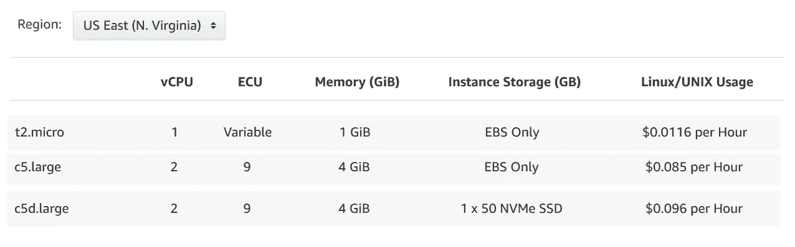
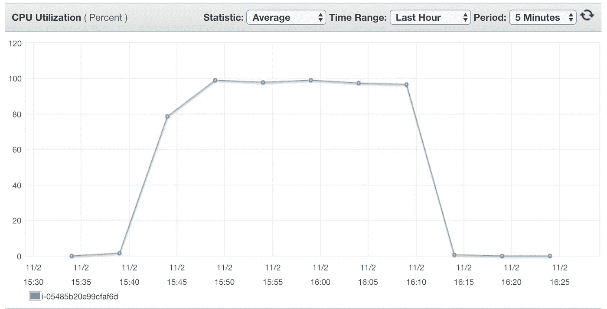

# 测试 AWS EC2 C5D 实例的 Waters

> 原文：<https://medium.com/hackernoon/testing-the-waters-of-aws-ec2-c5d-instances-d408fe995af0>

自从亚马逊宣布 AWS EC2 C5D 实例以来，我们 TotalCloud.io 作为 AWS 的实践者，一直在深入研究它的技术细节。我们发现了一些有趣的东西，我们愿意为了更大的利益分享我们的发现。

# C5D 简介:带有本地 NVMe 存储的 AWS EC2 实例

对于那些不知道的人，AWS EC2 C5D 实例是高性能块存储实例。据称，它们将于 2018 年 5 月推出，非常适合需要访问高速、低延迟本地存储的应用。这使得它成为 media vertical 最喜欢的例子。如果你想了解更多关于它的应用和其他细节，[点击这里](https://blog.totalcloud.io/testing-the-waters-of-aws-ec2-c5d-instances/)。

# 试验

为了测试 C5D 实例的性能，我们在 US-east 1 地区推出了一个 C5D.large 实例，其中包含 9GB Amazon Elastic Block Store+50GB Amazon EC2 NVMe 实例存储。

在同一个区域和可用性区域，我们启动了一个具有 54 GB EBS 卷的 C5.large 实例和一个 T2.small 实例进行比较，其中没有 NACLs，并在实例之间打开了安全组。所有实例运行的都是亚马逊 Linux 2 OS (ami-0a5e707736615003c)，截至 2018 年 10 月打了最新补丁。

> ***在我们向您介绍基准测试结果之前，让我们先来看看 C5D 之间的定价比较。大，C5。大 T2。小型按需实例:***

我们运行 Sysbench 工具来计算 20，000 以内的所有素数，以比较 C5D 实例与 C5 实例以及最流行的实例类型 T2 的纯计算性能。

# 以下是我们在所有三个实例上运行的测试类型:

*   为了运行 CPU 测试，我们使用了 SysBench 工具，进行单线程 CPU 测试。
*   为了测量磁盘性能，我们使用了 Sysbench 文件 IO 基准测试(使用随机读/写)。由于这些实例可能会爆炸，我们进行了一些测试来耗尽 IO 平衡。在耗尽 IO 平衡之前，我们使用 IOping 来测试延迟。然后，使用 FIO，我们尝试排空天平，并在爆破桶被清空和重新填充时测试性能。
*   为了对典型文件服务器工作负载的性能进行基准测试，我们使用了 blogbench 分数。
*   为了运行网络测试并演示 TCP/IP 延迟，我们使用了 100 个 icmp 数据包的平均延迟。此外，我们使用 iperf 测试设备之间的带宽。
*   为了得到一个更加“真实”的测试，我们使用 phoronix 测试套件来运行一个基准编译器测试(编译 Linux)。这提供了跨文件系统的真实磁盘 IO 以及一般的系统和 CPU 性能。磁盘 IO 通常是机器性能的一个制约因素，但它在很大程度上取决于您正在运行的特定工作负载。

# 结果如下:

# 以下是我们的主要观察结果:

#1 |所有 CPU 的得分相同，因为所有三个实例的 CPU 能力相同。

#2 |由于 nvme 磁盘，C5D 在文件 IO 方面远远优于 C5 和 T2，其读写能力几乎是 C5 实例的 4 倍。AWS 对 C5 和 T2 使用相同的底层磁盘技术。因此，C5 和 T2 的结果是相似的。

#3 |磁盘延迟测量(IOping)显示，nvme 磁盘的延迟是 C5 的一半。这是一个巨大的差异，对于实时分析等延迟敏感型工作负载具有重要意义。

#4 |正如所料，C5D 和 C5 实例的网络度量基本相同，但在 T2 实例上有显著改进。

#5 |编译时间很有趣。此时，任务遇到了 CPU 瓶颈。虽然 C5D 每次都更快，但很难找到一个可重复的真实任务来真正扩展新 nvme 磁盘的能力。

#6 |测试表明，CPU 100%最大限度地编译 Linux。这说明 C5D 要快一点。尽管编译 Linux C5D 是一个非常磁盘密集型的操作，但是在我们的测试用例中，CPU 是任务的最终瓶颈。

为了增加这些测试，C5 实例花费了 8.10 秒来解包 Linux 内核。C5D 花了 8.06 秒解包。

# 总结

为了对 C5D 进行基准测试，在一周内进行了几次测试。大型实例的性能。希望这些测试结果能给你新 C5D 实例的真实视角。

如果您想了解更多关于这些测试结果的信息，请写信至 tech@totalcloud.io 或发推文至 [@totalcloudio](https://twitter.com/totalcloudio) 。另外，请分享你对这篇文章的看法。我们很想听听你的想法。

*原载于 2018 年 11 月 9 日*[*blog . total cloud . io*](http://blog.totalcloud.io/testing-the-waters-of-aws-ec2-c5d-instances/)*。*