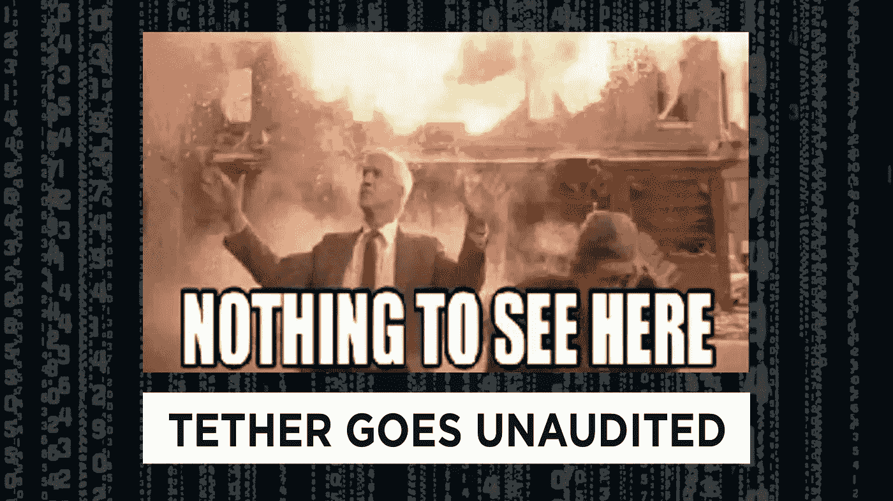

# 系绳和他们的虚拟造币厂

> 原文：<https://medium.com/hackernoon/tether-and-their-virtual-mint-9f26b8fbe72e>

如果你能印出无限的现金，你会这样做吗？谁不会！我在地下室的电脑上有一个虚拟的！

好吧，也许不是，但是 Tether 已经解释了他们自己的[虚拟造币厂](https://hackernoon.com/tagged/virtual-mint)显然是印刷美元等值加密[代币](https://hackernoon.com/tagged/tokens)。这也吸引了许多批评者，他们对该公司几乎每天持续产生数亿美元资本的能力表示怀疑。

上周有消息称，他们似乎已经断绝了与唯一审计师的关系，这一怀疑仍在继续。这一新闻和更多信息都在今天的加密新闻节目中！

## 文章缩略图

为了让这篇文章对 Hackernoon 更友好，我加入了下面的缩略图！希望有人能提供一种更简单的方法来实现这一点:)

