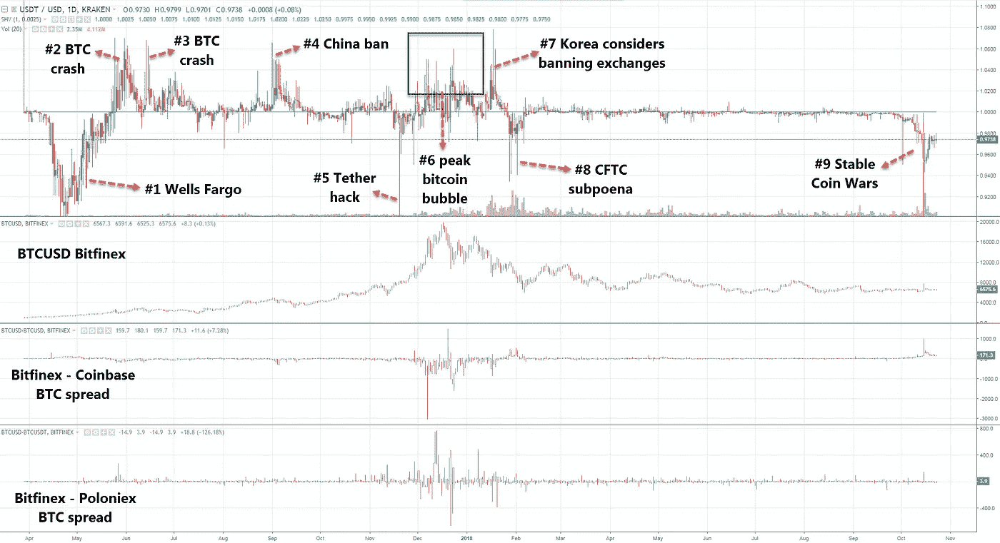

# 系绳传奇，图解时间线

> 原文：<https://medium.com/hackernoon/tether-bitfinex-saga-illustrated-timeline-2d128a703f9c>

## 2017 年以来，泰斯(USDT)大幅偏离美元。作为每一次重大比特币市场事件的时间线，它也很有价值。

# 摘要

当交易员认为 Tether/Bitfinex 存在可能影响其偿付能力和/或 USDT 流动性的问题时(即银行问题，请参见此处的)，USDT 通常会以相对于美元的折扣价进行交易。在系绳驱动的恐慌期间，比特币价格两次暴跌，两次飙升。

当比特币价格因与系绳无关的因素而暴跌时(或在比特币狂热的高峰期，如 2017 年 12 月发生的事情所示)，USDT 通常会溢价于美元。

Bitfinex 是一个菲亚特交易所。鉴于其作为 tethers 门户的地位，通常当 USDT 溢价超过美元时，Bitfinex 作为菲亚特 tethers 混合交易所交易(例如 BTCUSD 比特币基地> BTCUSD Bitfinex > BTCUSDT 币安)。与此同时，当 USDT 交易折价超过美元时，Bitfinex 作为一个限制交易所交易(例如比特币基地< BTCUSD Bitfinex = BTCUSDT Binance).

# Timeline

(Note: “equal to” symbols indicate “approximately equal to”)

## #1: Apr/14/17 to May/24/17: Bitfinex banking issues

*   USDT < USD
*   Max spread -11%.
*   BTCUSD Bitfinex = BTCUSDT Poloniex
*   BTCUSD Bitfinex >比特币基地

[Bitfinex-Wells Fargo 问题](https://www.law360.com/articles/910505)于 2017 年 4 月 6 日公之于众，并在接下来的十天内逐步升级。从 2017 年 4 月 18 日开始，Bitfinex[台湾银行](https://tether.to/announcement/)的国际汇款出现问题。Bitfinex 就此事积极沟通(参见此处[的](https://www.bitfinex.com/posts/199)，此处[的](https://www.bitfinex.com/posts/200)，此处[的](https://www.bitfinex.com/posts/201))

这一系列事件恰好与比特币牛市重合。BTCUSD 在 4 月 6 日上涨了 6%,然后从 4 月 14 日到 5 月 25 日连续上涨了 126%,开始了为期三天的暴跌。

这种趋势背后的看涨事件是[日本承认比特币](https://www.newsbtc.com/2017/04/02/japan-officially-recognises-bitcoin-currency-starting-april-2017/)为合法支付选项(2010 年 4 月 1 日)，以及关于[俄罗斯寻求承认和监管比特币](https://www.ccn.com/russia-may-recognize-regulate-bitcoin-2018/)(2010 年 4 月)。

对于一些人来说，这是 Tether 历史上一个有争议的时期，因为即使在 Tether 出现银行问题时，流通中的 Tether 仍在急剧增加，牛市与 Tether 的银行问题是多么精确地重合。然而，有银行问题并不等同于没有银行账户。此外，即使你可以理论上说，在没有美元支持的情况下，印制了系绳来购买比特币并抽取比特币([正如许多人所做的](https://modernconsensus.com/bitfinexed-interview-tether-bitfinex/))，你也可以同样理论上说，USDT 的发行是对比特币牛市驱动的需求增加的反应，如果没有银行问题，USDT 的发行会更大，而 USDT 的交易会溢价而不是折价。

## # 2:2017 年 5 月 25 日至 2017 年 6 月 8 日:比特币崩盘

*   USDT >美元
*   最大价差+7%
*   BTCUSD Bitfinex > BTCUSD Poloniex(5 月 25 日至 5 月 28 日)
*   BTCUSD Bitfinex < BTCUSD Coinbase

Bitcoin prices crash on May/25, for a 33% three day correction, then the upwards move continues raging on.

## #3: Jun/13/17 to Jun/16/17: bitcoin crash

*   USDT >美元
*   最大价差+7%
*   BTCUSD Bitfinex > BTCUSDT Bittrex(不那么 Poloniex)
*   BTCUSD Bitfinex < BTCUSD Coinbase

Bitcoin prices crash on 32% between Jun/12 and Jun/15\. Bitmain announced the [比特币现金硬叉](http://bitcoinmagazine.com/articles/bitmain-responds-uasf-another-hard-fork-announcement/)6/14。

## # 4:2017 年 9 月 1 日至 2017 年 9 月 18 日:中国禁令引发比特币崩盘

*   USDT >美元
*   最大价差+7%
*   BTCUSD Bitfinex > BTCUSDT Poloniex
*   BTCUSD Bitfinex < BTCUSD Coinbase

China announces ICO ban on Sep/4 and exchange ban on Sep/14\. Bitcoin prices crashed. Chinese funds flow into USDT.

## #5: Nov/20/17 to Nov/21/17: Tether hack

*   USDT < USD
*   Max spread -10%
*   BTCUSD Bitfinex = BTCUSDT Poloniex
*   BTCUSD Bitfinex = BTCUSD Coinbase

[Tether 遭到黑客攻击](https://www.coindesk.com/tether-claims-30-million-stable-token-stolen-attacker/)USDT 3100 万英镑从 Tether 国库钱包转移到一个未经授权的地址。第二天，也就是 11 月 20 日，这件事成了新闻。比特币价格暴跌，很快恢复。

## # 6:2017 年 12 月:比特币泡沫达到顶峰

*   USDT >美元
*   最大价差+8%
*   BTCUSD Bitfinex > BTCUSDT Poloniex
*   BTCUSD Bitfinex < BTCUSD Coinbase

## #7: Jan/16/18 to Jan/19/18: Korea considering closing exchanges

(Note: using Binance hereon as it surpassed Poloniex in volume)

*   USDT >美元
*   最大价差+8%
*   BTCUSD Bitfinex > BTCUSDT 币安
*   BTCUSD Bitfinex < BTCUSD Coinbase

South Korean authorities said [正在考虑关闭加密交换](https://www.cnbc.com/2018/01/17/south-korea-considers-closing-all-virtual-currency-exchanges.html)。比特币价格暴跌。

## # 8:2018 年 1 月 28 日至 2018 年 2 月 6 日:CFTC 传票

*   USDT
*   最大价差-6%
*   BTCUSD Bitfinex = BTCUSDT 币安
*   BTCUSD Bitfinex > BTCUSD 比特币基地

2017 年 12 月，CFTC 发出传票以限制& Bitfinex，mas 于 1 月 30 日通过媒体向公众公布了此事。比特币价格暴跌。

## # 9:2018 年 9 月 30 日至今(2018 年 10 月 23 日):Bitfinex 银行问题和稳定的硬币战争

*   USDT < USD
*   Max spread -15%
*   BTCUSD Bitfinex = BTCUSDT Binance
*   BTCUSD Bitfinex >比特币基地

在一系列竞争性稳定硬币首次亮相后，泰瑟就遇到了银行问题。比特币价格飙升。这里详细介绍。

## USDTUSD 利差没有明显偏离的其他重要比特币事件:

*   7 月/17/17: [矿工发出信号 SegWit 支持](https://www.coindesk.com/bip91-begins-bitcoins-miners-signal-segwit2x-scaling-proposal-early/)，结束 34 天 41%的回调，开始下一轮牛市。
*   2017 年 8 月 1 日:[比特币现金硬分叉](https://cointelegraph.com/news/bitcoin-cash-celebrates-its-first-birthday-from-a-hard-fork-to-easy-going)。
*   11/8/17:[segwit 2x 支持者撤回硬叉支持](https://twitter.com/Crypto_Macro/status/1032051849707364352)。
*   11 月 31 日/17: [CME 宣布推出比特币期货](https://www.coindesk.com/cme-group-plans-launch-bitcoin-futures-contract/)。
*   2018 年 1 月 27 日:[系绳确认与审计员的关系已解除](https://www.coindesk.com/tether-confirms-relationship-auditor-dissolved/)。
*   3/7/18:[SEC 发布关于潜在非法交易的声明](https://www.sec.gov/news/public-statement/enforcement-tm-statement-potentially-unlawful-online-platforms-trading)，引发第二波熊市。
*   Apr/12/18: [比特币价格向上突破](https://twitter.com/Crypto_Macro/status/984498210533203968)，45 分钟+16.5%。
*   2018 年 8 月 7 日: [SEC 推迟了对 Van Eck ETF 的决定](https://www.coindesk.com/sec-delays-vaneck-solidx-bitcoin-etf-decision-to-september/)。
*   2018 年 8 月 22 日:[比特墨斯维护泵](https://www.ccn.com/bitmex-downtime-crypto-pump-manipulation-in-the-bitcoin-market/)。
*   2018 年 9 月 5 日:[比特币价格暴跌](https://twitter.com/Crypto_Macro/status/1037840898644733953)。

## USDTUSD 数据不可用的其他重要比特币事件

(注:由于 USDTUSD 于 2017 年 3 月 29 日开始在北海巨妖交易，因此不容易获得，在此之前，人们需要通过查看与 Poloniex 或 Bittrex 的价差来查看合成的 USDTUSD)

*   2017 年 2 月 9 日:[中国交易所禁止撤资](https://www.businessinsider.com/bitcoin-price-february-9-2017-2017-2)。
*   17 年 3 月 10 日: [SEC 拒绝文克莱沃斯 ETF](https://www.nytimes.com/2017/03/10/business/dealbook/winkelvoss-brothers-bid-to-create-a-bitcoin-etf-is-rejected.html) 。

# 在你走之前…

如果你喜欢读这篇文章，请考虑通过点击拍手按钮来表达你的支持——越多越好，这增加了可见性。可以通过以下链接分享文章:[脸书](https://www.facebook.com/sharer/sharer.php?u=https%3A//hackernoon.com/tether-bitfinex-saga-illustrated-timeline-2d128a703f9c) | [推特](https://twitter.com/home?status=USDT%20trades%20at%20a%20discount%20when%20traders%20perceive%20Bitfinex%20is%20having%20issues%20affecting%20its%20solvency%20and/or%20the%20USDT%20liquidity.%20USDT%20trades%20at%20a%20premium%20when%20BTC%20is%20crashing%20due%20to%20factors%20unrelated%20to%20tether.%0A%0Ahackernoon.com/tether-bitfinex-saga-illustrated-timeline-2d128a703f9c)|[Reddit](http://reddit.com/submit?url=https%3A%2F%2Fhackernoon.com%2Ftether-bitfinex-saga-illustrated-timeline-2d128a703f9c&title=The%20Tether%20Saga%2C%20illustrated%20timeline)|[LinkedIn](https://www.linkedin.com/shareArticle?mini=true&url=https%3A//hackernoon.com/tether-bitfinex-saga-illustrated-timeline-2d128a703f9c&title=The%20Tether%20Saga,%20illustrated%20timeline&summary=USDT%20generally%20trades%20at%20a%20discount%20when%20traders%20perceive%20Tether/Bitfinex%20are%20having%20issues%20potentially%20affecting%20their%20solvency%20and/or%20the%20USDT%20liquidity.%20USDT%20generally%20trades%20at%20a%20premium%20when%20bitcoin%20prices%20are%20crashing%20due%20to%20factors%20not%20related%20to%20tether.&source=)|[Whatsapp](https://api.whatsapp.com/send?text=https://hackernoon.com/tether-bitfinex-saga-illustrated-timeline-2d128a703f9c)|[电报](https://telegram.me/share/url?url=https://hackernoon.com/tether-bitfinex-saga-illustrated-timeline-2d128a703f9c&text=The%20Tether%20Saga,%20illustrated%20timeline) | [微博](http://service.weibo.com/share/share.php?url=https://hackernoon.com/tether-bitfinex-saga-illustrated-timeline-2d128a703f9c&title=%7Btext%7D) | [邮箱](mailto:?subject=The Tether Saga, illustrated timeline&body=https://hackernoon.com/tether-bitfinex-saga-illustrated-timeline-2d128a703f9c)。你也可以在 Twitter 上关注我，保持联系。谢谢你。