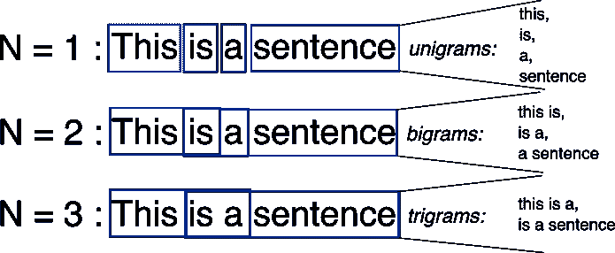

# 用脸书的快速文本简化文本分类

> 原文：<https://medium.com/hackernoon/text-classification-simplified-with-facebooks-fasttext-b9d3022ac9cb>

使用 FastText API 分析亚马逊产品评论情感的循序渐进教程


*无耻插件:我们是一个* [*机器学习数据标注平台*](https://dataturks.com) *让你超级轻松的* [*构建 ML 数据集*](https://dataturks.com) *。只需上传数据，邀请您的团队，快速构建数据集。*

这个博客提供了一个详细的一步一步的教程来使用 FastText 进行文本分类。为此，我们选择对 Amazon.com 上的客户评论进行情感分析，并详细说明如何收集特定产品的评论，以便对其进行情感分析，分析结果可以在购买前根据给定的反馈决定产品的质量。

# 什么是 FastText？

文本分类已经成为商业世界的基本组成部分；无论是用于垃圾邮件过滤，还是用于分析电子商务网站的推文或客户评论，这可能是最普遍的例子。


FastText 是由脸书人工智能研究所(FAIR)开发的开源库，专门致力于简化文本分类。FastText 能够在多核 CPU 上在不到 10 分钟的时间内用数百万个示例文本数据进行训练，并使用训练好的模型在不到 5 分钟的时间内对超过 300，000 个类别中的未加工文本进行预测。

# 用于训练的预标记数据集:

收集从 Kaggle.com 获得的包含几百万条评论的人工注释的亚马逊评论数据集，并在转换为 FastText 格式后用于训练模型。

快速文本的数据格式如下:

```
__label__<X> __label__<Y> ... <Text>
```

其中 X 和 Y 代表类别标签。

在我们使用的数据集中，我们将评论标题放在评论前面，用“:”和空格分隔。

下面给出了训练数据文件的样本，用于训练和测试模型的数据集可以在[Kaggle.com](https://www.kaggle.com/bittlingmayer/amazonreviews/home)网站找到。

```
__label__2 Great CD: My lovely Pat has one of the GREAT voices of her generation. I have listened to this CD for YEARS and I still LOVE IT. When I'm in a good mood it makes me feel better. A bad mood just evaporates like sugar in the rain. This CD just oozes LIFE. Vocals are jusat STUUNNING and lyrics just kill. One of life's hidden gems. This is a desert isle CD in my book. Why she never made it big is just beyond me. Everytime I play this, no matter black, white, young, old, male, female EVERYBODY says one thing "Who was that singing ?"
```

这里，我们只有两个等级 1 和 2，其中 __label__1 表示评论者对产品给出了 1 星或 2 星，而 __label__2 表示 4 星或 5 星评级。

# 用于文本分类的训练快速文本:

## 预处理和清理数据:

在规范化文本大小写并移除不需要的字符后，执行以下命令以生成经过预处理和清理的训练数据文件。

```
cat <path to training file> | sed -e “s/\([.\!?,’/()]\)/ \1 /g” | tr “[:upper:]” “[:lower:]” > <path to pre-processed output file>
```

## 设置快速文本:

让我们从下载[最新版本](https://github.com/facebookresearch/fastText/releases)开始:

`$ wget https://github.com/facebookresearch/fastText/archive/v0.1.0.zip
$ unzip v0.1.0.zip`

移动到 fastText 目录并构建它:

```
$ cd fastText-0.1.0
$ make
```

不带任何参数运行二进制文件将打印高级文档，显示 fastText 支持的不同用例:

```
>> ./fasttext
usage: fasttext <command> <args>The commands supported by fasttext are: supervised              train a supervised classifier
  quantize                quantize a model to reduce the memory usage
  test                    evaluate a supervised classifier
  predict                 predict most likely labels
  predict-prob            predict most likely labels with probabilities
  skipgram                train a skipgram model
  cbow                    train a cbow model
  print-word-vectors      print word vectors given a trained model
  print-sentence-vectors  print sentence vectors given a trained model
  nn                      query **for** nearest neighbors
  analogies               query **for** analogies
```

在本教程中，我们主要使用`supervised`、`test`和`predict`子命令，它们对应于学习(和使用)文本分类器。

## 训练模型:

以下命令用于为文本分类训练模型:

```
./fasttext supervised -input <path to pre-processed training file> -output <path to save model> -label __label__ 
```

`-input`命令行选项指的是训练文件，而`-output`选项指的是保存模型的位置。训练完成后，在给定位置创建一个包含已训练分类器的文件`model.bin`。

# **用于改进模型的可选参数:**

**增加训练的时期数:**

默认情况下，模型在每个示例上训练 5 个时期，为了更好地训练，我们可以指定-epoch 参数。

示例:

```
./fasttext supervised -input <path to pre-processed training file> -output <path to save model> -label __label__ -epoch 50
```

**指定学习率:**

改变学习速率意味着改变我们模型的学习速度是增加(或减少)算法的学习速率。这对应于处理每个示例后模型的变化程度。学习率为 0 意味着模型根本没有改变，因此没有学到任何东西。学习率的正确值在`0.1 - 1.0`范围内。

lr 的默认值为 0.1。下面是我们如何指定这个参数。

```
./fasttext supervised -input <path to pre-processed training file> -output <path to save model> -label __label__ -lr 0.5
```

**使用 n 元语法作为特征:**



对于依赖于词序的问题，尤其是情感分析，这是一个有用的步骤。它指定在 n 大小的窗口中使用连续标记的串联作为训练的特征。

我们为此指定-wordNgrams 参数(理想值在 2 到 5 之间) :

```
./fasttext supervised -input <path to pre-processed training file> -output <path to save model> -label __label__ -wordNgrams 3
```

# 测试和评估模型:

以下命令用于在预注释的测试数据集上测试模型，并将原始标签与每个评论的预测标签进行比较，并以精度和召回值的形式生成评估分数。

精度是由 fastText 预测的标签中正确标签的数量。召回是成功预测的标签数量。

```
./fasttext test <path to model> <path to test file> k
```

其中参数 k 表示该模型要预测每个评论的前 k 个标签。

在 400000 条评论的测试数据上评估我们的训练模型所获得的结果如下。正如所观察到的，获得了 91%的精确召回率，并且在非常短的时间内训练了该模型。

```
N 400000
P@1 0.913
R@1 0.913
Number of examples: 400000
```

# 分析 Amazon.com 网站上顾客对产品的实时评论:


## 收集亚马逊客户评论:

我们使用现有的 python 库从页面中抓取评论。

要设置模块，请在命令提示符/终端中键入:

`pip install amazon-review-scraper`

给定网页的 url，下面是一个收集特定产品评论的示例代码:

注:在输入特定产品的客户复查页的 URL 时，如果该页不存在，请确保附加&pageNumber=1，以便刮刀正常工作。

上面的代码从给定的 url 中抓取评论，并以下列格式创建一个输出 csv 文件:

从上面的 csv 文件中，我们提取了标题和正文，并像在训练文件中一样，将它们附加在一起，用':和空格分隔，并将它们存储在单独的 txt 文件中，用于情感预测。

# 刮削数据的情感预测:

```
./fasttext predict <path to model> <path to test file> k > <path to prediction file>
```

其中 k 表示模型将预测每个评论的前 k 个标签。

上述评论预测的标签如下:

```
__label__2
__label__1
__label__2
__label__2
__label__2
__label__2
__label__2
__label__2
__label__1
__label__2
__label__2
```

人工验证时非常准确。然后，预测文件可用于进一步的详细分析和可视化。

因此，在这篇博客中，我们学习了使用 FastText API 进行文本分类，抓取亚马逊客户对给定产品的评论，并用训练好的模型预测他们的情绪进行分析。

如果您有任何疑问或建议，我很乐意倾听。请在 abhishek.narayanan@dataturks.com 给我写信。

*无耻插件:我们是一个数据注释平台，让你建立 ML 数据集超级简单。只需上传数据，邀请您的团队，快速构建数据集。* [***快来看看吧！***](https://www.dataturks.com)