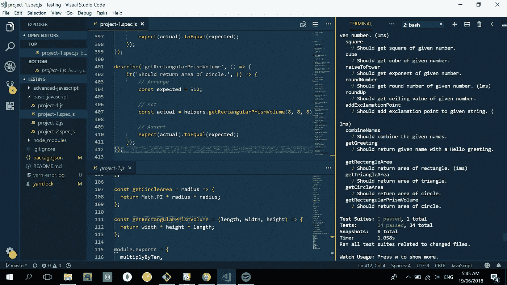

# 文本编辑器(和代码)是美的东西

> 原文：<https://medium.com/hackernoon/text-editors-and-codes-are-things-of-beauty-d58a79bf6ab6>

本周，我们开始在 Lambda 学校学习自动化测试。特别是，我们研究了单元测试或者使用称为测试运行程序的软件测试代码单元。有许多种测试跑步者，如摩卡，柴，茉莉，酵素，和因果报应，但我们使用的是 Jest，它是由给我们提供 React 的同一个团队开发的。

进行测试的原因应该是显而易见的:(1)在将代码交付给用户之前，您希望确保代码实际上可以工作；(2)它给你信心，只要你在开发产品的时候和提交到你的 g it 库之前不断地测试你的产品，你的代码就不会中断或退化；(3)通过测试应用程序的每个特性，您可以更深入地了解应用程序是如何工作的。

嗯，在今天早上用 VS 代码编写测试并检查终端的状态时，我被它的美妙之处震惊了——你知道，编码、文本编辑器、终端、描述性 git 提交等等。

现在，这是一件很奇怪的事情(至少对我来说)。当我们谈到美好的事物时，我们通常指的是绘画、诗歌、小说、短篇故事、[书籍](https://hackernoon.com/tagged/books)、建筑、电影、雕塑、风景、歌曲、自然或一个人的脸——但代码、终端和文本编辑器呢？

但这是真的。代码(经过适当的组织和编写)和文本编辑器(具有正确的主题和布局)可以是，或者确实是漂亮的。

看看我做的这个编辑器和代码的截图就知道了。主题是 Wes Bos 的钴蓝，项目，正如我提到的，是单元测试。

我不知道你怎么想，但它让我觉得很美，或者至少很有美感。(还是我就是太书呆子了？)

既然是这样(代码和文本编辑器可以是或已经是美丽的)，那么写代码的程序员、开发人员或工程师不也是在扮演艺术家的角色吗？她不仅仅是“键入”组成一个软件或产品的文本行；她实际上正在塑造成一件艺术品。一个代码越简洁、功能越强大、写得越好，它的简单性和对称性就越美。这意味着编码者，不管他或她是谁，实际上有义务使他的代码和产品漂亮。

当我在 Lambda 学校继续我作为软件工程师的旅程时，这只是一个想法。