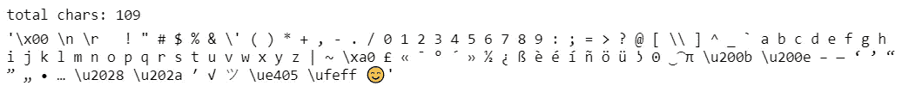
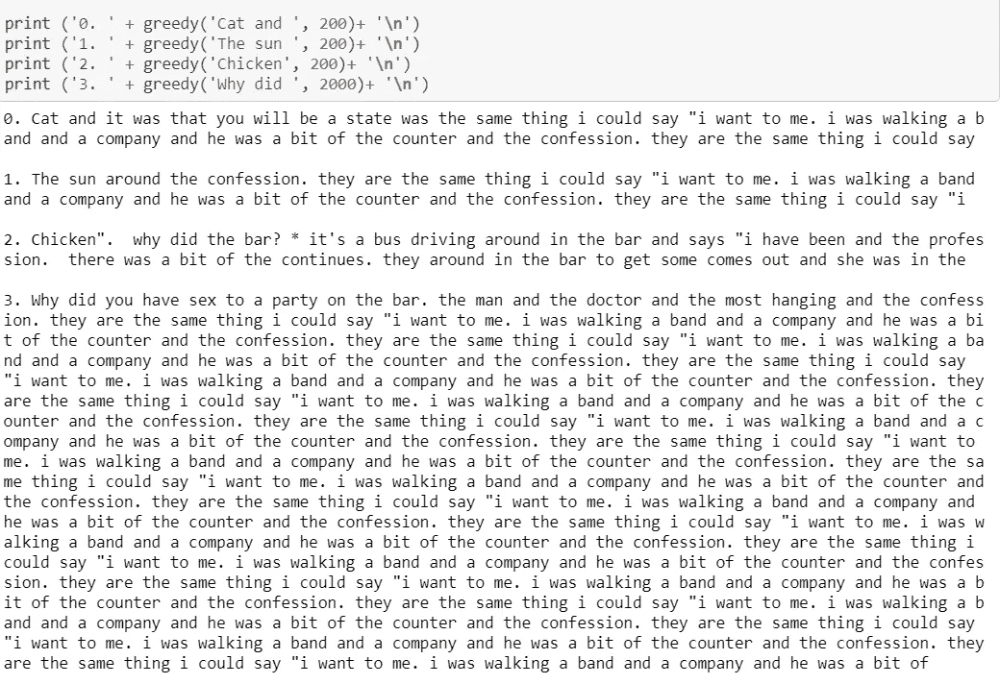
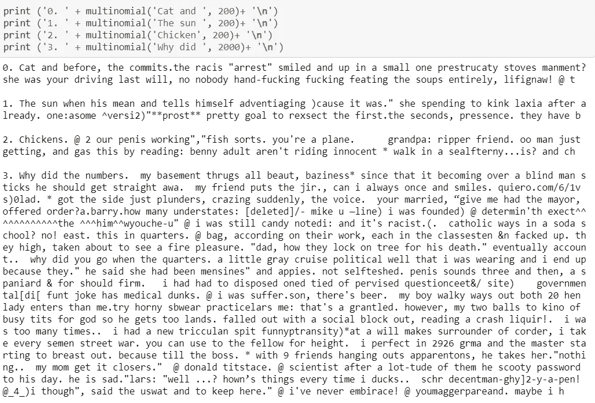
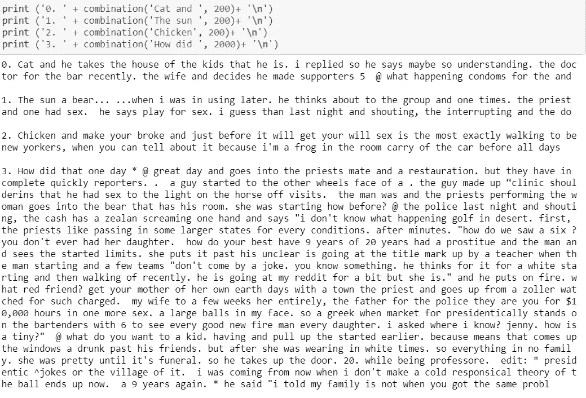
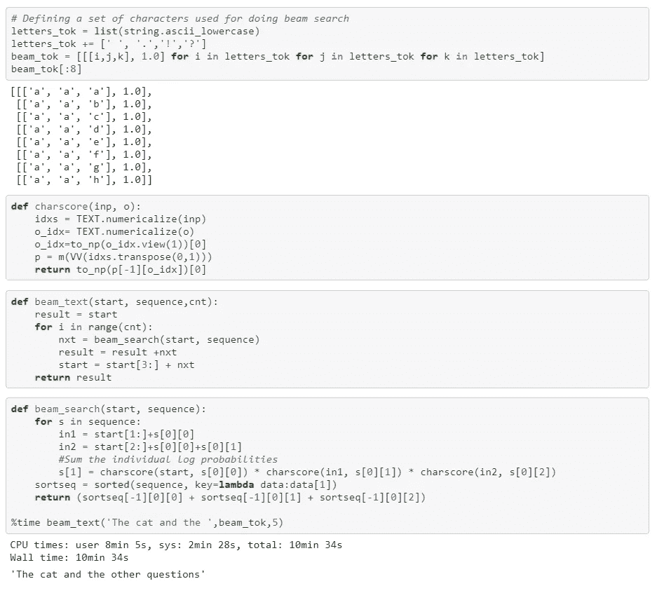
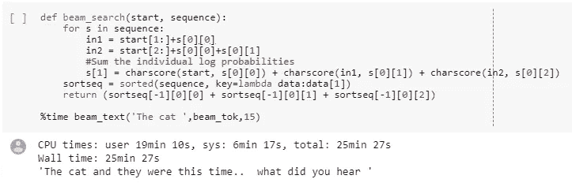
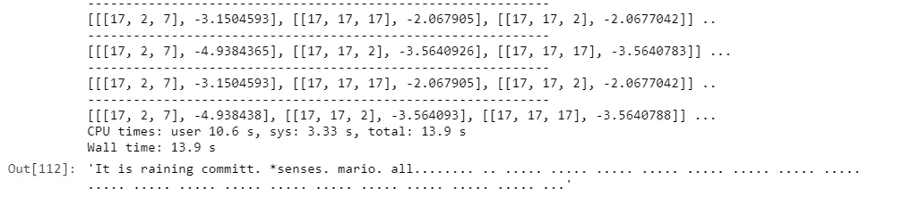
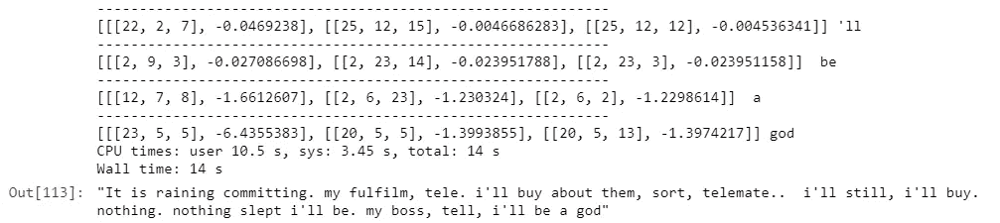

# Char LSTM 模型文本生成

> 原文：<https://medium.com/hackernoon/text-generation-for-char-lstm-models-685dc186e319>

在笑话语料库上训练人物级语言模型。

我决定尝试解决这个问题的方法，这是我在 OpenAI 的[研究请求](https://openai.com/requests-for-research/)博客上找到的。你可以在这里 看一下代码 [**。这是在**](https://github.com/coderbee/jokes) **[Pytorch](https://hackernoon.com/tagged/pytorch) 中写的，并受到了 [Fast.ai](https://www.fast.ai) 关于实现 RNN 的“从零开始”的奇妙课程的极大启发。**

**数据准备**我开始使用 [OpenAI](https://hackernoon.com/tagged/openai) 提供的[数据集](https://github.com/taivop/joke-dataset)。数据被转换成小写字母，在第一次运行时，我选择了排名最高的笑话，单词长度不到 200 个。以下是遇到的所有令牌的示例:



***前面露骨的话！*** 这个特定的数据集具有明确的单词/内容，因此这些会出现在模型的输出预测中。另一个有趣的问题是从模型的输出中过滤掉不合适的单词——或者通过检查生成的输出中是否出现一组已知的显式单词，或者更好的是——通过构建一个干净/不干净的情感分类器！我还使用我在 github 上找到的更干净的数据集运行了结果。

我尝试了 LSTM 的几个模型，主要是改变批量大小，隐藏层。随着反向传播 char 令牌( *bptt* )数量的增加，训练 char 级别模型变得越来越困难。现在让我们主要关注文本生成部分。该模型一次输出一个字符，我们的目标是生成一串(看似易懂，可能有趣的)文本。有许多方法可以采用:

## 贪婪的方法:

这是最简单的方法，我们递归地选择最可能的下一个序列字符。为了猜测接下来的 n 个字符，我们需要在模型上运行 n 次推理，这是相当快的。然而，这种情况下的输出差异较小，容易陷入循环。似乎有一组概率很高的 char 序列，并且预测通常收敛于这些序列之一。



## **顶 K 或多项式逼近:**

这种方法从 n 个类别中模拟一个结果的发生，每个类别都有确定的发生概率。为了在输出中注入更多的多样性，我们将神经网络建模为概率事件，并观察在单次游戏中输出哪个标记，而不是选择最可能的字符。然而，观察结果，这种方法并不擅长产生完整的单词。单词内部固有的结构更容易被打破。一种替代方法是结合贪婪的最佳匹配方法，有节制地使用跨国分布



## 结合

我们看到，使用贪婪方法总是会导致循环或重复的模式，而 top-k 方法的多项式会在 char 级别产生更多难以理解的单词。我试图通过使用贪婪的方法来生成字符，直到遇到一个空格(单词中的间隙)，从而获得两个世界的平衡。在这一点上，我使用了多项式生成器，这样在单词选择上就有了更多的多样性。这导致文本更加多样化，但整体上更容易理解。



## 波束搜索

波束搜索是一种试图获得更多“最优结果”的方法，我们着眼于预测迭代中长于一个字符的序列。给定一个输入序列，我们不是预测下一个字符，而是预测下 k 个字符。这有助于我们在一组输出序列上找到一个更全局的解。在某种意义上，我们需要考虑所有可能的长度为 k 的输出字符束。并且需要一些比较的度量标准。

在计算概率时，有几件事可以帮助我们:首先，使用贝叶斯规则，我们可以将获得特定输出序列的概率建模为各个条件概率序列的乘积。例如:给定输入序列‘太阳的预测’和‘得分’将是 *Score = P('a'| input = '太阳')*P('n'| input = '他太阳 a')* P('d' | input = 'e 孙安')。*其次，模型 soft-max 的输出通常是对数格式，这使得实现更容易，我们可以将对数值相加，而不是相乘。

下面显示了实现波束搜索过滤器所需的大部分代码。我们定义了一个数据结构*字母*来存储给定长度(比如说 3)的所有可能的序列和它的分数的占位符。 *charscore* 函数计算给定输入序列预测给定输出的概率。 *beam_search* 函数遍历可能的序列，并计算每个序列的分数。 *beam_text* 是迭代应用 beam_search 函数生成给定长度序列的函数。



波束搜索的这种简单实现需要相当长的时间(例如，产生 15 个样本需要 8 分钟)。下面是另一个例子，我们正在生成 15 束，或 45 个字符令牌。



我相信通过在 CPU 上完全运行推理，并更好地优化 *beam_search* ，可以大大降低这个速度。

## 未来的实验

下面是我尝试过的几个变种，还没有很大的成功。这些主要是由波束搜索的缓慢运行时间所驱动的。

**贪婪波束搜索:**这类似于波束搜索，但是我们不是搜索所有序列，而是搜索“最可能”的序列。例如，对于 3 的波束宽度，我们可以在 3 个阶段的每一个阶段中查看前 10 个最可能的选择。所以我们每次迭代都要搜索 10*10*10 的波束。这当然大大减少了延迟问题，但结果很快陷入了一个循环，重复模式。例如，对于两个波束图案'.. '和“…”无休止地重复。



为了增加更多的多样性，在计算波束得分时，我将各个概率相乘，而不是相加。结果更加多样化，但不一定更好。

```
[i, j, k], i_score * j_score * k_score]
```



## 参考资料:

[](https://www.fast.ai) [## fast.ai 让神经网络再次变得不酷

### fastai 是第一个为所有最常用的深度学习库提供单一一致接口的深度学习库

www.fast.ai](https://www.fast.ai) [](https://machinelearningmastery.com/beam-search-decoder-natural-language-processing/) [## 如何实现用于自然语言处理的波束搜索解码器

### 自然语言处理任务，如字幕生成和机器翻译，涉及生成序列的…

machinelearningmastery.com](https://machinelearningmastery.com/beam-search-decoder-natural-language-processing/) 

【https://github.com/coderbee/jokes/ 

[短笑话数据集](https://github.com/amoudgl/short-jokes-dataset)