# Twitter 数据的文本处理和情感分析

> 原文：<https://medium.com/hackernoon/text-processing-and-sentiment-analysis-of-twitter-data-22ff5e51e14c>

## 使用 Twitter 数据和 r。

无耻插件:我们是一个数据注释平台，让你建立 ML 数据集超级容易。只需上传数据，邀请您的团队，快速构建数据集。来看看我们吧。

 [## 满足您 ML 数据注释需求的最佳在线平台。

### 只需上传您的数据，邀请您的团队成员并开始标记。标记培训/评估数据的最佳方式是…

www.dataturks.com](https://www.dataturks.com/) 

# 为什么使用 R 进行文本处理？

随着计算文本分析在研究中的重要性日益增加，许多研究人员面临着学习如何使用高级软件来实现这种文本分析的挑战。目前，计算方法和新兴领域“数据科学”最流行的环境之一是 R 统计软件。然而，对于不精通编程的研究人员来说，学习如何使用 R 可能是一个挑战，尤其是执行文本分析可能会令人望而生畏。在这个循序渐进的指南中，您可以了解到在 R 中执行文本分析并不像有些人担心的那样困难。这是对常用技术使用的介绍，目的是帮助研究人员从总体上熟悉计算文本分析，并开始在 r。

# **为什么是 R？**

r 是专门为统计分析设计的，这使得它非常适合数据科学应用。虽然使用 R 编程的学习曲线可能很陡，尤其是对于没有编程经验的人来说，但是现在可以使用 R 中的工具来执行文本分析，只需使用几个简单的命令就可以轻松地执行强大、先进的文本分析。R 爆炸性增长的关键之一是它密集的扩展软件库集合，在 R 术语中称为包，由 R 的广大用户社区提供和维护。每个包都扩展了基础 R 语言和核心包的功能，除了功能和数据之外，还必须包括文档和示例，通常以演示包的使用的小插图的形式。最著名的包存储库，综合 R 存档网络(CRAN)，目前已经发布了超过 10，000 个包。

特别是文本分析已经在 R 中很好地建立起来。有大量的专用文本处理和文本分析包，从低级的字符串操作到高级的文本建模技术，如拟合潜在的 Dirichlet 分配模型，R 都提供了。在 R 中执行文本分析的一个主要优点是，在不同的包之间切换或组合它们通常是可能的，而且相对容易。R 文本分析开发人员社区最近的努力旨在促进这种互操作性，以最大限度地增加用户的灵活性和选择。4 因此，学习 R 文本分析的基础知识可以提供对大量高级文本分析功能的访问。

# **为什么是 Twitter 数据？**

Twitter 是一个在线微博工具，每天传播超过 4 亿条消息，包括从娱乐到体育、健康到商业等几乎所有行业的大量信息。Twitter 最好的一点——事实上，也许是它最大的吸引力——在于它的易用性。分享信息和收集信息都很容易使用。Twitter 为我们的立法者和名人提供了前所未有的访问途径，也提供了获取正在发生的新闻的途径。Twitter 也是大公司商业模式的重要数据源。

所有上述特征使 twitter 成为收集实时和最新数据的最佳场所，以便对现实生活情况进行分析和研究。

如果您需要其他数据集，您可以下载各种用例的现有数据集，如癌症检测、问答数据集、体育评论和聊天机器人。这里是各种[文本分类数据集。](https://dataturks.com/projects/Trending?type=TEXT_CLASSIFICATION)

或者，如果您有自己独特的用例，您可以为它创建自己的数据集。你可以从网上下载图像，并使用像 [Dataturks](https://dataturks.com/) 这样的注释工具，在 ziffy 中手动上传原始数据和标记，从而立即创建一个大数据集。

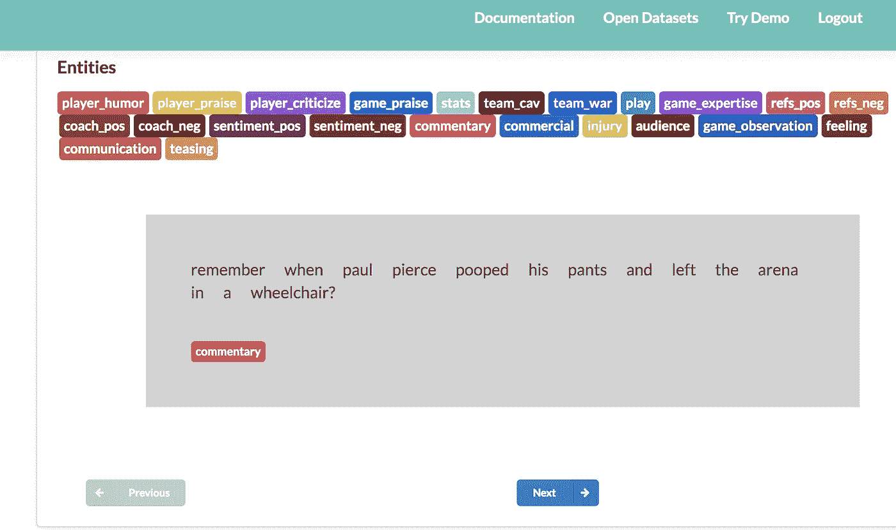

# **数据集:**

为了提取 Twitter 的数据，我们需要创建一个 Twitter 应用程序。

**创建 TWITTER 应用程序的步骤**

1.导航到我的应用程序。([链接](https://apps.twitter.com/))

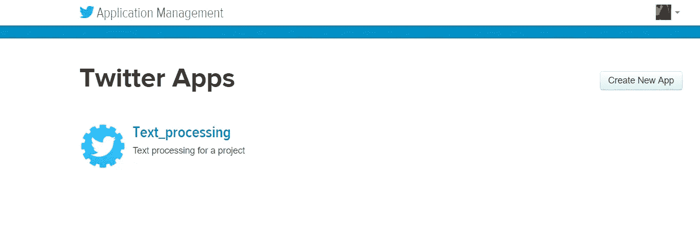

2.由于我已经创建了此应用程序，它会出现在我的页面上。点击“创建新应用”。

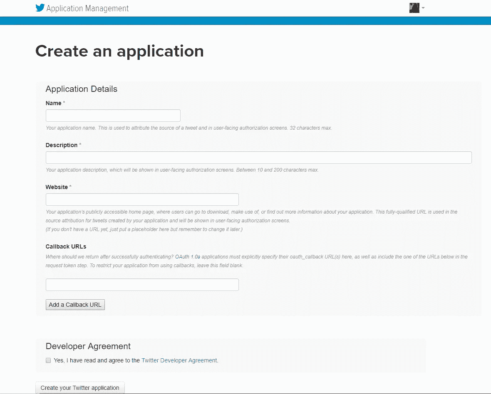

填写申请的所有细节。

3.一旦所有的细节都被填写和验证，你将被授予客户和访问密钥。

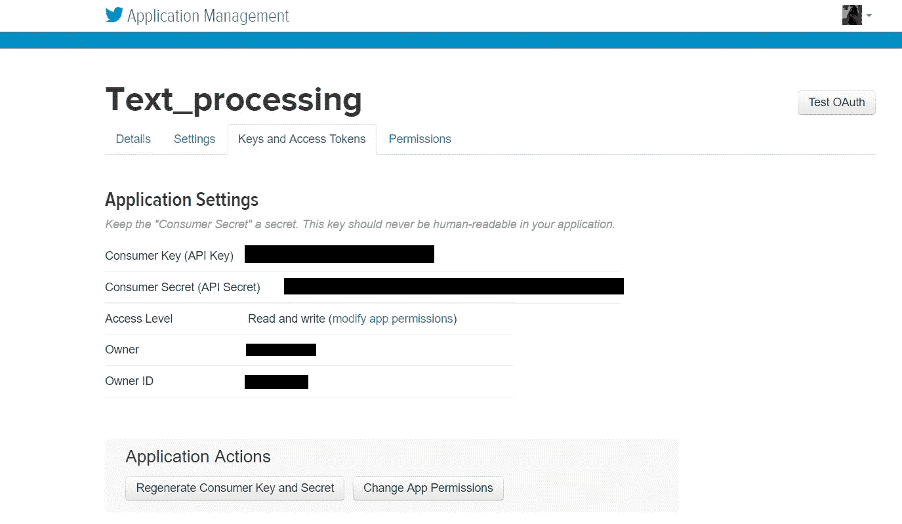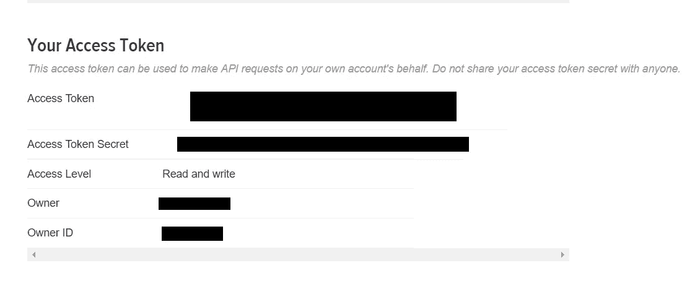

**安装并加载 R 包:**

r 带有一套标准的软件包。许多其他软件包[可供下载](http://cran.us.r-project.org/)和安装。出于这个职位的目的，我们将需要以下包:

–ROAuth:*提供 OAuth 1.0 规范的接口，允许用户通过 OAuth 向他们选择的服务器进行身份验证。*

–Twitter:*提供了 Twitter web API 的接口。*

让我们从安装和加载所有需要的包开始。

将您的 twitter 帐户连接到 R，以便提取所需的 tweets。

# **使用特定标签提取推文:**

将提取的数据转换为数据帧，这样可读性更强，也更容易处理。

数据看起来是这样的:

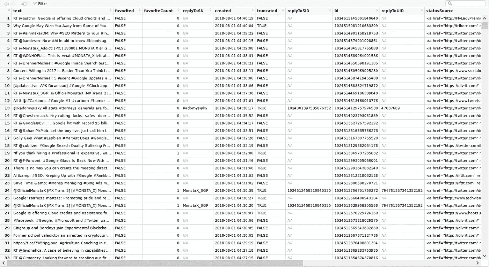

很明显，在我们需要处理的数据的文本部分，有很多我们不需要的特殊字符和不必要的数据。因此，预处理这些数据变得极其重要，然后我们可以继续进行分析。

下面是预处理数据并删除制表符、空格、链接等的代码。这一部分可以根据自己的需要进行修改。

# **多一点预处理——去除停用词！**

# 什么是停用词？

在使用文本挖掘应用程序时，我们经常会听到“停用字词”或“停用字词列表”甚至“停用列表”这样的术语。停用词基本上是任何语言中的一组常用词，不仅仅是英语。停用词对许多应用程序至关重要的原因是，如果我们删除给定语言中非常常用的词，我们就可以专注于重要的词。

停用词一般被认为是一个**【单套词】**。对于不同的应用，它确实有不同的含义。例如，在一些应用中，从限定词(例如，the，a，an)到介词(例如，above，cross，before)到一些形容词(例如，good，nice)移除所有停用词可以是适当的停用词列表。然而，对于某些应用来说，这可能是有害的。例如，在情感分析中，删除“好”和“不错”等形容词以及“不”等否定词会让算法偏离轨道。在这种情况下，根据应用的需要，可以选择使用仅由限定词或带介词的限定词或仅由并列连词组成的最小停用列表。

我们已经完成了数据的预处理，并准备进行一些分析。

数据可视化(如图表、图形、信息图等)为分析师提供了一种交流重要信息的宝贵方式。如果你想要一个令人惊叹的可视化格式来突出重要的文本数据点，使用单词云可以让枯燥的数据变得生动，并立即传达关键信息。

# **什么是词云？**

词云(也称为文本云或标签云)以一种简单的方式工作:特定的词在文本数据源(如演讲、博客帖子或数据库)中出现得越多，它在词云中出现得就越大、越粗。

因此，让我们生成一些词云，并找出我们提取的推文中使用的一些频繁且重要的术语。

以下是我掌握的数据的文字云:

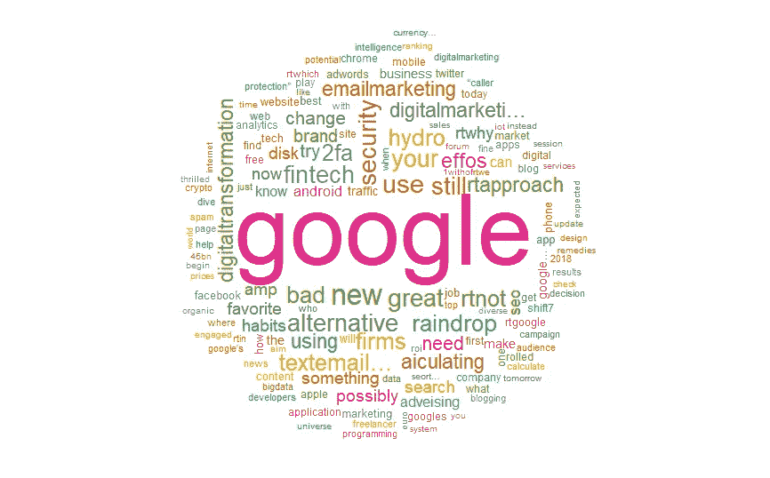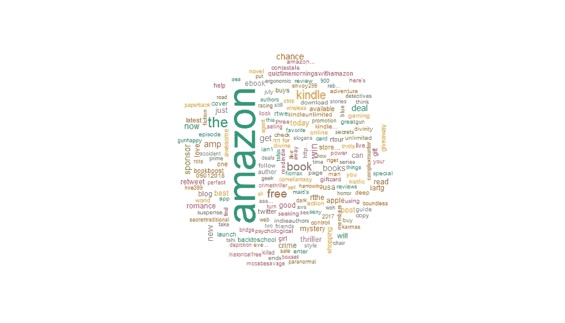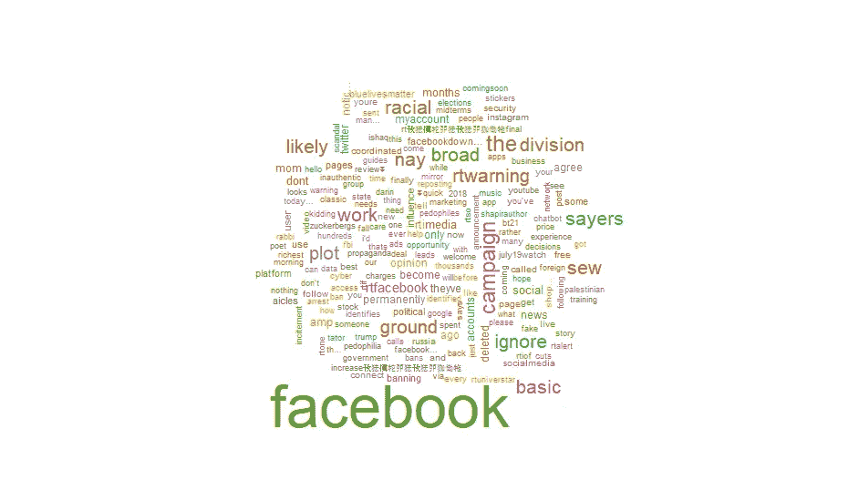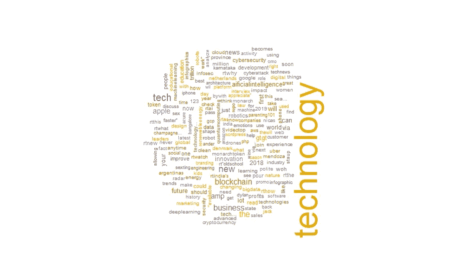

接下来，我将对推文进行情感分析。

# **情感分析简介:**

# 什么是情感分析？

情操本质上与感觉有关；态度、情绪和观点。情感分析是指应用自然语言处理和文本分析技术从一段文本中识别和提取主观信息的实践。一个人的观点或感觉在很大程度上是主观的，而不是事实。这意味着从一段文字中准确分析一个人的观点或情绪是极其困难的。从文本分析的角度进行情感分析，我们本质上是要了解作者对一段文本中的主题及其极性的态度；不管是正面的，负面的，还是中性的。

近年来，品牌、公司和研究人员对情感分析及其在商业分析中的应用越来越感兴趣。与许多数据分析流一样，当今的商业世界正在寻找“商业洞察力”

关于情感分析，我说的是对消费者行为的洞察，客户想要什么，客户喜欢和不喜欢产品的什么，他们的购买信号是什么，他们的决策过程看起来像什么等等，因为归根结底，这些企业是为了客户的满意度而工作的。

我使用了 R 中内置的情感分析器，它使用 NRC 情感词典来计算文本中八种不同情感的存在及其相应的效价。

从下面的#Google 推文中的情感分析图可以看出，Google 对消费者有着积极的影响，并且非常受他们的信任。最近有相当多的预期，可能是对他们的产品或公司员工或任何其他可能性的预期。

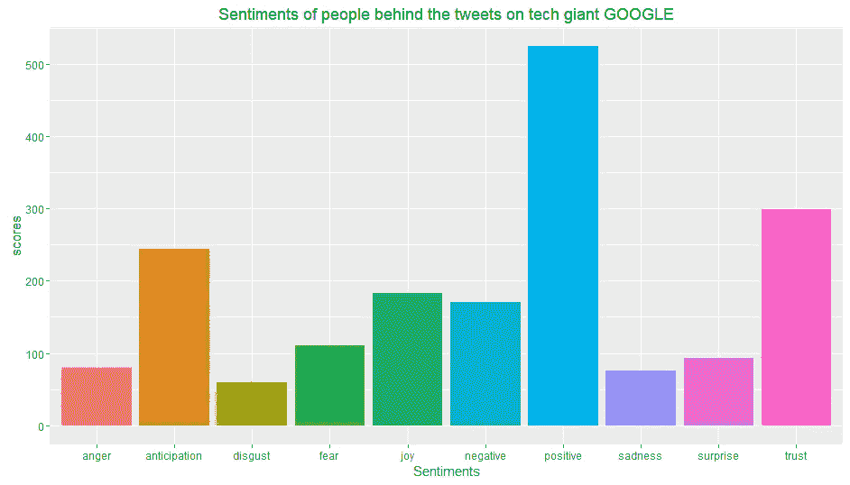

从下面对#Amazon 的推文的情感分析图可以看出，这家电子商务巨头有最多的推文是正面的，与谷歌相似，赢得了消费者的信任。除此之外，他们的顾客中还有相当多的快乐。

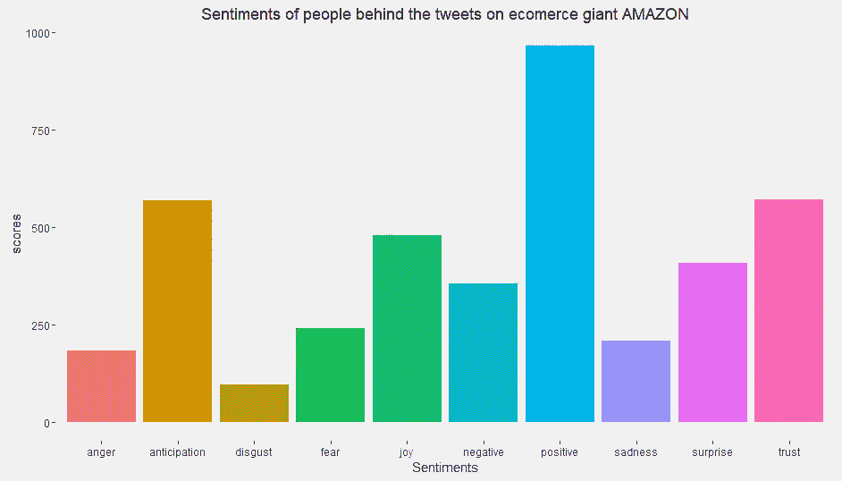

带有#脸书的推文显示了一点不同的趋势。最近，facebook 上的推文似乎有很多负面情绪。但与此同时，该公司还保持着一种信任。

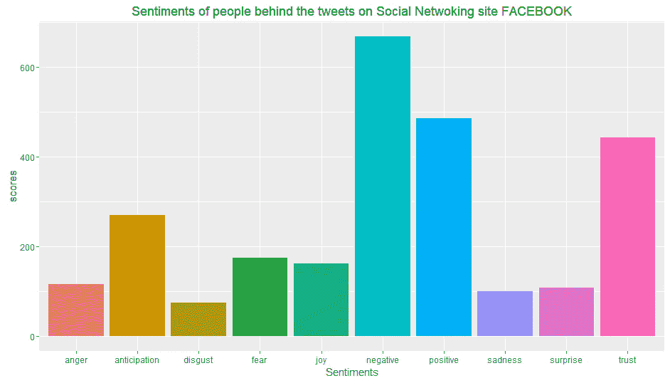

总的来说，在全球范围内，关于技术的推文在人们中间有很多积极性和信任。

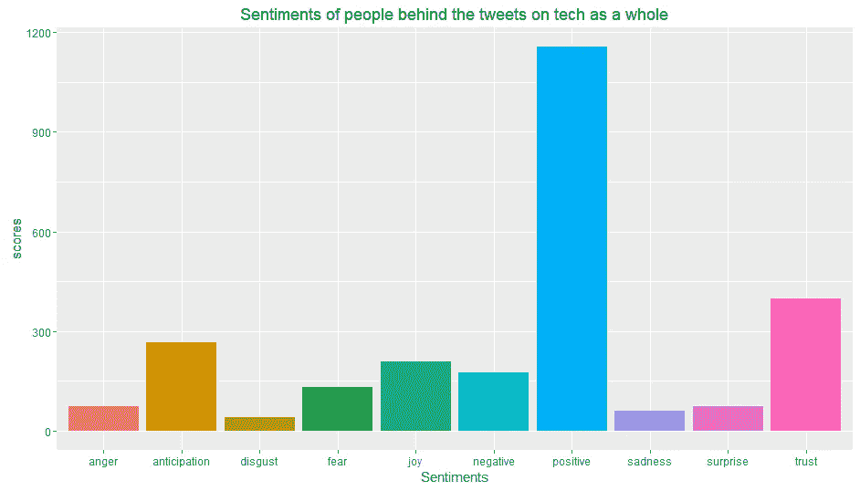

这些只是我所描述的几个非常明显的观点。您可以随时查看可视化效果，并对数据得出多种结论。

# **结论:**

文本处理和情感分析是一个具有挑战性的领域，因为它涉及自然语言处理，所以存在许多障碍。它有各种各样的应用可以受益于它的结果，如新闻分析，营销，问答，读者做。从互联网上，尤其是社交媒体博客上表达的观点中获得重要的见解对许多公司和机构来说至关重要，无论是在产品反馈、公众情绪还是投资者意见方面。

情感分析是一项很难做好的技术。然而，当你这样做时，好处是巨大的。

寻找一种使用自然语言处理技术的工具，最好具有机器学习能力。寻找一家认真对待情感分析并展示其情感分析技术进步和更新的供应商。

# [**完整代码。**](https://github.com/DevikaMishra-Dataturks/Twitter_Data_Analysis)

 [## DevikaMishra-Data Turks/Twitter _ Data _ Analysis

### GitHub 是人们构建软件的地方。超过 2800 万人使用 GitHub 来发现、分享和贡献超过…

github.com](https://github.com/DevikaMishra-Dataturks/Twitter_Data_Analysis)