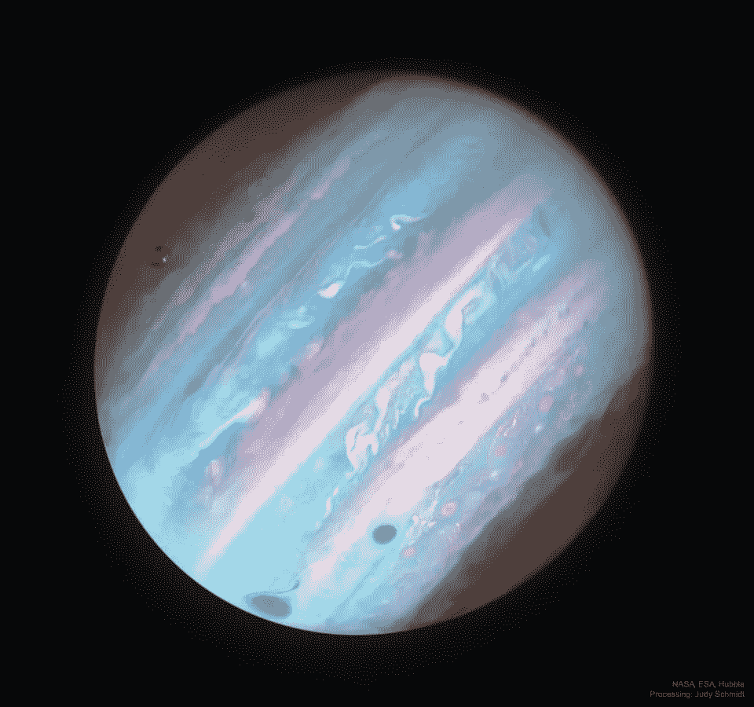
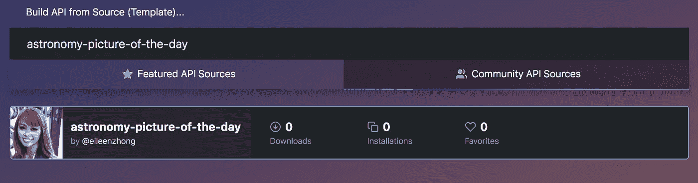
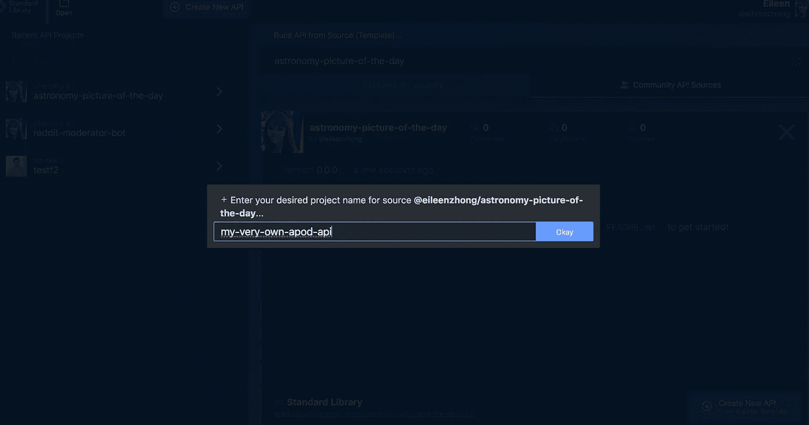
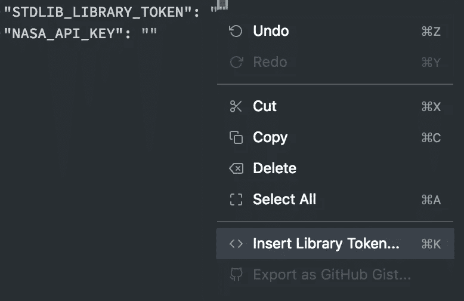
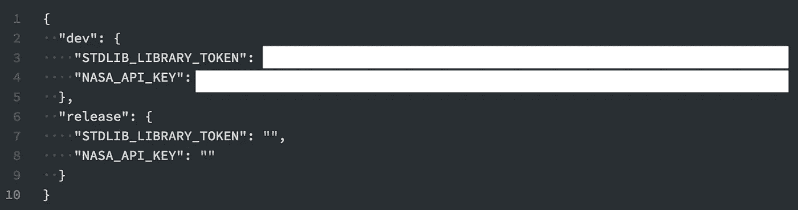
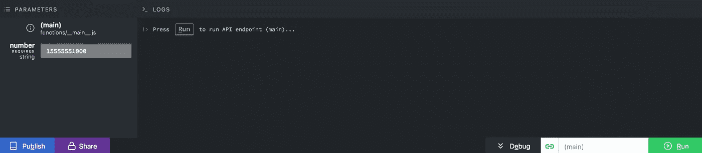
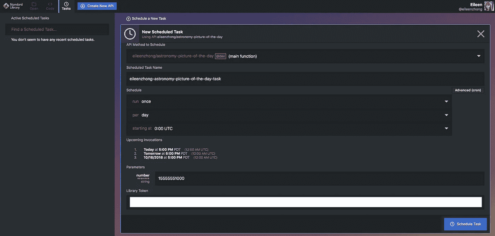
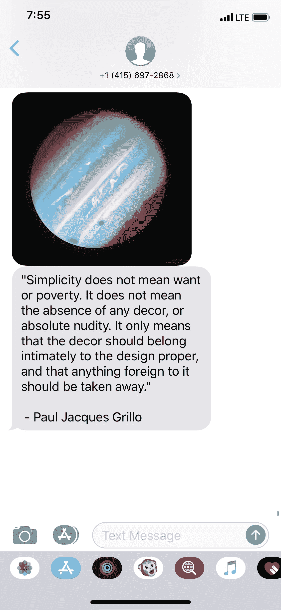

# 用标准库和 Node.js 给自己发一条 NASA 每日图片的短信

> 原文：<https://medium.com/hackernoon/text-yourself-the-nasa-picture-of-the-day-with-standard-library-and-node-js-226f6ca48adc>

**The APoD for 10/16/2018**: Jupiter in Ultraviolet from Hubble

> 我:天空不是☁️的极限
> 
> **陌生人**:图片或者我不相信你*🙄*

基于上面的对话，我将向你展示如何用[标准库](https://www.stdlib.com)获得 NASA 高度渴望的**天文图片** (APoD)🌑 ⭐️

如果你不熟悉[标准库](https://www.stdlib.com)，我们是一个无服务器平台，可以让**每个人** (是的，*每个人*！致电所有项目经理、设计师、营销团队、销售人员、职业健康和工程师…🙋)在几秒钟内构建、发布和集成可扩展的 API。在我们的在线文本编辑器 [Code.xyz](https://code.xyz) 的帮助下，你可以在浏览器上完成所有这些工作。

## 要求

*   [标准库](https://www.stdlib.com)账号(免费)
*   [NASA](https://api.nasa.gov/) API 密匙(免费)

[标准库](https://www.stdlib.com)提供了大量易于使用的 API 模板。为了检索 APoD API 模板，转到 [Code.xyz](https://code.xyz) 并搜索`astronomy-picture-of-the-day by @eileenzhong`💁

APoD template

命名您的 API:

Name your API

发送 APoD 到你的手机前的最后一步！

您需要正确配置`env.json`文件。你会注意到有两组变量。然而，我们将把代码部署到`dev`环境中，所以我们只需要提供`dev`变量。

首先，插入您的标准库库令牌(`STDLIB_LIBRARY_TOKEN`):

Right click to access this context menu

然后，插入你的 [NASA](https://api.nasa.gov/) API 密匙。完成后，您的`env.json`文件应该如下所示:

这就是你要做的所有设置！

要运行该程序，请单击“调试”以显示参数输入区。输入您的电话号码，包括国家代码:

Don’t forget the country code!

当你点击“运行”时，你会收到美国宇航局的当天天文图片！🚀

这还不是最酷的部分。

我们不想每天都点击“运行”来把这条短信发送到我们的手机上。谢天谢地，[标准库](https://www.stdlib.com)有一个任务调度器，你可以定制一个调度来自动*魔法*盟友调用你新创建的 API。

在 [Code.xyz](https://code.xyz) 中，点击“任务”选项卡。然后，您可以输入电话号码，并根据自己的喜好定制日程安排:

Create a scheduled task for your API

*建议:将任务安排为每天执行一次，因为 APoD 是* ***日*** *的天文图像的缩写，因此，图像在一天中不会改变。*

当您对设置满意时，单击蓝色的“调度任务”按钮来调度您的 API。

就是这样！如果你认识一个☝️、两个✌️或五个🖐人，他们会喜欢每天的天文照片，你可以为他们安排不同的任务(每个电话号码一个)。

## 奖金部分

如果你已经走了这么远，你应该得到奖励🌈现在，不要太激动(实际上——一定要激动🙃).只需 2 行代码，您就可以向您的朋友发送随机报价和 APoD！

APoD and a random Paul Jacques Grillo quote

我们将使用 WordPress 的 API 来抽取一个随机引用:`[http://quotesondesign.com/wp-json/posts?filter[orderby]=rand&filter[posts_per_page]=1](http://quotesondesign.com/wp-json/posts?filter[orderby]=rand&filter[posts_per_page]=1.)` [。](http://quotesondesign.com/wp-json/posts?filter[orderby]=rand&filter[posts_per_page]=1.)

Add lines **11** and **12** to send a random quote with the APoD text

不要担心第 12 行的所有正则表达式。WordPress API 只是返回一些在 MMS 中不能很好播放的 HTML 标签📱

或者，你可以用你想发送给你朋友的任何文本块来替换变量`quote`的值:`const quote = "Hi friend."`

尽情享受吧！