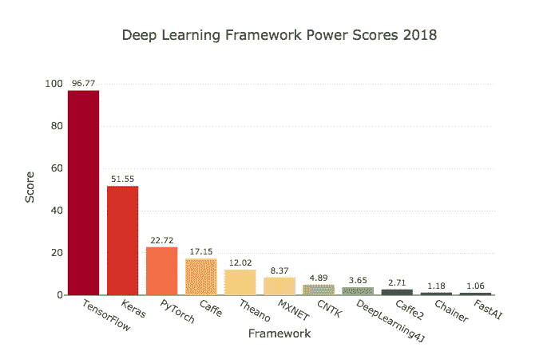
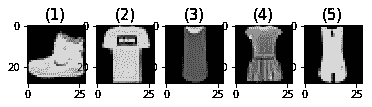
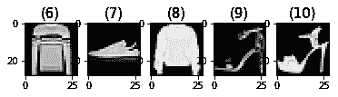

# 在 Keras MobileNet V2 和 Heroku 培训和部署深度学习模型:分步教程第 1 部分

> 原文：<https://medium.com/hackernoon/tf-serving-keras-mobilenetv2-632b8d92983c>


## 为什么要在 Keras + Heroku 上训练和部署深度学习模型？

本教程将逐步指导您如何训练和部署深度学习模型。在广泛搜索互联网后，我发现很难找到教程来从头到尾地构建和部署深度学习模型。虽然有一些关于这个过程的各个阶段的优秀文章(我在自己的深度学习之旅中使用过)，但我写这篇教程是为了填补我认为是一个重要的空白。

本教程将带您了解在 TensorFlow 中训练模型并将其部署到 Heroku 的整个过程——代码可从 GitHub repo [这里](https://github.com/malnakli/ML/tree/master/tf_serving_keras_mobilenetv2)获得。

**我们将要使用的技术的完整列表:**

*   [Keras 2.2](https://keras.io/) 是一个高级神经网络 API，用 Python 编写，能够运行在 TensorFlow 之上。
*   [TensorFlow 1.11](https://www.tensorflow.org/) (TF)是一个面向研究和生产的开源机器学习库。TensorFlow 是谷歌将深度学习的力量放到全球开发者手中的尝试。[1]
*   [Scikit-image 0.14](https://scikit-image.org/) 是图像处理的算法集合。
*   [Scikit-learn 0.19](http://scikit-learn.org/)Python 中的机器学习。
*   [Pillow 4.1](https://pillow.readthedocs.io/en/4.1.x/) 是 Python 图像库
*   [Python 3.6](https://www.python.org/downloads/release/python-367/)

TensorFlow、Keras(当然还有 python)已经被越来越多的行业和研究团体所采用:



*Deep learning frameworks ranking computed by Jeff Hale, based on 11 data sources across 7 categories*

由于易于使用，TensorFlow 逐渐增加了它的功能得分——它为初学者和专家提供 API，以便快速进入桌面、移动、web 或云开发。关于张量流的简单介绍，请参见:( [easy-tensorflow](https://github.com/easy-tensorflow/easy-tensorflow#why-use-tensorflow) )

Keras 网站解释了为什么它的用户采用率在 2018 年飙升:

*   Keras 是为人类设计的 API，不是为机器设计的。这使得 Keras 易学易用；然而，这种易用性并不以降低灵活性为代价。
*   Keras 模型可以很容易地部署在更多的平台上。
*   Keras 支持 TensorFlow、CNTK、Theano 等多个后端引擎。
*   Keras 有[内置支持多 GPU 数据并行](https://keras.io/utils/#multi_gpu_model)。

由于培训和部署很复杂，我们希望保持简单，我将本教程分为两个部分:

## **第一部分:**

*   **准备好你的训练数据。**
*   **训练深度学习模型。**

## [第二部分:](/@malnakli/tf-serving-keras-mobilenetv2-c167b4b2bb25)

*   **用** [**TensorFlow 服侍**](https://www.tensorflow.org/serving/) **服侍你的模型。**
*   **部署到** [**英雄**](https://www.heroku.com/) **。**

**为了从本博客中获益:**

*   你应该熟悉 python。
*   你应该已经对什么是深度学习和神经网络有所了解了。

# 为培训准备数据

解决深度学习问题最困难的部分之一是拥有一个准备充分的数据集。准备数据有三个一般步骤:

1.  **识别偏差** —由于模型是在预定义的数据集上训练的，因此确保不引入偏差非常重要。

> 在[统计](https://en.wikipedia.org/wiki/Statistics)中，**抽样偏差**是一种[偏差](https://en.wikipedia.org/wiki/Bias)，其中样本的收集方式使得预期[人群](https://en.wikipedia.org/wiki/Statistical_population)中的某些成员比其他人更不可能被包括在内。它产生一个**有偏样本**，一个群体(或非人为因素)的非随机样本，其中所有个体或实例被选择的可能性并不相等。如果不考虑这一点，结果可能会被错误地归因于所研究的现象，而不是归因于[取样](https://en.wikipedia.org/wiki/Sampling_(statistics))的方法。

(汗学院为如何[识别样本和调查中的偏差提供了很好的例子](https://www.khanacademy.org/math/ap-statistics/gathering-data-ap/sampling-observational-studies/a/identifying-bias-in-samples-and-surveys)。)

2.从数据中移除异常值。

> 异常值是偏离其他数据观察值的极端值，它们可能表明测量值的可变性、实验误差或新奇性。换句话说，异常值是偏离样本总体模式的观察值。

[更多关于离群点检测](http://A Brief Overview of Outlier Detection Techniques)。

3.将我们的数据集转换成机器可以理解的语言——数字。在本教程中，我将只关注转换数据集，因为其他两点需要一个博客来涵盖它们的全部细节。

为了准备一个数据集，你首先必须有一个数据集。我们将使用时尚-MNIST 数据集，因为它已经针对分类问题进行了优化和标记。

(点击阅读更多关于时尚 MNIST 数据集[。)](https://arxiv.org/abs/1708.07747)

时尚 MNIST 数据集包含 70，000 幅灰度(28x28px 像素)图像，分为以下几类:

```
 +-----------+---------------------+
                |   Label   |     Description     |     
                +-----------+---------------------+
                |     0     |     T-shirt/top     | 
                |     1     |     Trouser         | 
                |     2     |     Pullover        | 
                |     3     |     Dress           |
                |     4     |     Coat            |
                |     5     |     Sandal          |
                |     6     |     Shirt           |
                |     7     |     Sneaker         |
                |     8     |     Bag             | 
                |     9     |     Ankle boot      |
                +-----------+---------------------+
```

幸运的是，大多数深度学习(DL)框架都支持现成的时尚 MNIST 数据集，包括 Keras。要自己下载数据集并查看其他示例[，您可以链接到 github repo —这里是](https://github.com/zalandoresearch/fashion-mnist)。

```
from keras.datasets.fashion_mnist import load_data# Load the fashion-mnist train data and test data
(x_train, y_train), (x_test, y_test) = load_data()# output
x_train shape: (60000, 28, 28) y_train shape: (60000,)
x_test shape: (10000, 28, 28) y_test shape: (10000,)
```

默认情况下，`load_data()function`返回训练和测试数据集。

将数据分成训练集和测试集是非常重要的。

**训练数据**:用于训练神经网络(NN)

**测试数据:**用于在训练阶段通过调整和重新调整超参数来验证和优化神经网络的结果。

超参数是在学习过程开始之前设置其值的参数。

在训练一个神经网络之后，我们针对我们的验证数据集运行训练好的模型，以确保该模型是一般化的并且不会过度拟合。

**什么是过度拟合？:**

过度拟合意味着模型在根据训练数据进行测试时预测正确的结果，但在其他方面预测不准确。但是，如果模型预测训练数据的结果不正确，这就称为拟合不足。关于[过配合和欠配合](/greyatom/what-is-underfitting-and-overfitting-in-machine-learning-and-how-to-deal-with-it-6803a989c76)的进一步解释。

因此，我们使用验证数据集来检测过拟合或欠拟合。但是，大多数情况下，我们会多次训练模型，以便在训练和验证数据集中获得更高的分数。因为我们基于验证数据集结果重新训练模型，所以我们不仅会在训练数据集中，而且会在验证集中过度拟合。为了避免这种情况，我们使用了第三个在训练中从未使用过的数据集，即测试数据集。

这里是一些数据样本



## 数据标准化

```
norm_x_train = x_train.astype('float32') / 255
norm_x_test = x_test.astype('float32') / 255
```

标准化数据维度，使它们具有大致相同的比例。一般来说，规范化使非常深的神经网络更容易训练，特别是在卷积和递归神经网络中。这里有一个很好的解释[视频](https://www.coursera.org/lecture/deep-neural-network/normalizing-activations-in-a-network-4ptp2)和一篇[文章](/@darrenyaoyao.huang/why-we-need-normalization-in-deep-learning-from-batch-normalization-to-group-normalization-d06ea0e59c17)

## 将标签(y_train 和 y_test)转换为一个热编码

```
from keras.utils import to_categoricalencoded_y_train = to_categorical(y_train, num_classes=10, dtype='float32')encoded_y_test = to_categorical(y_test, num_classes=10, dtype='float32')
```

一种流行的编码是将分类变量表示为二进制向量。[这里有完整的解释](https://machinelearningmastery.com/how-to-one-hot-encode-sequence-data-in-python/)如果你想深入了解，有问题尽管问

## 调整图像大小并转换为 3 通道(RGB)

[MobileNet V2](https://keras.io/applications/#mobilenetv2) 型号接受以下格式之一: *(96，96)，(128，128)，(160，160)，(192，192)或(224，224)。*此外，图像必须是 3 通道(RGB)格式。因此，我们需要调整尺寸&转换我们的图像。从(28 X 28)到(96 X 96 X 3)。

在我们所有的数据中运行前面的代码，可能会耗尽大量的内存资源；因此，我们将使用发电机。 [Python 生成器](https://www.programiz.com/python-programming/generator)是一个返回对象(迭代器)的函数，我们可以迭代这个对象(一次迭代一个值)。

# 训练深度学习模型

在我们对数据集进行分割、归一化和转换后，现在我们将训练一个模型。

有许多训练模型的技术，我们将只涵盖其中一种，尽管我认为它是最重要的方法或策略之一，即迁移学习。

## 迁移学习

深度学习中的迁移学习是指将知识从一个领域转移到一个相似的领域。在我们的例子中，我选择了 MobileNet V2 模型，因为它训练速度更快，体积更小。最重要的是，MobileNet 使用 [ImageNet 数据集](http://www.image-net.org/)进行预训练。

> ImageNet 是根据 WordNet 层次结构组织的图像数据集。WordNet 中的每个有意义的概念，可能由多个单词或单词短语描述，称为“同义词集”或“同义词集”。WordNet 中有超过 100，000 个同义词集，其中大多数是名词(80，000+)。在 ImageNet 中，我们的目标是平均提供 1000 个图像来说明每个 synset。每个概念的图像都经过质量控制和人工注释。[2]

因为我们的数据集是 ImageNet 数据集的一个子集，所以我们将把这个模型的知识转移到我们的数据集上。一篇很好的文章更详细地解释了这一点:[深度学习迁移学习的温和介绍](https://machinelearningmastery.com/transfer-learning-for-deep-learning/)

当使用迁移学习作为一种技巧时，理解下面的代码很重要:

```
for layer in base_model.layers:# trainable has to be false in order to freeze the layers
  layer.trainable = False # or True
```

当使用一个预先训练好的模型(例如我们的例子中的 MobileNetV2)时，你需要密切关注一个叫做**的概念微调。**

> 一般来说，“微调”是指我们冻结除倒数第二层之外的预训练神经网络(在数据集 A[例如 ImageNet]上)的所有层的权重，并在数据集 B[例如时尚-MNIST]上训练神经网络，只是为了学习倒数第二层上的表示。我们通常用我们选择的另一层来替换最后一层(softmax )(取决于新问题所需的输出数量)。[3]

在我们的例子中，我们有 10 个类，所以我们有如下

```
output_tensor = Dense(10, activation='softmax')(op)
```

**我们什么时候使用需要微调？**

*   当您有小数据集时(例如，几千个)
*   当用于训练预训练模型的数据集与新数据集非常相似或相同时。

## 构建和培训

```
from keras.optimizers import Adammodel = build_model()
model.compile(optimizer=Adam(),
              loss='categorical_crossentropy',
              metrics=['categorical_accuracy'])
```

现在我们编译这个模型。一些编译定义:

> **Adam** 优化算法是随机梯度下降的扩展，最近在计算机视觉和自然语言处理的深度学习应用中得到了更广泛的采用。[4]
> 
> 损失函数(**categorial _ cross entropy**)是预测模型在预测预期结果方面表现如何的度量。[5]
> 
> **category _ accuracy**是一个度量函数，用于判断模型的性能。[6]

```
train_generator = load_data_generator(norm_x_train, encoded_y_train, batch_size=64)model.fit_generator(
    generator=train_generator,
    steps_per_epoch=900,
    verbose=1,
    epochs=5)
```

在训练任何深度学习模型时，理解以下内容是至关重要的。

> **时期**是指整个数据集仅通过神经网络前后传递一次。[7]
> 
> **批次大小**是单个批次中训练样本的总数[7]。这与前面提到的 python 生成有很大关系
> 
> 迭代次数( **steps_per_epoch** )是完成一个 epoch [7]所需的批数。

要更详细地了解[，请阅读—时期与批量大小与迭代](https://towardsdatascience.com/epoch-vs-iterations-vs-batch-size-4dfb9c7ce9c9)。

经过 5 个时期的训练，准确率达到 94%,但是在测试数据集中我们会做得怎么样:

```
test_generator = load_data_generator(norm_x_test, encoded_y_test, batch_size=64)
model.evaluate_generator(generator=test_generator,
                         steps=900,
                         verbose=1)
```

对于花费在训练上的时间来说，86%似乎是合理的——1 小时的 CPU 时间。

**你可以尝试提高准确度的事情**

*   多选择**历元**，10 为例。
*   尝试冻结图层。**可训练** =假。
*   选择更大的 **batch_size** ，以 128 为例。
*   选择不同的**优化器**，例如 Nadam。然而，在这种情况下，更改优化器有时确实会带来很大的改进。

## 保存模型

确保您保存了模型，因为我们将在下一部分中使用它

```
model_name = "tf_serving_keras_mobilenetv2"
model.save(f"models/{model_name}.h5")
```

# 结论

我们已经为 MobileNetV2 模型准备了时尚数据集。此外，我们使用 MobileNet 模型作为迁移学习的基础模型。

在[第 2 部分](/@malnakli/tf-serving-keras-mobilenetv2-c167b4b2bb25)中，我们将通过 TensorFlow 服务来准备要成为服务器的模型。然后我们将模型部署到 Heroku。

问题/建议？—把它们留在下面的评论里。

# 参考

1.  [Keras 中微调深度学习模型的综合指南](https://flyyufelix.github.io/2016/10/03/fine-tuning-in-keras-part1.html)
2.  什么是 ImageNet？
3.  [迁移学习和微调:我们来讨论一下](https://www.linkedin.com/pulse/transfer-learning-fine-tuning-lets-discuss-arun-das/)
4.  [深度学习的 Adam 优化算法简介](https://machinelearningmastery.com/adam-optimization-algorithm-for-deep-learning/)
5.  [回归损失函数所有机器学习者都应该知道](https://heartbeat.fritz.ai/5-regression-loss-functions-all-machine-learners-should-know-4fb140e9d4b0)
6.  [指标的使用](https://faroit.github.io/keras-docs/2.1.0/metrics/)
7.  [历元对批量对迭代](https://towardsdatascience.com/epoch-vs-iterations-vs-batch-size-4dfb9c7ce9c9)