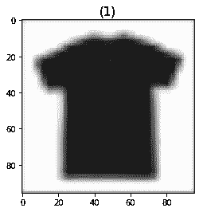

# 在 Keras MobileNet V2 和 Heroku 培训和部署深度学习模型:分步教程第 2 部分

> 原文：<https://medium.com/hackernoon/tf-serving-keras-mobilenetv2-c167b4b2bb25>


在第一篇[部分](/@malnakli/tf-serving-keras-mobilenetv2-632b8d92983c)中，我们介绍了部署深度学习模型的两个主要方面:

1.  准备数据集
2.  使用迁移学习技术训练模型。

第 2 部分将着重于准备一个由 TensorFlow 提供服务的训练模型，并将该模型部署到 Heroku。

# [张量流发球](https://www.tensorflow.org/serving/overview)

是一个面向机器学习模型的灵活、高性能服务系统，专为**生产**环境而设计。我不打算详细介绍它，因为 TensorFlow 服务有许多方式来服务模型，对于这个简短的教程来说，有太多的概念需要消化。

我强烈建议 TensorFlow 服务初学者先看， [TensorFlow 服务 101 pt。1](/epigramai/tensorflow-serving-101-pt-1-a79726f7c103) 。然而，本教程将介绍如何服务于 Keras 模型和使用新的 RESTful API，这在本教程中没有涉及。

# 为模特服务。

首先，让我们从[第 1 部分](/@malnakli/tf-serving-keras-mobilenetv2-632b8d92983c)加载保存的模型

```
from keras.models import load_model# model_name = tf_serving_keras_mobilenetv2
model = load_model(f"models/{model_name}.h5")
```

**保存模型**

我们定义输入张量`*images*`和输出张量`*scores*`。名称`*image*`和`*score*`可以是任何字符串。然后我们指定一个保存模型的路径，`models/export/tf_serving_keras_mobilenetv2/1`。`*1*`是型号的版本；当您打算重新培训模型并拥有新版本时，这非常有用。

每个版本将被导出到给定路径下的不同子目录中。最后，我们通过传递 TensorFlow 会话、输入和输出张量来构建模型。`sess`是 TensorFlow 会话，保存您要导出的训练模型[3]。

`tags`是用来保存元图的标签集。在这种情况下，因为我们打算在服务中使用该图，所以我们使用预定义的 SavedModel 标签常量[3]中的`serve`标签。

`signature_def_map`指定正在导出的模型类型，以及运行推理时要绑定的输入/输出张量。

# 将您的部署模型容器化— Docker

## Docker 是什么？为什么是 Docker？

> Docker 是一个工具，旨在通过使用容器来简化应用程序的创建、部署和运行。容器允许开发人员将应用程序与它需要的所有部分打包在一起，比如库和其他依赖项，然后作为一个包发送出去。通过这样做，由于有了容器，开发人员可以放心，应用程序将在任何其他 Linux 机器上运行，而不管该机器的任何定制设置可能与用于编写和测试代码的机器不同。[1]

以下是使用 Docker 的一些好处:

*   通过大幅减少基础设施资源实现投资回报和成本节约[2]。
*   Docker 容器确保跨多个开发和发布周期的一致性，标准化您的环境[2]。
*   快速部署，因为 Docker 为每个进程创建一个容器，并且不引导操作系统[2]。
*   所有主要的云计算提供商都支持 docker，包括 Heroku。
*   Docker 确保每个容器都有自己的资源，与其他容器隔离开来[2]。

如果你想深入了解 docker，[我推荐这个博客](https://medium.freecodecamp.org/a-beginner-friendly-introduction-to-containers-vms-and-docker-79a9e3e119b)。

[接下来:安装 docker——对于 macOS，windows](https://www.docker.com/products/docker-desktop) [或者 Ubuntu](https://docs.docker.com/install/linux/docker-ce/ubuntu/#upgrade-docker-ce) 。

一旦 Docker 安装完毕，运行以下命令以确保它正常工作。

```
> docker ps 
CONTAINER ID IMAGE COMMAND CREATED STATUS PORTS NAMES
```

# 赫罗库

## 什么是 Heroku？为什么是 Heroku？

Heroku 是一个平台即服务(PaaS ),使开发人员能够完全在云中构建、运行和操作应用程序。我将使用 Heroku，因为它可以免费用于开发和测试，易于部署(不需要太多工作)，默认支持多种语言，

(由于我在 Heroku 上找不到很多关于部署 TensorFlow 模型的资源，如果您有问题，请在下面留下评论，我将帮助您解决问题)

## 注册并安装 heroku-cli

*   [注册 Heroku](https://signup.heroku.com/)
*   安装 heroku-cli

注册安装 heroku-cil 后，运行以下命令来确认安装。

```
> heroku --version
heroku/7.18.3 darwin-x64 node-v10.12.0# make sure you have logged in to your heroku account
> heroku login
# Output should have:   
Logged in as xxxxx@xxx.xx
```

干得好——现在我们要将 TensorFlow 服务 docker 映像部署到 Heroku 但是，由于默认的 TensorFlow 服务 docker 映像没有针对部署到 Heroku 进行优化，因此我创建了一个 docker 文件:

[Original Dockerfile](https://github.com/tensorflow/serving/blob/master/tensorflow_serving/tools/docker/Dockerfile)

运行以下代码来构建 docker 映像，确保您与 Dockerfile live 在同一个文件夹中。

```
> docker build -t tf-serving-heroku-1.11 .
```

让我们在本地运行它来测试它

```
> docker run -p 8501:8501 -e PORT=8501 -t tf-serving-heroku-1.11
...2018-10-27 21:17:47.515120: I tensorflow_serving/model_servers/server.cc:301] Exporting HTTP/REST API at:localhost:8501 ...
```

# 给模特打电话

现在我们准备称之为生产就绪模型。

在调用模型之前，让我们了解 TensorFlow 服务 RESTful API 实际上是如何工作的:

```
POST http://host:port/<URI>:<VERB>URI: /v1/models/${MODEL_NAME}[/versions/${MODEL_VERSION}]
VERB: classify|regress|predict
```

在我们的例子中，请求看起来像这样:

```
[http://localhost:8501/v1/models/tf_serving_keras_mobilenetv2/versions/1:predict](http://localhost:8501/v1/models/tf_serving_keras_mobilenetv2/versions/1:predict)
```

其次，发送到 TensorFlow 模型服务器的 JSON 数据必须以一种非常特殊的方式构建

```
{
  // (Optional) Serving signature to use.
  // If unspecified default serving signature is used.
  "signature_name": <string>,// Input Tensors in row ("instances") or columnar ("inputs") format.
  // A request can have either of them but NOT both.
  "instances": <value>|<(nested)list>|<list-of-objects>
  "inputs": <value>|<(nested)list>|<object>
}
```

在我们的案例中:

```
{
  "signature_name":'prediction',
  "instances": [{"images":IMAGE_AS_LIST}]
}
```

你可以在这里看到 RESTful API [的完整文档。](https://www.tensorflow.org/serving/api_rest)

现在，我将展示一个如何从 python 调用我们的模型的例子

**预处理前的图像:**


Image size 1000 X 1000

**预处理后的图像:**



Image size 96 X 96

它将打印 *T 恤/上衣*

如果你已经走到这一步，你已经克服了许多障碍，祝贺你！—我们快到了。

# 现在我们要将模型部署到 Heroku。

在运行下面的任何命令之前，请确保您位于 Dockerfile 所在的同一文件夹中。

**登录容器注册表:**

```
> heroku container:login
```

**创建 Heroku app:**

确保用你的名字代替`${YOUR_APP_NAME}`

```
> heroku create ${YOUR_APP_NAME}
```

**推送 docker 图片到 Heroku:**

```
> heroku  container:push web -a ${YOUR_APP_NAME}
> heroku container:release web -a ${YOUR_APP_NAME}
```

要测试您的应用程序，请将 RESTful API URL 更改为:

```
https://{YOUR_APP_NAME}.herokuapp.com/v1/models/tf_serving_keras_mobilenetv2/versions/1:predict
```

也就是说，你现在已经训练并部署了一个深度学习模型到生产中。欢迎来到小型生产就绪机器学习社区:)

我已经创建了一个 [Jupyter 笔记本](https://github.com/malnakli/ML/blob/master/tf_serving_keras_mobilenetv2/main.ipynb)，里面有本教程第 1 部分和第 2 部分的所有代码。

# 结论

我希望你喜欢这个关于部署和训练深度学习模型的 2 部分系列。我会回答问题/建议，不管是谁在评论区留下的。如果你想看更多这样的教程，请跟我来，鼓掌并建议我们接下来应该学什么

:)

特别感谢肖恩·甘博亚的帮助和反馈。

# 参考

1.  [Docker 是什么？](https://opensource.com/resources/what-docker)
2.  [码头工人的十大好处](https://dzone.com/articles/top-10-benefits-of-using-docker)
3.  [服务于张量流模型](https://www.tensorflow.org/serving/serving_basic)