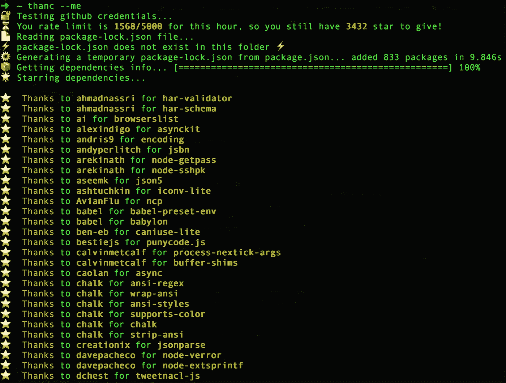

# 谢谢你，先生！⭐️

> 原文：<https://medium.com/hackernoon/thanc-ye-sir-%EF%B8%8F-57d5e99ee869>

## 感谢您在 Javascript 项目中使用的每个依赖项。是的，所有的人。用 thanc🤘



## TL；tr😏

[***thanc***](https://github.com/wilk/thanc)*是一个*[*node . js*](https://hackernoon.com/tagged/nodejs)*程序，它允许您启动包含 package.json 清单或 package-lock.json 文件的给定项目的整个依赖树。在 Github 上展示你在项目中使用的每一个依赖项，这有助于表达谢意。*

## 序文

圣诞节前几天，我的一个朋友告诉我关于 [**感谢**](https://github.com/symfony/thanks) ，一个 Symfony 的包裹送到:

> (以 GitHub ⭐的形式)感谢你的 PHP 包维护伙伴(不仅限于 Symfony 组件)！

这是一个很棒的想法，我也想把它用于 Javascript。
唯一的问题是,[感谢](https://www.npmjs.com/package/thank)和[感谢](https://www.npmjs.com/package/thanks)这两个软件包已经在 NPM 上存在，我需要找到其他的东西，因为，你知道，命名东西实际上很重要。
嗯，原来英语中表示感谢的古词是 [thanc(或 thancian](http://www.dictionary.com/browse/thank) ):我喜欢，所以选了它。

## 黑客攻击 c

那天是 12 月 23 日，星期六，午夜过后几分钟，我开始写代码。首先，我一步一步地设计了 thanc 的工作流程:

*   请求 Github 用户凭据(基本身份验证)
*   阅读 package-lock.json 依赖列表
*   通过查询 NPM 注册表来检索每个依赖项的包信息
*   star Github repos

这非常简单，在凌晨 4:00 我就可以提交第一个工作原型[](https://github.com/wilk/thanc/commit/943b8482b05118dc8571dd2a3257e4b1c23d4362)****。我没想到的是:我错过了那些美好的夜晚，在大学学习的时候，花在宠物项目上。伟大的时代！
但是突然，事情发生了！我激动万分，激动不已！****

## **⭐️介绍桑克·⭐️**

**现在我正在写，是 12 月 31 日，8 天，53 次提交，19 次发布。thanc 发展很快，但工作流程完全相同。
它支持**基本**和**用户令牌**认证，并且它继续依赖 **package-lock.json:** 如果它不存在，thanc 会动态生成一个临时的，所以即使是用 Node.js 0.10 构建的旧项目也是如此。
thanc 也被**转换**到 ES5，这样它就可以在 Node.js 的旧版本上运行:事实上，源代码是用普通的 ES6+编写的。
[](https://github.com/chalk/chalk)**粉笔已经被用来使它更加用户友好和有趣，就像表情符号的大量用法: [**榆树-感谢**](https://github.com/zwilias/elm-thanks) 启发了我很多👊****

****我认为 thanc 最重要的特性是能够感谢整个依赖树，而不仅仅是定义在 package.json 清单中的第一层。
事实上，当 thanc 针对一个项目启动时，它会扫描 package-lock.json 文件，解析每一个依赖项，最终到达树叶(那些没有依赖项的节点)。****

## ****⚙️使用 thanc****

****thanc 的第一个用户是我，不仅仅是为了测试，也是因为我需要它。自从 0.10 版本以来，我一直在使用 Node.js，我已经积累了如此多的项目，以至于我不可能列出所有 package.json 文件中列出的所有依赖项和子依赖项。
在开始做 thanc 之前，我在 Github 上有过 **1291** 主演的回购(收集于**几年**):然后， **3294** 。****

****几天内 2000 颗星星…太惊人了😲
我想你会注意到你的回购使用了多少包，也许只是很小一部分:是的，有时只是[我们的错](https://hackernoon.com/whats-really-wrong-with-node-modules-and-why-this-is-your-fault-8ac9fa893823)。****

****总之，thanc 使用起来很简单🙌
用 NPM 安装即可:****

```
**$ npm i -g thanc**
```

****[在你的 Github 账户上创建一个新的用户令牌](https://github.com/settings/tokens/new)，然后将它放入一个名为 **GITHUB_TOKEN** 的环境变量中，你就完成了:****

```
**$ export GITHUB_TOKEN=<your_github_token>
$ thanc**
```

## ****感谢、分享和贡献💛****

****你能做的第一件事就是感谢 thanc 本身:****

```
**$ thanc --me**
```

****thanc 是开源的，我相信你有很多好的想法可以分享和提出:所以，不要忘记公关和提出新的问题！****

****如果您喜欢这篇文章，请👏并与你的同伴分享🤘****