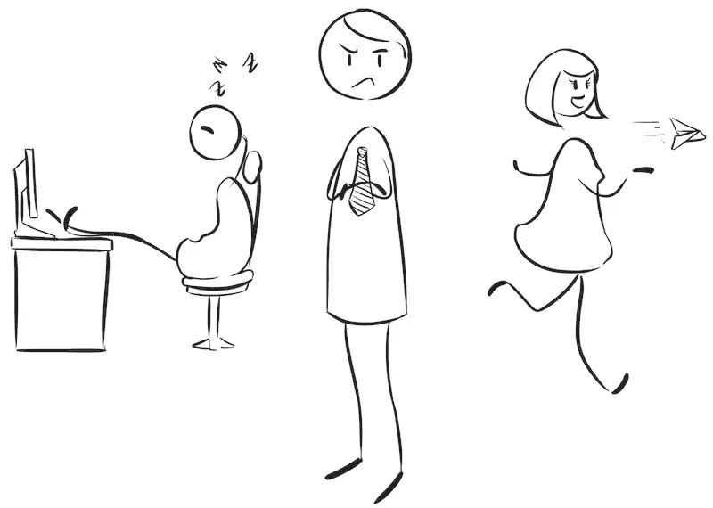

# 那个没人想做的项目

> 原文：<https://medium.com/hackernoon/that-project-where-no-one-wants-to-work-at-b349599b0f3f>

有些项目是人们想去做的。这可能有很多原因，我在这里列举了一些我见过的原因。意识到这些问题是开始解决它们的第一步。最重要的是，通过意识到这些问题，我们可以从第一天开始实施防止此类事情发生的流程。

# 该项目是如何定义的？

# 低品质

通常这些项目是由整体的低质量定义的:在代码基础上，在工具和过程上，可能在团队的一些成员上。如果我们的目标是快速上市，有时很难避免低质量。再加上缺乏经验的开发人员、苛刻的[截止日期](https://engineering-management.space/post/dealing-with-deadlines/)和糟糕的领导是失败的原因。

一开始我们可能看不到问题。团队可能看起来很快，并且按时交付。但是所有的技术债务将开始堆积，并将影响团队的生产力和健康。

有时候我们确实需要急着做一些事情。但是我们不应该让团队养成无论如何都要把事情做好的心态。因为这将很难改变。

# 很多虫子

低质量通常意味着我们有很多 bug 要处理。我们开始让我们的 bug 追踪器充满了 bug 和大量的抱怨，并开始与支持团队发生一些冲突。

在产品中出现影响客户的阻止程序错误总是令人沮丧的，我们开始在错误修复上花费更多的时间，而不是在功能和改进上。我们需要非常小心，不要陷入这个漩涡。

# 非常复杂，缺乏上下文，难以维护

复杂性意味着代码不容易更改或修复。我们可能粘贴了许多代码副本，在一个地方更改意味着在几个地方更改。很自然，我们会忘记一些地方，可能只有生产过程中一些愤怒的客户会提醒我们。

通常我们也没有文档来说明为什么事情是这样的。因此，对于不熟悉代码库的开发人员来说，理解正在发生的事情是非常困难的。这带来了风险，减缓了发展。

我们可能只能在[项目](https://hackernoon.com/tagged/project)的一部分中得到这个，就像那个支付处理模块，没有人理解，也没有人知道它是如何工作的，实现它的开发者两年前就离开了公司。

# 名声很差

其他项目的开发人员意识到了这个坏名声，并拒绝参与这个项目。他们可能不知道什么是挑战或问题，但即使如此，坏名声也会到处传播。

这将开始围绕项目的消极螺旋。其他开发者会说坏话，批评就容易了。这将挫败当前的开发者，因为项目和他们自己实际上可能是嘲弄的目标。

这通常始于直接互动并依赖于该项目的团队。即使没有上下文，人们也很容易回复电子邮件或去 slack，说类似这样的话:*那个新版本非常糟糕，充满了错误，他们做得很糟糕*。

事实是，有时这是最好的可能。

# 没有测试套件

没有这类项目的测试套件意味着我们所做的每一个改变都有很高的破坏风险。我们可能只有在生产时才知道。我们可能有不认为测试有价值的开发人员，并且反对他们。

还有一种观点认为，测试会增加开发速度，而且很麻烦。但我们需要考虑的不仅仅是发展速度。我们花在 QA 修复 bug 上的时间以及 bug 对生产的影响也应该考虑在内。

有时我们确实有一个开发团队，他们知道所有的项目和每一个变化的含义，并且可以不用测试就维护一个应用程序。当我们在团队中加入新成员时，这种情况就会被打破。有人很容易做出假设，改变不该改变的东西。没有测试，这些问题很容易影响生产。

# 非常慢的反馈循环

即使我们有一个测试套件和一个 CI 管道，拥有一个花费大量时间(小时)的将会影响团队的速度。团队应该设定反馈的最大时间，并努力让 CI 渠道低于这个时间。当我们提交一个补丁时，理想情况下我们想知道下一分钟是否一切正常。但是如果我们有一个缓慢的测试套件或者大量的集成测试，这可能会很棘手。

如果我们需要等待，我们有两个选择:

*   我们只是等待，不做别的
*   我们切换环境，开始做其他事情

我见过开发人员使用 2-4 个*补丁线程*就是因为这个原因。这开始影响他们思考自己在做什么的速度和能力。

我们也可以进行手动验证。这可能会导致反馈变慢，我们也需要小心处理。

# 如何设置和部署是一个谜

这时，你需要几天时间和团队成员的帮助，将项目在一台新机器上运行。通常是因为总有特定的上下文和补丁，或者你需要执行的一些技巧。这是非常令人沮丧的，特别是当当前的开发者得到一台新机器，或者当你需要升级你的机器，并且担心你需要几天才能回到正轨。

这与难以部署的机制密切相关。如果我们没有一个自动的方法来部署工件，我们将不得不手动地做，这总是容易出错。有时我们实际上不知道如何部署。这可能发生在部署一次的较小服务上，然后我们只需要在几个月后进行修复:

*   服务在哪里运行？
*   它使用什么样的机器和服务？
*   我如何更新它？

# 有问题的团队成员

我们可能有一个或多个团队成员存在问题，没有人愿意和他们一起工作。可能是因为他们喜欢事情进行的方式，不想提高项目的质量/体验。或者是因为他们有强烈的冲突性格，并主宰所有的决定。

他们也可能在技术上很优秀，但会产生不良情绪。

# 旧的或不性感的技术堆栈

拥有一个拥有旧堆栈的项目意味着依赖关系是旧的，并且升级将是非常复杂的。所以升级永远不会发生。这意味着，如果我们想对某些东西使用新的依赖，我们可能无法做到，因为项目太过时了。

所使用的语言/框架也可能不再有支持和新的补丁。

这对招聘来说尤其不好，因为开发人员考虑他们的职业生涯，在旧堆栈上开发的附加值并不是那么好。目前的开发者也将开始考虑他们是否正在失去对新事物的跟踪，以及它们的市场价值是什么。

# 如何让船掉头？

# 面对问题

理解并列出问题是第一步。我们需要意识到这些问题，并开始制定计划来解决它们。所有这些问题影响了人才的招募，也影响了开发人员在项目中的停留时间。如果我们想一想，让开发商参与这类还可以、不想搬迁的项目，是一个很大的危险信号。

我们需要一步一步来。了解团队最大的困难可以让我们知道是什么增加了更多的挫折，如果我们给团队资源来解决它们，我们可以增加团队的动力。

# 允许开发人员制定计划并解决问题

如果我们足够幸运，我们可能会有真正想解决问题并扭转局面的开发人员。我们需要在这方面投资，我们需要为他们提供资源(通常是时间)，让他们提出解决问题的计划。我们需要注意的是，不要做长期计划，而是打破计划，一点一点地推进。

这将平衡开发中遇到的*坏*问题的挫败感，以及修复和实现系统中*好*部分的动机。

# 调转船头

目标是这样的:

*   让我们把那个没人想做的项目变成一个*每个人*都想做的参考项目

这实际上是一个巨大的成就，如果我们幸运地拥有一个愿意实现这一目标的团队，他们将会非常满足，然后达到这个目标。

我们确实需要小心这些改进的规模。改进代码、工具和流程是伟大的，但不会持续很长时间。开发人员可能会忘记他们的驱动力，意识到对他们来说改变太多了，并开始考虑他们的未来。

整个团队需要在这一点上保持一致。让团队的一部分退回到以前的实践会引起讨论和挫折。

# 如何防止这种情况？

这应该是我们的重点。有时候不容易发现这些问题，当我们意识到的时候已经太晚了。对此我们能做些什么？

*   **追求零 bug 政策**:所有的 bug 都应该马上解决。如果某些东西不那么重要，应该从 bug 追踪器中移除并转移到其他地方(产品积压？).
*   **使用质量诱导技术**:比如代码审查或者结对编程。
*   **使用 linters** :让我们确保所有的代码库都遵循相同的指导方针，并且我们不会让不同风格的不同开发人员造成代码库的混乱。
*   **定期 1 对 1**:与团队一起执行定期 1 对 1，并尝试在问题出现之前发现它们。有一些指标可以预测问题，这里是收集这些指标的地方。
*   **测量做事情的时间**:例如，如果我们测量我们每个月在单元测试上增加了多少时间，我们就可以估计几年后测试套件将花费多少时间。如果这有问题，我们现在就可以开始改变我们做测试的方式([我们应该以 100%的代码覆盖率为目标吗？](https://engineering-management.space/post/100-percent-test-coverage/))。
*   **使部署指令成为强制性的**:每个项目都应该有关于如何部署和环境的指令。理想情况下，我们应该让部署命令自动化。
*   **文件申请流程**:特别是最复杂的。假设会有新人加入这个项目。她或他如何理解正在发生的事情，并能够改变和改善它？
*   **尝试定期升级依赖关系**:这可能会很麻烦，我们可能需要投入时间来升级那些具有突破性变化的依赖关系。但是如果我们不早点做，以后就永远不会做了。此外，尽量减少依赖性。

*原载于 2018 年 3 月 30 日* [*工程-管理.空间*](https://engineering-management.space/post/project-no-one-wants-to-work-at/) *。*