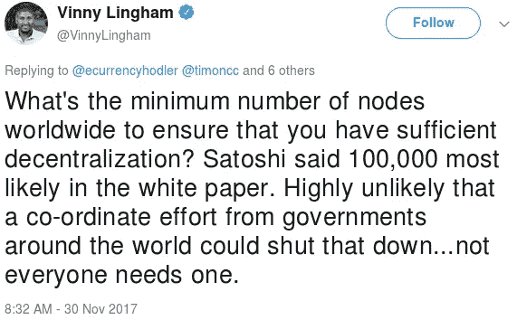
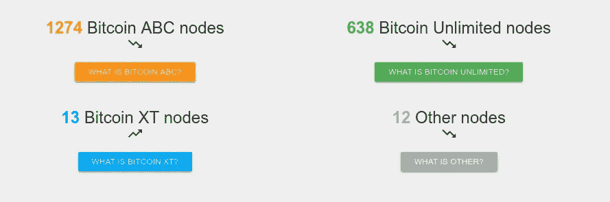

# 那不是比特币，那是 BCash

> 原文：<https://medium.com/hackernoon/thats-not-bitcoin-that-s-bcash-f730f0d0a837>

## 或者，一个完整节点的故事

## 介绍

我想在这篇文章之前做一些澄清，让事情变得非常清楚。首先，当我说 BCash 时，我指的是比特币*模仿者*，正式名称是比特币'**现金'**。

出于他们的社区对其他人给他们的项目起的 BCash 昵称缺乏热情，有人创建了一个假的项目，实际上叫做“BCash ”,这是一个可笑的尝试，旨在混淆旁观者，让人们不再把比特币**【现金】**称为 BCash。现在，当你使用这个术语时，他们都来源于这个虚假的项目，好像这否定了你试图辩论的任何论点。

你是在谈话或辩论中使用了 BCash 这个术语吗？争论…“卡什是一个不同的硬币，你一定是糊涂了或者是个巨魔。”

抱歉，不，我两者都不是。你只是个骗子。

这是假的:

这不是 BCash。这不是一枚不同的硬币。这是一种干扰。上面的假页面*(截图已经过时，Vinny 已经屏蔽了我)*和相关联的[空 Github](https://github.com/bcash-coin/bcash) 页面就是罗杰在下面这个剪辑中所说的“一个完全独立的项目，完全没有关系”:

“a paid operative”: [Caller 1](https://twitter.com/FiatisShiat/status/961684534730268672) — [Caller 2](https://twitter.com/BTC4USD/status/961711048695992321)

这是另外两个片段，一个来自 Roger，另一个是 Wu *(这个项目的两个最大倡导者)*对这个昵称非常不满。很明显，这不是一个开玩笑的事情，我们应该以更尊重的态度对待他们的项目/骗局，直截了当地称呼它:

In the [full interview](https://www.youtube.com/watch?v=OJT2CbfHTpo&t=7s), Bitcoin Jesus implicitly referred to BCash as “[his] project”.

[https://www.pscp.tv/w/1BdxYMDqezgxX](https://www.pscp.tv/w/1BdxYMDqezgxX)

同样，在本文的其余部分*(无论何时你在网上看到有人这么说)*，所有提到 BCash 的地方都是指比特币**、**、*，以防有任何混淆*。我不在乎你对昵称的感觉。这篇文章不是写给那些被昵称伤害的人，而是写给那些几乎不知道发生了什么的人。如果这让你困扰… *不要读:*

[https://www.youtube.com/watch?v=EigRGcfSEcw](https://www.youtube.com/watch?v=EigRGcfSEcw)

我不喜欢 BCash，所以我不会使用它，或它的实际名称。继续看实际的文章…

# 那么什么是 BCash 呢？它从哪里来的？它的目的是什么？我应该在乎吗？为什么是绿色的？

你没有理由盲目地信任我，但实际上如果你只是回避它，你就没什么好担心的。这篇文章不是写给那些已经很久的人的*(除了作为参考的书签)*，写给新手，没有意识的临时工，以及未来流入这个领域的兴趣浪潮。这些信息中的一些可能看起来已经过时或者是“旧闻”，但是我们的目标是通知和存档。这个社区的新成员不应该浏览多年的 Reddit 评论历史、Twitter 帖子，观看数百小时的比特币会议小组/讲座、YouTube 采访或亚历克斯·琼斯的客串，如果他们听信这些欺诈并购买 BCash，就可以明白为什么他们会被骗。如果你只是偶然发现这篇文章，我强烈推荐你阅读我的第一篇文章。你会对这个骗局中的一些玩家有更好的感觉。

像我的第二篇关于失败的 2X 分叉的[文章](https://hackernoon.com/this-is-bitcoin-who-are-you-to-tell-us-otherwise-8fc5966d4ac4)一样，我不会讨论缩放争论的整个历史。我会将尽可能多的信息汇集成一个易于理解的顺序，并加入一些我自己的观点。这篇文章一半的价值来自这里分享的内容，不是我的，所以请确保您检查了我在这篇文章中链接的来源，包括一个关于块传播的一小时长的视频。如果你真的想学习一些东西，你应该花时间去看它，并阅读所有其他分散在各处的文章。

# 索引

*   **延迟 Segwit:** 通往 Schnorr，MAST，机密交易，闪电网络，ASICBoost 的便捷杀手。
*   **造谣&宣传:**如何有效地摧毁你的整个声誉，但只针对那些一直在关注的人，以及为什么这是加密货币领域的一个好的商业策略。
*   **摩尔的*观察* :** 随着时间的推移增加硅上的晶体管数量与保持比特币的网络去中心化没有任何关系。
*   克雷格·赖特是个骗子，罗杰·维是他的朋友。
*   **结论:**忠告之言。

# 为什么要试图封杀和嘲讽 Segwit？

要理解原因，首先要理解 Segwit 的所有好处，它对比特大陆硬件操作的负面影响，然后要认识到，如果升级到 Segwit 成功，任何试图吸收比特币的人都将失去他们所拥有的任何优势，因为它为平稳和包容的软分叉走向未来奠定了必要的框架，但我稍后会谈到这一点。我无法开始概述 Segwit 的所有技术优势，比两年前比特币核心网站*上的[实际帖子](https://bitcoincore.org/en/2016/01/26/segwit-benefits/)更好，去读吧。相反，我将总结 Segwit 提供的一些东西，以及我所期待的需要 Segwit 来有效实现的最著名的未来发展*(不是所有的都可以实现，有些可能会随着时间的推移而发展)*。*

## Segwit 支持:

*   **事务吞吐量增加** —数据块的理论大小限制从 1MB 增加到 4MB，但实际平均大小增加到 2MB+，比当前容量增加了一倍多。
*   [**签名聚合(启用 Schnorr 签名)**](https://hackernoon.com/excited-for-schnorr-signatures-a00ee467fc5f) —允许块中有更多的事务数据*(通过“压缩”)*，而不管该块的大小。*节点*仍然需要处理额外的数据，但是*网络*不会受到影响，因为发送的数据量是相同的。 ***可以使用 SegWit 脚本操作码进行软分叉。***
*   [**【MAST】**](https://bitcointechtalk.com/what-is-a-bitcoin-merklized-abstract-syntax-tree-mast-33fdf2da5e2f)—显著减少智能合约&交易中必需的脚本数据量。 ***可以使用 SegWit 脚本操作码进行软分叉。***
*   [**保密交易**](https://www.youtube.com/watch?v=LHPYNZ8i1cU) —允许您在交易中发送的比特币的*数量*被隐藏，但如果需要的话是可证明的。 ***可以使用*** [***SegWit 脚本操作码***](https://lists.linuxfoundation.org/pipermail/bitcoin-dev/2016-January/012194.html) ***进行软分叉。***
*   [**闪电网络**](https://lnmainnet.gaben.win/)**——借助 Segwit 的延展性修复，闪电网络实现起来更简单，更高效地利用区块链空间。现在也有可能让轻量级 Lightning 客户端*(像手机钱包)*外包监控区块链，而不是每个 Lightning 客户端都需要是比特币全节点。**

**因此，Segwit 允许许多伟大的功能更顺利地实现，比如可以在不破坏网络的情况下通过硬分叉添加新的操作码，使未来的升级更加安全，并修复一些阻碍其他技术发展的交易格式问题。但何必呢，对吧？**

****

**相反，让我们取笑它，试图阻止它，当它因为是好代码而最终成功时，让我们分叉链，创建一个没有它的新 altcoin *(BCash)* 。在整个过程中，我们将继续传播关于它是什么以及它是如何工作的谎言，甚至谈论潜在的逆转 Segwit 作为后备选项，以防没有人喜欢或想要购买我们刚刚制作的新 altcoin，就像 Rick Falkvinge 在这个视频中所做的那样:**

**我现在简单提一下，以后再谈:**基础设施强化共识代码。****

**Segwit 不可逆转。下图显示了对 Segwit 兼容节点的粗略估计 *(~80%)* 。所有这些都从 2017 年 8 月初开始接受 Segwit 格式的块。任何逆转 Segwit 的尝试都会导致一个硬分叉，将网络分裂成另外两个硬币，在这个新的链上，你会让所有 Bech32 地址被盗，包括每一个闪电支付渠道。原来的链条会保持正常运转，因为没有任何东西改变，也没有任何东西损坏。**

**简单地说，没有人会使用新的链条。瑞克在欺骗你。**

****

**Highlighted boxes are software implementations that are assumed to not be Segwit compatible because they’re likely older than 0.12.1.**

**现实是，这里的每个人都不是在同一个“团队”工作。BCash 最初是由吴创建并为其服务的，因为 Segwit 会通过禁用隐蔽的 ASICBoost 来边缘化其公司的利润，这是对采矿的“改进”,使其采矿业务相对于其他公司具有显著的优势。你可以在下面读到更多，它有更好的细节:**

** [## ASICBoost，比特大陆封杀塞格维特的原因。

### 当然这是在我睡觉的时候发生的，但是格雷格·麦克斯韦发了一封非常有趣的邮件。

medium.com](/@WhalePanda/asicboost-the-reason-why-bitmain-blocked-segwit-901fd346ee9f) 

韩吉知道有一个少数群体想要走自己的路，并利用这一点为自己谋利。他其实多次说得很清楚，比特币是比特币，BCash 是 BCash，两者不可混为一谈。相反发生的是，少数群体拿起了新的叉子，并带着它跑。知名人士试图抓住它，称之为*比特币，就连韩吉也对此进行了反击并说不:*

[https://twitter.com/JihanWu/status/928831035441274880](https://twitter.com/JihanWu/status/928831035441274880)

与此同时，在这一切发生的整个时间里*(2017 年全年)*，2X 分叉就在地平线上，而为 BCash 鼓掌的同一批人同时也在推动 2X 试图瓜分比特币社区。[阅读我的 2X 文章了解更多。](https://hackernoon.com/this-is-bitcoin-who-are-you-to-tell-us-otherwise-8fc5966d4ac4)

所以我再次问，为什么要阻止比特币网络自诞生以来最重要的升级？为什么玩营销和社交媒体游戏？

# 为什么 sprea **d 造谣&宣传？**

加密货币社区最值得注意的事情之一是它的增长速度有多快，但教育过程有多慢。通过直接与一些开发人员交谈，以及与像我一样的许多不太参与的人接触，我学到了很多我所知道的东西，但这显然是不可扩展的。讲课很好，但“没人”真的看。播客也不错，但它们很少深入技术层面。从外部观察这一切，而不了解其内部运作，很容易认为我们已经处理好了这一切，直到你阅读像我和许多其他人一样的帖子，向你展示这一切实际上是如何处于初级阶段。

你知道有多少人知道比特币符合这一描述？

1.  明白这是无人控制的*“协议”。*
2.  *知道的人*“矿”*吧。*
3.  *知道价格涨跌。*
4.  **就这样。**

*我敢打赌是大多数人。像我正在写的这篇文章是*好的*，但是我的第一篇文章花了 4 个月才达到 2 万“浏览量”。大多数人只是不想投入时间，或者不具备自己做研究所需的技能。另一方面，这条带有短视频的推文花了几天时间才达到 20，000 次视频观看和 100，000 次展示，但这仍然不是很多*(这只是一个短视频):**

*然而，这并不令人惊讶，“没有人”了解互联网是如何工作的。这样做的人不到总人口的 1%，比特币的协议栈也是如此。随着社区随着比特币的采用而增长，它看起来不再像一个社区，而开始像一个有着不同观点的群体，与此同时，“实际的”社区继续前进，继续讨论和建立比特币曾经是*(现在仍然是)*的目标。这个内部圈子在不断扩大，但远不及观点大相径庭的外部圈子。*

**

*[https://twitter.com/janeygak/status/967076813141786624](https://twitter.com/janeygak/status/967076813141786624)*

*的确如此，但那是因为大多数人实际上并不是“社区”的一部分，他们也不需要成为，也永远不会成为。没有一个“TCP/IP”社区是由互联网协议工程师和普通脸书用户组成的。让我们看看一些非常简单的社区增长类别，例如，通过不同的因素增长:*

****

*抛开现实世界的准确性*(比特币基地只是一个单一平台)*，你看到我看到的了吗？我看到有 10，000，000 人可能被操纵而相信虚假的前提和宣传。如果我想改变足够多的观点，让自己看起来与真实社区有竞争力，我需要说服多少人？ **0.18%。**在一个有 1000 人的房间里，我只需要说服其中两个人相信我，并在 Reddit 或 Twitter 上发布。那么你会怎么应对呢？也许你会因为不关心而忽略它，也许你会在社交媒体上与人争论，也许你会写一篇文章通知人们。*

*这些数字显然是错误的，我对任何试图挑战它们的人都不感兴趣，因为这偏离了主题。在这个领域说谎很容易，从中获利，被人叫出来，然后再次说谎以获取更多利润。人们可能不知道下面的论点是什么意思，但如果他们刚刚进来，偶然发现这一点，他们会立即产生偏见，他们不知道球门柱已经移动了 10 次:*

**

*[https://twitter.com/Falkvinge/status/967687732721004545](https://twitter.com/Falkvinge/status/967687732721004545)*

> *Segwit 是对一个非问题的拙劣修复，比特币可以随着更大的块而扩展。*
> 
> *Segwit 作为一个软分叉是一个黑客工作，作为一个硬分叉会好得多，我们还需要更大的块。*
> 
> *Segwit 正被强加给甚至不知道它是什么的用户，但如果它有更大的块，我会接受它。*
> 
> *闪电网络是一个蒸汽软件，实际上并不存在。*
> 
> *闪电网络在 18 个月内不会准备好，即使到那时它也是完全集中的。*
> 
> *闪电网络对于最终用户体验来说会太复杂，没有更大的块就不行。*
> 
> *BCash 也会有闪电网络，BCash 有更大的区块，所以会更好用，我们没有 Segwit。*

**

*Malleability wasn’t the only thing added in with Segwit, and it was never just about Lightning.*

**

*Bitcoin Unlimited failed. [About 400 of their fake nodes recently shut down too…](https://twitter.com/StopAndDecrypt/status/964974123905626112)*

**

*There’s no infringement. [The patents referenced](https://patents.google.com/patent/US7370206) are owned by Adobe, would effect the entire Internet, and aren’t enforceable. Segwit has nothing to do with this. At best Adobe owns these defensively.*

**

*T[he whitepaper](https://bitcoin.org/bitcoin.pdf) defines an electronic coin as a chain of signatures (section 2). This still exists with Segwit.*

**

*Right…*

**

*Vitalik supports the Raiden Network (Ethereum’s version of Lightning), and nothing about the Lightning Network changes the security of Bitcoin’s base layer. It only adds features on top of it.*

**

*Again…Lightning changes nothing about Bitcoin’s base layer. It only adds features on top of it.*

**

*The problem always existed. He just came into this space early, ignorantly spread what he believed to be true, while all the developers knew what would eventually happen. Also, [Satoshi conceived of payment channels.](https://lists.linuxfoundation.org/pipermail/bitcoin-dev/2013-April/002417.html)*

> *闪电太糟糕了，但如果你喜欢它，你仍然可以在 BCash 上拥有它！—罗杰*
> 
> *我从来没有说过，这句话是诽谤。我要告诉我的律师。—罗杰*

*“More Users” and “More Nodes” are provably false.*

*注意到右下角他的朋友假聪*(克雷格)*了吗？我们稍后将回到这一点…*

> *比特币现金可以拥有比特币拥有的一切，外加更大的区块。事实上，比特币现金**就是**比特币。虽然还没有，但是一旦有了，我们就可以把“现金”这个词从名字中去掉。*

*这就是为什么他们**讨厌【BCash 这个名字。这与他们想要的正好相反，它从名字中去掉了“比特币”，他们一直在努力推动*试图用这种命名惯例迷惑人们。罗杰拥有 Bitcoin.com，并且至少正在与控制@比特币 Twitter 账户的人合作，这个人一直在推动“BCash 是比特币，比特币的核心不是”。许多人怀疑他控制了账户，这并非不可思议，因为回复的风格是相似的，还有一些其他信息也指向这一结论。我不认为这些信息中的任何一个证明了这个理论是正确的，但是同样，他们至少在一起工作:****

**

*[https://twitter.com/bitfinexeded/status/980205104707063808](https://twitter.com/bitfinexeded/status/980205104707063808)*

*罗杰不喜欢你用民调评论他的推文，因为每次都不利于他。不相信我？试试看，他会屏蔽你的。他已经对我做过三次了。这不是一个 sockpuppet 帐户，这是我公开我是谁，为社区问简单的问题。他声称审查无处不在，并公开以支持“自由和开放的言论”为荣，所以我毫不犹豫地避开了他阻止我的选择。我之所以展示这些信息，是因为真正有趣的是**在罗杰屏蔽我的同时，@比特币账户也屏蔽了我**，尽管这是一个从未与@比特币 twitter 互动过的新账户。更有趣的是，当我清楚地知道我将继续这样做*(与他们的叙述相反的高能见度民意调查)*，并继续呼吁两个账户同时阻止我时，@比特币账户公布了他们的“Twitter 区块链”名单，以进行可信的否认。他们真的不想让你破坏他们迷惑你的企图。*

**

*[我要在这里引用我自己的话:](https://hackernoon.com/thats-not-bitcoin-this-is-bitcoin-95f05a6fd6c2)*

> *你有没有注意到我在旧比特币- *XT* subreddit 中为用户设置的“Pro Bitcoin Unlimited”标签？同样的运动，不同的旗帜:**控制网络。掌控比特币这个名字。***

*随着他们接管网络的能力越来越远离现实*(当你硬分叉时，你不能像闪电节点一样带着* ***基础设施*** *和他们的通道平衡)*他们越来越关注命名约定，因为随着网络变得硬化，这是他们唯一剩下的试图欺骗人们的东西。他们去年年底开始这样做，*在*2X 分叉日过去之前:*

**

*尽管如此，Roger 还是继续推广 2X fork **以及***(如上所述)，因为他知道这可能会对我们产生分歧。它只是从那时起才建立起来的，术语“比特币核心”的使用已经被加入到他们的努力中，所以他们可以开始尝试从 BCash 中丢弃“现金”。你可以从投票中看出，尽管有意误导了 80 万潜在选民，但大多数投票的人都知道发生了什么，但他们没有这样做。你甚至可以用任何你想要的来替换这些名字，没关系:**

********

**这些都没有阻止尝试，似乎加倍他的行动是所有罗杰知道如何做。Bitcoin.com 手机钱包首先列出了 BCash，现在默认情况下不再创建实际的比特币钱包，他的网站现在正在用同样的策略欺骗游客:**

****

**[https://explorer.bitcoin.com/bch](https://explorer.bitcoin.com/bch)**

********

**[https://twitter.com/billsmith4lyfe/status/988803284038172672](https://twitter.com/billsmith4lyfe/status/988803284038172672) /// [https://twitter.com/peterktodd/status/988693611943514113](https://twitter.com/peterktodd/status/988693611943514113)**

**我有一种强烈的感觉，这一切都将降临到他身上，但在那之前，比特币耶稣将继续存在。他不断接受来自太空之外的人的采访，这些人对他的历史或他们即将进行的讨论的背景一无所知，他不断对每一个人重复同样的咒语。**

**“比特币核心是”**

*   **“慢”**
*   **“昂贵”**
*   **“不可靠”**
*   ****摩尔定律意味着数据块可以永远在链上扩展。****

**“比特币现金是”**

*   **“快”**
*   **“便宜”**
*   **“可靠”**
*   **"多亏了摩尔定律,它将继续扩大规模."**

**观看下面这三个采访*(如果你能忍受)*，当你听到每一个采访中都提到这四个采访时，就大喊“宾果”:**

# **摩尔的观察**

**我将这一部分作为独立的一篇文章发表，以便将来有人提出这一观点时可以很容易地参考。 [*你可以在这里找到。*](/@StopAndDecrypt/moores-observation-35f7b25e5773)**

****

**[https://twitter.com/ELEProbtc/status/963845795140292609](https://twitter.com/ELEProbtc/status/963845795140292609)**

> **摩尔定律是观察到在密集的[集成电路](https://en.wikipedia.org/wiki/Integrated_circuit)中[晶体管](https://en.wikipedia.org/wiki/Transistor)的数量大约每两年翻一番。—维基百科**

**当人们讨论提高比特币的块大小时，引用摩尔定律来证明为什么网络可以继续以这种方式扩展已经变得司空见惯。简而言之，咒语是这样的:**

*   **过去，需要时，比特币总是以这种方式扩大规模。**
*   **计算机越来越强大，*看看摩尔定律就知道了。***
*   **你不需要运行一个节点，只有矿工应该决定运行什么代码。**

**注意到第三个和前两个没有关系吗？这是因为在你驳回关于摩尔定律的说法后，它们又回到你不需要*来运行一个节点，所以因为你不需要运行一个节点，所以如果它们剥夺了你运行一个节点的*能力*也没关系。因此，让我们抛开摩尔定律，为为什么能够运行比特币节点至关重要做一个有力的论证。***

1.  *摩尔定律是衡量集成电路增长率的标准，平均每年增长 60%。它不是衡量平均可用带宽的指标*(这一点更重要)*。*
2.  *带宽增长速度较慢。查看[尼尔森定律](https://www.google.com/search?q=Nielsen%27s+Law)。从 1:1 的比率*(硬件和带宽之间没有瓶颈)*开始，以每年 50%的速度增长，10 年的复合增长率约为 1:2。这意味着带宽扩展在 10 年内慢了两倍，20 年内慢了 4 倍，40 年内慢了 8 倍，以此类推……*(它实际上比这更糟糕，但我保持简单，它看起来仍然很糟糕。)**
3.  *网络**延迟**比带宽扩展得更慢。这意味着随着网络上节点的平均带宽速度的增加，数据块的数据传播速度不会以同样的速度增长。*
4.  ***更大的数据块需要更好的数据传播*(延迟)*以对抗节点集中化。***

**

*[https://twitter.com/ELEProbtc/status/963845795140292609](https://twitter.com/ELEProbtc/status/963845795140292609)*

> *永远*

*…*

> *20 年慢 4 倍，40 年慢 8 倍，以此类推…*

*…*

**

*Recycling this because it’s applicable, and a good meme. I made it myself.*

*这也不是什么新信息，他多年来一直在宣扬这种误解。他知道这无关紧要。甚至那些在不停地敲打比特币之后跳上 BCash 潮流的人几年前就知道延迟是个问题，但这都不能阻止这个论点被一次又一次地提出。这些推文来自多年前(' 15/'16)，以下 Reddit 帖子是今年(2018)4 月的:*

***

[https://twitter.com/adam3us/status/693847158693433344](https://twitter.com/adam3us/status/693847158693433344) /// [https://twitter.com/el33th4xor/status/638399125474684931](https://twitter.com/el33th4xor/status/638399125474684931)* **

*[https://www.reddit.com/r/btc/comments/8e88xu/satoshis_original_whitepaper_talks_about/](https://www.reddit.com/r/btc/comments/8e88xu/satoshis_original_whitepaper_talks_about/)*

*这与存储那些交易无关。它是关于完整节点能够接收事务，检查 UTXO 集以验证事务中的信息是正确的，并在将它发送到下一个节点做同样的事情之前认为它是有效的。这需要时间。这延迟了传播。然后，在某一点上，挖掘器成功地找到了块的有效散列，并将该块发送到网络，然后该块必须传播到网络上的节点，并像所有事务一样得到验证。有办法通过检查已经验证的事务块来简化这个过程，但是这仍然需要时间，并且增加块的大小会直接影响这个过程。如果你想增加块的大小，投入工作有助于抵消这个问题。*

*这是真正的缩放:*

*[https://www.reddit.com/r/Bitcoin/comments/7x4psl/advances_in_block_propagation_greg_maxwell/](https://www.reddit.com/r/Bitcoin/comments/7x4psl/advances_in_block_propagation_greg_maxwell/)*

*因此，我们建立了*(再次…)* 所有这些都很重要，因为对完整节点有集中效应。很好，现在我们已经完全驳回了那个论点，我们甚至可以忘记它发生过。为什么？你在网上为此与人争论的所有努力都无关紧要，因为:*

> *你不需要运行一个节点，只有矿工应该决定运行什么代码。*

*这场辩论只有两个方面。“非采矿”节点很重要，或者不重要。任何在这两种立场之间争论的人都忽略了大局，或者知道争论中间立场有助于你实际上站在哪一边赢得这场拉锯战。*

**

*[https://twitter.com/VinnyLingham/status/936271705298812928](https://twitter.com/VinnyLingham/status/936271705298812928)*

*…让我们讨论一下为什么这是对大局的误解，但首先要了解一些我们都应该能够认同的简单概念。*

*   *超过安全比低于安全要好。*
*   *如果共识的改变导致有能力操作一个完整节点的个体数量增加，*其他条件不变* **，**网络分散*某个*值。*
*   *如果共识的改变导致有能力操作一个完整节点的个体数量减少，*其他条件不变*，**，**网络通过*某个*值集中。*
*   *软叉是包容性的。硬叉子是专用的。包容建立了一个健康的单一网络，排斥造成分裂。*

*你提出的任何改变都会导致某人不再能够运行他们的节点，以及他们在连接到网络时达成一致的代码，*这是一件不好的事情*。你刚刚创造了一个有经济动机反对你改变的敌人，你在某种程度上缩小了网络。你还建立了一个先例，阻止其他人参与进来，因为他们可能害怕被切断联系。(顺便说一下，这个先例是证明工作变动也是一个坏主意的原因之一。你正在切断节点 ***和*** *的 hashpower。)**

*此外，您还面临破坏现有基础架构的风险。目前，这包括依赖于运行节点的服务，利用照明网络的当前和未来服务，以及**将**建立在该网络之上的任何其他服务。闪电只是开始。我甚至不会说网络现在是安全的，因为仍然有太多的变化风险，而且我不认为它会是安全的，直到有足够的分层和现实世界的负面后果，即使是试图对底层规则做出这样的改变的*。**

*我说的尝试是什么意思？*

*下面是一个“TCP 段”。你不需要知道那是什么意思，除了我将要告诉你的，我对它知道的不多。*

**

> *一个 TCP 段由一个段*头*和一个*数据*段组成。TCP 报头包含 10 个强制字段和一个可选的扩展字段。数据部分跟在标题后面。它的内容是应用程序携带的有效载荷数据。TCP 数据段报头中没有指定数据段的长度。它可以通过从总 IP 数据报长度(在 IP 报头中指定)中减去 TCP 报头和封装 IP 报头的组合长度来计算。—维基百科*

*这些是共识规则。互联网共识规则。*

*如果你改变了这些规则，并试图使用新的规则在互联网上发送数据，没有任何反应，这是无法识别的。**无效。***

*如果你实现使用不同规则的网络代码或硬件，然后用这些新规则将 2 台计算机连接在一起，你就创建了一个与互联网的其余部分完全不兼容的新网络。*

*如果你在一个充满新硬件和软件的数据中心这样做，将它们全部联网，然后尝试连接到外部世界，什么都不会发生，*你只是浪费了大量的金钱和时间。**

*如果你是美国电话电报公司的首席执行官，并与威瑞森合谋推出 4G LTE，你有几个选择:*

*   *让所有人大吃一惊，没人有 4G 手机，所有人都改用 Sprint，你亏了那么多钱你妈都把你当孩子排斥了。*
*   *宣布一个艰难的日期。每个人都嘲笑你。你放弃你的想法。*

*在这两种情况下，如果你是首席执行官并想这么做，你甚至都做不到。如果整个董事会都投赞成票，你仍然无法完成这件事。从你的律师称你们都是白痴，到工程组被告知在 6 个月内他们需要在全球范围内关闭所有交换机，然后对你刚刚发给他们的备忘录一笑置之。虽然只是一个更广泛的类比的例子，我不会做，**这是什么是真正的强制共识。***

*我的 3G 手机通过与数百万其他手机共存，强化了这一共识，问以下问题听起来很荒谬，不是吗？*

> *全球最少要有多少部手机才能确保你有足够的权力下放？*

*现实生活中不会发生硬分叉。整个系统有太多的层次，以至于违背初衷和*拒绝与现有的基础设施*合作只会导致*你*被从系统中切断。试着在马路对面开车，这是一条硬性规定。我在空无一人的道路上这样做过，我这样做是为了超越慢车，但实际上这是一条硬性规定？永远不会回到正常的一面？看看你能坚持多久。把结果告诉我。*

*比特币的全面安全并非来自于运行“节点”的“用户”数量，而是来自于从客户端挖掘*或*改变任何旧规则的总体能力。我无法告诉你我们如何达到这一点或何时达到这一点，但我们永远不会带着“硬叉子没问题”的心态达到这一点，我们也永远不会带着“矿工可以自由支配共识”的心态达到这一点，好像矿工们甚至从未将权力下放列在他们的优先事项清单上…*

# *邓迪*

*一个有趣的事情发生了，在 BCash 社区中，对假聪的鄙视已经开始酝酿。 Craig 开始被自己的团队召唤，我认为这很重要，因为这很可能会成为一个完美的例子，说明为什么“硬叉没问题”的心态实际上是不好的。一些平常的事情，比如一个社区和几个人之间的冲突，通常只会导致这些人消失或被称为“喋喋不休的人”。在这个社区中，他们对互联网/社交平台的各个方面具有财务影响力和控制权，潜在的结果是数十亿市值技术的硬分叉。听起来很棒，对吧？*

*事实上是的。还记得包容性和排他性吗？它们都在每次迭代中复合自己。每次你试图硬分叉时，你都以一个认为他们都一致的小团体结束，直到他们不再一致，他们一次又一次地硬分叉，使他们越来越分裂。相反，软叉社区通过包容性继续建设。永远不要将您的节点从网络中踢出，确保您编写的软件不会变得不兼容，或者确保您下载的钱包不会被禁用或在每次网络升级时不知道该做什么或跟谁走。*

*一般来说，每一个试图分叉或提议分叉比特币的客户背后都有一个首席开发人员:*

*   *迈克·赫恩——比特币-XT*
*   *加文·安德森——比特币经典*
*   *彼得·里尊——比特币无限*
*   *杰夫·加齐克— 2X *(btc1)**
*   *阿毛里·谢切特 *(deadalnix)* —比特币现金*
*   *Emin Gun Sirer — Bitcoin-NG *(比特币现金的叉子提议，还没有客户端)**

*自从 BCash 成功脱离后，这些老客户中的两个已经被重新调整为与该链兼容。Mike，Gavin，Jeff 都走了，虽然客户在串场，但目前对 BCash 的代码和走向有潜在影响力的真的只有三个人:**阿毛里，Peter，Emin** 。*

*我不想诋毁其他开发人员，但除了声称自己是首席科学家的彼得，只有三个人在研究比特币无限，还有两个开发人员在修补 XT。Amaury 是唯一一位向[bit coin-ABC](https://github.com/Bitcoin-ABC/bitcoin-abc/graphs/contributors)*(BCash 参考客户端)*提交代码的开发者，并帮助重新调整了 Bitcoin XT 客户端的用途，以兼容即将推出的 BCash hard-fork。这有助于给人留下这样的印象，即 BCash“实施分散化”，ABC 不是参考客户……***它是。****

****

*[https://github.com/bitcoinxt/bitcoinxt/graphs/contributors?from=2018-01-01&type=c](https://github.com/bitcoinxt/bitcoinxt/graphs/contributors?from=2018-01-01&type=c)*

**

*[https://cash.coin.dance/nodes](https://cash.coin.dance/nodes)*

*由于实际上没有人在运行 XT 节点，这就剩下了 ABC，无限的和未来潜在的“NG”*。[那些无限节点有 400 个是假的](https://twitter.com/StopAndDecrypt/status/977240462208720897)。这又让我想起了克雷格，因为彼得和艾敏是公开指责他胡说八道的人。这就剩下了**阿毛里** *(他曾与克雷格* *和他的*[*sockpuppet Scatman 先生*](https://twitter.com/StopAndDecrypt/status/918437904069906432) *在过去，以及与那个群体的其他成员有过* [*意见不合的历史*](https://www.reddit.com/r/btc/comments/7y6rsp/this_is_not_a_healthy_ratio_of_clients/dueatln/)*)*最终的选择:声讨克雷格和后者将导致 BCash 分叉成两个链，但前者将导致所有活跃的 BCash 开发者避开 Craig，这将他的朋友 **Roger** 置于一个有趣的困境中…**

********

**[https://twitter.com/StopAndDecrypt/status/988263156517621761](https://twitter.com/StopAndDecrypt/status/988263156517621761)**

**不相信这里会有问题吗？克雷格被视为“首席科学家”的 nChain 刚刚发布了他们的“[开放比特币现金许可证](https://nchain.com/app/uploads/2018/04/nChain-Open-BCH-Licence.pdf)”。Craig 非常坦率地表示了他对 BCash 相关软件专利的意图，以及他们打算如何为 BCash 添加只能在 nChain 许可下使用的功能。我认为下面的简短对话很好地总结了这个问题，但是，请记住“硬分叉是可以的”，所有 BCash 开发者都同意这一点。*(他们不是。)***

****

**[https://www.reddit.com/r/btc/comments/8f1ffv/the_nchain_open_bitcoin_cash_license_pdf/](https://www.reddit.com/r/btc/comments/8f1ffv/the_nchain_open_bitcoin_cash_license_pdf/)**

***【其他】*阵营的前景并不看好，他们也不能说我们没这么告诉他们。他们已经抓住这些人，因为他们有钱帮助推动他们最初想要的叉子，但现在钱推得比他们可能想要的更远，放手将是困难的。如果克雷格被踢出局，罗杰会怎么做？如果 Craig & nChain 强制使用 fork，Roger 支持他们，但是他们社区的一半人不想要它，其他开发人员会怎么做？nChain 开始起诉会怎么样？如果其他开发者妥协他们的道德并与他们合作会发生什么？**

# **结论**

**巩固上述一切本身已经是一个过程。我希望我能包括更多，但这会把这篇文章变成可能已经看起来像一个 Tumblr 页面。如果我不得不考虑以上的一切，结合我以前的文章，我只会以对这场“辩论”另一端的*真正的*少数人的建议来结束:**

*   **BCash 社区需要抛弃克雷格和罗杰。如果你真诚地相信更大的块是前进的方向，那么如果他们还在你的团队中，你将永远不会取得任何进展。切断绳索，他们合法地阻止你。最糟糕的是什么？你会意识到你的社区/支持者中有一半人不想这么做。他们过于投入和依赖他们来支持他们的主张，但这是你需要做的事情。**

****

**[https://twitter.com/PeterRizun/status/983961846804725761](https://twitter.com/PeterRizun/status/983961846804725761)**

*   **更名和前进，它对 Dash *(前身为 DarkCoin)有效。只要咬紧牙关，因为如果这一切都是关于 Satoshi 的视觉，它不应该有关系。抛弃名称游戏和对白皮书标题的关注，抛弃内讧，再一次抛弃你背上的坚持让它成为争论焦点的重担。***

****

**[https://twitter.com/CryptoCobain/status/963538894959644673](https://twitter.com/CryptoCobain/status/963538894959644673)**

*   **放弃阴谋论吧。我甚至不应该进入这个，但它让你的整个小组看起来像疯子。如果你真的相信“Bilderberg 是 Blockstream 的幕后黑手”，你真的需要看看下面的视频，重新考虑一下你的人生观。不要再喜欢暗示这种白痴行为的愚蠢的 Twitter 评论或分享像下面这样的文章。如果你不相信这些理论，考虑一下不要给那些“站在你这边”传播这些理论的人声音。**

********** [## 🅂🅃🄾🄿 (@StopAndDecrypt) |推特

### 来自🅂🅃🄾🄿的最新消息(@StopAndDecrypt)。全栈社会工程师:10% FUD，20%迷因，15%集中…

twitter.com](https://twitter.com/StopAndDecrypt)****