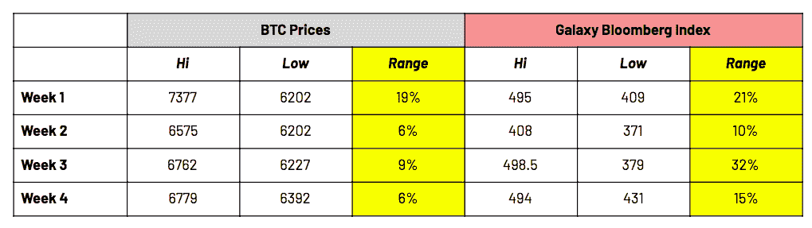
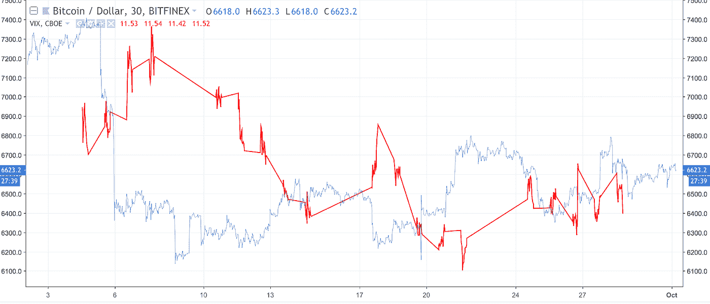
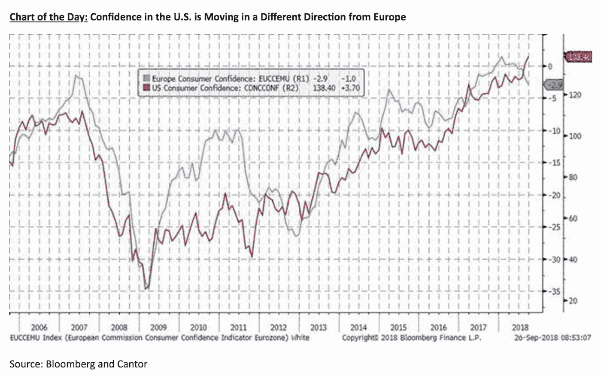

# “这是我们的两个 Satoshis”——Arca 每周加密摘要(BTC，XRP，ZRX，VIX)

> 原文：<https://medium.com/hackernoon/thats-our-two-satoshis-arca-weekly-crypto-recap-btc-xrp-zrx-the-vix-649aef0b8f3>

# 本周密码市场发生了什么？

## 不要相信“低波动性”的宣传

整体加密市场在本周结束时持平，略有下降，本月各种加密指数收于+/- 5%。但是正如我们上周提到的，这并不是一个平稳的旅程，本周也不例外。在 9 月结算账目时，我们注意到上个月的 4 个日历周中，每一周的价格波动都超过了 10%，在某些情况下，周内波动幅度超过了 20%。仅在过去的一周，经过本周的低调开局，加密市场在周二迅速下跌，但在本周剩余时间内价格反弹，本周结束时基本没有变化。

与此同时，通过研究表明 BTC 和其他加密资产正在更狭窄的价格通道中交易的技术图表，公众的叙事正转向“[缺乏波动性](https://www.coindesk.com/bitcoin-price-volatility-hits-lowest-level-in-nearly-2-years/amp/)”。我们会把图表留给那些每天每分钟都在交易的人，但是当我们看这些一周内的波动时，它表明一些别的事情可能正在发生。

## 所以让我们从顶部开始——宏观观点和消费者信心

戴着近视眼镜看世界是不明智的。虽然我们的内部研究团队专门关注加密市场，但我们的宏观观点是由传统市场中正在发生的事情形成的。虽然许多加密爱好者继续谈论加密与传统市场缺乏相关性，但最近有一些模式值得进一步探索。

今年夏天，我们强调说[比特币可能不再是一种不相关的资产](https://hackernoon.com/bitcoin-is-no-longer-an-uncorrelated-asset-a1bf38f10376)，理由是亚洲股票和[比特币](https://hackernoon.com/tagged/bitcoin)价格之间存在很强的相关性。这种关系虽然并不完美，但仍然存在，甚至可以用肉眼简单地通过观察特定的亚洲隔夜强/弱交易后美国市场早期的加密价格方向来测试。

此外，许多人认为比特币最终将成为“数字黄金”。这反过来会让比特币与风险资产负相关。这种想法表明，其他风险资产将是比特币的领先指标。然而，在过去的一个月里，以 VIX 衡量，BTC 实际上是一个领先指标。9 月份有 3 次重大的 BTC 修正，每一次都伴随着 VIX 的上涨。

**2018 年 9 月 1 日—9 月 30 日 BTC 与 VIX 价格对比图**

**来源:TradingView**

最后，考虑到我们发现交叉资产关系的倾向，我们承认下一个让我们特别困惑。由于加密价格跟随亚洲和新兴市场股票，我们假设加密和美国/欧洲之间一定有某种关系。那么，当两个最大的经济强国意见相左时，有什么好处呢？消费者信心就是如此，美国和欧洲的情绪走向相反的方向。这方面需要进一步分析。

## 著名的行动者和震撼者

从历史上看，数字资产之间的相关性非常高，但这种相关性可能开始消失。过去一周，市值排名前 25 位的⅔股市走低，而⅓股市一周比一周走高。

*   继周四上涨 27%之后，2017 年比特币的分支比特币现金(BCH)周环比上涨 10%[。此前有消息称，比特大陆已正式申请在港交所进行首次公开募股(IPO ),这可能会缓解比特大陆以及 BCH(比特大陆的资产负债表上有相当大的头寸)的一些流动性问题。](https://www.forbes.com/sites/cbovaird/2018/09/26/bitcoin-cash-surges-20-after-bitmain-files-for-ipo/#5f214ebd687f)
*   0x (ZRX)本周仅上涨 1%，尽管在协议 v 2.0 发布后的周一上涨了 15%。在周二的大范围抛售后，0x 未能保持住这些涨幅。

# 我们这周在读什么

[开放储蓄计划允许比特币用户锁定资金，直到特定时间](https://news.bitcoin.com/new-app-allows-users-to-create-a-custodian-free-bitcoin-trust/)

这是一个很酷的想法。有一个新的平台，允许人们在一个有时间限制的地址里拯救 BCH 和 BTC，使得资金在特定的时间之前不可动用。因此，从本质上说，一个用户如果想在儿子 10 岁生日时给他 1000 BCH，但想把这笔钱锁定到他 21 岁，他可以使用 OSI 平台。

[AirBNB 想给它的主人股权](https://www.documentcloud.org/documents/4917050-Airbnb-Letter-to-the-SEC-09-21-2018.html)

AirBNB 希望在其业务中给予 hosts 股权。嗯……一个社区需要一个激励结构，让重要的参与者继续在社区内运作和传播福音。这是一个新奇的概念；我们以前在哪里听过？(提示:加密资产)

[摩根大通推出 DLT 支付系统，将 Ripple 略微推到一边](https://u.today/jp-morgan-launches-dlt-payment-system-pushing-ripple-slightly-aside)

JP 摩根的代表表示，他们的系统是对 Ripple 或 Stellar 等主要加密初创公司的回应，这些公司现在正在全球银行系统中扩张，提供他们的产品，使用他们的令牌快速、低成本地进行海外支付。

[Compound 推出做空加密货币的简便方法](https://techcrunch.com/2018/09/27/short-ethereum-zrx-bat-rep/)

关于卖空者是帮助还是伤害市场，总会有争论，但我们站在卖空有助于市场实现均衡的阵营。

[第一首符号化歌曲](https://www.blockchainbeach.com/taryn-southern-is-first-artist-to-release-a-tokenized-song/)

还在寻找[区块链](https://hackernoon.com/tagged/blockchain)的现实生活有用应用？这首来自塔瑞安·扫森的歌曲标志着世界上第一次通过智能合同进行大规模音乐合作和后端所有权的实验。

# 媒体和街头的 Arca

*   Arca 的首席信息官史蒂文·麦克卢格和 Arca 的研究负责人凯蒂·塔拉蒂本周联手[讨论加密保管问题](https://www.crowdfundinsider.com/2018/09/139614-the-crypto-custody-conundrum/)。
*   在拉斯维加斯举行的[内部替代方案和资产分配会议](http://conferences.fa-mag.com/alts/)上，麦克卢格还在一个讨论 [Arca 自下而上研究过程的小组上发言。](https://twitter.com/arca/status/1044346254774304768)

***这就是我们的两只聪！***

*感谢大家的阅读！问题或意见，请告诉我们。*

Arca 投资组合管理团队

首席投资官史蒂文·麦克卢格

*首席交易员杰夫·多尔曼*

*凯蒂·塔拉蒂——研究部主管*