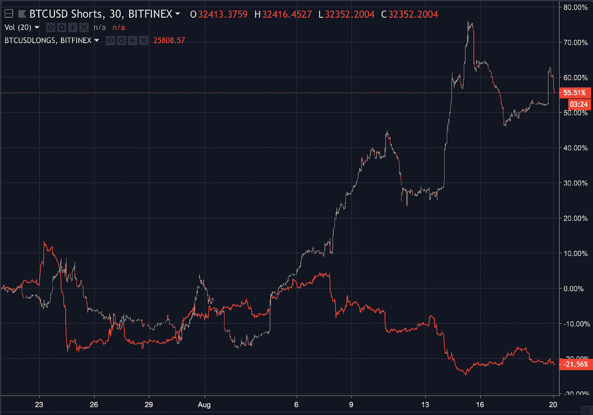
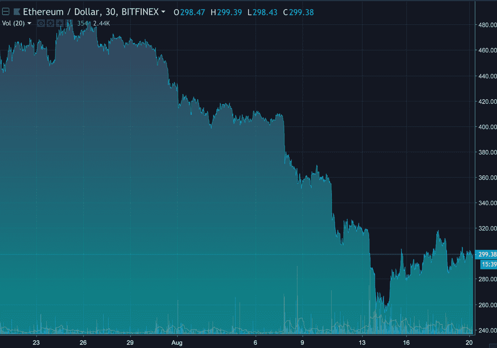
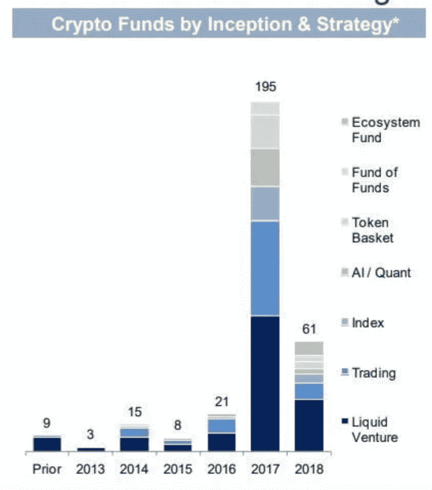

# “这是我们的两个 Satoshis”——2018 年 8 月 20 日加密市场概述(BTC、瑞士联邦理工学院、XRP、兽医)

> 原文：<https://medium.com/hackernoon/thats-our-two-satoshis-crypto-market-recap-8-20-18-btc-eth-xrp-vet-e32411edb9de>

本周密码市场发生了什么？Arca 基金投资组合团队讨论了周周价格波动、以太坊的影响以及比特币基地的持续优势。

# 不知通往何处的蜿蜒道路

对于那些在夏末度过假期的人来说，过去的一周乍一看可能相对平淡。比特币上周一为 6400 美元，目前为 6500 美元(截至周日晚上)。然而，你可能会错过的是令人难以置信的剧烈周内波动，大多数大型加密货币的交易区间为 15 %- 30%。本周开始时，周一开盘的比特币空头头寸大量涌入，同时平仓的多头头寸(如下图所示)导致比特币价格跌破 6000 美元，接近年初至今的低点。恐慌在整个加密社区蔓延，情绪迅速转向负面，因为许多人担心这是下一个走向新低的大事件。然而，6000 美元再次被证明是一个坚实的支撑位(2018 年第四次测试该水平)，到本周末，市场基本上没有变化。即使对我们这些习惯了这个不成熟市场波动的人来说，这也是一个迅速的举动。

# 以太坊已经迷失了方向

随着第二大加密货币大幅跌至 254 美元的低点，这是自 2017 年 9 月以来从未见过的价格，以太坊(ETH)的假头感觉更加真实。虽然 ETH 也从低点反弹了 20%(本周结束时下跌了 5%)，但这一举动引发了关于以太坊是否能够作为新令牌的合格平台的根本不确定性，该领域的一些知名人士呼吁以太坊彻底垮台(包括个位数的价格预测)。以太坊的联合创始人 Joe Lubin 已经站出来，[重申](https://www.ccn.com/ethereum-co-founder-joseph-lubin-crypto-market-slump-wont-curtail-growth/)最近的价格下跌不会减少生态系统基础设施的发展。值得注意的是，以太坊的竞争对手 EOS 也表现不佳，这两种硬币在过去 30 天里都下跌了 35%(尽管 EOS 在过去几天的表现已经开始超过 ETH)。

撇开以太坊的命运不谈，本周我们确实开始听到加密参与者之间的窃窃私语，他们开始怀疑 Fat 协议理论——该理论认为协议层将比应用层产生更多的价值(这是一个最初由 Union Square Ventures 提出的理论)。许多人认为这是 T2 区块链 T3 将要走的路，然而不久前随着互联网的形成，一个非常不同的场景出现了。HTTP 和 TCP/IP 是规定互联网如何运行的基本协议；如果没有这些基础层的实现，像谷歌、脸书、亚马逊和推特这样的应用就不会存在。然而，互联网的所有价值都产生于应用程序本身，而不是底层协议。作为加密领域最受认可的协议，以太坊的消亡让专家们比以往任何时候都更加怀疑区块链会效仿互联网的发展道路。尽管还有待观察哪些应用程序(dApps)能应付这种情况。([在这里阅读更多关于这个论点的内容](/ledgercapital/the-fat-protocol-thesis-debated-65ad56285fd5))

# 我们将何去何从？

展望未来，相对于其他代币，以太坊面临更大的抛售压力不足为奇，部分原因是基本面，部分原因是 ICO 项目转换带来的抛售压力([在此阅读我们对 ICO 资金管理不善的看法](https://www.crowdfundinsider.com/2018/08/138052-how-poor-treasury-management-is-killing-eth/))。此外，我们认为另一个潜在的过剩也正在接近市场。大多数加密专用基金都是在 2017 年推出的，几乎所有基金都有 1 年的投资者锁定期。虽然在 2017 年 3 季度之前成立的基金可能仍然处于困境，但许多在 2017 年 4 季度和 2018 年 1 季度成立的基金几乎普遍出现了负收益。这可能会导致未来几个季度出现一系列赎回和被迫抛售，也是那些准备好资金等待的基金的绝佳切入点。

*来源:自主 Next*

其他消息，比特币基地度过了非常忙碌的一周。周四，比特币基地为所有产品(比特币基地专业版、比特币基地和比特币基地移动版)的实时交易启用了以太坊经典版(ETC)。这标志着他们的交易所/经纪服务提供的第五个令牌；另一个重要的里程碑是比特币基地致力于完全遵守 SEC 法规。比特币基地最近还收购了旧金山的一家初创公司分布式系统公司，致力于为所有比特币基地产品创建分散的身份验证服务。此举巩固了比特币基地的扩张，除了钱包和交换产品之外，还向客户提供对其身份和其他 PII 的控制。

> 关于 Arca 或 Arca 基金的具体信息，点击[这里](https://arca.vosterra.com/referrals/3A3HFrBZQKU)。

# 著名的行动者和震撼者

上周，VeChain **(兽医)**股价飙升 61%。随着 mainnet 的成功发布和从 **VEN** 到 **VET/VTHO** 的令牌迁移，价格行动终于跟上了。应该注意的是，即使本周上涨了 61%，VET**仍然与本月初的美元名义价格相同。**

*   Ripple ( **XRP** )上周上涨 16.5%，因有[消息称 Ripple Inc .已与三家首选交易所(Bitso、Bittrex 和 Coin.ph)合作。这将允许与 Ripple Labs 相关的金融机构为 XRP 创建账户和交易票据，开始利用区块链的跨境支付。](https://smartereum.com/29563/xrp-xrp-news-today-xrp-is-currently-enjoying-significant-gains-xrp-amasses-gains-of-more-than-16-percent-over-the-past-twenty-four-hours-xrp-is-currently-in-a-bullish-territory/)
*   本体论 **(ONT)** 在周六成功推出 mainnet 后，本周收盘上涨 75.6%。本体论是一个有趣的发展，因为它是建立在 **NEO** 基础上的最值得注意的令牌(现在是硬币)，这是一个基于中国的平台令牌，可以与 **ETH** 和 **EOS** 相媲美。

# 我们这周在读什么

在投资者损失了 2400 万美元后，T 公司被指控玩忽职守

*   在提交给洛杉矶美国地方法院的一份 69 页的诉状中，Michael Terpin 声称，由于“美国电话电报公司愿意与黑客合作，严重疏忽，违反其法定职责，未能遵守其隐私政策中的承诺”，他损失了近 2400 万美元的加密货币。他起诉索赔 2.24 亿美元，称美国电话电报公司或代表美国电话电报公司的第三方协助窃贼，故意允许未经授权的用户更换 SIM 卡。在交易所存储加密货币(相对于冷存储)和使用 SMS 双因素身份认证存在巨大的风险。更多关于 Arca 在安全和托管方面的最佳实践，请加入我们的 Arca 对冲基金更新小组。

[每个金融投资组合都应该拥有比特币](https://www.ccn.com/every-financial-portfolio-should-include-bitcoin-new-research-paper-suggests/)

*   美国国家经济研究局(National Bureau of Economic Research)最近的一份报告得出结论，每个投资组合都应该包含至少 1%的比特币(6%是最佳选择)，作为对传统资产的多元化策略。他们认为，即使比特币具有内在的波动性，它也比传统资产提供了更高的风险/回报。

[安全令牌的时代来了](https://venturebeat.com/2018/08/04/the-era-of-security-tokens-has-begun/)

*   随着加密空间的不断发展，从最初的硬币发行(ICO)向安全令牌发行(s to)的转变似乎迫在眉睫。这将给成长空间带来新的合法性层面，并可能加速风险资本的分散化。

[央行数字货币即将上线](https://www.ethnews.com/ibm-blockchain-lead-predicts-central-bank-digital-currency-on-stellar-soon)

*   在“问我任何事情”会议上，IBM 的区块链解决方案负责人 Jesse Lund 表示，他们一直在积极地与各国央行合作数字货币项目，并指出数字货币令牌将在不久的将来发行。IBM 对 Stellar 网络的进一步采用预示着该项目的长期存在。恒星(XLM)令牌周环比持平。

[MLB 在区块链上拿棒球卡](http://fortune.com/2018/08/13/mlb-crypto-baseball-blockchain/)

*   继 Crypto Kitties 之类的产品之后，美国职业棒球大联盟(Major League Baseball)为在区块链出售的可收藏棒球卡创建了一个 dApp。通过智能合约持有特定的棒球卡，人们将能够实时获得良好表现的奖励。Arca 的研究负责人 Katie Talati 认为这是个可怕的想法。棒球是一项垂死的运动”而投资组合经理和前三级棒球运动员杰夫·多尔曼回应道“*你咬你的舌头！*“研究过程有效！

# 新闻中的阿卡

*   Crowdfundinsider.com[发表了 Arca 首席信息官史蒂文·麦克卢格关于瑞士联邦理工学院销售压力的想法](https://www.crowdfundinsider.com/2018/08/138052-how-poor-treasury-management-is-killing-eth/)，这是由通过 ico 融资的初创公司糟糕的(或不存在的)资金管理造成的。

***这就是我们的两只小智！***

*感谢大家的阅读！问题或意见，请告诉我们。*

Arca 投资组合管理团队

*史蒂文·麦克卢格——首席投资官
杰夫·多尔曼——投资组合经理/首席交易员
萨沙·弗莱斯曼——交易员
凯蒂·塔拉蒂——研究主管*

***免责声明:*** *本评论仅作为一般信息提供，绝不作为投资建议、投资研究、研究报告或建议。对本评论中讨论的证券进行投资或采取任何其他行动的任何决定可能涉及本文未讨论的风险，此类决定不应仅基于本文包含的信息。*

*本沟通中的陈述可能包括前瞻性信息和/或可能基于各种假设。此处表达的前瞻性陈述和其他观点或意见是在本出版物发布之日做出的。实际的未来结果或事件可能与预期的有很大不同，并且不能保证任何特定的结果会发生。本文中的陈述可能会随时更改。Arca Funds 不承担更新或修改此处表达的任何声明或观点的任何义务。*

*在考虑本注释中包含的任何绩效信息时，应注意过去的绩效并不能保证将来的结果，也不能保证将来的结果会实现。此处提供的部分或全部信息可能是或基于观点陈述。此外，此处提供的某些信息可能基于第三方来源，这些信息虽然被认为是准确的，但尚未经过独立验证。Arca 基金和/或其某些分支机构和/或客户持有并且将来可能持有与本评论中讨论的证券相同或基本相似的证券的财务权益。对于此类金融权益的盈利能力，无论是现在、过去还是将来，都不做任何声明，Arca 基金和/或其客户可以随时出售此类金融权益。此处提供的信息无意也不应被解释为出售或购买任何证券的要约。本注释未经任何监管机构审核或批准，且在编制时未考虑可能收到本注释的个人的财务状况或目标。特定投资或策略的适当性将取决于投资者的个人情况和目标。*