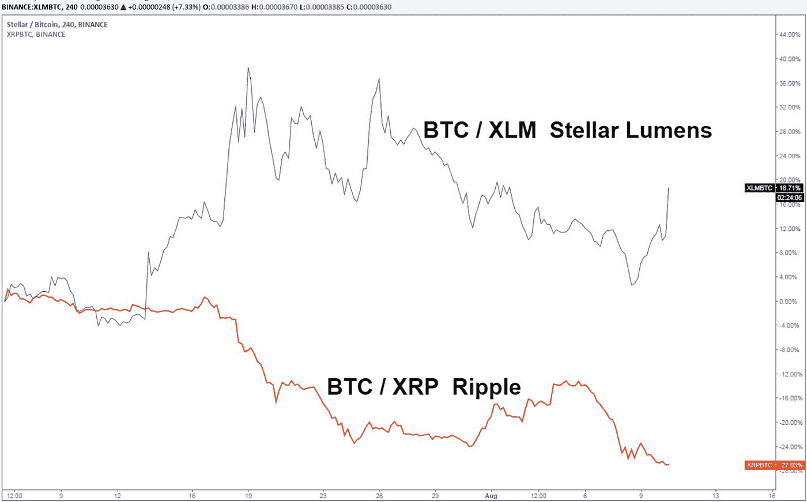

# “这是我们的两个 Satoshis”——加密市场概述(BTC、瑞士联邦理工学院、XLM、EOS、LINK)

> 原文：<https://medium.com/hackernoon/thats-our-two-satoshis-crypto-market-recap-btc-eth-xlm-eos-link-5afe8353f1fd>

# 本周密码市场发生了什么？

# 红色的海洋

随着加密市场在连续第二周两位数的损失后继续出血，上个月的收益开始看起来像是海市蜃楼。上周，比特币下跌 10%，至 6300 美元，而加密市场的总市值又下跌了 400 亿美元(考虑到整个资产类别目前的价值仅为 2130 亿美元，这不是一个微不足道的数字)。

这场大屠杀始于周二，当时 SEC 将 VanEck ETF 提案的最后期限延长至 9 月 30 日，导致比特币盘中下跌 500 美元，市场其余部分也做出了类似反应。我们预计 SEC 不会在 8 月份批准 Van Eck 的申请，也不会在 2018 年批准。价格下跌持续了一周，加速到周四和周五。我们认为，我们已经进入了一个“投降阶段”，许多散户投资者已经放弃了挽回收益的努力，并亏本出售了自己的投资组合，无法应对市场的日常压力。从历史上看，这是熊市的尾声。

或许奇怪的是，比特币对美国证交会即将做出的决定有如此明显的依赖。[加密货币](https://hackernoon.com/tagged/cryptocurrency)是一群对银行和监管机构控制“货币”的方式感到沮丧的人的想法——然而在 2018 年，在比特币白皮书撰写近 10 年后，我们看到监管机构的决定(或缺乏决定)主导了整个市场的价格行为。

在其他地方，其他大型代币如以太坊( **ETH** )、莱特币( **LTC** )和 Eos ( **EOS** )受到的冲击比比特币大得多，极薄的交易量下跌 20%至 40%(低于的交易量下跌更多)。以太坊特别有看头。大多数 ICO 项目在以太坊筹集资金，但这些项目所有者没有必要持有以太坊，尤其是在一个下滑的市场中。因此，这些项目所有者一直在寻求出售 ETH，以便获得足够的资金来维持运营。这方面的一个例子见于 **EOS** 公司，该公司[在今年 6 月和 7 月出售了](https://www.trustnodes.com/2018/07/03/eos-finally-sells-eth)剩余的 ETH **和**——这一头寸最初高达 300 万 ETH。据我们所知，在如此低的价格下，几乎所有的抛售压力都来自卖空者和 ICO 项目所有者，他们希望压低价格，直到找到阻力。

# 低交易量/广阔市场——非流动性证券透视

在这个时候，我们想提醒我们的读者，Arca 基金团队有几十年的非流动性资产交易经验，如高收益债券、不良债券、新兴市场债券和重组股票。在下跌过程中以 1 美元 80 美分、1 美元 60 美分、1 美元 40 美分的价格买入不良债券的情况并不少见……***同一天*** 。消息传出，价格调整，市场参与者必须对新的价格做出反应，新的价格可能是也可能不是可交易的(即，需要时间来达到市场均衡，即双方有平等的买方/卖方)。

让我们回到 crypto，仅仅因为 crypto 交易所允许任何人看到实时价格，并不意味着在这些级别上确实发生了任何交易。这是一个极其不成熟的市场，它通过不断显示看似可交易但实际并非如此的价格，诱使人们产生一种虚假的流动性感觉。加密在很大程度上是一个场外交易驱动的市场，这可能意味着非常大的买卖差价，因为买家和卖家相距甚远。因此，目前 crypto 的流动性不足。许多加密资产的价格急剧下降，几乎没有交易量。大多数这些代币，包括一些被认为是流动的代币，在没有卖家的情况下正在走低。做市商就像赌场庄家——他们不在乎哪一方赢，他们只想找到一个双方都行动的水平(这样他们就可以在更高的交易量上赚钱)。我们认为流动性不足是上周价格波动的主要原因。抛售在两周前基本停止，但没有足够的买家让市场达到平衡——所以做市商继续测试市场的低点，看看买家会在哪里介入。当他们最终介入，我们触及“底部”时，底部的交易量将非常小，因为我们会迅速反弹，看看是否还有卖家在这些较低的水平。投资于波动性大、流动性差的市场需要不同的方法和原则——在这样的市场中，我们会感到非常舒服。

# 宏观问题

我们一直在跟踪几个宏观趋势，我们认为这些趋势会对加密和整个市场产生影响。第一个趋势是通货膨胀以及更高的商品价格将如何影响数字资产(见我们对商品和石油的看法[这里](/arca-funds/oil-prices-a-signal-for-future-inflation-ef79635255a0))。通货膨胀是高度关注的问题，也是各国央行的首要任务，他们正准备通过加息来战斗，首先是美国的美联储，现在是欧洲央行，正如这里[所描述的](https://hackernoon.com/europe-has-ended-quantitate-easing-now-will-tackle-inflation-466cf4d8eab3)。加息对新兴市场经济体有影响，因为它们的借贷成本更依赖于联邦基金利率和伦敦银行同业拆借利率，而非本国利率。美联储、欧洲央行和英国央行的鹰派政策伤害了新兴市场，最近土耳其里拉的[贬值](https://www.zerohedge.com/news/2018-08-12/lira-crashes-through-700-erdogan-urges-turks-not-pull-money-out-banks)和南非兰特的[贬值](https://www.zerohedge.com/news/2018-08-12/south-african-rand-flash-crashes-10-turkey-contagion-spreads)就是明证。繁重的关税也是这一举动的催化剂。我们一直在跟踪加密与新兴市场股票等其他风险资产之间的相关性，但我们认为，超通胀和汇率波动将推动加密货币的更多采用。

> 有关 Arca 或 Arca 基金的具体信息，请点击[此处](https://arca.vosterra.com/referrals/3A3HFrBZQKU)。

# 著名的行动者和震撼者

上周，整个市场惊人地下跌了 21%，紧接着前一周下跌了 15%。很少有资产在加密中是安全的，除了一些例外和著名的移动者。

*   Chainlink **(LINK)** 上周上涨 10.5%，相对 BTC 上涨+20%。Chainlink 开发团队非常活跃——这是过去 9 个月中数千个项目中第 18 个最活跃的项目。随着他们为 mainnet 发布做准备，这个项目的背景似乎正在酝酿一场风暴。
*   XRP 和 XLM 的竞争愈演愈烈，XRP 下跌了 30%，XLM 下跌了 9.5%。自从杰德·麦卡勒在 2013/2014 年离开 Ripple 创办 Stellar 以来，Ripple 和 Stellar 一直被列为竞争对手。虽然它们涉及银行业的不同领域(交易费与汇款网络)，但它们总是被放在一起进行比较。虽然迄今为止,**一直是占主导地位的项目，但它似乎正在失去对【】XLM 的巨大动力，正如下面由 Twitter 上一位著名的加密货币分析师制作的图表[所示。](https://twitter.com/BitBitCrypto/status/1027972281149087744)**
*   **比特币 **(BTC)** 的统治地位现在已经达到 50.8%，并且没有放缓的迹象。在像这样的长期熊市中，比特币仍然是价值储存争论中的避风港。随着传统市场和其他市场遭遇困境(见土耳其里拉和南非兰特)，比特币提供了稳定性。**

****

# **我们这周在读什么**

**[区块链炒作是否已经见顶？](https://qz.com/1350355/blockchain-hype-has-peaked-but-ibm-is-still-a-believer/amp/?__twitter_impression=true)**

*   **区块链疲劳已经开始影响企业，财报电话会议上提到“区块链”的次数减少就证明了这一点。2018 年，公司似乎对域名删除加密相关术语更加谨慎。**

**[现实生活中的安全令牌用例——在区块链上出售的房地产](https://www.businesswire.com/news/home/20180808005549/en/Templum-Markets-Launches-Digital-Security-Offering-St?utm_source=The+Block&utm_campaign=8bca04a12a-EMAIL_CAMPAIGN_2018_08_08_10_22&utm_medium=email&utm_term=0_88997815bd-8bca04a12a-34175057)**

*   **我们已经说过，加密资产，尤其是安全令牌的最佳时机尚未到来。很快，你在区块链购买资产的事实甚至将不会成为人们谈论的话题，这是一种假设(就像 ETF 现在被假设为你购买一篮子股票的工具一样)。在这种情况下，圣里吉斯阿斯彭度假村的股权通过一种新的“阿斯彭代币”出售给投资者。**

**[勇敢的浏览器重新定义网络广告](https://www.cnet.com/news/brave-browser-will-let-you-cash-in-on-tweets-and-reddit-posts/?utm_source=reddit.com)**

*   **Brave 将在年底前增加对 Twitter 和 Reddit 的支持，允许用户在推文和帖子上赚钱。这将通过用户自愿向他们认为有价值的内容的作者捐款来完成，使用加密货币 **BAT** 作为支付。**

**[比特币不再被犯罪分子利用](https://www.bloomberg.com/news/articles/2018-08-07/bitcoin-speculators-not-drug-dealers-dominate-crypto-use-now?srnd=cryptocurriences)**

*   **根据美国药品管理局的说法，比特币的使用不再主要是作为非法活动的一种手段。DEA 的一名成员甚至承认，他们更喜欢犯罪分子使用加密，因为通过区块链的完美记录跟踪是多么容易(消除了加密是犯罪分子避风港的流行神话)。**

**[青年投资者引领的加密货币](http://fortune.com/2018/08/09/buy-bitcoin-cryptocurrency-who-owns/)**

*   **分析公司 Harris Insights 进行的一项调查显示了比特币和加密货币投资者的年龄差距。随着新资产类别的极端波动性，年轻投资者更倾向于冒险，而年长投资者则更不愿意冒险。随着年轻人与数字时代的联系越来越紧密，比特币似乎比其他成年人更能引起他们的共鸣。**

*****那就是我们的两只聪！*****

***感谢大家的阅读！问题或意见，请告诉我们。***

**Arca 投资组合管理团队**

****

***史蒂文·麦克卢格——首席投资官
杰夫·多尔曼——首席交易员
萨沙·弗莱斯曼——交易员
凯蒂·塔拉蒂——研究主管***

*****免责声明:*** *本评论仅作为一般信息提供，绝不作为投资建议、投资研究、研究报告或建议。对本评论中讨论的证券进行投资或采取任何其他行动的任何决定可能涉及本文未讨论的风险，此类决定不应仅基于本文包含的信息。***

***本信息中的陈述可能包括前瞻性信息和/或可能基于各种假设。此处表达的前瞻性陈述和其他观点或意见是在本出版物发布之日做出的。实际的未来结果或事件可能与预期的有很大不同，并且不能保证任何特定的结果会发生。本文中的陈述可能会随时更改。Arca Funds 不承担更新或修改此处表达的任何声明或观点的任何义务。***

***在考虑本注释中包含的任何绩效信息时，应注意过去的绩效并不能保证将来的结果，也不能保证将来的结果会实现。此处提供的部分或全部信息可能是或基于观点陈述。此外，此处提供的某些信息可能基于第三方来源，这些信息虽然被认为是准确的，但尚未经过独立验证。Arca 基金和/或其某些分支机构和/或客户持有并且将来可能持有与本评论中讨论的证券相同或基本相似的证券的财务权益。对于此类金融权益的盈利能力，无论是现在、过去还是将来，都不做任何声明，Arca 基金和/或其客户可以随时出售此类金融权益。此处提供的信息无意也不应被解释为出售或购买任何证券的要约。本注释未经任何监管机构审核或批准，且在编制时未考虑可能收到本注释的个人的财务状况或目标。特定投资或策略的适当性将取决于投资者的个人情况和目标。***