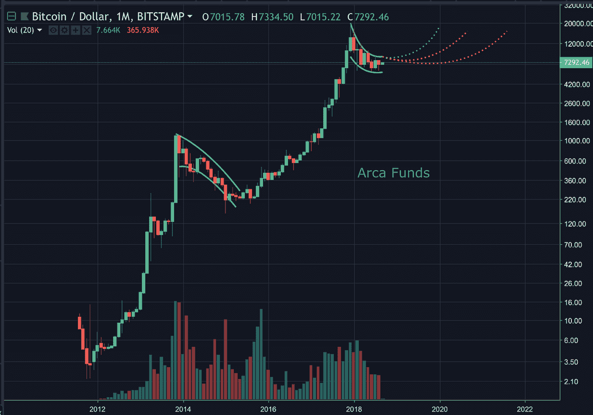
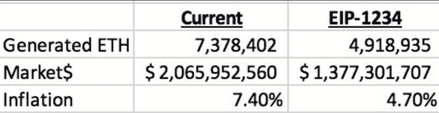
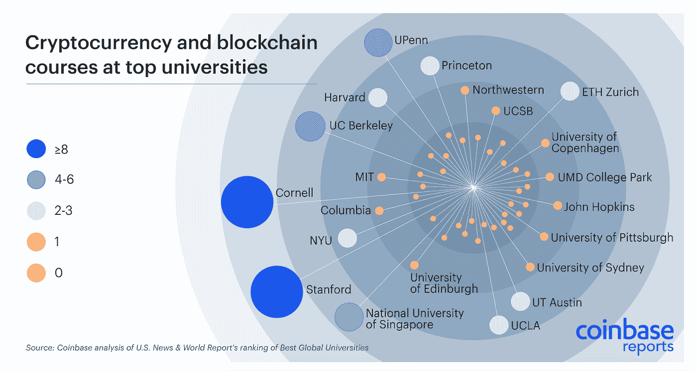
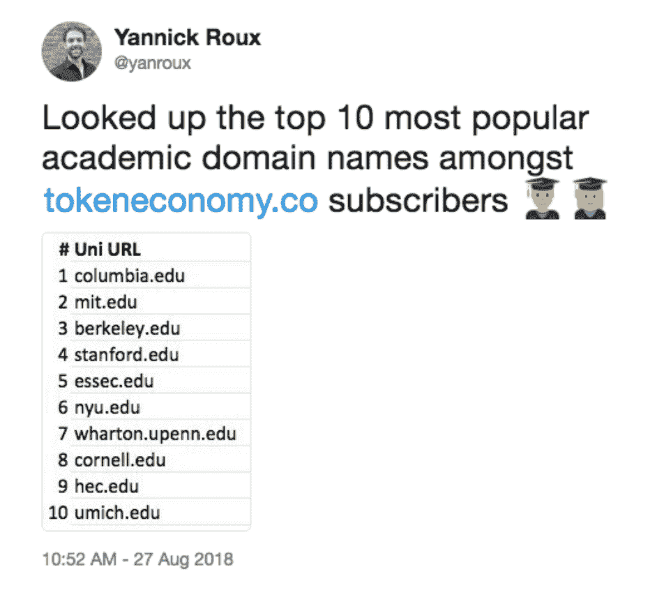

# “这是我们的两个 Satoshis”——加密市场摘要，2018 年 9 月 11 日

> 原文：<https://medium.com/hackernoon/thats-our-two-satoshis-crypto-market-recap-september-11-2018-f188169e5d3b>

# 本周密码市场发生了什么？

# 装饰门面

把月底想象成一个故事——图表是一个故事，市场力量决定情节。当然，资产管理公司每月都会报告他们的回报。此外，相对于其他资产类别，只有极小比例的投资者在积极地阐述这一观点，因此无论如何都很容易推进这一议程。

如果我们回顾上个月，[比特币](https://hackernoon.com/tagged/bitcoin)的价格在 7 月 31 日(8100 美元)经历了重大波动，一直持续到 8 月 11 日(6150 美元)。本月底也不例外，因为比特币于 8 月 30 日开始移动(6850 美元)，截至周日，目前位于 7250 美元。这不是巧合——7 月对那些做多的人来说是一个很好的月份，所以他们在月底急于锁定收益，导致了为期两周的低迷。相反，对于那些做空市场的人来说，8 月是一个很好的月份，他们急于在月底补仓并锁定收益。

# 透过树看到森林

但是，在更长的时间范围内，叙事是什么呢？那得看你问谁了。对于那些在 2017 年进入该领域的人来说，他们的叙述是，比特币和 crypto 的其余部分只是一个投机泡沫，比特币在年初至今已经损失了约 70%的价值。对于那些更早进入这个领域的人来说，这是我们所有人都认同的潮起潮落——双向波动。如果我们看图表，我们会发现这个“熊市”只不过是一个调整——尽管是一个长期的调整。在 Mt.Gox 崩盘以及随后的市场恐慌之后，2014 年的熊市有着与今天不同的叙事。

值得注意的是，比特币已经超过 4 个月没有出现更低的低点。因此，越来越清楚的是，这个故事的性质与 2014 年讲述的故事没有关联。虽然谁也说不准市场何时会改变说法，但我们必须区分这两个故事之间的差异，确保不要把不应该关联的东西关联起来。

**以太坊和期货市场**

CBOE [宣布](https://cointelegraph.com/news/report-cboe-to-launch-ethereum-futures-trading-later-this-year)他们将在今年晚些时候推出以太坊期货，许多人将比特币期货的与[的宣布以及随后在 2017 年 12 月 18 日的推出相提并论。当 BTC 期货宣布时，比特币的价格在 2017 年 12 月 17 日一路飙升至 19500 美元的历史高点。从那以后，随着期货市场不断压低价格，价格一直在走下坡路。](https://www.cnbc.com/2017/12/01/cme-says-its-launching-bitcoin-futures-on-dec-18.html)

可以假设，大型市场影响者在宣布之前购买了大量比特币，导致市场歇斯底里，价格非理性上涨。由于没有订单来支持如此波动的收益，这些有影响力的人于是拿着他们的比特币，利用期货做空市场，从而利用上涨和下跌的方式获利。

然而，BTC 期货在牛市中开盘，而 ETH 期货很可能在熊市中开盘。以太坊的价格已经降到了极薄的体积。当期货推出时，对于大型市场参与者来说，在薄订单簿上做多以太坊更有意义——这与比特币正好相反。

这与 ETH 将[建立 EIP-1234](https://smartereum.com/31412/ethereum-eth-news-today-block-rewards-of-ethereum-eth-reduced-to-2-eth-by-core-developers-of-ethereum-ethereum-core-developers-delay-difficulty-bomb-implantation-eth-usd-price/) 并在 10 月份将他们的君士坦丁堡分叉中的块奖励从 3 ETH 降低到 2 ETH 的信息一起，提供了以太坊可能在不久的将来提供良好的上行回报的场景。与比特币的大宗交易减半(每 4 年将大宗交易奖励减半)类似，这种 EIP 既能降低资产通胀，也能降低矿商的卖方压力。

# 为什么采矿奖励与更高的价格相关？

答案就在工作证明(PoW)的内心。每天，矿工们都要做出一个决定——获得的回报是否值得采矿的成本？

如果答案是否定的，大多数矿商将关闭钻机，等待有利可图的条件回归。由于采矿是一个由矿工数量和交易量决定的开放市场，如果交易量保持不变，但矿工数量下降，每个矿工现在开采更多的区块，因此获得更多奖励。

因此，随着采矿 ETH 的盈利能力从 3 ETH/block 上升到 2 ETH/block，许多矿工可能会认为奖励减少 33%会使其无利可图。对于零售矿商来说，这是个小问题。对于有大量无烟煤的大型采矿作业，这个问题更为突出。关闭价值数百万美元的机器可能是有害的，因为这些机器的前期成本和技术的短暂寿命使它们陷入困境。

这些矿商对以太坊的卖方订单贡献很大(对任何基于电力的资产也是如此)，并且可以相互同意停止出售以太坊，直到价格上涨到有利可图的水平。保持订单的卖方空白将推高以太坊的价格——没有卖方和一致的买方。

以太坊长期会发生什么还有待观察，但根据今天可用的信息，以太坊将为市场经济提供一个关于基于权力的资产(不叫比特币)的试金石。

# 我相信孩子是我们的未来

**据最近的比特币基地调查报道，** [18%的美国学生现在拥有加密货币](https://blog.coinbase.com/the-rise-of-crypto-in-higher-education-81b648c2466f) **。当这些人在 30 岁左右拥有真正的财富和影响力时，你认为会发生什么？21 所排名前 50 的大学 **现在正在提供加密教育课程，这值得称赞。****

[代币经济](https://tokeneconomy.co/)利用这一点，甚至走得更远，拉起了他们用户群的顶级电子邮件域名。我们听说过一些这样的学校，并且非常有信心这些项目的毕业生将会在未来的几十年里在加密社区中出类拔萃。

当然，我们都已经看到，CFA 协会[计划在其 2019 年的考试中提供区块链和加密主题](https://www.bloomberg.com/news/articles/2018-07-16/cfa-exam-adds-crypto-blockchain-topics-as-wall-street-dives-in)。所以我们问自己…在如此短的时间内，有多少其他科目进入了大学和高等教育课程？

争论不再是关于 Crypto 的持久力，而是关于它的能力。

**关于投资 3 只私募 Arca 基金的具体信息，点击** [此处](https://arca.vosterra.com/referrals/pv-oXhLJr4A) **。**

# 著名的行动者和震撼者

*   Digibyte (DGB)周环比上涨 31.01%，新加坡的 Huobi(日总成交量的 70%)领涨。Digibyte 本周还发布了 v6.16.4 [区块链](https://hackernoon.com/tagged/blockchain)核心软件，这可能是积极价格行动的潜在催化剂。有趣的是，几周前，当土耳其里拉经历恶性通货膨胀时，土耳其 Sistemkoin 经历了大量涌入的人用他们的里拉购买 DGB。Digibyte 是一种类似于比特币的加密货币，不同之处在于阻塞时间(15 秒)、每秒交易次数(500)和算法方差(5)。
*   Icon (ICX)本周收盘上涨 5%，此前周二有消息称，该基金会将从市场上回购价值 500 万美元的 ICX，以显示对该项目的诚意。ICX 从 1 月份的历史高点经历了一次明显的回撤(-93%)，但看起来正在寻找价格底部。

# 我们这周在读什么

[比特币是新的避风港吗？](https://www.zerohedge.com/news/2018-08-28/bitcoin-new-safe-haven-trade)

*   在不确定性、压低资产价格或恶性通货膨胀时期，一个好的价值储存手段会成为一个隐藏的工具。对各个国家比特币需求的快速观察显示，新兴市场正在不断使用比特币(BTC)作为将资金转移出各自国家的一种方式。全球数百万人涌向比特币的事实证明了它的存在。

[OpenFinance 推出安全令牌监管交易平台](https://www.coindesk.com/openfinance-launches-regulated-trading-platform-for-security-tokens/)

*   您已经听到我们谈论加密资产的未来，这包括任何资产的令牌化，包括股权和债务。像 OpenFinance 这样的平台正在出现，以促进这些工具的合规交易。

[讽刺的是使用纸和笔来存储数字资产](https://www.wired.com/story/coinbase-physical-vault-to-secure-a-virtual-currency/)

*   我们只能说这些流程将会改进，但就目前而言，这是一篇理解安全保护数字资产的困难和必要预防措施的好文章。

[加密交易所加入文克莱沃斯支持的自律组织](https://www.coindesk.com/gemini-partners-with-3-crypto-exchanges-in-push-for-self-regulatory-org/)

*   自我监管和创造最佳实践对行业来说是一件好事，我们对文克莱沃斯集团表示赞赏。

[比特币交易价值达到 1.3T 美元，通过 PayPal 和 Discover](https://xbt.net/blog/bitcoin-blog/bitcoin-transaction-value-reaches-1-3t-as-it-passes-paypal-and-discover/)

*   向 Ark Invest 的朋友们致敬，他们对比特币交易量和相应价值进行了出色的分析。尽管你可能听说过比特币在实际交易中使用不足，但它现在的使用率远远高于除 Visa 和顶级信用卡之外的任何其他常用价值转移机制。

# 新闻中的阿卡

*   目前正在香港上市的比特大陆 IPO 可能会对比特币(BTC)和比特币现金(BCH)产生负面影响。Arca 首席信息官史蒂文·麦克卢格[通过 Crowdfundinsider.com](https://www.crowdfundinsider.com/2018/09/138553-bitmain-ipo-what-it-means-for-bitcoin/)表达了他的想法。正如史蒂文所说，“当一家公司为高利润率的现金流业务创造出口时，通常意味着增长或利润率的下降。这也可能预示着比特币的持续熊市。”

***那就是我们的两只聪！***

*感谢大家的阅读！问题或意见，请告诉我们。*

Arca 投资组合管理团队

*首席投资官史蒂文·麦克卢格*

*首席交易员杰夫·多尔曼*

*萨沙·弗莱斯曼——交易员*

*凯蒂·塔拉蒂——研究部主管*