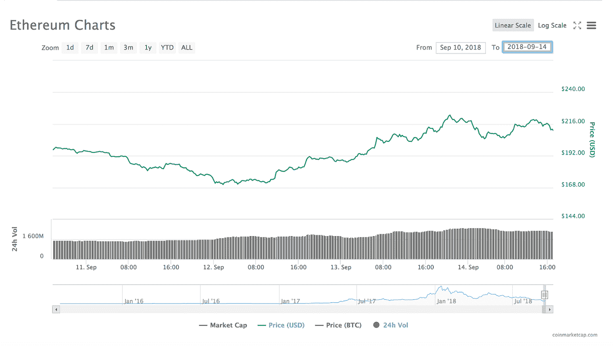
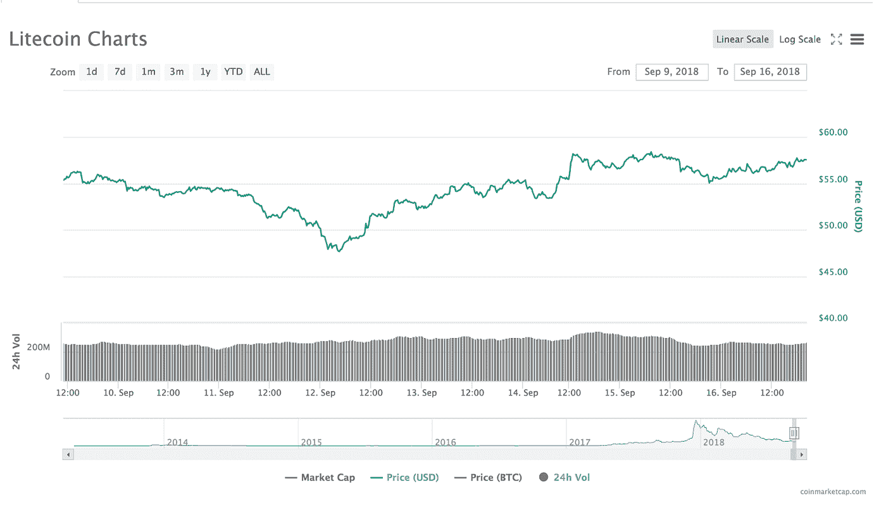
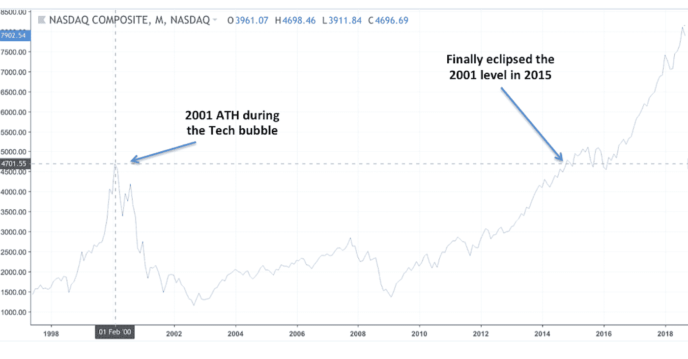
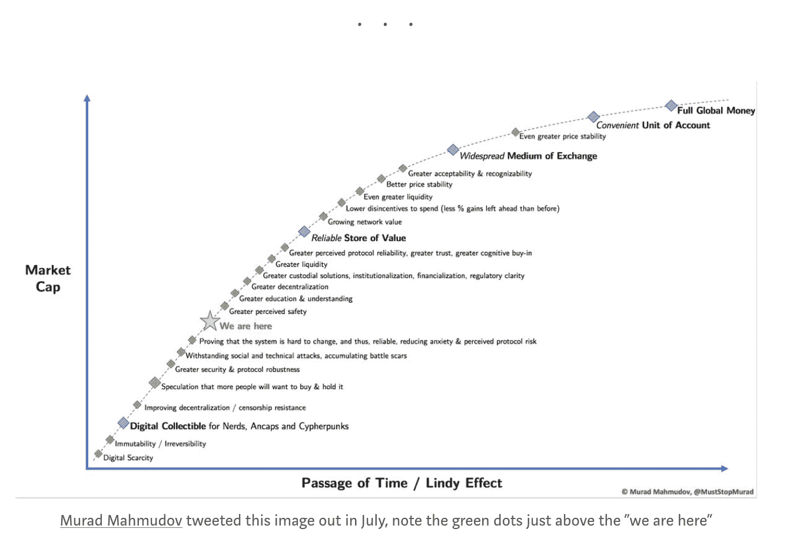

# “这是我们的两个 Satoshis”——加密市场摘要，2018 年 9 月 17 日

> 原文：<https://medium.com/hackernoon/thats-our-two-satoshis-crypto-market-recap-september-17-2018-954c6d54aaba>

# 本周密码市场发生了什么？

## 周三是投降日吗？

过去的一周有点奇怪，即使对加密市场来说也是如此。10 天前，市场开始显示出一些看涨信号，这使得在经历了本月残酷的第一周之后，最糟糕的情况似乎已经过去，但加密从来不像它看起来那样。我们没有在本周早些时候走高，甚至只是稳定下来，相反，我们在整个前半周看到了决定性的负面价格行动，再次在大规模抛售中达到高潮；周三早上的这个时候。许多代币创下年初至今新低，包括曾经的市场宠儿以太坊(ETH)。

但抛售开始时很快就结束了，到周三晚上，整个市场已经恢复，一些硬币和代币在 20%的峰-谷-峰范围内波动。不知何故，当该说的都说了，该做的都做了，市场基本上一周接一周地保持不变。

ETH 可能存在严重的空头挤压，导致在 48 小时内从 173 美元/美元上涨至 220 美元/美元。但反弹的不仅仅是 ETH。莱特币(Litecoin)的交易价格一直保持在 BTC 价格的 1%到 2%之间，最近几个月已经基本上与 T2 的比特币(T3)脱钩。但 LTC 也在 48 小时内从 48 美元/美元的低点反弹至 58 美元/美元，远远超过 BTC。

以太坊(ETH)图表—2018 年 9 月 12 日周三

莱特币(LTC)图表—2018 年 9 月 12 日周三

## 好的，坏的和反应不足的

尽管波动很大，但本周 crypto 的消息是积极的。如果这是一个牛市，我们可能已经开始比赛，并达到新高。但在今天的市场环境下，我们反而看到了相当温和和滞后的反应。让我们探索其中的一些:

首先，有一团司法和监管的烟雾，表面上可能被解读为负面的，但仔细想想，实际上对加密监管的未来非常积极。周二的裁决感觉像是政府清理密码的努力向前迈出了一大步。事实上，DOJ 和证券交易委员会不仅维护既定的规则，而且积极寻找坏演员，最终将有助于这些公司严格按照水平运作。基本上，监管机构和执法机构正在做他们的工作(保护投资者)，同时允许该行业的其余部分继续试验和繁荣。

1.  2017 年 11 月，纽约东区 DOJ 指控一名男子犯有三项证券欺诈罪，涉及两个 ico:“REcoin”和“DRC”。法官本周裁定，假设 DOJ 的所有指控都是真的，承认刚果民主共和国是有价证券，法律不会模糊到违宪。本质上，法官说 ico 是证券，必须遵守证券法。
2.  证券交易委员会[停止了追踪 BTC ETH 价格的两家瑞典 etn——CX btf 和 cet HF——的交易。美国证券交易委员会指出了困惑，因为这些是零售产品，文件中没有明确说明它们实际上是什么类型的证券(ETF 或 etn)。](https://uk.reuters.com/article/us-usa-cryptocurrency-sec/sec-halts-trading-in-two-cryptocurrency-products-citing-market-confusion-idUKKCN1LP0TW)
3.  然后证券交易委员会[指控一名对冲基金经理](https://www.sec.gov/news/press-release/2018-186)虚假陈述其基金，同时[指控一名 ICO 顾问](https://www.sec.gov/news/press-release/2018-185)涉嫌在没有经纪人/交易商执照的情况下销售 ICO。

华尔街也跳上了新闻列车，再次验证了 crypto 的潜力，并通过宣布为客户提供新产品来加强其持久力。在我们看来，这些产品中的大部分可能没有必要，只是表明传统金融服务部门缺乏意愿(或能力)来生产真正帮助客户的增值产品。然而，值得注意的是，他们希望被视为在加密领域提供产品。

1.  花旗集团宣布推出“数字资产收据”( Digital Asset Receipts )( T8 ),这将与美国存托凭证(ADRs)非常相似，为菲亚特投资者提供了一种拥有比特币的合成方式。
2.  摩根士丹利(Morgan Stanley)宣布了“[比特币互换](https://www.bloomberg.com/news/articles/2018-09-13/morgan-stanley-said-to-prepare-bitcoin-swap-trading-for-clients)”，这是另一种合成工具，在不实际拥有资产的情况下，提供比特币的多头和空头敞口。
3.  美国银行(Bank of America)也宣布推出比特币投资产品(T1 ),但具体细节仍不明朗。
4.  据报道，纳斯达克(Nasdaq)正在试验将关于数字资产的信息添加到其分析中心。纳斯达克希望纳入的工具将从各种来源获取数据，并将被投资者用于做出交易决策。

最后，密码世界自己发布了一些令人鼓舞的公告。

1.  一个[区块链游说团体成立](https://ci.covesting.io/news/cryptocurrency-news/coinbase-circle-crypto-vets-form-blockchain-association)，目标是教育和说服政府官员。该组织由行业巨头 Circle、比特币基地、数字货币集团和其他几家公司领导。
2.  三个新的团体推出了[受监管的稳定令牌产品](https://www.coindesk.com/carbon-becomes-latest-startup-to-launch-a-dollar-pegged-stablecoin/)。文克莱沃斯双胞胎推出了第一款名为“Gemini Dollar”的产品，而 Paxos Group 和 CarbonUSD 紧随其后推出了自己的产品。

综合考虑，有理由对增长持乐观态度。话虽如此，阻力最小的短期路径可能仍然较低，因为在加密资产能够恢复上升之前，仍需要解决一些重大威胁(ICO 出售、对冲基金赎回、杠杆化解套)。我们将在未来的版本中扩展这些主题。

## 对密码更现实的看法

我们不急于将 crypto 誉为同类最佳的原因之一是，新技术发挥其全部潜力需要时间。我们不要忘记，2001 年泡沫破裂后，纳斯达克用了 14 年时间才回到历史高点。但是一旦纳斯达克指数超过了 2001 年的高点，它就在我们现在所说的方股票(脸书，亚马逊，网飞，谷歌)的带领下继续前进。我们可能在一段时间内不会看到 BTC 达到 2 万美元左右的历史高点，但对于加密市场参与者来说，通常很难对长期价格上涨采取耐心的态度。

“林迪效应”是一个概念，根据这个概念，一些不易腐烂的东西，如技术或思想的未来预期寿命与它们当前的年龄成比例，因此每增加一个存活期，就意味着剩余的预期寿命更长。从下面的图表中可以看出，秘密故事远未结束。接下来的步骤是通过教育建立更好的理解，更好的安全和保管解决方案，以及为公众提供更容易的用户体验。毫无疑问，长期趋势是更高的——但我们不要急于期望。

**关于投资 3 只私募 Arca 基金的具体信息，点击** [此处](https://arca.vosterra.com/referrals/pv-oXhLJr4A) **。**

# 著名的行动者和震撼者

最近，几乎没有影响市场的消息。一直是“学生团体左”或“学生团体右”。但在过去的几个交易日里，随着积极的发展，我们看到一些代币和硬币的表现优于市场其余部分，这是一个非常健康的迹象。

*   Stellar (XLM)本周上涨 7%，周二上涨 11%，此前有消息称，Stellar 的盈利子公司 [Stellar Development Project 收购了 Chain](https://www.forbes.com/sites/michaeldelcastillo/2018/09/10/visa-backed-blockchain-firm-embraces-stellar-cryptocurrency-via-merger/#13e4b0e574c2) 。值得注意的是，连锁投资者包括 Visa、纳斯达克(Nasdaq)和花旗风险投资(Citi ventures)，它们仍将是新合并实体的客户。
*   Tezos (XTZ)是周周表现最好的股票，[上涨 35%](https://www.coindesk.com/no-longer-beta-200-million-tezos-blockchain-will-be-official-mainnet-soon/) 有消息称，他们将在周一推出备受期待的 mainnet。
*   创(TRX)本周与整体市场保持一致，早盘下跌，但周四反弹，本周结束时保持不变。 [TRX 宣布，他们将于本月在 5 个新的交易所上市](https://dailyhodl.com/2018/09/10/tron-trx-launches-on-five-new-cryptocurrency-exchanges-releases-latest-project-update/)，并给出了积极的运营更新，这可能会导致未来的进步。
*   Waves (WAVES)上周一天内上涨了 45%，并在[宣布新的智能合约协议](https://www.ccn.com/waves-swells-45-upon-announcement-of-smart-contract-protocol/)后保持了大部分周环比涨幅(+20%)。WAVES 是本周市值超过 2 亿美元的代币的最大赢家之一。

# 本周我们要读的内容

布里奇沃特的雷伊·达里奥阐述了美国最可怕的噩梦

*   提示:他没有明确告诉你购买比特币，但他揭示了美元在 15+万亿美元债务的重压下有多么成问题。

[加密将如何成长为机构资产类别](http://fortune.com/2018/09/12/crypto-grow-institutional-asset-class/)

*   我们都听说过机构采用加密面临的问题，但《财富》杂志做了一项出色的工作，列出了一些短期解决方案，可能会引起全球最大投资者的新兴趣。

[加拿大批准比特币共同基金](https://cointelegraph.com/news/canadian-bitcoin-fund-receives-status-as-mutual-fund-trust)

*   加拿大是大麻公司合法化和上市的领导者。它现在为合格投资者提供了利用比特币的机会。

[比特币在这些问题国家极其有用](https://cryptodaily.co.uk/2018/09/bitcoin-useful-in-countries/)

*   当你把所有时间都花在发达国家时，有时很难看到比特币的真正用途，但如果你关注阿根廷、委内瑞拉、南非等国的货币危机，你会更好地感受到全球价值储存的重要性。

[国债出售及其对乙醚(ETH)的影响](/mosaic-network-blog/a-look-at-token-sale-treasuries-ed9889748f89)

*   我们以前写过通过 ico 筹集 ETH 的公司进行邪恶的公司资金管理。这篇文章很好地解释了对市场的确切影响，ETH 供应过剩，甚至深入到“负企业价值”(当公司拥有的现金超过象征性市值时)。

# 新闻界的阿卡

*   Arca 的首席信息官 Steven McClurg 和 Arca 的研究主管 Katie Talati 本周联手发布了一份关于即将到来的比特币现金(BCH)硬分叉的[重要而及时的概述。](https://www.crowdfundinsider.com/2018/09/139066-bitcoin-cash-is-the-end-near/)

***这就是我们的两只聪！***

*感谢大家的阅读！问题或意见，请告诉我们。*

Arca 投资组合管理团队

*首席投资官史蒂文·麦克卢格*

首席交易员杰夫·多尔曼

*萨沙·弗莱斯曼——交易员*

*凯蒂·塔拉蒂——研究部主管*