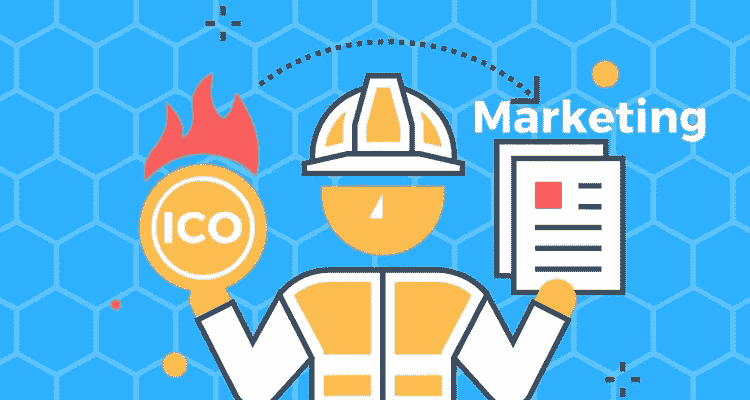

# 头号终极 ICO 营销指南

> 原文：<https://medium.com/hackernoon/the-1-ultimate-ico-marketing-guide-3d13aa1a22e4>

去年，CoinCheckup 通过我们的[营销](https://hackernoon.com/tagged/marketing)服务为 100 多个[ico](https://hackernoon.com/tagged/icos)提供服务。我们已经获得了很多关于什么可行什么不可行的知识，我们很高兴与您分享这份“终极 ICO 营销指南”,在这里我们分享我们的“经验教训”,这样您可以节省一些时间。我们相信，您可以从本指南中获得价值，并利用它来最大限度地提高您的 ICO 投资并取得成功。

# **1)用你的白皮书赢得投资者的信任**

为您的 ICO 创建白皮书是任何新区块链项目的第一步。你的白皮书应该提供你的 ICO 项目的所有细节:你的想法/愿景；最好是对你的工作项目或概念证明的深入解释；你的策划；法律方面；以及让你比其他 ico 更优秀的每个细节。

**这里列出了你的 ICO 白皮书应该至少包含的不同部分:**

*   你的 ICO 如何从竞争对手中脱颖而出？
    即使你没有真正的竞争对手，你也需要记住，每周大约有 30 到 60 个 ico 发布，“脱颖而出！”。
*   谁将从你的 ICO 中受益？他们将如何受益？
*   你打算如何发展你的 ICO，并让它在“现实世界”中获得牵引力？
*   你需要多少资金？
*   代币/硬币是如何分配的？
*   从技术角度来看，你是如何实现你的愿景的？*(最好包括图纸和模型)*
*   对社会有什么好处/对“现实世界”有什么好处”
*   你的 ICO 有哪些法律方面的问题？
*   谁在你的团队中？这个团队将如何从想法/测试/概念阶段发展到全面的区块链项目？

**记住**:你的白皮书将决定你公司的命运。所以留下好印象是必须的。

> [**点击获取更多** ICO 营销**好物:**](https://nexibeo.typeform.com/to/WCM3cD)+ 32 点 ICO 营销清单
> + 10 个奖励技巧，让你的 ICO 翻 20 倍，节省 3000 美元+
> +排名第一的 ICO 白皮书模板

# **2)创建一个:网站；社交媒体渠道；以及最初的有机促销活动。**

一旦你完成了你的白皮书，创建一个网站和一个社会媒体将会更容易。

## **2a)打造一个粉碎的&干净的网站。**

为你的 ICO 创建一个干净、简单、透明的网站。你的网站是你给潜在投资者的第一印象。你不能在这里出错，因为你会失去他们的信任。

**确保:**

*   第一印象是砸；
*   在管理投资者的期望时，你要尽可能透明；
*   你有干净的网站设计，有良好的用户体验；
*   你的网站是完全 SEO 优化的；

**您的 ICO 网站至少应包含以下页面:**

*   “关于我们”页面/部分
*   “联系我们”页面/部分，包括您所有社交渠道的链接
*   白皮书页面/章节
*   关于代币/硬币页面/部分，解释如何:

1.  你会花掉 ICO 资金，你预计你的跑道有多长(没人喜欢死了的硬币/代币)；
2.  投资者回报预期——您的 ICO 代币/硬币的潜在收益和增长；
3.  代币/硬币如何在代币持有者之间分配(X%用于团队，Y%用于预售，Z%用于公开销售，等等。)

*   一个博客页面和/或链接到你的中型博客——每周两次，尽可能透明地介绍你的 ICO 及其进展。
*   团队页面/部分—注意，您需要在团队中至少有一名(最好是高级)区块链开发人员/专家；
*   法律页面/部分—谁可以加入 ICO /加入 ICO 有什么风险？
*   “购买代币/硬币”页面/部分——解释如何以及何时购买代币/硬币的过程；

> [点击获取更多 ICO 营销好物:](https://nexibeo.typeform.com/to/WCM3cD)
> + 32 点 ICO 营销清单
> + 10 个奖励提示，让你的 ICO 翻 20 倍，节省 3000 美元+
> +排名第一的 ICO 白皮书模板

## **2b)创建社交媒体形象**

我们建议 ico 至少**在以下渠道中使用社交媒体:**

*   [**Reddit**](https://www.reddit.com/r/CryptoCurrency/)——围绕你的品牌获得最初的有机牵引力和认知度。
*   [**电报**](https://telegram.org/faq)——与你的潜在投资者交谈。
*   [**中等**](/)——每周写(两次)文章，尽可能透明地谈论你的 ICO 及其进展。
*   [**“alt coin 讨论”版块上的 Bitcointalk 页面**](https://bitcointalk.org/index.php?board=67.0)——包含一个精简的、不太专业的白皮书版本。这可能是一个或两个寻呼机。
*   [**【LinkedIn 商务页面**](https://business.linkedin.com/marketing-solutions/company-pages)——与更有商业头脑的受众分享你的帖子和更新。
*   ****，**[**Twitter**](https://twitter.com/signup)**&**[**Youtube**](https://support.google.com/youtube/answer/1646861?hl=en)肯定能增加很多价值和知名度，但你可能更难找到合适的受众，而且这些平台上不再提供付费推广。**

# ****3)推广你的 ICO——找到付费有机营销的组合。****

**简而言之，伟大 ICO 的理想组合是:**

*   **第一阶段:有机地推广你的网站，以获得最初的吸引力和知名度。**
*   **阶段 2a:就在你的私人和公共 ICO 之前和期间，你可以从付费广告开始，直接进入正确受众的雷达。**
*   **阶段 2b:同时开始提升你的有机社交媒体营销**
*   **第 2c 阶段:通过有机社交媒体和社区营销，强化对 ICO 项目的认知。**
*   **第三阶段:善后护理和支持。**

## ****在你的 ICO 开始之前的第一阶段推广:有组织地推广你的网站，以获得最初的关注&。****

**在你的 ICO 发布前几个月，你必须确保你的 ICO 网站已经完成，现在是时候在社交媒体渠道上对你的网站进行初步的有机推广，为你的项目创造第一个认知流。请注意，在这个阶段您还没有销售任何东西。利用这个阶段来扩大你的社交媒体渠道，你的电报组和你的简讯列表。我们将在下面更深入地讨论有机和社会营销。**

**简而言之，在你的私人或公共 ICO 开始前(最好是几个月前)，获得对你的 ICO 的初步关注和认知是很重要的。**

1.  **几乎没有人会在只看过你的品牌/项目一次后投资 ICO。**
2.  **短期在线的 ICO 网站(< 1 month) usually get less investment, since it’s a bigger chance that they could be a SCAM. Most investors check this before they invest.**

## ****第 2 阶段:在 ICO 上市前和上市期间全力进行付费和有机营销。****

**当你获得一些初步的吸引力和认知度后，你可以开始你的私人和公开销售，你可以从付费和有机营销开始。**

## **第 2a 阶段:针对合适受众的付费广告。**

**最近，脸书、推特和谷歌禁止了加密货币广告。然而，你可以在各种加密货币和区块链网站上做广告，这些网站允许你在他们的网站上放置横幅和文本链接。**

**使用现有区块链平台的主要好处是，你可以直接接触到合适的受众。**

**有点不要脸的自我推销，不好意思；-) —就拿 [Coincheckup.com 的付费广告套餐](https://coincheckup.com/blog/advertising)来说。与其他加密平台相比，CoinCheckup 的优势在于，该网站主要由寻找下一个重大投资机会的加密研究人员使用。虽然就规模而言，我们是排名第 5-6 的网站，但您可能会找到适合您的受众。**

> **[点击获取更多 ICO 营销好物:](https://nexibeo.typeform.com/to/WCM3cD)
> + 32 点 ICO 营销清单
> + 10 个奖励提示，让你的 ICO 翻 20 倍，节省 3000 美元+
> +排名第一的 ICO 白皮书模板**

## ****2b 期:有机；社交媒体；论坛&社区推广。****

**LinkedIn、Reddit、Telegram、Bitcointalk 和脸书群组上有各种各样的加密货币社区、群组、页面和网络。成为这些社区的一部分，积极参与讨论和活动，支持社区而不直接自我推销。这些在线社区将为你提供大量的机会，结识许多志同道合的人和潜在的投资者。**

**正如第二章所提到的，你必须确保你建立了正确的社交媒体渠道。**

**以下是这些社交渠道上有机促销的一些灵感。**

**[**Telegram**](https://telegram.org/faq):Telegram 是 ICO 营销的绝佳平台。你可以用电报和你的社区通话。利用有趣的(独家)优惠和/或营销合作伙伴的帮助，有机地扩大您的 Telegram 用户群。**

**Reddit :每月 15 亿的访问量，Reddit 在全球排名第 26 位。Reddit 有许多流行的加密渠道。通过他们的上下投票系统，该平台确保相关内容出现在顶部。通过加入不同的渠道增加你的 Reddit 粉丝，围绕你的 ICO 展开讨论和/或为社区提供有用的信息。向你的营销专家寻求在新用户中提高知名度的策略。**

**[**Medium**](/)——Medium 基本上是一个简单干净的博客，许多密码爱好者可以从这里获得深入的新闻。确保你每周写(两次)文章，并尽可能透明地谈论你的 ICO 及其进展。利用好的内容和/或营销伙伴的帮助，有机地扩大你的媒体基础。**

**[**Bitcointalk“alt coin 讨论”板块**](https://bitcointalk.org/index.php?board=67.0) — Bitcointalk 是排名第一的加密爱好者论坛，每月有 1300 万到 2400 万的访问量。在“Alt 讨论板”上添加一个帖子，附带一个精简的、不太专业的白皮书版本。这可能是一个或两个寻呼机。使用 1-2 页的高质量白皮书，强调所有的 USPs(独特卖点)和/或您的营销合作伙伴的帮助，有机地增加您的 Bitcointalk 粉丝。**

**[**Producthunt**](https://www.producthunt.com/search?q=crypto&topicName=Cryptocurrencies)——每月有 800 万的访问量，product hunt 是推广任何新(数字)业务的好地方。你获得的支持票越多，你在他们的话题列表中的排名就越高。向你的营销专家寻求一种策略，使其最终出现在加密和金融科技主题列表的顶部，以直接接触到正确的受众。**

**[**黑客新闻**](http://news.ycombinator.com)——尽管很难接触到你特定的加密/金融受众，但 Y-Combinator 的黑客新闻是科技领域最热门的新闻网站之一。凭借 1500 万的月访问量和他们的新闻投票系统，你可以引起许多科技爱好者和潜在投资者对 Y-combinator 的关注。向你的营销专家寻求一个策略来获得黑客新闻。**

**[**LinkedIn 商务页面&群组**](https://business.linkedin.com/marketing-solutions/company-pages) — LinkedIn 充斥着严肃的投资者、金融&密码爱好者。你可以在 LinkedIn 上建立自己的商业页面，推广你所有的媒体帖子和更新。除此之外，在加密平台的 LinkedIn 页面上推广帖子可能相对容易且便宜。**

**Quora : Quora 是一个非常棒的讨论平台，里面充满了非常严肃的人，他们访问这个平台来获得更多关于某些主题的知识，比如加密。通过在 ICO 上发布话题和问题来提高对 ICO 的认识，从而提高 ICO 的曝光率。向你的营销专家寻求支持，让你的 Quora 话题和评论获得更多关注，从而进一步增加曝光率。**

## ****第 2c 阶段:电子邮件营销和时事通讯****

**电子邮件营销不再像以前那样受欢迎了，它在加密迷和 ICOs 中仍然非常活跃。至少如果你有合适的观众。您可以:**

1.  **使用快速简单的注册表格(参见第 2a 章网站)或登录页面(第 2a 章阶段……)创建您自己的电子邮件列表。**
2.  **或者，您可以通过联系加密平台并要求他们发送简讯，直接接触加密和金融爱好者。这些时事通讯通常是付费的，但好处是你可以直接接触到你的目标受众。**

****为了获得最大结果，**您将阶段 2a、2b 结合起来。和 2c。对于任何 ICO 来说，最重要的事情是在任何地方创造意识，尤其是在你的私人和公开销售期间，因为这是你的 ICO 和你成功的区块链项目的信心所在。**

***在这个阶段，最好与秘密营销专家合作，因为他们可以帮助你最大限度地增长。由于 CoinCheckup 为 100 多个 ico 管理营销和广告，我们绝对可以帮助您。请随时给我们发电子邮件至 raluca.jeroen@coincheckup.com***

## *****第三阶段:善后处理&支持*****

***一旦你的 ICO 完成，确保你在社交媒体上保持频繁更新，让人们对你的项目保持热情，这样他们就会成为你的推广者。***

> ***[点击获取更多 ICO 营销好物:](https://nexibeo.typeform.com/to/WCM3cD)
> + 32 点 ICO 营销清单
> + 10 个奖励提示，让您的 ICO 翻 20 倍，并为您节省 3000 多美元
> +排名第一的 ICO 白皮书模板***