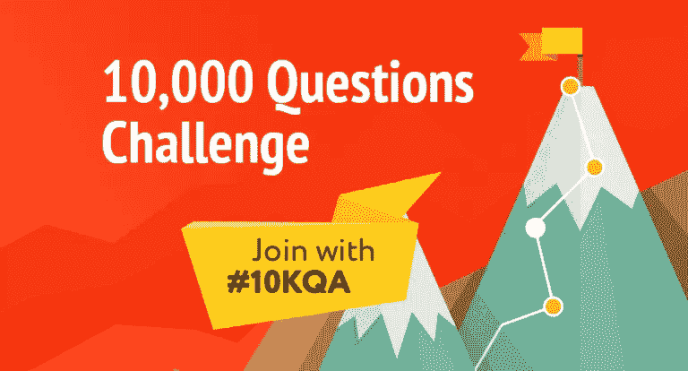
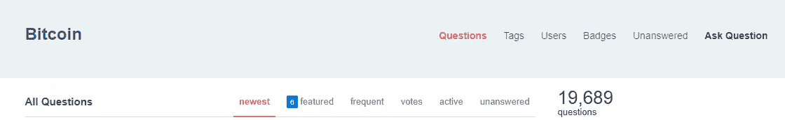

# 一万个问题的挑战——你的区块链之旅从这里开始

> 原文：<https://medium.com/hackernoon/the-10-000-question-challenge-your-blockchain-journey-starts-here-98829f6b3cbc>

#10KQA — 10 000 Blockchain Question Challenge

马尔科姆·格拉德威尔的书《[局外人:成功的故事](https://www.amazon.com/Outliers-Story-Success-Malcolm-Gladwell/dp/0316017930)》提到了“10000 小时法则”，该法则称，要成为任何领域的世界级专家，都需要 10000 小时格拉德威尔所说的“刻意练习”。满足感确实来自这些长时间的努力工作，但当你坚持足够长的时间，每天练习，并接近 10，000 小时的目标时，你会看到巨大的成果。

虽然有些人不相信这条规则是正确的(一些有趣的细节[在这里](https://www.inc.com/nick-skillicorn/the-10000-hour-rule-was-wrong-according-to-the-people-who-wrote-the-original-stu.html)由[尼克·斯奇里科恩](https://twitter.com/improvides)提供)，但我通过自己的经验发现，努力工作和奉献确实会有回报，而且之后的回报会大得多。有多少次你去了健身房，感觉肌肉酸痛，火辣辣的，才意识到过了一段时间，在跑步机上艰难的跑了几次，你终于得到了你想要的身材？在你最终开始进入事物的流程，意识到你创造了一些特别的东西之前，你花了多少时间在汇编程序上编码？

进入心流并成为大师需要努力和刻意的练习。这就是发起 10，000 个问题挑战的想法是如何诞生的。本次挑战的主要目标是通过研究区块链并与其他专家交流，更好地了解它。我确信，在这个过程中，大量的新想法将浮出水面，与该领域的专家交谈也将是有趣的。

# 一万题挑战是什么？

2018 年，我希望收到来自各自领域最优秀专家的关于区块链的 10，000 个问题的答案。为什么一万个问题？为什么不…这个数字并不算大。毕竟，比特币和以太坊论坛上有超过 19000 个问题。

source: [https://bitcoin.stackexchange.com/questions](https://bitcoin.stackexchange.com/questions)

所以，我的目的是为那些想投身区块链的初学者创建一个入口。

我自己制定了以下几类，我将问题整理成四类:

**核心区块链开发**:这将涵盖一切，从核心区块链技术，到其开发，到解决缩放问题的方法，以及一般的密码学(包括理解当量子计算机奴役世界时会发生什么)。

**利润(交易，ICO，采矿)**:这些都将是与赚钱和了解加密货币炒作将持续多久有关的问题。这将是关于交易机制和区别加密交易与普通交易的细微差别的问题。投资 ico 以及该领域正在开发的新技术背后的真正盈利能力将会受到质疑..

**真正的颠覆性模式**:有一种感觉，在大多数情况下，区块链的技术是牵强的，没有办法通过将其应用到其他市场来实际获利([自由服务](https://hackernoon.com/can-the-blockchain-really-disrupt-the-middleman-freelance-platform-market-50c1ee5282f7)，航空业，音乐业等。).我想深入探讨这些关于区块链如何扰乱多个行业的问题，并从已经在各自领域成功实施区块链的真正从业者和专家那里获得答案(顺便说一下，这里有一篇关于这个主题的好文章，作者是 Haseeb Qureshi 。

**法律法规**:任何关于法规、适用的法律惯例、比特币的合法性等问题都属于这一类。ICOs 会很快被规范吗？在 crypto 发工资合法吗？

问题的讨论和选择将在 Slack 上进行，或者通过 **#10KQA** 标签从社交网络中收集。我希望很多人都参与到这个活动中来。

随后，每天都会发送一封包含所选问题的邮件。我和我的团队会审核所有的信息，只留下真正有趣的。除此之外，我将向我认为是该领域专家的人提一个问题(在我们的 [Howtotoken](https://howtotoken.com/) 社区中有很多这样的人)。还有，随意推荐自己的专家。

每周一次，我们会在 Hackernoon 上以短文的形式总结我们的成果，并描述我们在那一周学到的有趣的事情。我们将选择最有趣的问题、答案和意想不到的观点。也希望其他参与者发表自己的随笔，讲述自己的所学。

# 如何从#10KQA 开始？

挑战的标签是 **#10KQA** 。所有的问题，以及与之相关的答案，将由我们的版主团队收集(对于那些想成为版主的人，只需写评论或加入下面的 slack)。我相信，对于专家和区块链的创业者来说，能够与任何想了解更多密码世界的人分享他们的知识和成就，将会证明是很有趣的。

## ***如果你是一名培训生，想问你的问题或者想抢先一万个答案:***

> 点击订阅时事通讯[。](https://howtotoken.com/10000-question-challenge/)
> 
> 在[推特](https://twitter.com/howtotoken)或[电报](https://t.me/TENKQA)上关注我们的更新
> 
> 关于[松弛](https://join.slack.com/t/howtotoken/shared_invite/enQtMjU4MDY2OTcwMTUxLWJlZDE2OWFlN2M4YWE5MTgzMGJjYzkxMDM3MzdjZTQxNDI1MjdmODg1MmNkMWI3NWYxMzA3NDA3ZGE1OTg4YjU)的讨论

## 如果你是一名专家或区块链的创业者，想通过回答几个问题来回馈社区 ***:***

> 论坛上的回答[这里](https://howtotoken.com/all-questions/)

## 如果你想作为主持人参与进来，成为我们团队的一员，帮助找到最好的问题 **:**

> 只要加入版主松弛频道[这里](https://join.slack.com/t/howtotoken/shared_invite/enQtMjU4MDY2OTcwMTUxLWJlZDE2OWFlN2M4YWE5MTgzMGJjYzkxMDM3MzdjZTQxNDI1MjdmODg1MmNkMWI3NWYxMzA3NDA3ZGE1OTg4YjU)

我将感谢所有的参与者、想法和讨论。我希望我们都能从这个过程中得到一些积极的东西，以及那种难忘的心流感觉。

***我们需要你的掌声*** 👏因为这是一份新的出版物，所以能接触到更多的人。请用推文、facebook 分享等方式传播这个故事。

## 关于作者:

基里尔·希洛夫——geek forge . io 和 Howtotoken.com 的创始人。采访全球 10，000 名顶尖专家，他们揭示了通往技术奇点的道路上最大的问题。加入我的**# 10k QA challenge:**[geek forge 公式](https://formula.geekforge.io/)。