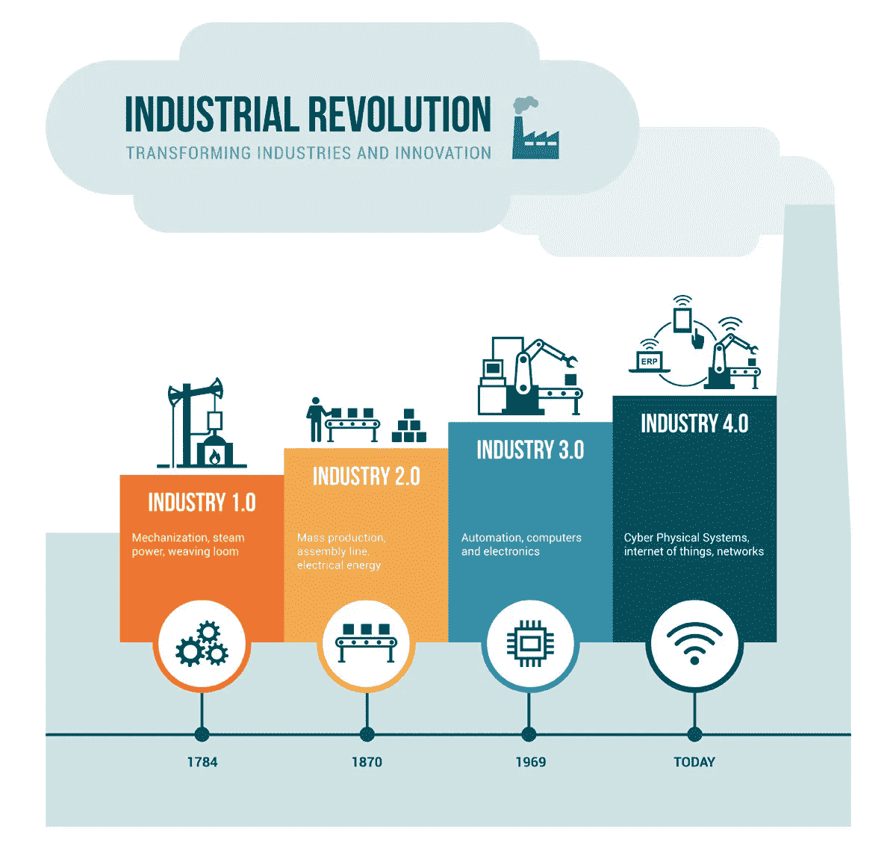
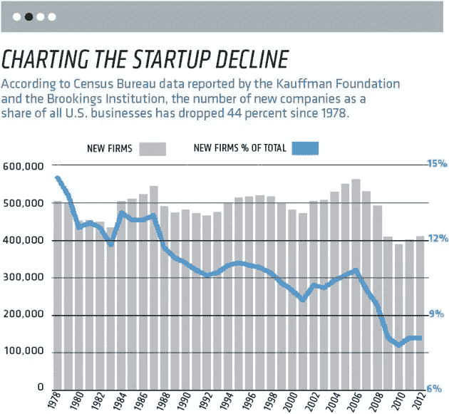
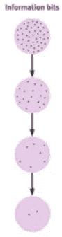
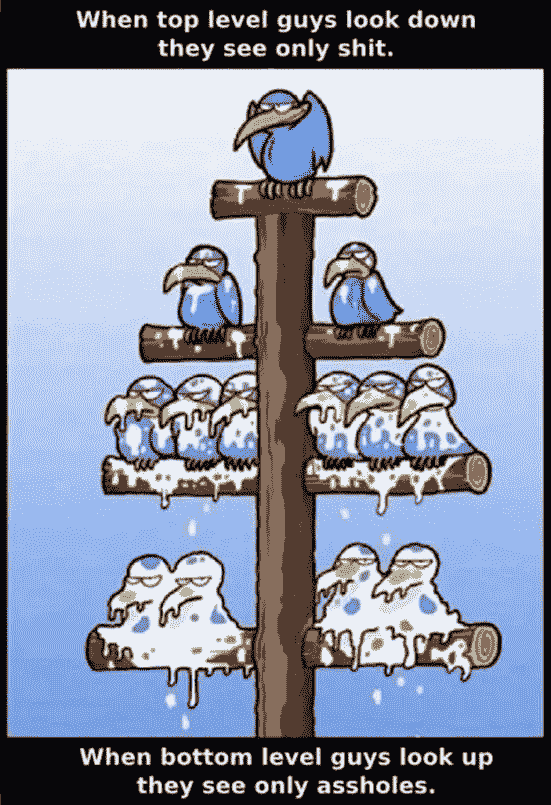
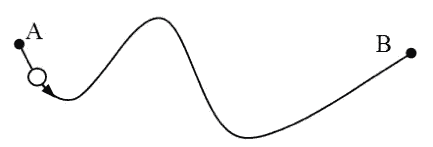
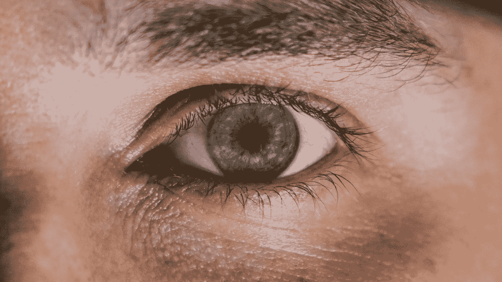
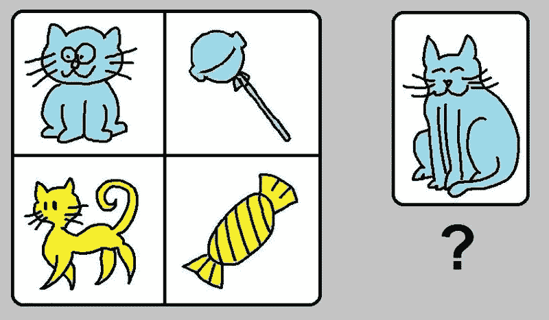

# 每个企业家都需要发展的 10 项技能

> 原文：<https://medium.com/hackernoon/the-10-skills-every-entrepreneur-needs-to-develop-a268a0ce6584>

## 新的世界需要新的技能组合。你准备好了吗？

第一个世界正在向第四次工业革命转变。定义为模糊数字、物理和生物领域之间界限的技术融合。随着[机器人](https://en.wikipedia.org/wiki/Robotics)、[人工智能](https://en.wikipedia.org/wiki/Artificial_intelligence)、[纳米技术](https://en.wikipedia.org/wiki/Nanotechnology)、[量子计算](https://en.wikipedia.org/wiki/Quantum_computing)、[生物技术](https://en.wikipedia.org/wiki/Biotechnology)、[物联网](https://en.wikipedia.org/wiki/Internet_of_Things) (IoT)、 [3D 打印](https://en.wikipedia.org/wiki/3D_printing)和[自动驾驶汽车](https://en.wikipedia.org/wiki/Autonomous_vehicles)表征它。

在这个通常被称为[信息经济](https://www.thetechpartnership.com/globalassets/pdfs/research-2013/informationeconomyeconomicestimates_oct2013.pdf)的新时代，工人的价值并不在于他们在装配线上的生产率，或者他们作为一台大型机器中的一个齿轮而富有成效地工作的能力。他们的价值在于快速创新以超越竞争对手的能力。从 1955 年到 2016 年，只有 12%的财富 500 强企业保持了他们在排行榜上的位置。不再榜上有名的公司被新的竞争者淘汰了。

熊彼特在他 1942 年的论文《资本主义、社会主义和民主》中创造了这个过程——创造性破坏。新的吃旧的。

> “当创新打破了长期存在的安排，并释放资源以部署到其他地方。”

这一进程正在加速。创业成本下降了 10 倍，是过去几十年的两倍。从几十年前的估计 50 万美元，到网络时代的 5 万美元，再到现在的 5000 美元。

然而，[这并不意味着更多的企业获得成功](https://www.inc.com/magazine/201505/leigh-buchanan/the-vanishing-startups-in-decline.html)，事实上，创业精神(定义为新公司的数量占美国企业的份额)正在迅速下降。

我相信这些趋同趋势的推拉效应正在创造一个有趣的机会。我们正处于这样一个时刻，任何经济稳定的人都可以创办一家新公司。然而越来越少的公司成功地在 T4 起步。为什么？

让我们期待世界经济论坛 2016 年[就业报告](http://www3.weforum.org/docs/WEF_Future_of_Jobs.pdf)的答案。这个新时代要求工人掌握新技能，而我们的教育系统在某些方面无法提供这些技能。

这项研究最有趣的意义在于，任何人都有机会培养自己的这些新技能。

出于这个原因，这篇文章的目的是向你展示这些 **10 技能是什么**，并帮助你了解如何在你自己身上发展它们。

*   10 项技能基于 [O*Net Content Model](https://www.onetcenter.org/content.html) 、[欧盟 EntreComp 框架](https://ec.europa.eu/jrc/en/publication/eur-scientific-and-technical-research-reports/entrecomp-action-get-inspired-make-it-happen-user-guide-european-entrepreneurship-competence)，具体技能名称取自[世界经济论坛](https://www.weforum.org/agenda/2016/01/the-10-skills-you-need-to-thrive-in-the-fourth-industrial-revolution/)。
*   在每项技能的最后，我会列出一些工具、模型或框架，它们对接近或理解这些技能很有用。
*   将来，我会进一步写一些更棘手的技能，比如 1 号、3 号和 10 号。敬请关注。

# 每个企业家都需要发展的 10 项技能

## 1.[复杂问题解决](https://www.ncbi.nlm.nih.gov/pmc/articles/PMC5504467/)

复杂性被定义为系统中变量或输入的数量。以管理一个团队为例。每个额外的团队成员都为团队增添了他们自己的愿望、能力、工作模式和观点。

这使得团队更加复杂。这不仅是因为新成员增加了输入，还因为他们的输入与团队现有的输入相互作用。

基本上，每一个新的因素都会使问题变得更加复杂。有技能的人可以处理这种复杂性，并从中得出策略和结果。

由诺贝尔奖得主 H.A .西蒙定义:

> 与问题的规模相比，人类思维公式化和解决复杂问题的能力是非常小的，而问题的解决是现实世界中客观理性行为甚至是这种客观理性的合理近似所需要的。

吉姆·科林斯将复杂的问题定义为大的、令人毛骨悚然的、大胆的目标。这些目标；就像在我的家乡多伦多抗击精神健康危机一样，加拿大有多个利益相关者、根源、半可行的解决方案，这使得*甚至理解它们*都变得异常复杂。

拥有启发法或框架来理解、构建、解决和实施复杂问题的解决方案，对于全世界渴望产生影响的企业家来说是至关重要的，并将继续如此。

工具:[石川(鱼骨)图](https://whatis.techtarget.com/definition/fishbone-diagram)、[根本原因分析](http://asq.org/learn-about-quality/root-cause-analysis/overview/overview.html)、[冲击缺口画布](http://tacklingheropreneurship.com/the-impact-gaps-canvas/)、[麦肯锡问题解决方法](https://collaborate.uchicago.edu/depts/bcs/TestSite/Clone_Consulting/Consulting%20Resources/General_McKinsey%20Problem%20Solving%20Method.pdf)

## 2.批判性思维

批判性思维与解决复杂问题密切相关。批判性思维的简单定义是，通过清楚地定义我们的陈述，然后将它们组织成论点或结论，完成清晰的、逻辑的论点构建。

比如说；如果 A，那么 B. A .所以 b。

如果我煮一杯咖啡，

b:那我就喝吧。

我刚煮了杯咖啡。所以我喝了它。

这是有用的，任何企业家都应该在基本的逻辑论证结构上有所建树。这本教科书对我很有用。然而，有一些问题将批判性思维过程投射到解决大的、棘手的、大胆的目标的混乱中。这就是为什么我更喜欢下面的方法。

当解决问题时[我们创造简化的模型](https://www.andrewjwalls.com/blog/using-mental-models-to-understand-the-world/)，或者现实的抽象，帮助我们处理一些场景的关键元素。因为简单地说，我们没有能力处理来自现实生活的所有变量(A、B、C 等)。下面两个步骤概述了我们如何自然地处理这种可变性。

1.  批判性思维的第一步是我们的能力，将世界的感官刺激汇集成离散的数据点，然后从这些数据点中创造意义，以增加对某一时刻现实的理解。

2.第二步是随着时间的推移创建这些数据点的网络。这些网络让我们了解现实。准确，可预测到其他情况，并且始终如一。

这个过程无时无刻不在进行。当你读这篇文章的时候，你正在做这件事。通过理解处理现实信息的过程，我们可以更有效地得出有力的结论，随着时间的推移，这些结论赋予我们丰富的认知能力来处理复杂的问题。

磨砺这种能力的持续过程被称为[结晶智能](https://en.wikipedia.org/wiki/Fluid_and_crystallized_intelligence)，定义为:

> "一个人一生的智力成就，主要通过一个人的词汇和常识来证明."

工具:[逻辑谬误图](https://yourlogicalfallacyis.com/images/slides/FallaciesPosterHigherRes.jpg)，[批判性思维技巧](https://www.universalclass.com/articles/business/critical-thinking-skills/an-overview-of-critical-thinking-skills.htm)

## 3.创造力

在[创新者的 DNA](https://amzn.to/2JosAKc) 中，创造力被定义为:

> “你产生创新想法的能力不仅仅是大脑的功能，也是优化你的大脑以进行发现的五种关键行为的功能。”

这五个关键行为是:

1.  **关联:**将不相关领域的疑问、问题或想法联系起来。
2.  **提问:**提出挑战常识的问题。
3.  观察:仔细观察客户、供应商和竞争对手的行为，找出新的做事方式。
4.  **社交:**结识有不同想法和观点的人。
5.  **实验:**构建互动体验，激发非正统的反应，看看会出现什么洞见。

这个模型很吸引人，原因有很多。

1.  它展示了人类独特的飞跃，一旦我们 I)理解了问题 ii)并找到了模式。使我们能够 iii)合成解决方案。
2.  任何人都可以做这些单独的活动，而创造力是它们的集合。这意味着创造力可以被**训练**。

2012 年 Adobe 关于创造力的一项研究显示，只有 1/4 的人相信他们发挥了自己的创造潜力。这是一个关键指标，说明为什么创业率的下降反映了创造力的下降。

全球化的商业正在加速我们问题的复杂化，而我们缺乏理解这些系统的技能，也缺乏综合解决这些问题的方法。

然而，如果我们能够学会释放我们的创造力，并进一步实施我们产生的创新。我们可以创建一些企业，这些企业对过去国有化程度更高的企业有着指数级的影响。

工具:[生命评估之轮](https://www.creativityatwork.com/creativity-innovation-coaching/wheel-of-life-assessment-tool/) s，[艺术家之道](https://amzn.to/2He551l)(特指晨间页面工具)，[清扫计划](https://cdn.creativityatwork.com/wp-content/uploads/2013/03/CleanSweepProgram_2012.pdf)，[创新者能力地图](https://cdn2.hubspot.net/hubfs/3903042/Website%20Resources/The%20Moment%20The-ID-Capability-Map.pdf)

## 4.人员管理

人员管理有两个组成部分。

1.  **人。**这意味着情商、鼓舞、激励、鼓励和**领导。**
2.  **管理。这意味着雇佣、解雇、培训、惩戒、评估和指导。**

这两个部分可能看起来不一致。但是，高效的管理者在推动团队向目标前进时，会熟练地平衡这两者。这可能是作为一个公司的代表试图满足一些战略目标。或者作为一个企业家带领他们周围的人走向某种理想的最终状态。

人事经理要做的主要工作是让他们身边的人发挥出最大的潜能。*自上而下的组织领导促成成功。*

高效的人事经理平衡合作、尊重、自我激励和信任。领导别人的本质是领导自己。因此，高效的人事经理知道他们的内部节奏，他们将自己的行动与目标结合起来，并利用所需的纪律来经受任何重大、棘手、大胆目标的起伏。

*总而言之:*想象你正坐在办公室里。一个明星员工走进来。一家竞争公司给了他们一个更好的职位。他们想租下它，但是他们想先和你联系一下。你需要领导这种情况，为你自己、你的公司、*和明星员工创造最好的结果。* **你如何回应？**

场景 2。你的首席财务官走进来。他们说你不会达到这段时间的财务目标。你必须卷起袖子来处理这种情况。

在这两种情况下，你都需要采取行动。然而，情况完全不同。一个需要领导，另一个需要管理。然而，对于一个企业家来说，这两种情况在某一天都可能发生。你必须是这两方面的专家。

工具: [360 度反馈](https://economictimes.indiatimes.com/definition/360-degree-feedback)、 [12 个心智模型](/the-mission/this-is-exactly-how-you-should-train-yourself-to-be-smarter-infographic-86d0d42ad41c)、 [NLP 感知位置](http://www.nlpls.com/articles/perceptualPositions.php)、 [CPQQRT 任务分配框架](http://miningman.typepad.com/mining-man/2010/09/how-to-use-cpqqrt-to-completely-describe-a-task.html)、[理解行为](https://healthypsych.com/how-to-change-behavior-a-theoretical-overview/)

## 5.与他人协调

人员管理天生就有权力不平衡的问题。经理和员工。团队领导和成员。最强有力的企业家知道当他们处于等式的任何一边时，以及当他们与同行保持平衡时，如何运作。

这位同事可能是经理同事，也可能是企业家。它可能是你所在领域的投资者、合作伙伴或利益相关者。这里的重点不是放眼世界，看到等级制度。

它是关于认识到什么时候它们是相互依赖的，或者什么时候那些依赖是单方面的或者特定的情况。例如，雇员依靠雇主获得收入，而雇主依靠雇员获得产出。而其他企业家可能会相互依赖，以实现商业模式的互惠互利。

这就是[与他人](https://www.sciencedirect.com/science/article/pii/S0732118X09000774)协调的意义所在——理解他人，并拥有管理相互依赖关系的工具。

工具:[九形图](https://www.enneagraminstitute.com/how-the-enneagram-system-works/)，[迈尔斯-布里格斯 16 种人格类型](https://www.capt.org/mbti-assessment/home.htm?bhcp=1)，[霍夫斯泰德 6 种文化维度](https://www.mindtools.com/pages/article/newLDR_66.htm)， [8 步改变模型](https://www.mindtools.com/pages/article/newPPM_82.htm)

## 6.情商

情商就是能够理解和管理自己和他人的情绪。它包括三项技能:

1.  **情感意识**——知道自己和他人何时会有什么样的感觉。它包括情感素养，即能够标记这些情感，并据此采取行动。在最高水平上，一个人可以预测来自外部和内部刺激的情绪，从而随着时间的推移调节它们。
2.  **驾驭情绪**——在意识和读写能力，或者认识和理解之后，就要对情绪采取行动，从而与他人和自己建立健康的关系。一旦我们控制了自己的情绪，我们就可以引导与他人的互动，缓解紧张局势，并以互利的方式引导我们周围的人。
3.  **管理情绪**——前两项技能的顶峰是能够主动预测、理解、驾驭和管理情绪。我们不是做出反应，而是用适当的情绪来回应。你需要冷静来专注于某项任务？情商高的管理者可以调节自己的内心状态，创造出那种情绪状态。这同样适用于为我们团队的任务创造热情。

想象一个客户打电话给你。他们很不安。他们所依赖的一个订单延迟了，结果他们失去了一个客户。他们多年来一直是忠实的顾客，而你让他们失望了。

这可能是你的错，也可能不是你公司某个人的错。但他们是盟友、朋友和顾客。一个高情商的企业家能够处理好这种情况。

注意你对今天突然出现的棘手情况的内部反应。你是如何行动的？你乘风破浪吗？还是用你渴望感受的情绪去分析、理解、回应？

工具: [MoodGym](https://moodgym.com.au/) ，[情绪自我调节](https://positivepsychologyprogram.com/emotion-regulation-worksheets-strategies-dbt-skills/)，[人类情绪图表](http://humanemotionschart.com/)

## 7.判断和决策

判断和决策是复杂问题解决、批判性思维、创造力、人员管理、协调和情商的结合。

它能够分析性地评估情况，理解含义，认识范围和可能性，利用您的内部和外部组织资源，并监督解决方案的实施。

这是一件非常难坚持做的事情，它需要强大的精神纪律、意志力和专注。最有效的企业家每天都这样做。他们逃脱了扑灭当天大火的陷阱，而是专注于解决组织最高层的问题。那些你作为领导今天看不到的。公司没有意识到的问题。

像柯达没有意识到它错过了数字革命这样的问题。或者 FaceBook 错过了主动解决其数据隐私问题的机会。

这里的要点是，组织领导人需要利用这些创业技能来主动面对即将发生的事情，并提出他们的价值主张所特有的问题。

## 8.面向服务

[服务导向](http://www.trubyachievements.com/service_orientation.html)定义为:

> “预测、识别和满足他人需求的能力和愿望，有时甚至在这些需求被表达出来之前。"

从一个组织领导者的角度来看，我认为围绕服务导向的对话应该集中在服务型领导上。

“仆人式领导”一词是罗伯特·K·格林里夫在 1970 年的文章《作为领导者的仆人》中创造的:

> “这种差异体现在仆人的照顾上——首先要确保他人最优先的需求得到满足。最好的测试，也是很难管理的测试，是:被服务的人成长了吗？他们在被服侍的时候，会变得更健康、更聪明、更自由、更自主，更有可能成为仆人吗？对社会中最没有特权的人有什么影响？他们会受益还是至少不会被进一步剥夺？”

作为领导力的一个视角，这一概念是开创性的。一般来说，我们认为组织对那些职位最高的人最有利。首席执行官的薪酬最高，然后福利慢慢往下流。

This perspective has led to crude images like this one. Are you seen as the bird up top?

仆人式领导颠倒了这种等级制度。首席执行官对大多数人负责。他们首先需要帮助组织中的每个人:实现自我，支持家庭，超越他们的经济地位。

那些职位最低的人有最多的人鼓励他们，并试图帮助他们在成长和繁荣中成为更好的仆人。

再想想上面的图。但不是像责备、忙碌的工作和煮咖啡这样的组织浪费。相反，那些处于底层的人在鼓励、学习机会、有意义的工作、对家庭生活的关心以及情感/精神健康支持方面受到了极大的鼓舞。

在那个世界里，组织将变得更像家庭而不是机器。这就是 Frederic Laloux 在他富有洞察力的作品“[重塑组织](http://www.reinventingorganizations.com/)”中所说的“Teal 组织”。由[创办的创新咨询公司 The Moment 将他们的公司转型为 Teal](http://themoment.is/fifty-shades-teal/) ，他们创造了更多的目标、平衡的决策和透明度。

当你向前工作的时候，问问你自己——在这一刻，我是作为一个仆人还是一个权力领袖？

工具:[五级领导](https://www.mindtools.com/pages/article/level-5-leadership.htm)、[价值主张画布](https://strategyzer.com/canvas/value-proposition-canvas)、[商业模式画布](https://strategyzer.com/canvas/business-model-canvas)、[变革型领导模式](https://www.verywellmind.com/what-is-transformational-leadership-2795313)、[路径-目标领导理论](http://www.nwlink.com/~donclark/leader/lead_path_goal.html)

## 9.谈判

谈判是各方调解分歧的过程。理想情况下，达成妥协或协议，避免争论和争议。推动谈判的原则是:

*   公平，
*   互惠互利，
*   和维持关系。

为了有效地谈判，领导者需要清楚地了解他们当前的位置，以及他们想要的结果，连接这两者的路径创造了他们的战略。

想象一条双方都在前进的真实路径。我们可以把谈判想象成一个过程，在这个过程中，有交叉路径的两方妥协，以便尽可能少地偏离他们各自的路径。

在这种模式中，很明显，透明度、信任和相互理解对于成为彼此道路上的推动者而不是障碍是至关重要的。这适用于生活中的任何地方。无论是浪漫的关系，友谊，同龄人，还是家庭。我们不断地与周围的人协商我们的欲望、信仰、希望和不确定性。

我们是否选择成为盟友和共同推动者取决于我们每个人。通过“走正道”并成为第一个公开运作的人，你创造了一个其他人可以跟随你的空间。

试试看。当你走自己独特的道路时，试着去理解你周围人的道路，他们如何与你的一致，以及作为合作伙伴，你们如何互相帮助，更好地沿着你们各自的道路前进。

工具:[冲突过程模型](https://iedunote.com/5-stages-conflict-process)、 [5 种冲突处理风格](http://sourcesofinsight.com/conflict-management-styles-at-a-glance/)、[可能协议区](https://www.beyondintractability.org/essay/zopa)、[沟通过程模型](http://www.educational-business-articles.com/communication-process-model/)

## **10。认知灵活性**

认知灵活性有两个组成部分。

1.  在思考两种不同概念之间转换的能力。
2.  同时思考多个概念的能力。

这里有一个例子。这张图片包含两个概念，由两个类别组成:颜色和物体类型。认知灵活的人可以将概念从具体的实现中分离出来，例如从蓝猫中分离出“蓝色”,然后将新的概念重新组合或引入到新的对象中，如蓝狗或灰猫。

认知灵活性依赖于一个人的批判性思维——是什么和不是什么，以及他们的创造力——可能是什么。

作为一名企业家，你经常在不同的任务之间切换，处理类似问题的不同变化。你就越能降低你的认知“转换成本”，更好地综合不同领域和学科的新解决方案。你就越有能力在不确定和快速的环境中运作。就像大多数企业家一样。

工具:阅读书籍，[许多大脑训练应用程序中的一个](https://dailyburn.com/life/tech/train-your-brain-apps/)，[流体 Vs 结晶智力](https://www.verywellmind.com/fluid-intelligence-vs-crystallized-intelligence-2795004)，[环境是智力的一个因素](https://cdn.vox-cdn.com/uploads/chorus_asset/file/6530823/Screen%20Shot%202016-05-23%20at%209.51.10%20AM.png)

我们到了。总结一下**你应该培养的 10 项技能是**:

1.  复杂问题解决
2.  批判性思维
3.  创造力
4.  人员管理
5.  与他人协调
6.  情商
7.  判断和决策
8.  面向服务
9.  谈判
10.  认知灵活性

这些技能都是可以训练和发展的。但这需要奉献、自信和对他人的信任。

我对开始的建议？在业余时间选择一个雄心勃勃的项目，然后开始行动。你会发现，通过从事一个复杂的、令人愉快的项目(比如我正在建造一个水培生菜园)，你会自然而然地运用大部分或所有这些技能，并最终成为一个更有效的领导者、更快乐、更有趣的人。

那么，你在做什么项目？

**想要更多？**访问我的博客 [**大胆引领**](https://www.andrewjwalls.com/blog/10-skills/) 。或者加入 100 多名读者的行列，获得 10 个故事，每周一次我最好的文章、引用、我使用的资源等等。另外，我会寄给你一个文件夹，里面装满了帮助你了解你的业务的工具。[点击这里订阅！](https://www.andrewjwalls.com/subscribe/)