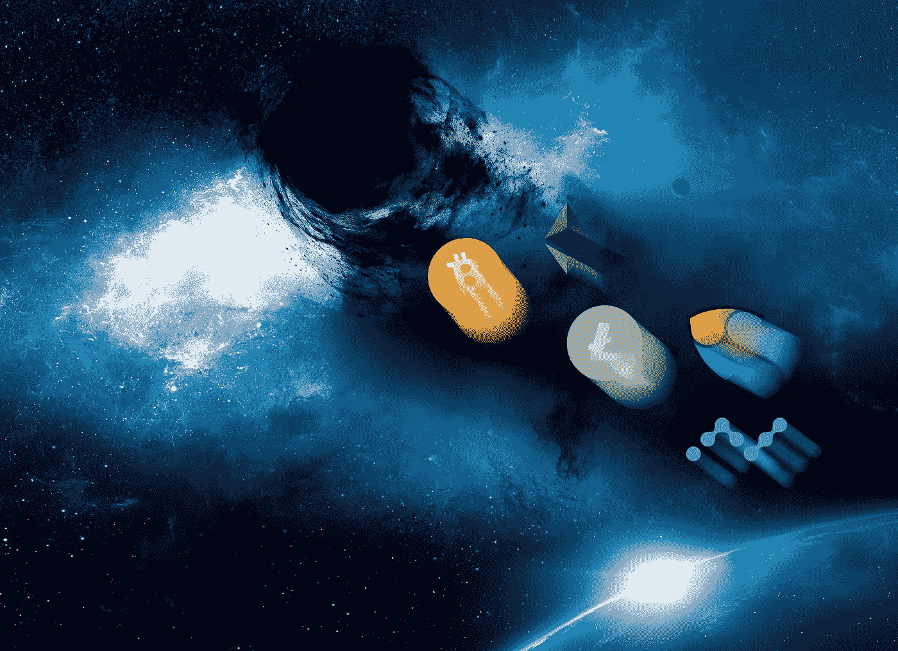
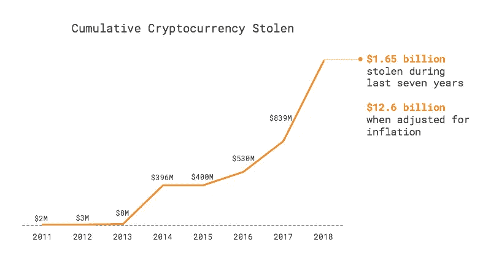
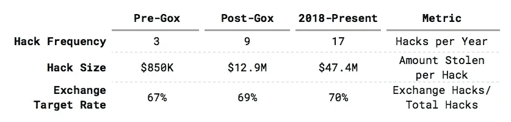
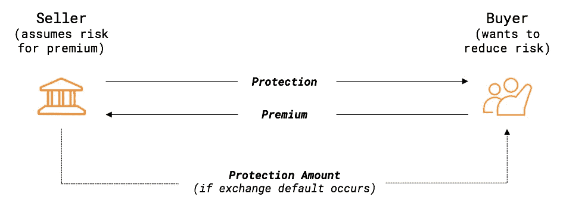

# 126 亿美元的黑洞:你的资产得到保护了吗？

> 原文：<https://medium.com/hackernoon/the-12-6-billion-black-hole-are-your-assets-protected-7ee34d9c810e>

## 解决加密保管问题

加密货币有可能彻底改变全球经济的主要领域。通过用[区块链](https://hackernoon.com/tagged/blockchain)技术取代可信中介，初创公司旨在扰乱银行、众筹、供应链、房地产、医疗保健等等。

为了利用这一机会，加密货币投资者、交易商、对冲基金和爱好者利用集中交易创造了金融史上最不稳定和最有活力的**市场之一。**

然而，目前交易量排名前 50 位的交易所 100%都是集中的。

## 机遇伴随着风险

交易所仍然容易受到无情的网络攻击和欺诈。自 2011 年以来，**全球已经发生了 60 多起重大加密货币黑客攻击**，投资者遭受了**126 亿美元的损失**。

# **密码黑客的简史**

## **前 Mt. Gox 时代(2011–2014)**

*   只有[比特币](https://hackernoon.com/tagged/bitcoin)被盗，因为山寨币实际上并不存在。
*   在此期间，流通的大约 1000 万枚比特币中有 30 万枚被盗(占总供应量的 3%)。

## **Mt. Gox:第一次重大抢劫(2014 年 2 月)**

*   Mt. Gox 的数量优势是一个历史性的异常，处理所有加密量的大约 80%。相比之下，目前没有一家交易所的交易量超过总交易量的 10%。
*   Mt. Gox 破产引发了+75%的回调，花了三年多时间才恢复过来。

## 后戈克斯山:生态系统增长(2014–2017)

*   有 36 起公开的黑客攻击，相当于每五周一次。
*   2016 年 8 月，价值 7200 万美元的比特币从 Bitfinex 被盗，导致 BTC 价格下跌 23%。

## 当前形势(2018 年至今)

*   就黑客攻击的频率和被盗的数量而言，2018 年是有记录以来最糟糕的一年。
*   历史上最大的一次黑客攻击发生在八分钟之内，当时日本外汇硬币支票被盗走了 5.3 亿美元。

## 比较前和后 Mt. Gox 时代

尽管安全程序有所增加，但黑客攻击的频率和严重性却有增无减。令人惊讶的是，自 2011 年以来，中央交易所被黑客攻击的比率一直保持在 70%左右，尽管黑客的其他潜在目标(ico、Dao、stable coins 和私营公司)有所增加。

在 Mt. Gox 之前发生的九次黑客攻击中，760 万美元被盗，平均每次攻击 85 万美元。

在此后发生的 53 起事件中，总共有 13 亿美元被盗，导致平均黑客价值跃升至 2400 万美元。

这是 Gox 时代之前平均黑客价值的 28 倍。

# **投资者有什么选择？**

随着生态系统的发展，黑客攻击的严重性急剧增加，并将继续恶化。如果一家交易所受到攻击，储户会感受到黑客攻击的真实成本。这是因为那些在交易所储存资金的人无法收回那些钱。

> 交易所无法退还你的钱的风险被称为**信用风险。**

当涉及到处理交易所信用风险时，投资者、交易者、基金和用户目前有两种主要选择。

# **选项 1:在加密货币交易所存储**

需要流动性来利用有利可图的交易机会的投资者可以选择将资金放在币安、火币网或 Bitfinex 等集中交易所。

## 优势

*   获得流动性
*   与个人离线钱包相比，保管选项更简单

## 不足之处

*   面临外汇信用风险
*   黑客的明显目标
*   交易所的安全性缺乏透明度

这种选择最适合要求立即进入市场的投资者，如交易者、做市商和不喜欢自我存储选项的人。

# **选项 2:个人冷钱包**

投资者可以选择将密码保存在个人离线钱包中，这意味着他们不会面临交易所黑客攻击的风险。通过使用纸质钱包或硬件钱包，如 Trezor 或 Ledger，投资者可以通过断开互联网连接来消除网络攻击的风险。注意:热门钱包如 MyEtherWallet 仍然面临[网络攻击](https://coinjournal.net/150000-usd-in-ethereum-stolen-in-myetherwallet-hack/)。

## 优势

*   零汇兑信用风险

## 不足之处

*   无法立即获得流动性，对于活跃的交易者来说，托管选项毫无用处
*   [用户错误](https://www.wired.co.uk/article/bitcoin-lost-newport-landfill)的高可能性
*   法律限制限制了许多机构的自我监管

这种方法最适合长期投资者或" [HODLers](https://www.reddit.com/r/Bitcoin/comments/5m9m4g/whats_a_hodler/) "，因为他们不需要定期进入市场进行交易。然而，投资者必须习惯于离线存储他们自己的私钥。

# **新替代品:CDx**

投资者缺乏一种解决方案来保护他们的加密资产免受风险，同时保持从快速发展的加密世界中获利所需的流动性。

CDx 是一个智能契约协议，旨在解决这个问题。

信用违约互换实际上是可交易的保险单。买方预先向卖方支付溢价，以换取交易所免受黑客攻击的保护。

## CDx:令牌化信用违约互换协议

CDx 保护投资者的加密资产，允许他们通过一种全新的资产类别对冲交易所黑客或诈骗的风险:令牌化的信用违约互换。这保护了投资者的加密资产，使他们能够防范交易所黑客和退出骗局。

## 优势

*   零汇兑信用风险
*   获得流动性
*   每个交易所的感知风险完全透明
*   允许用户通过在交易所出售保险获利

## 不足之处

*   必须支付额外费用来换取保护

CDx 对任何目前将资产存放在交易所的人来说都是有价值的，包括活跃的投资者和所有者。

> 通过消除信用风险，CDx 允许投资者在交易所存储他们的加密资产，并满怀信心地进行交易。