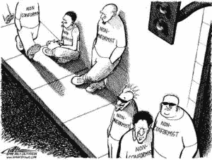

# 创新的 15 个敌人

> 原文：<https://medium.com/hackernoon/the-15-enemies-of-innovation-813313988ce5>

当我戴上顾问的帽子时，我有一个非常简单的方法来检测你的公司是否致力于[创新](https://hackernoon.com/tagged/innovation)，以及它是否会:[你领导和优先考虑](http://www.game-changer.net/2017/06/13/a-critical-measure-of-innovation-leadership-and-priorities/)的方式。

我考的和能力无关，和领导力有关。你看，**领导力是创新**的另一个代名词。如果你的领导专注于保护现在而不是过去，你的组织最终会失败。

我在寻找证据证明你是为了赢而比赛。不要输。

保护自己建立起来的东西是人之常情，失去所有创业公司与生俱来的“无所不能”的精神。这也是为什么老牌组织都在和自己的人性竞争。尽管如此，创新的组织也不能避免落入自满的陷阱；他们只是设置了一些机制，让他们的文化更难融入其中。

创新型组织明白创新有很多敌人，有些是看得见的，有些是看不见的，它的领导者会积极地将他们拒之门外。

什么敌人？

随着他们的成长和成熟，成熟的组织发展出许多阻碍创新的障碍。最近，Vala Afshar 将其中的 12 种列为创新的敌人:

我想再补充三点:自满、专业技能和群体思维。

1.  责备文化；
2.  没有安全的空间进行实验；
3.  取悦所有人的欲望；
4.  自大的人；
5.  自我怀疑；
6.  人才的微观[管理](https://hackernoon.com/tagged/management)；
7.  害怕失败；
8.  流程过于严谨；
9.  急躁；
10.  资源丰富；
11.  河马的；
12.  衡量努力与结果；
13.  自满；
14.  知识的诅咒(专长)；
15.  集体思考。

检查这个列表，你会注意到**转型的最大障碍是人性**；这就是为什么创新与态度和视角以及过程一样重要。

# 减法创新

首席执行官和高管们问我他们的公司如何创新。这是个错误的问题。正确的问题是: ***我们在做什么阻碍创新？***

组织不擅长创新，因为他们把创新当作加法——在已经做的事情上增加更多的活动——而实际上应该做的是首先消除阻碍创新的因素；上面提到的 15 个敌人。

安逸，是进步的敌人。就像个人一样，公司也有自己的发展方式。通往新的更好的目的地的道路是消除[阻碍进步的垃圾](http://www.game-changer.net/2014/07/10/crap-is-the-real-killer-of-innovation/)；[减法创新](http://www.game-changer.net/2012/10/08/subtract-to-innovate/)。

*想开始吗？查看我的文章* [*如何解决这些挑战*](http://www.game-changer.net/2016/06/02/solving-the-10-most-common-innovation-challenges/) *以获得更详细的解释。*

*原载于 2018 年 1 月 4 日*[*www.game-changer.net*](http://www.game-changer.net/2018/01/04/the-15-enemies-of-innovation/)T22。