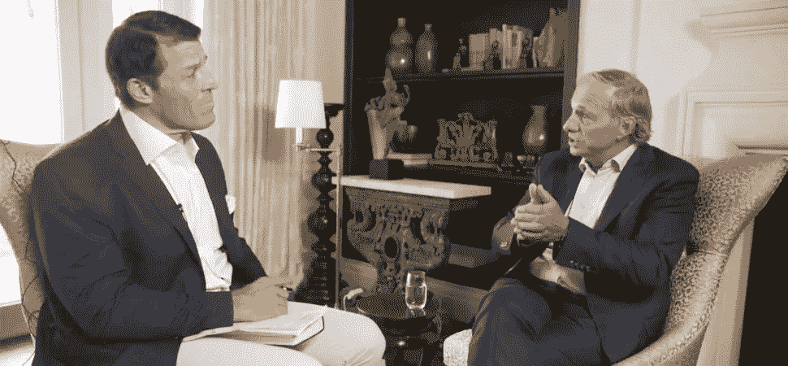
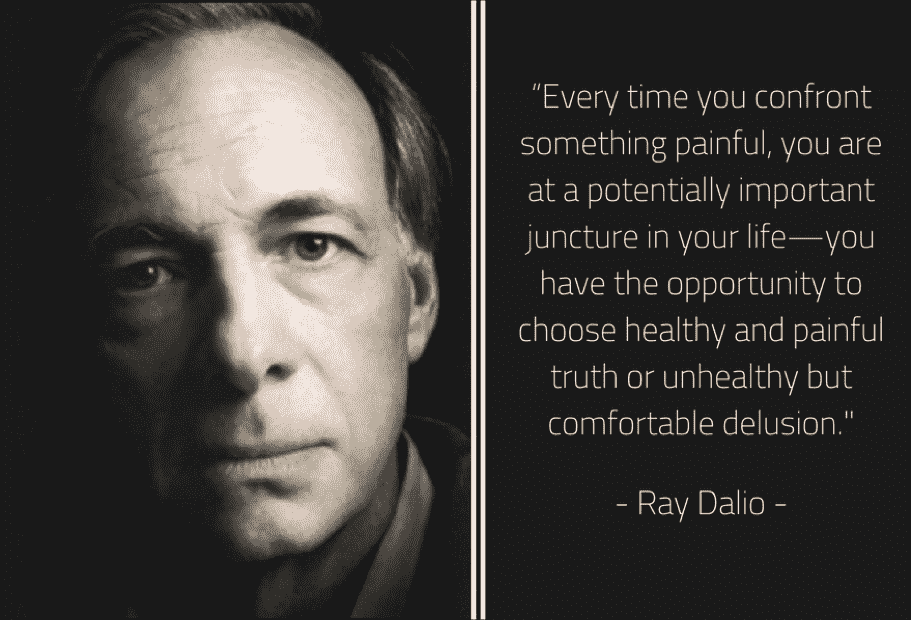
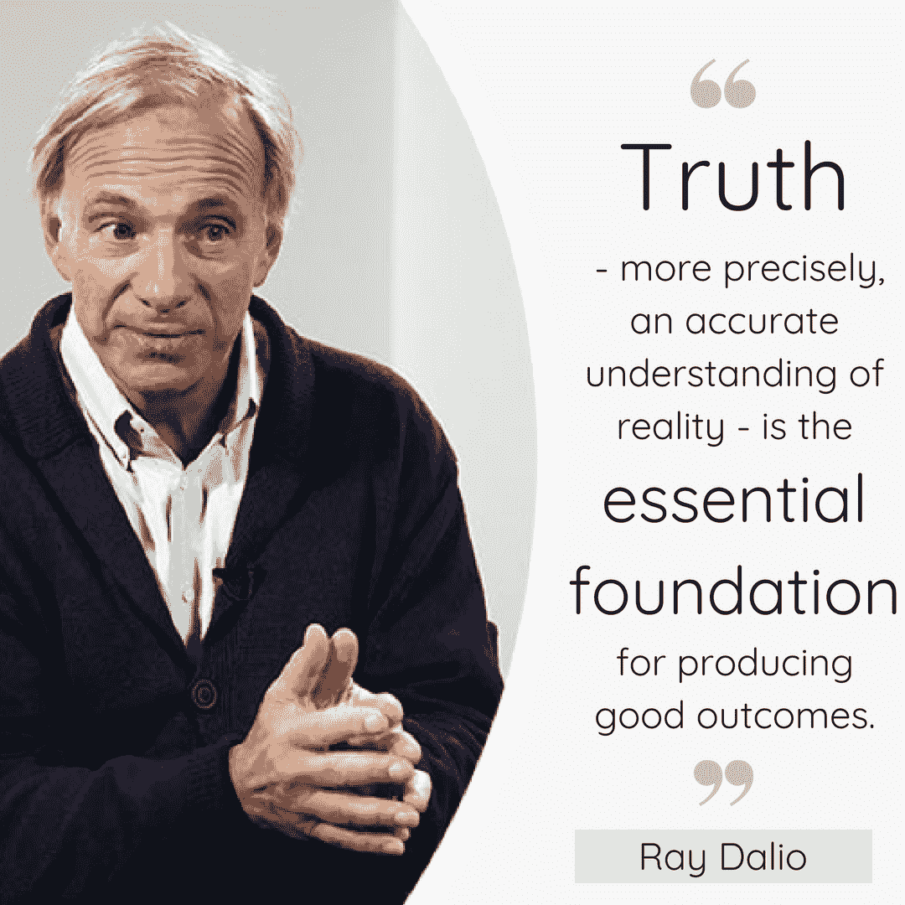
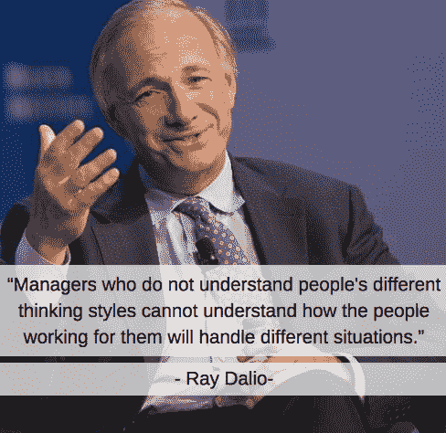

# 170 亿美元的教训:如何像雷伊·达里奥一样思考

> 原文：<https://medium.com/hackernoon/the-17-billion-lesson-how-to-think-like-ray-dalio-65146ac81ccf>

Tony Robbins (left) and Ray Dalio. (Inc.)

*创业不插电博客系列之一:博客 6*

我最近读完了雷伊·达里奥的书《原则》据估计[的净资产超过 170 亿美元](https://en.wikipedia.org/wiki/Ray_Dalio)，达利奥是世界上最成功的对冲基金经理之一，1975 年他在自己的家里开始创业。Bridgewater Associates 已经发展成为美国五大私营公司之一。

和大多数成功人士一样，达利奥从错误中学到的东西比他的成功更多。他最痛苦的学习经历发生在 1982 年，当时墨西哥拖欠了他的贷款。虽然正确预测了信贷危机，但市场上涨而非下跌，随后是长达 18 年的牛市。尽管他是对的，但这个错误几乎让公司破产，Dalio 被迫让所有人离开，除了他自己。事后看来，他注意到，当导致这一巨大的失败时，他自己的傲慢是可能发生在他身上的最好的事情。观看他伟大的 ted 演讲，了解整个故事。

1982 年之后，达利欧没有回到舒适的华尔街工作，而是选择从错误中吸取教训，确保布里奇沃特重新站立起来。他的《原则》一书抓住了推动布里奇沃特前进的精髓，推而广之，也抓住了他在过去 30 多年持续成功的精髓。

> “如果你没有失败，你就没有挑战你的极限，如果你没有挑战你的极限，你就没有最大限度地发挥你的潜力”

**将你的决定系统化**

《原则》中最能引起我共鸣的是提议的系统化决策方法。本质上，这是一种将你所有的学习经历，无论好坏，转化为原则并最终转化为计算机算法的方式。想象一下，每次你做决定时，你的耳朵里都有一个小人，配备了一台强大的计算机，它会根据你过去的记录告诉你该做什么。

重要的区别是，增强决策不仅仅是随机成功！成功是持续学习和系统化方法的结果。

因此，我决定用戴利奥的“原则”来检验我们这些在世界各个角落创业的企业家。自从我读完他的书后，我就一直想找到这个迫切问题的答案:

***达利奥的系统方法能否应用于创业公司？***

为了更好地理解“原则”是如何导致成功的，下面是达利奥在布里奇沃特如何实施他的原则。有两个关键领域:

1.投资和 2。公司决策

**做出正确的投资:精英中的精英**

Bridgewater 的大部分成功都依赖于他们日复一日的投资决策。反过来，他们的投资是基础投资的结果:如何投资，何时投资，投资什么。虽然是“基础”，但这三个问题(或原则)很难预测和回答。因此，达利奥和其他资深投资专业人士将他们的原则转化为计算机算法。这些算法不会取代日常决策，而是对其进行补充。

知道 Bridgewater 的投资成功是他们整体成功和成名的核心驱动力，我问自己是否有可能将这些学习经验转移到一家创业公司。想象一下一个算法驱动的决策支持系统的好处，它可以帮助创业者成功应对首次创业或连续创业的日常挑战！

> “原则是基本的真理，是行为的基础，让你在生活中得到你想要的。它们可以在类似的情况下反复应用，帮助你实现目标。”

我越是思考这个令人信服的想法，就越是意识到 Dalio 的 Bridgewater 方法对于金融行业是独一无二的。股市预测基于大量的数据，包括经济、金融和历史数据集。股市数据回溯[将近 200 年](http://jasonzweig.com/does-stock-market-data-really-go-back-200-years/)！为了成为一名伟大的投资者，你的成功很大一部分是基于你理解市场的能力，以及开发算法和模型来更好地预测股票市场行为的能力。

那么，为什么这种方法对创业公司不起作用呢？以下是我在尝试将投资方法应用于初创企业时想到的几个关键问题(或障碍):

1.  有多少公开的、甚至付费的结构化数据集可以帮助企业家做出更好的商业决策？
2.  如果我们考虑大多数商业模式的创新性和未经证实的本质，我们能从过去学到多少？
3.  有多少企业家创新并创造了新的行业或细分市场，而不是在现有的行业或细分市场中创业？

这并不是说我不喜欢强化决策。这些问题清楚地表明，对于初创公司来说，没有任何逻辑或基于算法的决策方法可以与对冲基金相比。简而言之，与股票市场不同，初创企业世界没有足够的结构化或可用数据来构建算法，并像 Dalio 在 Bridgewater 那样取得成功。

然而，我并不是完全否定达利奥将原则应用于初创企业的想法。

**公司决策:如何做出正确的决策**

Dalio 方法的第一部分侧重于投资决策。但还有第二部分，关于在你的公司应用“原则”，包括人力资源决策、与同事的日常互动、何时让员工离开等等。

> “问题的痛苦是寻找解决方案的呼唤，而不是不快乐和无所作为的理由，所以对遇到的问题和选择感到沮丧是愚蠢、无意义和有害的。”

尽管很难像股票市场一样量化人类行为，但 Dalio 非常依赖对员工进行心理测试。把它想象成一个人格测试，帮助你了解每个个体的优缺点；在布里奇沃特，他们使用经典的测试，如 T2 测试。但这还不是全部！

每位员工还会得到一张虚拟的棒球卡，上面总结了测试结果和由算法评估的*。“棒球卡”数据用于根据技能将人员与项目相匹配。让我们假设一个项目经理正在寻找一个有创造力的人加入一个项目。通过轻松地在他们的内部数据库中搜索与所需或要求的技能相匹配的人，他们已经找到了完美的人选。*

这个想法不仅令人信服，而且切实可行。你可以在雇人前后收集自己的个性数据，而不是像股票市场那样依赖过去或历史数据。你知道有多少初创公司以这样或那样的方式测试员工的性格？我们都知道首次招聘有多重要。错误的雇佣会毁掉你的公司。那么，我们为什么不把招聘决策更多地建立在数据而非直觉的基础上呢？也不仅仅是为了找到更好的人。算法还可以通过改善创业团队内部的匹配机制来激发生产力。

我希望这个思想实验已经让你想到如何最好地将 Dalio 的“原则”应用到你的*创业中。虽然这篇博客关注的是投资和公司决策的原则，但我们都知道这不是构成任何公司基础的仅有的两件事。*

根据达利奥的说法，一家公司由两样东西组成:人👫和文化🌍

从最新的创业公司到世界上最大的对冲基金之一，有很多方法可以将 Dalio 艰难学到的经验应用到任何公司。如果你还没有读过“原则”，并且想要快速理解要点，花几分钟看一下这个[很棒的视频](https://www.youtube.com/watch?v=B9XGUpQZY38)。你将了解更多关于达利奥的精英文化，包括激进的透明度，深思熟虑的分歧，以及公平和适当的方式来克服分歧。

我真的很期待你们的评论，喜欢和其他参与方式。😀🙏

➡️每周从你的收件箱里收到一篇值得一读的文章。[在这里报名](https://goo.gl/forms/p6gnR2OTUiZc47in2)。🙏

PS:大家可以拍手跟我来，这样会有更多的人在 Medium 上看到这篇文章(见下面的视频)。👏 👍

**你可以通过**联系到我

**推特:** @marcelmuenster

**个人网站:**[about.me/marcelmuenster](http://about.me/marcelmuenster)(了解更多关于我的信息并安排通话)

**LinkedIn:** 给我发一封[电子邮件](https://www.linkedin.com/in/marcelmuenster/)或一条[直接信息](https://www.linkedin.com/in/marcelmuenster/)