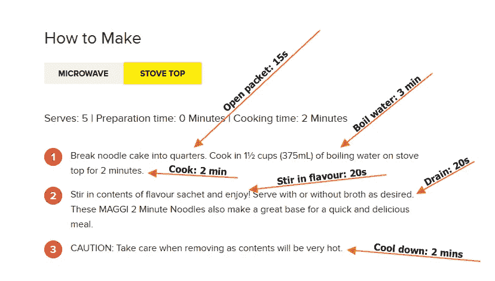

# 两分钟面条规则

> 原文：<https://medium.com/hackernoon/the-2-minute-noodle-rule-84c7a3348ac8>

每当我听到一个[程序员](https://hackernoon.com/tagged/programmer)说代码修复只需要“2 分钟”时，我都会退缩。因为我知道他们会让自己失望。因为从来不需要 2 分钟。什么都不用 2 分钟。即使是 2 分钟的[面](https://hackernoon.com/tagged/noodles)也不需要 2 分钟。

*顺便说一句，如果你不知道它们是什么，2 分钟面条是一种标志性的澳大利亚方便面小吃/餐。从我在电视节目中听到的，我认为它们类似于美国人所说的“拉面”。这篇文章不应该被看作是对两分钟面条的批评。我衷心赞同 2 分钟面条。*

虽然我很喜欢 2 分钟的面条，但我总是对他们做的时间感到失望。事实上，做 2 分钟的面条需要 5 到 10 分钟。不信你看说明书就知道了。

当然，煮面条只需要 2 分钟，但这只是其中一个步骤。其他步骤也需要时间。光烧水就要 3 分钟！

2 分钟面条正是程序员的思维方式。我们的默认立场是根据我们想象自己编码的时间来引用时间。但是编码只是我们工作的一小部分。想想我们要做的其他工作。像阅读需求、讨论我们的解决方案、创建分支、请求评审、编写测试、部署和修复我们刚刚引入的新错误这样的工作。在一些团队中，即使是最小的代码变更也可能需要几个小时的工作。

问题是，当你发现自己花了 1 个小时解决了一个你说要花 2 分钟解决的问题时，你会感觉很糟糕。你觉得有压力要加快速度，你觉得自己失败了，你担心每个人都会失望。这就是为什么我制定了这条规则，提醒自己不要忘记所有我必须做的非编码工作。

> 两分钟面条规则——记住，除了煮面条还有很多步骤。

当你使用两分钟面条规则时，你会感觉很好。你会感到放松、快乐和成就感。你会说一个代码修复需要 1 个小时，但实际上大部分时间都需要 1 个小时。在软件开发的怪异世界中，这是令人惊讶的。