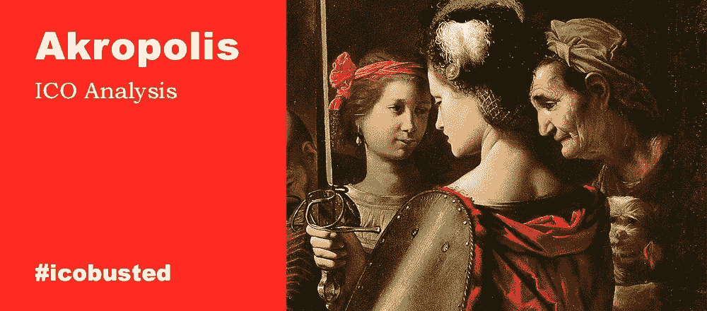

# 21 万亿美元的养老基金市场正在向区块链注入资金——I closed 分析

> 原文：<https://medium.com/hackernoon/the-21-trillion-pension-fund-market-is-pouring-money-into-the-blockchain-icobusted-analysis-96bd8bdc1a9e>

我们将从这篇文章开始一个新的专栏—*# I closed*。专栏作者是[亚历山大·萨维金](https://howtotoken.com/blockchain-experts/)，我们的投资专家和 [Howtotoken](https://howtotoken.com) 的联合创始人。在这里，我们将扫描市场，寻找最新、最引人注目的即将推出的 ico，并对它们进行深入分析，我们的重点将是这些项目背后的商业概念的可行性。这不会涉及前 ICO/ICO 价格差距，没有对团队的喘息和抱怨，也没有代码检查。在这里，我们将试着把每一件事都分解开来，看看当且仅当该产品能够交付时，该产品是否有任何市场前景。

如果您对我们的新形式有任何反馈，我们将不胜感激，因此请在评论区畅所欲言，发表您的意见——您对哪些部分最感兴趣，以及我们如何改进这些主题，让您对它们更感兴趣。要了解我们的最新动态，请关注我们:

*   [推特](https://twitter.com/howtotoken)
*   [脸书](https://www.facebook.com/groups/howtotoken/)
*   [电报](https://t.me/howtotoken)

或者只订阅我们的电子邮件简讯(以接收仅通过电子邮件分发的更新和独家材料):

即将出现的最有趣的 ico 之一叫做 [Akropolis](https://akropolis.io/) 。简言之，Akropolis 的目标是成为第一个养老基金市场。这是少数几个将在传统经济领域利用区块链的项目之一。而这个特殊的领域恰好相当大。

# 产品

核心思想是建立一个平台，将独立的养老基金整合到一个市场中，个人可以在这个市场中比较和选择最合适的养老基金和计划(从现有的各种各样的基金中)，基金经理将能够使用这个平台来获得客户。数据可信度和数据所有权将通过智能合同得到支持。

我不会说没有区块链就不可能做出这样的服务；但作为一种公共控制机制，区块链可以提供真实性的优势，这主要是因为互动历史和基金业绩/声誉的分布式分类账。此外，例如， [DAO](https://en.wikipedia.org/wiki/Decentralized_autonomous_organization) 可用于减少养老基金和基金经理之间的分数。这也是一个很好的实验方式，可以在拥有集中备份的同时，观察事情在实践中是如何进行的。

Akropolis 决定从半分散的解决方案开始，因为区块链在这种情况下不是一个必要的元素，尤其是在开始的时候。但正如我们所见，退休基金市场非常不规范，很难正确分析。这样，数据存储的区块链架构可能是让这个混乱的市场变得有序的方法之一。

此外，这可能会促进智能合约在 Akropolis 平台的中立领域的使用，这本身可能会将这个市场变成一个更加以客户为导向的市场。当然，区块链在 Akropolis 平台上的实现也是拥有 ICO 的一个很好的理由。

如今，选择养老基金的典型方式是咨询你的银行经理、保险代理人或财务顾问。大多数中介会把你送到他们的合作伙伴那里。这意味着你的选择将受到严重的限制和偏见，因为这些“合作伙伴”通常支付中介费。

是的，有很多关于如何管理养老金储蓄的[调查和计算器](https://www.nerdwallet.com/blog/investing/best-retirement-plans-for-you/)。有一系列的[项目](http://www.retirementmarketplace.com/)试图帮助你做出选择。英国和美国[也有一些基金评级网站](http://www.pionline.com/article/20180205/INTERACTIVE/180209925/funded-status-of-the-largest-us-public-pension-funds)[。尽管如此，由于这个市场缺乏统一性，客户面临着数据缺乏和费用增加的问题。](http://www.morningstar.co.uk/uk/lnpquickrank/default.aspx?search=blackrock)

但目前还没有这样一个市场，你可以通过不同的特征来比较所有的选择，直接在网站上购买，甚至为养老金计划定制自己的个人订单，并为你感兴趣的基金进行拍卖。

因此，如果有人能够提供一个不偏不倚、易于理解的工具来选择最合适、最可靠的养老基金，那么这是一个大有可为的机会。

# 市场

Akropolis 的潜在市场非常非常大。

2017 年，美国养老金资产达到[25.4 万亿美元，年增长率为 12.7%](https://www.willistowerswatson.com/-/media/WTW/Images/Press/2018/01/Global-Pension-Asset-Study-2018-Japan.pdf)，约占全球养老金资产总量的一半。

顺便说一句，所有这些都发生在 20 个经合组织国家的无准备金政府养老金负债平均水平为 GDP 的 190%的时候，使所有政府债务的报告金额相形见绌，其总额仅为 GDP 的 109%(根据 Akropolis 白皮书中引用的 CityGroup 报告)！

该市场的核心观点是:发达国家的人口老龄化是一个稳定的过程，与国家财政状况恶化同时发生。每个人都必须主要为自己赚取养老金。

Akropolis 可以假装为获取客户的营销预算提供资金。为了评估潜在股份的规模，让我们以共同基金为例，它们是市场上主要的客户搜寻者。[美国的活跃共同基金](https://jacobslevycenter.wharton.upenn.edu/wp-content/uploads/2017/08/Marketing-Mutual-Funds.pdf)在 2016 年已经管理了总计 11.6 万亿美元。该行业的收入约为 1000 亿美元，其中超过三分之一的金额代表营销支出，营销支出主要由销售负载和经纪人佣金(称为 12b-1 费用)组成。

因此，如果 Akropolis 成为客户进入养老基金的入口，那么它可能拥有每年至少 300 亿美元的潜在市场。

# 类似物

事实上，传统养老基金行业并没有太多创新。任何承诺为客户和服务提供商迈出实质性一步的项目都有望获得良好的市场反应。

我们可以以 [Blooom 项目](https://www.blooom.com/)为例，它提供了一个投资咨询应用程序，旨在管理员工的 401k 账户(每月 10 美元，估计每年平均节省 5000 美元)。Blooom 收集基本用户数据，如姓名、电子邮件、年龄和退休时间，并提供免费分配和费用分析。客户只需支付一个月的费用，就可以注册让 Blooom 管理他们的账户。

在不到三年的时间里，截至 2018 年 1 月，Blooom 管理的资产达到了 20 亿美元。A 轮(2015 年 10 月)融资 400 万美元，然后 Blooom 获得了 900 万美元的 B 轮融资(2017 年 1 月)。Blooom 的收入还不清楚，但是通过将网站上公布的 16000 名客户乘以 120 美元的年费，我们得到的数字是大约 200 万美元。假设有 9000 万美国人正在独自处理他们最有价值的退休资产——401k——只需要 1%的市场就可以将 Blooom 收入提高到 1 亿美元以上。伙计们，看起来像只独角兽！

# 摘要

Akropolis 似乎没有很高的开发失败风险，他们可以很好地实现他们所有的承诺。2500 万美元的硬性规定对于这样的努力来说也是合理的。但这里的问题是，根据 Akropolis 的材料草案，1250 万美元的技术和人才费用似乎很多，250 万美元的营销费用也引发了质疑。这笔钱真的足够用于全国性的 B2C(企业对客户)营销活动，更不用说全球营销了吗？在项目开始自己赚取足够的资金之前，可能需要额外的资金。

我个人认为拥有一个安全令牌是必须的。无论公用事业代币中嵌入了什么，没有什么能 100%保证投资者的未来利润。这不是一种可以在股价上涨时兑现的加密货币。

以及最终的*正反*:

(+)巨大且不断增长的国内市场，以及全球市场
(+)市场上缺乏直接且强劲的竞争对手
(+)产品不难交付
(-)未经深思熟虑的预算(至少在草案版本中)
(-) Token 不是一种安全的令牌，尽管股息支付表明并非如此

总而言之，Akropolis 值得投资者进行更详细的考虑。

你现在只能看到 WP 的草稿。朋友们，请让你的 WP 测试版更易于阅读！

___________________________________________________________________

# 有用的材料

1.  [为什么人们放弃他们的 401(k)由市场周末员工](https://www.marketplace.org/2017/11/09/world/abandoned-401ks)
2.  [前瞻研究院 2018 年全球养老金资产研究](https://www.willistowerswatson.com/-/media/WTW/Images/Press/2018/01/Global-Pension-Asset-Study-2018-Japan.pdf)
3.  [精算师协会养老金研究报告](https://www.soa.org/research/topics/pension-res-report-list/)
4.  [Milliman 的 2018 年企业养老金基金研究](http://us.milliman.com/uploadedFiles/insight/Periodicals/corporate-pfs/2018-corporate-pension-funding-study.pdf)
5.  [安永会计师事务所&扬(EY)](https://www.ey.com/Publication/vwLUAssets/Building_a_better_retirement_income_solution/$File/ey-building-better-retirement-income-solution.pdf) 打造更好的退休收入解决方案
6.  [新泽西发布私营部门退休市场投资选择的 RFI](http://www.pionline.com/article/20180117/ONLINE/180119880/new-jersey-issues-rfi-for-investment-options-for-private-sector-retirement-marketplace)
7.  [新泽西州小型企业退休市场](https://www.nj.gov/treasury/doinvest/pdf/Rfp/RFI17-1226final.pdf)
8.  新的退休计划市场让美国人更容易存钱
9.  [研究&先锋评论](https://institutional.vanguard.com/web/c1/inst-investor-researchcommentary/listView/Retirement/all/)
10.  [最佳退休计划:选择适合你的计划](https://www.nerdwallet.com/blog/investing/best-retirement-plans-for-you/)
11.  [尼古拉·鲁沙诺夫、阮宏勋和·魏营销共同基金](https://jacobslevycenter.wharton.upenn.edu/wp-content/uploads/2017/08/Marketing-Mutual-Funds.pdf)
12.  [华盛顿州推出网上退休市场，作者梅勒妮·沃德尔](https://www.thinkadvisor.com/2018/03/22/washington-state-launches-online-retirement-market/?slreturn=20180719142804)
13.  退休储蓄的新领域？洛克菲勒政府研究所创建州退休储蓄市场

*所有材料仅供参考。任何材料都不应被解释为投资建议。*

*原载于 2018 年 8 月 28 日 howtotoken.com**的* [*。*](https://howtotoken.com/for-traders/21-trillion-pension-fund-market-pouring-money-into-blockchain/)