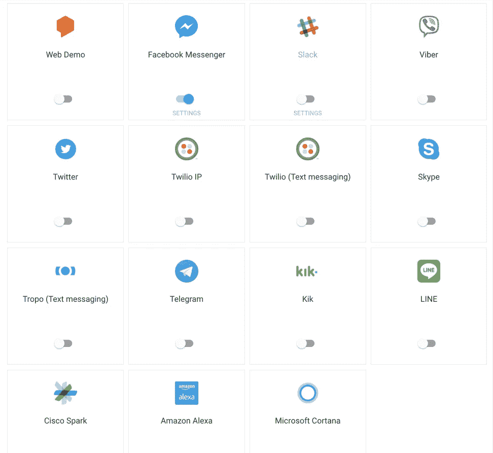
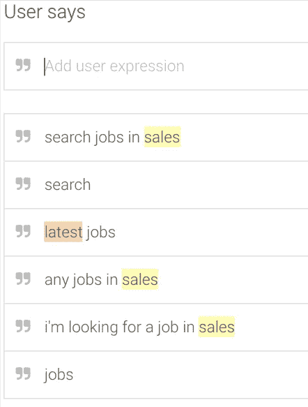
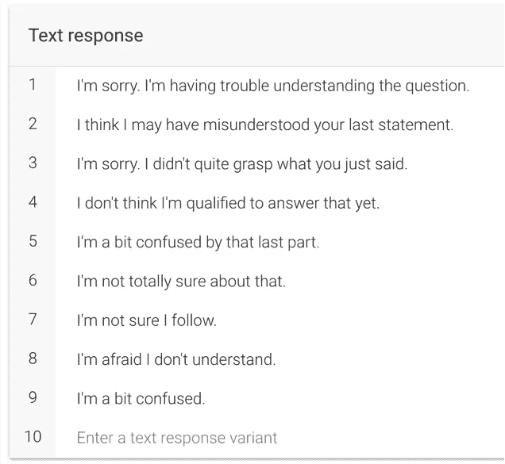
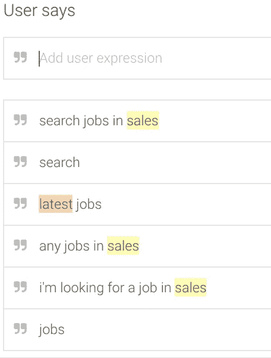

# 对话流代理的 3 个主要组件

> 原文：<https://medium.com/hackernoon/the-3-main-components-of-a-dialogflow-agent-e5cfffc1a186>

## **意图**、**上下文**和**实体**是任何对话流代理的三个主要组成部分

DialogFlow 成立于 2010 年，2016 年被谷歌收购。DialogFlow 的美妙之处在于，我们可以用它来构建一个代理，然后将它与语音或文本集成到多个服务中。像亚马逊 Alexa、谷歌助手、Facebook Messenger、Twitter 等服务…

Supported integrations

# 1.意图

意图代表了用户所说的和我们的应用程序需要采取的行动之间的映射。通常我们在一个代理中会有不止一个意图。

把这想象成一棵决策树，我们需要把用户的短语映射到一个特定的结果/响应。

还有一个**后备意图**的概念，以防代理不知道如何对某件事做出反应。

# 2.上下文

语境引导对话，因为它们告诉我们在任何给定的时间点我们知道什么。

让我们想象这样一个对话流程:

1.  在惠灵顿找工作
2.  按日期对**和**排序

第二个对话项(意图)可以有一个输入上下文(如搜索标准)。我们还可以要求用户提供缺失的输入上下文，以便能够正确地触发意图。

# 3.实体

它们是用户所说的值，如位置、日期等…

DialogFlow 有一些预定义的实体，如地址、城市等，这些被称为系统实体。还有我们在代理中定义的实体，称为开发人员实体。

最后，我们很可能还需要一个与我们的代理配套的后端。我们既可以自己实现和托管它，也可以使用 Firebase 云功能(就像 Amazon Lambdas 一样)。

# 最后的想法

在个人电脑的早期，用户必须与控制台进行交互。几乎没有选项可供选择的黑屏。

然后是可视化界面。软件“能做什么”变得越来越明显。

现在，我们正在转向一种模糊的与机器互动的形式，使用语音。它是不明确的，因为我们不能**然而**只是用它自然地说话，并且弄清楚它能做什么可能是棘手的。

如果你喜欢读这个故事，请**👏**并分享出来帮助别人找到！您也可以在 Twitter 上关注我，以便在我发布新故事时获得通知。