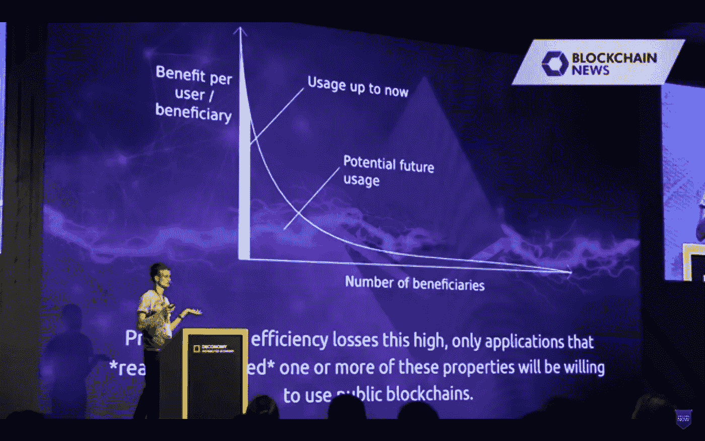
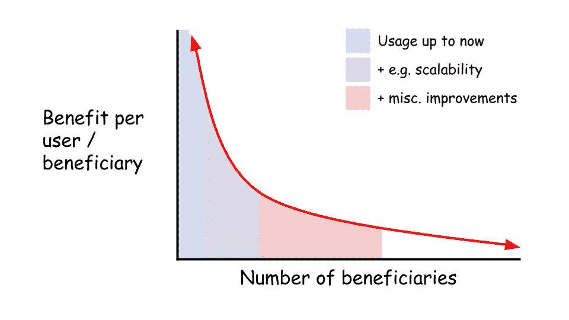
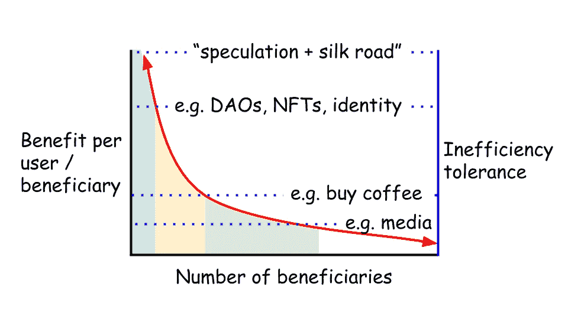
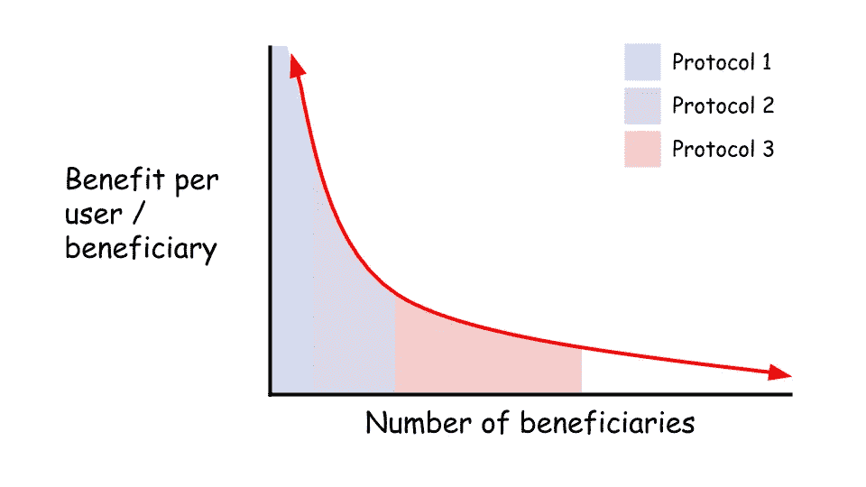

# 区块链用户采用的 3 条路径

> 原文：<https://medium.com/hackernoon/the-3-paths-to-blockchain-user-adoption-11131be5297f>

## [Vitalik Buterin](https://medium.com/u/587a00dbce51?source=post_page-----11131be5297f--------------------------------) 在他的 Deconomy 演讲中播放了一张幻灯片，描述了当前用户对区块链的使用情况。如今，加密已经足够有益于“投机和丝绸之路”，但需要沿着曲线转移，才能对世界产生更有意义的影响(例如，为没有银行账户的人提供银行服务)。

为了沿着曲线前进，与非区块链技术相比，我们需要降低区块链的低效率。正如他所说，“由于效率损失如此之高，只有*真正需要*这些属性中的一个或多个的应用程序才会愿意使用公共区块链。”

换句话说，您可以预期区块链技术的采用会是这样的:

这是**解读这条曲线的第一种方式**。技术的不断进步使区块链能够为更多的人服务。提高可扩展性等属性可以降低效率，让我们能够为更多用户提供更多使用案例。

**解释该图的第二种方式**是添加另一个轴，代表受益人为了获得利益愿意容忍的低效率程度。使用维塔利克的描述，今天的投机者和丝绸之路经营者愿意容忍高度的低效率。

您可以想象一组从区块链的固有属性中受益匪浅的用例，但是低效率对于用户来说仍然太高。我们可以将收益等于低效率的点称为*低效率容忍阈值*。用户拒绝在他们的用例中采用区块链，直到曲线低于低效率容忍阈值。

如此等等，直到低效率达到零，并且所有用户都使用区块链得到更好的服务。

我们经常问这个问题“这个项目需要区块链吗？”这条曲线是回答这个问题的一个有用的模型。越向左，用户*越需要*区块链的好处。

考虑这条曲线的第三种方式是描述智能合约协议市场份额的一种方式。

也许协议的独特权衡将它们置于曲线的不同部分。你可以想象左边是一个高度安全、分散但效率低下的协议，右边是一个更加集中、高效的协议。因为用户在 x 轴上的每一点都有不同的偏好，所以他们应该通过迎合他们偏好的折衷的协议得到更好的服务。

无论你如何看待这条曲线，有一点是清楚的:我们仍然处于非常早期的阶段，还有很多工作要做。

*原载于 2018 年 4 月 9 日*[*【www.tonysheng.com】*](https://www.tonysheng.com/blockchain-user-adoption-curve)*。*