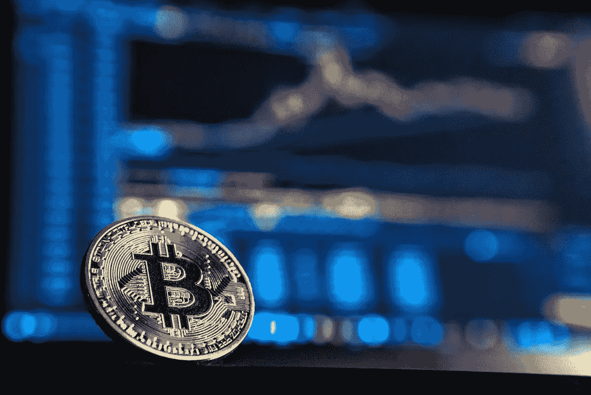
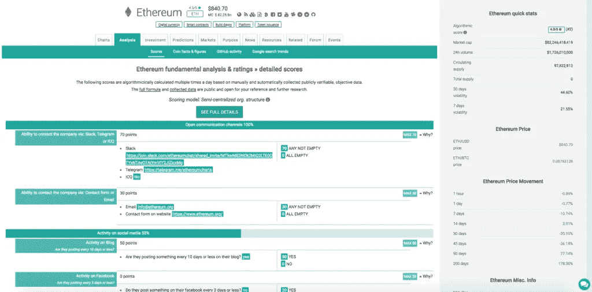
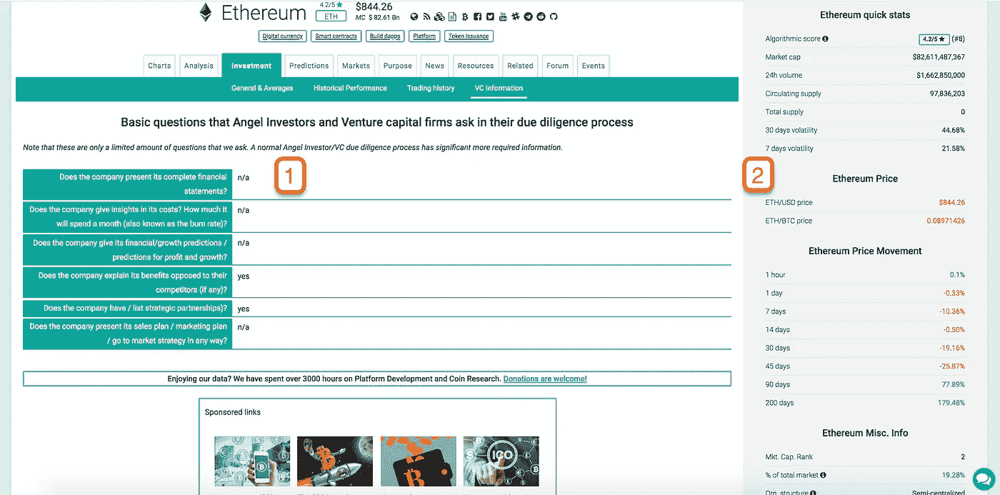

# 加密货币研究 3 步入门指南

> 原文：<https://medium.com/hackernoon/the-3-step-beginners-guide-to-cryptocurrency-research-1155f2f540af>

如果说自从加密货币开始出现在每个街角以来，我们都学到了什么，那就是如果你选择了错误的投资对象，你很容易失败并失去你的钱。

如果你在投资 altcoins，基本面分析会帮你选择长期潜力最好的，能给你带来一些利润的。

首先，你要做好这个生态系统极端波动的准备。加密货币通常会在一天内飙升 40–50%。

请记住，[加密货币](https://hackernoon.com/tagged/cryptocurrency)市场也是由情绪驱动的，当你考虑投资一枚硬币时，害怕错过(简称 FOMO)是一个巨大的因素。

试着掌握你的 FOMO，当你在图表上看到大幅上涨时，不要惊慌失措，卖掉其他资产，只投资一枚硬币。

在进行投资之前，根据你在网上能找到的尽可能多的信息进行分析和决定。

# 那么，如何继续加密货币的研究呢？

你应该知道的第一件事是所有的投资都有利弊。如果事情开始时比较困难，不要气馁。如果你付出一些努力，随着时间的推移，你会发展技能，观察投资机会。

首先，你应该考虑交易破坏者。我将在下面指出它们，如果它们存在，你不应该在这些加密货币上投入更多的时间，因为它们很可能会失败。

找到关于加密货币的正确信息具有挑战性，原因如下:

*   这些信息要么不存在，要么很难找到
*   有时没有任何方法来验证消息来源是否可靠
*   理解信息的某些部分可能超出了你的技术能力
*   阅读、理解和吸收需要很多时间

有很多平台可以提供每枚硬币不同方面的信息。在本文中，我们将使用 coincheckup.com，因为它拥有大量关于上市硬币的信息，并将简化您的加密货币研究，只需去那里查看任何一枚硬币上 70–80%的重要信息。

在研究任何事情的时候，你应该从一系列需要答案的问题开始。crypto 也是如此。我们在下面准备了一份清单，可以作为你研究的框架。

保存它，打印它，并在你研究你想投入资金的加密货币时将其用作清单。

# 第一步:看看基本面分析数据

知识就是力量，在投资领域也是如此。为了评估一种加密货币是否值得投资，我们必须首先知道我们可以从哪里获得信息。

[USC Group](https://www.usc.group/) Daytrader &分析师，Zissou ( [@ZeusZissou](https://twitter.com/ZeusZissou) )告诉我们在考虑一种加密货币时，第一步应该做什么。

> *“这取决于你的分析方法，以及你是自下而上还是自上而下。如果我对宏感到兴奋，我会挖掘得更深。*
> 
> 最理想的情况是，你想要一个基础强大的项目。然后你只要运用技术分析找到好的进场点"

即使塞苏是日内交易者，他也是从基本面开始分析的。在这篇文章中，我们不会进入技术分析，因为这是一个完全不同的主题。

# 让我们来看看如何获取基本面分析的信息。

每枚硬币都有多个传播信息的渠道。最重要的是:

*   其网站(关于团队、投资或战略的大部分信息应该在那里)
*   白皮书是关于硬币技术和用途的最重要的信息来源
*   twitter、facebook 或 reddit 等社交媒体账户
*   基于不同应用的社区:Telegram、Discord、bitcointalk、脸书群组等

在检查一枚硬币的基本信息时，触摸以下几点，并对它们进行好坏评分，将有助于您对它是否有未来有一个好的想法。

在我看来，粗体字是任何硬币的交易破坏者。这并不意味着其他的不重要，但是先看看这些，如果它们看起来可疑，最好远离硬币。

1.  **公司的详细资料是否透明，容易找到？**
2.  加密货币是什么时候创造的？
3.  组织结构是怎样的？
4.  项目是否足够透明，目的是否清晰？
5.  币背后是否有经验丰富的开发团队？
6.  顾问委员会的人以前成功管理过这类项目吗？
7.  团队是否足够多样化以涵盖硬币成功所需的所有行动？
8.  他们在社会上活跃吗？—脸书、Youtube、Twitter、Reddit、Slack、Telegram 等。
9.  他们有 ICO 吗？
10.  **他们是否有明确的最新路线图？**
11.  你能在多少个交易所交易硬币？
12.  他们网站的流量有多少？
13.  他们的 GitHub 活跃度够高吗？我们相信软件项目应该看到持续的活动
14.  谁在财政上或以其他方式支持这枚硬币？
15.  是否有任何即将到来的[秘密事件](https://coincheckup.com/coins/ethereum/events)如分叉等会影响价格？

加密货币市场在其短暂的生命周期中以前所未有的速度发展(与其他资产相比)。

自 2009 年 1 月向公众发布比特币以来，已经开发了 1500 多种加密货币，其中大多数都取得了一般的成功。

这里有一个视频，可以让你更好地了解新加密货币和 ICO 活动在未来 4 年的情况。

为了更多地了解任何加密货币，你必须进行数小时的研究，大多数人不会这样做，他们投资于没有坚实基础的加密货币，将自己置于危险的境地。

# 我们怎么做呢？

这就是为什么在这里，在 CoinCheckup，我们希望给市场上所有的加密货币更多的透明度。

我们从研究硬币的基本原理开始，我们创建了一个标准化的研究过程，研究了几乎所有的硬币，并提出了对这些硬币进行分级的公式。

我们所做的研究，回答了我们上面列出的关于加密货币基本数据的所有问题，可以在它的分析选项卡中找到。

让我们以[以太坊的基本面分析](https://coincheckup.com/coins/ethereum/analysis)页面为例。

我们没有研究他们的网站、社交媒体渠道和社区论坛，而是为所有这些数据创建了一个简单易用的界面。

基于我们研究并输入到算法中的 100 多个数据点，我们甚至制作了一个评分算法。

我们不想用细节来烦你，但我们只想明确一点，每个人都可以在这里查看，评分时考虑的所有信息都可以在每个硬币的分析标签中找到。

您将能够找到以下硬币信息:

*   在社交媒体上开放沟通渠道和活动
*   团队力量
*   产品强度
*   Github 活动
*   硬币强度
*   品牌知名度/影响力
*   咨询委员会的实力

# 第二步:检查硬币的经济性

您应该能够找到以下问题的答案:

1.  该公司是否对其成本给出了见解？
2.  公司是否给出其财务/增长预测/利润和增长预测？
3.  目前硬币的交易量是多少？交易量在过去是什么样的？
4.  硬币的波动性有多大？
5.  每周、每月、每年的最大增长率是多少？
6.  他们的硬币发射率是多少？硬币的通货膨胀得到控制了吗？

就以太坊而言，你可以查看它的投资标签，寻找上面一些问题的答案。

你会注意到的另一件事是侧边栏，在所有页面上都有。

它让你可以快速统计加密货币的价格、波动性、市值、占总市场的百分比以及许多其他有用的信息。

# 查看他们的成本和投资计划

一家寻求投资的公司，不管是在哪个行业，都应该尽可能透明。

你会相信一个来找你要钱的人说“相信我，会成功的，你很快就会成为亿万富翁”吗？。很可能你不会也不应该。加密货币也是如此。

看看他们的网站，看看他们是否有明确的成本划分和未来投资计划。

他们在营销上的投资是否多于开发？尽快离开那里，忘了这件事。

# 小心“泵和转储”

由于两个非常重要的方面，加密货币成为“泵和转储”的受害者是很常见的:

1.  订单处理的速度
2.  事实上，加密市场尚未受到监管，而且全天候交易

什么是“泵和转储”？

一个“泵和转储”是一个硬币的价格运动，当它被快速或不断推高，然后非常快地下降。

这些受到加密货币团队或希望快速兑现利润的财大气粗的投资者的影响，甚至受到有组织的人群的影响。

有证据表明，Telegram 上有多达 17，000 人的团体，为了获取利润而追逐“泵和转储”。

以下是关注泵和转储的几个原因:

1.  为了避免恐慌和抛售一枚历史上表现良好的被抛售的硬币。
2.  避免恐慌，不要买一个目前正在发行、历史上表现不佳的硬币。
3.  尽早投入一枚抽水硬币并快速卖出(快速获利)。
4.  或者从被抛出的硬币上跳下来获利或减少损失。

关于泵和转储的更多信息可以在[cryptocurrencyfacts.com](https://cryptocurrencyfacts.com/investing-tip-watch-out-for-pump-and-dumps/)找到

# 第三步:检查网上社区和情绪

对许多投资者来说，营销和品牌是一个重要的基准。

对此进行研究将有助于您回答以下问题:

1.  他们在社交网络上流行吗？—这对于吸引大量交易非常重要(你可以使用 [solume.io](https://solume.io/) 来研究社会趋势和情绪，并将其与一枚硬币的价格进行比较)
2.  网上有关于硬币的负面评论吗？
3.  他们是否经常分享关于自身发展的想法？
4.  团队是否在社交媒体上与人互动？
5.  他们的社区总规模有多大？(脸书+电报+推特等。)
6.  他们的 GitHub 社区总规模有多大？
7.  在线搜索硬币的趋势是什么？(查看[谷歌趋势](https://coincheckup.com/coins/ethereum/analysis/search-popularity)了解搜索趋势)

如果你已经研究了硬币的基本原理和经济学，一切看起来都很强大，看到它背后的技术提供了独特的功能，也适用于多个领域，是时候看看有多少人真正了解它了。

在对该技术提供的解决方案一无所知的情况下，如何应用该解决方案来解决问题呢？这就是市场营销的用武之地，它有助于将解决方案告知市场。

# 品牌宣传

你也应该检查硬币的品牌和方法。检查一下，看看是否有任何重新标记完成，因为它们在加密领域并不罕见，因为硬币在其发展和市场采用中经历了不同的阶段。

小心频繁的更换商标，因为这可能意味着两件事情中的一件。要么是硬币改变了策略，要么是想隐藏什么。在加密货币的整个生命周期中频繁更换品牌对其未来的战略决策没有积极意义。

另一件你应该留意的事情是硬币正在获得的媒体报道以及围绕其品牌和技术相关主题的对话。

# 社会证明

在特定的加密货币相关网站中的正面提及是非常重要的，如[cointelegraph.com](https://cointelegraph.com/)、【coindesk.com】T2 或[cryptocoinnews.com](https://www.ccn.com/)。

更重要的是，加密领域之外的出版物也提到了这一点。看到《福布斯》、《华尔街日报》或《彭博》对一枚硬币的实力、成长和团队给出了良好的信号，这意味着主流对它有兴趣。

硬币市值或加密货币的总价值也是一种社会证明。一枚硬币的总价值是投资者用钱包投票支持或反对这枚硬币的结果。

# 社会化媒体

检查硬币的社会统计数据是他们发展社区和接触更多人的能力的另一个指标。

除了每个社交频道和论坛之外，一个非常好的数字是它的总社区规模。

在[硬币检查](https://coincheckup.com/)上，您可以在每个硬币的分析标签中看到这一点。只需进入品牌认知度/关注度部分，查看社区总规模。

# 结论:

如果你是一个非常善于分析的人，投资加密货币的另一种方法是跟踪它们的势头，并在图表上进行技术分析。

如果你希望进行短期投资，并专注于在未来几天或一个月内获利机会最高的投资，你可以试试这个。有些人用这种策略取得了不同程度的成功。

另一方面，如果你是长期投资，你会对坚如磐石的基本面感兴趣。这在正常的股票市场上行得通，它没有理由对加密货币不起作用。

# 如果你有兴趣了解 CoinCheckup 的所有功能，请访问我们的[市场概述](https://coincheckup.com)页面，开始研究你感兴趣的硬币。

*原载于 2018 年 2 月 27 日*[*【coincheckup.com*](https://coincheckup.com/blog/beginner-guide-cryptocurrency-research/)*。*