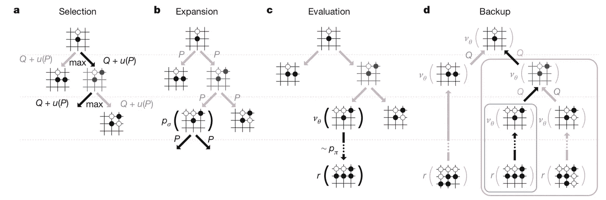
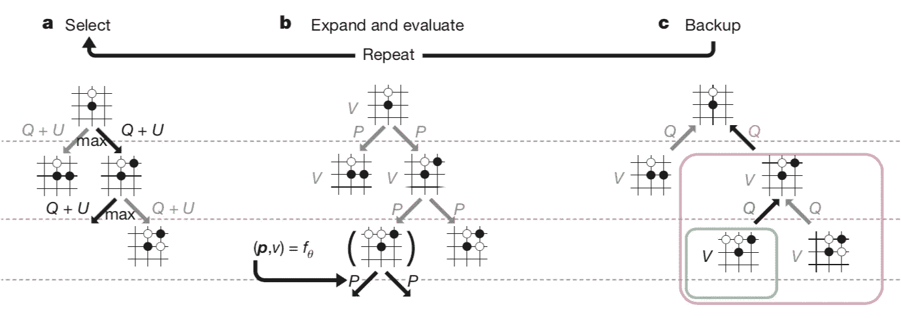

# 让 AlphaGo Zero 成功的 3 个诀窍

> 原文：<https://medium.com/hackernoon/the-3-tricks-that-made-alphago-zero-work-f3d47b6686ef>

2017 年，[深度学习](https://hackernoon.com/tagged/deep-learning)和人工智能取得了许多进展[，但很少有人像 DeepMind 的](http://www.wildml.com/2017/12/ai-and-deep-learning-in-2017-a-year-in-review/) [AlphaGo Zero](https://deepmind.com/blog/alphago-zero-learning-scratch/) 一样引起如此多的关注和兴趣。这个程序确实是一个令人震惊的突破:它不仅以 100 比 0 击败了 AlphaGo 的早期版本——该程序仅在一年半前击败了 17 次世界冠军 Lee Sedol，而且它在没有任何真实人类游戏数据的情况下进行了训练。Xavier Amatrain 在《机器学习中称之为[“比过去 5 年中的任何事情都更加【重要】”。](https://www.quora.com/What-is-the-significance-of-AlphaGo-Zero-in-AI-research/answer/Xavier-Amatriain)

那么 DeepMind 是怎么做到的呢？在这篇文章中，我将尝试给出 AlphaGo Zero 使用的技术的直观想法，是什么使它们工作，以及对未来人工智能研究的影响。先说 AlphaGo 和 AlphaGo Zero 下围棋的一般方法。

# DeepMind 的一般方法

AlphaGo 和 AlphaGo Zero 都评估了围棋棋盘，并结合使用了两种方法来选择走法:

1.  执行" **前瞻**"搜索:通过模拟游戏来前瞻几个走法，从而看到当前的哪一个走法最有可能导致将来的“好”位置。
2.  根据“直觉”**评估头寸，判断头寸是“好”还是“坏”——也就是说，可能会导致盈利或亏损。**

**AlphaGo 和 AlphaGo Zero 都是通过巧妙地结合这两种方法来工作的。让我们依次看看每一项:**

## **go-play 方法#1:“前瞻”**

**围棋是一个足够复杂的游戏，计算机不能简单地使用蛮力方法搜索所有可能的走法来找到最佳走法(事实上，[它们甚至不能接近](https://en.wikipedia.org/wiki/Go_and_mathematics))。**

****

**The tree of possible positions in Go. [Source](https://www.quora.com/What-does-it-mean-that-AlphaGo-relied-on-Monte-Carlo-tree-search/answer/Kostis-Gourgoulias)**

**AlphaGo 之前最好的围棋程序通过使用“[蒙特卡罗树搜索](https://en.wikipedia.org/wiki/Monte_Carlo_tree_search)或 MCTS 克服了这个问题。在高层次上，这种方法包括最初探索棋盘上许多可能的棋步，然后随着时间的推移专注于这种探索，因为某些棋步被发现比其他棋步更有可能导致胜利。**

**AlphaGo 和 AlphaGo Zero 都使用相对简单的 MCTS 版本进行“前瞻”，只是使用了在[蒙特卡罗树搜索维基百科页面](https://en.wikipedia.org/wiki/Monte_Carlo_tree_search)中列出的许多最佳实践，以正确管理探索新的移动序列或更深入地探索已经探索过的序列之间的权衡(有关更多信息，请参见发表在自然杂志上的 AlphaGo 原始论文[中“方法”下的“搜索”部分)。](https://storage.googleapis.com/deepmind-media/alphago/AlphaGoNaturePaper.pdf)**

**尽管在 AlphaGo 之前，MCTS 一直是所有成功围棋程序的核心，但 DeepMind 将这种技术与基于神经网络的“直觉”巧妙结合，使其超越了人类的表现。**

## **围棋打法 *#2:“直觉”***

**DeepMind 与 AlphaGo 的重大创新是使用深度神经网络来理解游戏的状态，然后使用这种理解来智能地指导 MCTS 的搜索。更具体地说:他们训练网络来观察**

1.  **当前的董事会职位**
2.  **哪个玩家在玩，**
3.  **最近移动的顺序(排除某些非法移动的必要条件)**

**给定这些信息，神经网络可以推荐:**

1.  **应该下哪一步棋**
2.  **当前玩家是否有可能赢。**

**DeepMind 是如何训练神经网络做到这一点的？在这里，AlphaGo 和 AlphaGo Zero 使用了非常不同的方法；我们先从 AlphaGo 的开始:**

## ****AlphaGo 的“直觉”:政策网和价值网****

**AlphaGo 有两个单独训练的神经网络。**

****

**The two neural networks at the core of AlphaGo. [Source](https://storage.googleapis.com/deepmind-media/alphago/AlphaGoNaturePaper.pdf)**

1.  **第一个神经网络(随机初始化)被训练为模拟人类专家的游戏，向其展示来自大型真实游戏数据库的 3000 万个动作。解决这个问题是一个困难但简单明了的模式识别问题，深度神经网络在这方面更胜一筹。事实上，一旦经过训练，这个网络确实学会了推荐类似于它观察人类专家在游戏中玩的那些动作。**
2.  **DeepMind 不仅希望 AlphaGo 模仿人类棋手:他们还希望它赢。为了学会玩更有可能导致胜利而不是失败的游戏，网络——被训练得像人类专家一样玩——与自己玩游戏。然后从这些“自我游戏”中随机抽取动作样本；如果一个给定的移动发生在一场游戏中，当前玩家最终获胜，网络被训练成更有可能在未来进行类似的移动，反之亦然。**

**DeepMind 然后以一种非常聪明的方式将这两个神经网络与 MCTS 结合起来——即程序的“直觉”与其强力“前瞻”搜索相结合:它使用经过训练的网络来*预测移动*到*引导博弈树的哪个分支*进行搜索，并使用经过训练的网络来*预测某个位置是否“获胜”*到*评估*它在搜索过程中遇到的位置。这使得 AlphaGo 能够智能地搜索即将到来的移动，并最终击败 Lee Sedol。**

****

**Monte Carlo Tree Search in AlphaGo, guided by neural networks. [Source](https://storage.googleapis.com/deepmind-media/alphago/AlphaGoNaturePaper.pdf)**

**然而，AlphaGo Zero 将这一点提升到了一个全新的水平。**

# **让 AlphaGo Zero 成功的三招**

**在高层次上，AlphaGo Zero 的工作方式与 AlphaGo 相同:具体来说，它通过使用基于 MCTS 的前瞻搜索来玩围棋，并由神经网络智能指导。**

**然而，AlphaGo Zero 的神经网络——它的“直觉”——与 AlphaGo 的训练完全不同:**

## **技巧 1:如何训练你的 AlphaGo Zero，第 1 部分**

**假设你有一个试图“理解”围棋的神经网络:也就是说，对于每一个棋盘位置，它都使用一个深度神经网络来生成对最佳走法的评估。DeepMind 意识到的是，无论这个神经网络有多智能——无论它是完全无知还是围棋高手— *它的评估总是可以由 MCTS* 做得更好。**

**从根本上说，MCTS 执行的是一种前瞻搜索，如果给它足够的时间，我们可以想象一个人类大师会执行这种搜索:它智能地猜测哪些变化——未来移动的序列——最有希望，模拟这些变化，评估它们*实际上*有多好，并相应地更新其对当前*最佳移动的评估。***

**下面是一个例子。假设我们有一个神经网络，它正在读取棋盘，并确定给定的移动会导致游戏变得公平，评估值为 0.0。然后，网络智能地预测一些移动，并找到可以从当前位置强制的移动序列，最终导致 0.5 的评估。然后，它可以更新其对*当前*板位置的评估，以反映它会导致更有利的位置。**

****

**How MCTS can always continually improve programs’ evaluations.**

**因此，这种前瞻搜索总是能够给我们提供关于神经网络正在评估的*当前*位置中的各种移动有多好的改进数据。无论我们的神经网络是处于业余水平还是专家水平，这都是真实的:我们可以通过向前看，看看它当前的哪些选项实际上会导致更好的位置，来*总是*为它生成改进的评估。**

## **技巧 1(续):如何训练你的 AlphaGo Zero，第 2 部分**

**此外，就像在 AlphaGo 中一样，我们也希望我们的神经网络能够学习哪些步骤可能会导致胜利。因此，也像以前一样，我们的代理人——利用其 MCTS 改进的评估和其神经网络的当前状态——可以与自己玩游戏，赢一些输一些。**

****

**Self-play in AlphaGo Zero. Diagram courtesy of [DeepMind](https://deepmind.com).**

**这些数据完全通过前瞻和自玩生成，是 DeepMind 用来训练 AlphaGo Zero 的。更具体地说:**

1.  **神经网络被训练来玩反映执行“前瞻”搜索的改进评估的动作。**
2.  **对神经网络进行了调整，以便它更有可能在自我游戏中采取类似于导致胜利的行动，而不太可能采取类似于导致失败的行动。**

**很大程度上是因为没有人与人之间的游戏被用来训练 AlphaGo Zero，而这第一个“技巧”就是为什么:对于围棋智能体的给定状态，通过执行基于 MCTS 的前瞻，并使用前瞻的结果来改进智能体，它总是可以变得更聪明。这就是 AlphaGo Zero 能够不断改进的原因，从它还是一个业余选手一直到它比最好的人类棋手都强。**

**第二个技巧是一个新颖的神经网络结构，我称之为“双头怪物”。**

## ****第二招:双头怪****

**AlphaGo Zero 的是它的神经网络架构，一种“双头”架构。它的前 20 层左右是现代神经网络结构中常见的层“块”。这些层之后是 ***两个“头”*** :一个头获取前 20 层的输出，并产生围棋智能体进行某些移动的概率，另一个头获取前 20 层的输出，并输出当前棋手获胜的概率。**

****

**AlphaGo Zero’s two headed neural network architecture. Diagram courtesy of [DeepMind](https://deepmind.com).**

**这很不寻常。在[几乎所有的应用中，](https://towardsdatascience.com/the-5-deep-learning-breakthroughs-you-should-know-about-df27674ccdf2)神经网络输出一个单一的、固定的输出——比如一幅图像包含一只狗的概率，或者一个包含一幅图像包含 10 种对象之一的概率的向量。如果一个网接收到两组信号:一组是它对棋盘的评价有多好，另一组是它选择的特定走法有多好，它怎么能知道呢？**

**答案很简单:记住神经网络从根本上来说只是数学函数，有一堆参数决定了它们所做的预测；我们通过反复向他们展示“正确答案”并让他们更新参数来“教”他们，这样他们产生的答案就更接近这些正确答案。**

**因此，当我们使用双头神经网络使用头#1 进行预测时，我们只需更新导致进行该预测的参数，即“主体”和“头#1”中的参数。类似地，当我们使用 Head #2 进行预测时，我们更新“Body”和“Head #2”中的参数。**

********

**Training the two headed neural network, one head at a time.**

**这就是 DeepMind 如何训练它的*单“双头”神经网络*的，它用来在搜索过程中指导 MCTS，就像 AlphaGo 使用两个独立的神经网络一样。这一招占了 AlphaGo Zero 比 AlphaGo 提升的对局实力的一半。**

**(这个技巧在技术上被称为具有硬参数共享的多任务学习。 [Sebastian Ruder 在这里有一个很好的概述](http://ruder.io/multi-task/index.html#introduction)。**

**游戏强度增加的另一半仅仅来自于使神经网络架构与该领域的最新进展保持同步:**

## ****绝招三:“残”网****

**AlphaGo Zero 使用了比 AlphaGo 更“前沿”的神经网络架构。具体来说，他们使用了一种“残差”神经网络架构，而不是纯粹的“卷积”架构。剩余网络是微软研究院在 2015 年末首创的[，大约在 AlphaGo 第一版工作结束的时候，所以 DeepMind 没有在最初的 AlphaGo 程序中使用它们是可以理解的。](https://arxiv.org/pdf/1512.03385.pdf)**

****

**Diagram comparing residual to convolutional architectures, from the original “ResNet” paper. [Source](https://arxiv.org/pdf/1512.03385.pdf)**

**有趣的是，如下图所示，这两种与神经网络相关的技巧中的每一种——从卷积架构切换到残差架构，以及使用“双头怪物”神经网络架构而不是单独的神经网络——都会导致游戏强度增加约一半，这是两者结合时实现的。**

****

**Improvmenet of AlphaGo Zero — which used a “Dual-Residual” neural network architecture — over AlphaGo, which used a “Separate-Convolutional” architecture. Chart courtesy of [DeepMind](https://deepmind.com).**

## ****招数总结****

**这三个技巧使 AlphaGo Zero 实现了令人难以置信的性能，甚至让 AlphaGo 都望尘莫及:**

1.  **使用蒙特卡罗树搜索提供的评估——“智能前瞻”——来不断改进神经网络对棋盘位置的评估，而不是使用人类游戏。**
2.  **使用一个神经网络——同时学习两个动作的“双头怪物”“智能前瞻”将推荐*和*哪些动作可能导致胜利——而不是两个独立的神经网络。**
3.  **使用更先进的神经网络架构——“残差”架构，而不是“卷积”架构。**

## ****一条评论****

**值得注意的是，AlphaGo 没有使用任何经典甚至是“前沿”的强化学习概念——没有深度 Q 学习、异步行动者-批评家代理或任何其他我们通常与强化学习联系在一起的东西。它只是使用模拟来为其神经网络生成训练数据，然后在监督下进行学习。 [Denny Britz](https://twitter.com/dennybritz) 在 AlphaGo Zero 论文发布后不久的这条推文中很好地总结了这个想法:**

**Follow Denny [here](https://twitter.com/dennybritz).**

## ****数字:训练 AlphaGo 零分，循序渐进****

**以下是 AlphaGo Zero 如何训练的“一步一步”时间表:**

1.  **初始化神经网络。**
2.  **玩自我游戏，每一步使用**1600**MCTS 模拟(耗时约 0.4 秒)。**

****

**One MCTS iteration in AlphaGo Zero. Diagram courtesy of [DeepMind](https://deepmind.com).**

**3.随着这些自玩游戏的进行，从最近的 **500，000** 游戏中取样 **2，048** *位置*，以及游戏是赢还是输。对于每一步棋，记录 A)MCTS 对这些位置的评估结果——这些位置的各种棋步基于前瞻的“好”程度——以及 B)当前玩家是赢了还是输了这场游戏。**

**4.使用 A)由 MCTS 前瞻搜索产生的移动评估和 B)当前玩家是赢还是输来训练神经网络。**

**5.最后，每重复 1000 次步骤 3-4，对照以前的最佳版本评估当前的神经网络；如果它赢得了至少 55%的游戏，开始使用 *it* 来生成自己玩的游戏，而不是以前的版本。**

**重复步骤 3-4**700，000** 次，同时继续玩自我游戏——三天后，您将拥有自己的 AlphaGo Zero！**

# ****对 AI 其余部分的影响****

**DeepMind 令人难以置信的成就对人工智能研究的未来有许多影响。以下是几个关键的例子:**

**首先，从模拟中生成的自我游戏数据“足够好”，能够训练网络，这一事实表明**模拟的自我游戏数据*可以*训练代理在极其复杂的任务中超越人类的表现，甚至完全从零开始**——从人类专家那里生成的数据可能并不需要。**

**第二，**“双头怪物”技巧似乎极大地帮助代理学习在许多领域执行几个相关的任务**，因为它似乎可以防止代理将其行为过度适应于任何单独的任务。DeepMind 似乎真的很喜欢这个把戏，并使用它和它的更高级版本来构建代理，这些代理可以在[几个](https://arxiv.org/pdf/1707.04175.pdf) [不同的](https://arxiv.org/pdf/1701.08734.pdf) [域](https://arxiv.org/pdf/1708.07860.pdf)中学习多项任务。**

****

**DeepMind’s AI learning to solve mazes, using the “Distral” framework for multitask reinforcement learning. [Source](https://deepmind.com/research/publications/distral-robust-multitask-reinforcement-learning/)**

**机器人领域的许多项目，特别是新兴的使用模拟来教机器人代理使用他们的肢体来完成任务的领域，正在使用这两个技巧取得巨大的效果。 [Pieter Abbeel 最近的 NIPS 主题演讲](https://www.youtube.com/watch?v=TyOooJC_bLY)强调了许多令人印象深刻的新成果，这些成果使用了这些技巧*以及*许多前沿强化学习技术。事实上，运动似乎是“双头怪物”技巧的一个完美用例:例如，机器人代理可以同时被训练使用球棒击球和击打移动目标，因为这两项任务需要学习一些共同的技能(例如，平衡、躯干旋转)。**

****

**The tricks DeepMind used to train AlphaGo Zero have already been applied to locomotion. [Source](https://www.youtube.com/watch?v=hx_bgoTF7bs)**

**DeepMind 的 AlphaGo Zero 是 2017 年人工智能和深度学习领域最有趣的进步之一。我迫不及待地想看看 2018 年带来了什么！**