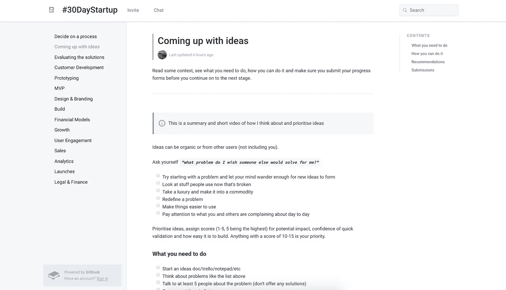

# #30DayStartup 挑战——学会在 30 天内建立并启动一家初创公司

> 原文：<https://medium.com/hackernoon/the-30daystartup-challenge-learn-to-build-and-launch-a-startup-in-30-days-ca8e4ca9dfb6>

> 我将教你如何在 30 天内建立并[启动](https://hackernoon.com/tagged/launch)一家[初创公司](https://hackernoon.com/tagged/startup)，免费且**无代码。已经有超过 3，000 人报名参加这项挑战。**

> 或者直接登陆网站:[**https://www.newco.app/30daystartup**](https://www.newco.app/30daystartup)

## 以下是几个很好的理由:

如今，障碍低得可笑，工具强大，到处都有想法和灵感，你应该停止用借口不去建造一些东西。

## 它是如何工作的

1.  注册登记
2.  加入聊天
3.  浏览内容并提交您的进度

## 内容访问

通过各种截屏、文本和视频，我们将向您发送建议，帮助您建立和完成创业的某些阶段。

## 每天都在建造

在 30 天里，试着用至少 30 分钟的时间为你的创业做点贡献。小功能或更大的组件，每一点都有帮助！

## 保持负责

用#30daystartup 标签发推文，用我们的内部跟踪器记录你每天的进展。和同路的人联系，互相鼓励，不断建设。

# 课程

您将获得截屏、博客帖子、文章、工具和视频，帮助您导航您的旅程。

*   如何提出想法并对想法进行优先排序
*   与用户交谈并进行有效的客户开发
*   原型设计和构建 MVP
*   设计和你的品牌，从调色板到制作一个标志。
*   创造销售并实施初步营销工作
*   启动你的创业

# 来加入我们吧，我们很乐意邀请你🤗

 [## #30daystartup - Twitter 搜索

### 7 月 30 日@mubashariqbal 在推特上写道:“#30DayStartup:学习构建和启动。”-阅读别人在说什么，并加入…

twitter.com](https://twitter.com/search?f=tweets&vertical=default&q=%2330daystartup&src=typd)