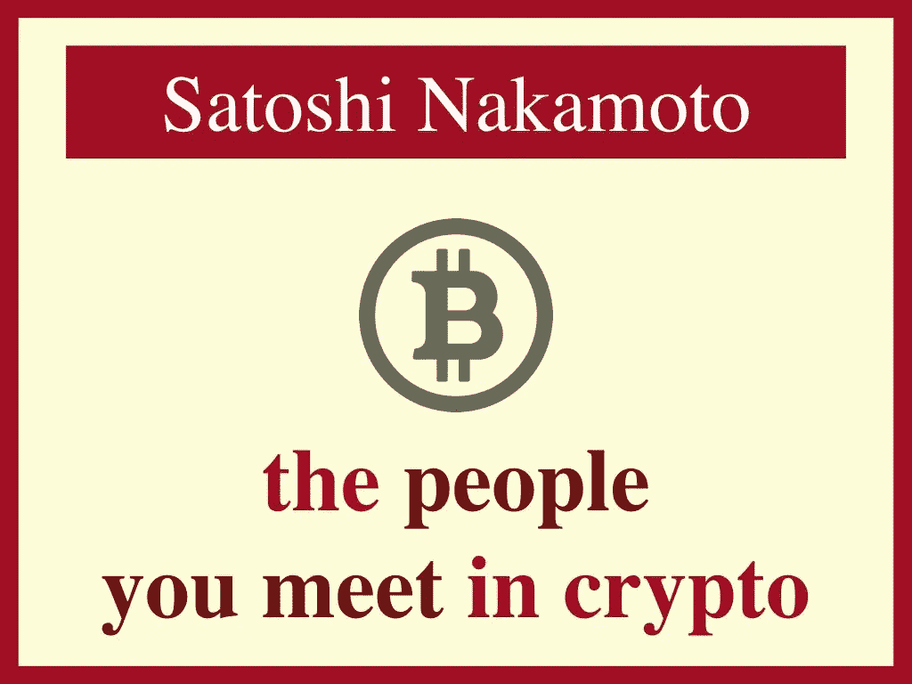
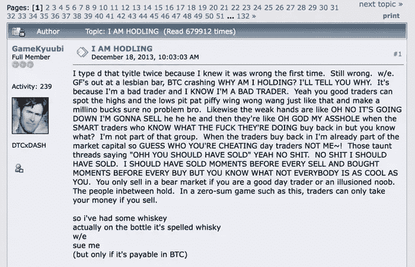
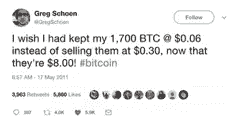
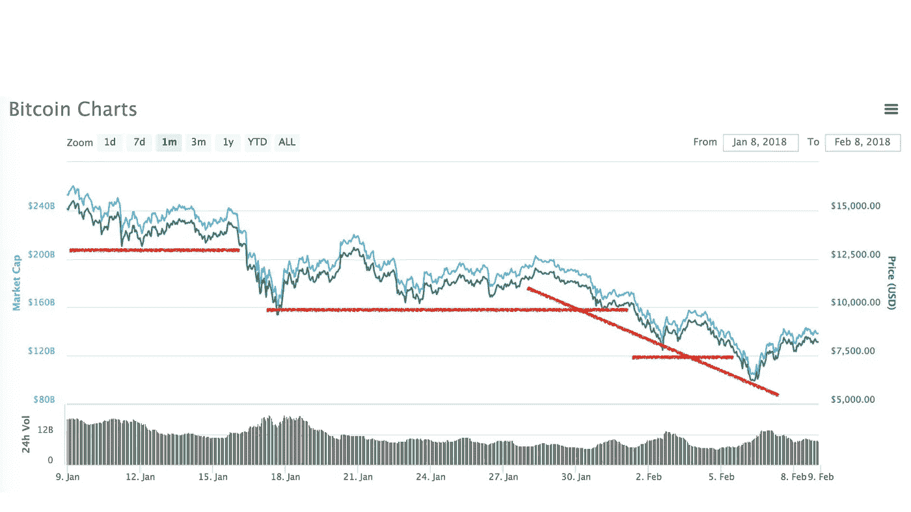
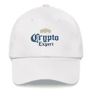
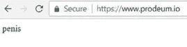
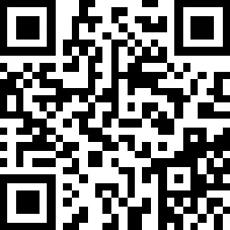

# 你在 Crypto 遇到的 31 个人

> 原文：<https://medium.com/hackernoon/the-31-people-you-meet-in-crypto-98a867c7901f>

Crypto will solve everything in heaven too

我是一名密码老手。2011 年听说过[比特币](https://hackernoon.com/tagged/bitcoin)。2013 年，我参加了第一次比特币见面会。我的第二个是昨天。我在一月份买了我的第一个密码。

然而，从 2017 年底开始，我在美国、加拿大、中国、韩国、法国等地遇到了一些丰富多彩的密码角色。享受，用一粒[盐](https://coinmarketcap.com/currencies/salt/)。

# **买家类型**

## **1。信徒**

难得的不入猜测的人物。这种人最有可能在涨跌时早早买入，并保持冷静多年。这个讨厌银行的菩萨可能是一个百万富翁，除非所有的东西都在一次秘密抢劫中消失了，或者慢慢地花在了比萨饼上。
*语录:“我在 2013 年买了我的第一辆 BTC。我试图用它来喝啤酒，但失败了。”*

[*GameKyuubi*](https://bitcointalk.org/index.php?topic=375643.0) *was the first true HODLer*

## **2。霍德勒**

因为现在的价格低于他们的购买价格。主要是关于去年感恩节后的新来者。
*引用:“HODL！”*

## **3。意外的百万富翁**

出于好奇购买了 crypto，然后多年来忘记了它，但没有丢失他们的私钥。
*语录:“我不希望人们为此而认识我。或者成为众矢之的。”*

*Don’t we all?*

## 4.早期卖家

通过挖掘或持有赚了一些钱，但应该坚持下去。引用:“我现在会有 1000 万美元。”

## **5。另类赌徒**

自 ICO 以来，他们经常押注于较小的货币，希望突然出现繁荣，并准备持有多年。
*语录:“10 次 10%的几率 1000 倍”*

*Recommended headgear*

## **6。加密救世主**

钱不是问题。都是关于改变世界，经济民主，平等，普吉岛的派对。
*引用:“波多黎各见！”*

# **业务类型**

## **7。经销商**

向密码迷出售镐和铲。采矿钻机、冷藏、期货合约的加密交易(披露:SOSV 是 Bitmex 的唯一投资者)。正如他们所说的，“不要靠自己的供给而兴奋”。
*引用:“我把一切都保存在菲亚特”。*

## **8。矿业巨头**

中国出局了。现在都是加拿大，瑞典，冰岛(也许还有俄罗斯？)，以及 ASICS 或 GPU，视情况而定。
*引用:“每兆瓦多少钱？”*

## **9。经纪人**

知道一些惊人的早期创业和前 ICO 交易。你错过了第一次 3 倍的估值增长，但 ICO 即将到来，这是 10 倍的最小值，如果你坚持下去，甚至更多！这一轮主要是内部人士，但他们可以推动你进来。别忘了这个一次性财团的 20%佣金。
*引用:“都是麻省理工的博士。”*

# **金融类型**

## **10。金融老手**

了解资本形成的模式和游戏，以及资金如何流动。引用:“市场不是那样运作的。”

## **11。谨慎的投资者**

前段时间买了 crypto。时不时卖一些。
*引用:“我拿了点利润。”*

## **12。技术交易员**

支撑、阻力线、成交量、波动……技术交易者已经搞清楚了。引用:“我最好的交易是做空 Ripple。我最糟糕的是昨天。”

*Extra points when lines cross*

## 13。套利者

正在研究跨平台和国家的差异，以找到一个简单的阿尔法。但是如果这么简单，每个人都会这么做。引述:“如果你用除了韩元以外的任何一种货币付款，我会以低于市场价的价格卖给你韩国货。”

## 14。ICO 投资者

会打折购买最有说服力项目的 pre-ICO 代币，推广，尽快卖出最多。引用:“代币比股票更具流动性。”

# **营销人员类型**

*The right swag for the trade*

## 15。密码专家

免费拥有成功秘诀。阅读博客，得到这本书，参加网上研讨会，你会知道下一个 ICO 击中回。引用:“像我在华尔街和作为一个企业家那样赚 7 位数的钱，但是更快而且不用工作！”

## 16。ICO 旋转艺术家

目前正在进行区块链的一个项目。白皮书一准备好，它就开始行动；一旦白皮书中有一些令人信服的数学知识，它就会准备好；一旦有人被雇来做算术，它就会被做好。
*引用:“ICO 将在 6 周内上线”*

*Prodeum was a pioneer*

## **17。ICO CEO**

数分钟内数百万人涌入。建立还是走开？
*语录:“我们在招人”或“阴茎”*

## **18。福克尔(福克尔？福克斯特？)**

找到了改进其他加密技术的方法，使它更快，更便宜，更安全，或者消耗更少的能量。它现在唯一需要的是数百万人使用它。
*语录:“报名空投！”*

## **19。加密顾问**

脸书的广告已经过时了，但是还有其他的方法。预 ICO 与加密鲸，高知名度的顾问，战略投资者…你会被覆盖。1 位数的佣金百分比、5 位数的象征性前期费用和 6 位数的律师费用与你将筹集的 9 位数相比微不足道！你的车门最终会正确打开。
*引用:“我们很快就会有一个正式的架构。”*

## **20。半官方认证机构**

它看起来像联邦通信委员会，但没有制衡。带有官方名称的邮票将节省加密投资者阅读 Lite 寻呼机的时间。
*引用:“我们的非营利组织认证密码组织。”*

# **专家类型**

## **21。实际专家**

写软件，喜欢区块链，知道核心技术。对投机者和普遍的无知感到绝望。
*引用:“我在第一届密码黑客马拉松中获得了第二名。”*

## **22。(东欧？)密码天才**

俄罗斯、乌克兰、白俄罗斯、摩尔多瓦……或者第二代？不可能记得这个是从哪里来的。未来是一个硬分叉还是一个全新的系统？家里人不会说，限制电脑使用集中在高中。
*引用:“我还没赚到发行的权利。”*

## 23。举报人

知道一个泡沫，但不会成为它的一部分。
*引用:‘郁金香。’*

## 24。反举报者

知道一个非泡沫。引用:“在真正的泡沫中，人们抵押他们的房子来购买。”

## **二十五。经济学家**

学到了学校教不到的东西。可以将看起来像阴谋论或真实见解的想法联系起来。
*引用:“包括外部性在内，密码仍然比银行和印钞厂要好。”*

## 26.无私的教育家

花了 10，000 个小时教别人密码和郁金香球根，却没有得到一丁点儿好处。将被群众的慷慨解囊所证明。可能会在粗略的计划中失去一半，另一半是因为喝酒。引用:“我很谦卑。”

# **政治类型**

## **27。威权监管者**

像一个仁慈的父母，它不会允许其公民交易密码或做 ico，以保护他们免受自己。为了捍卫其支撑货币的稳定性，它将没完没了地指责加密启示录的三骑士。
*引用:“我们防止市场操纵、非法资金和投机。”*

## **28。秘密的无政府主义政权**

希望基于本地资源创建自己的令牌。或许有点像未来？但我不是搞金融的。
*引用:“加密就是自由！”*

## **29。全球金融组织**

没有被邀请参加聚会。决心扫大家的兴。它的新话名字给人庄严感；它的金融权力让它“帮助”的政府保持沉默。
*引自:“调控不可避免。”*

# **随机类型**

*Each girls’s mask sports their totem token*

## 三十岁。意料之外的日本事

日本生活在一个不同的现实中，有时与我们的现实相交叉。这里是 [Crypto Money Girls](https://qz.com/1177249/japans-kasotsuka-shojo-the-worlds-first-cryptopop-group-sings-about-bitcoin-and-cryptofraud/) 流行组合(？).
*引用:“# ETH”*

## 31.秘密喜剧演员

喜欢神秘的幽默？感谢信可寄至:

QR Code for BTC

BTC:**19 wxrpyzhm 1 gtbsrzaxvgve 7 feu 3 z 6 rn**

ETH:**0x61b 031 a 687 b 091 afca 1698615 a 75407 e 113 edd 8c**

*感谢 AH、AL、EL、ER、GG、GP、GV、ID、IL、JA、JT、LB、MF、NH、NM、SC、SG、SL、TC、WB 等人的励志对话。*

*感谢*[*TwoBitIdiot*](https://medium.com/u/dd6a8357807c?source=post_page-----98a867c7901f--------------------------------)*和他的* [*95 篇密码论文*](/@twobitidiot/95-crypto-theses-for-2018-ca7b74f8abcf) *证明长得离谱的清单也可以很有趣。感谢* [*tRoU dU cULz 的藏身之处*](http://www.azerty0.ironie.org/) *展示了用极客的方式取笑极客的东西是可以的。*

本·乔菲(@ [*本杰明·乔菲*](http://twitter.com/benjaminjoffe)*】/ben@hax.co)是一个新崛起的业余“密码专家”，他知道人，喜欢故事。他永远不会透露他拥有多少密码，也不会透露他为此付了多少钱。白天，他是* [*HAX*](http://www.hax.co) *的合伙人，早期硬件创业公司最活跃的投资人，全球首个基于程序的种子基金*[*SOSV*](http://www.sosv.com)*的一部分。Ben 也是一位偶尔的天使投资人，是《福布斯》* [*【福布斯】*](http://forbes.com/sites/benjaminjoffe/)*[*Techcrunch*](https://techcrunch.com/contributor/benjamin-joffe/)*和*[*VentureBeat*](https://venturebeat.com/author/benjamin-joffe-hax/)*关于硬件、亚洲和风险投资的客座作家，也是一位在 30 个国家进行 200 多次演讲的热门演讲者。**