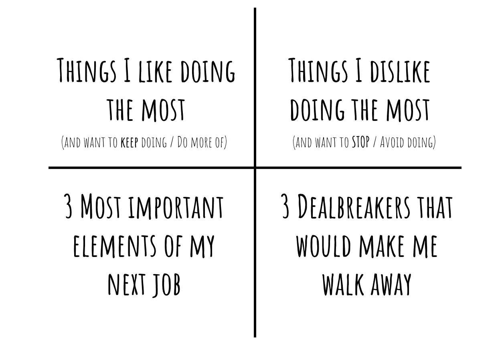
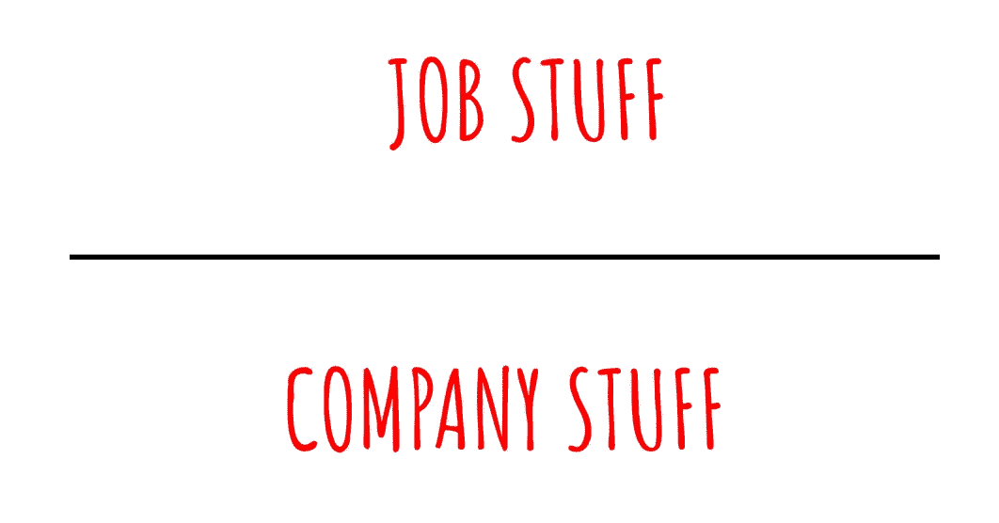
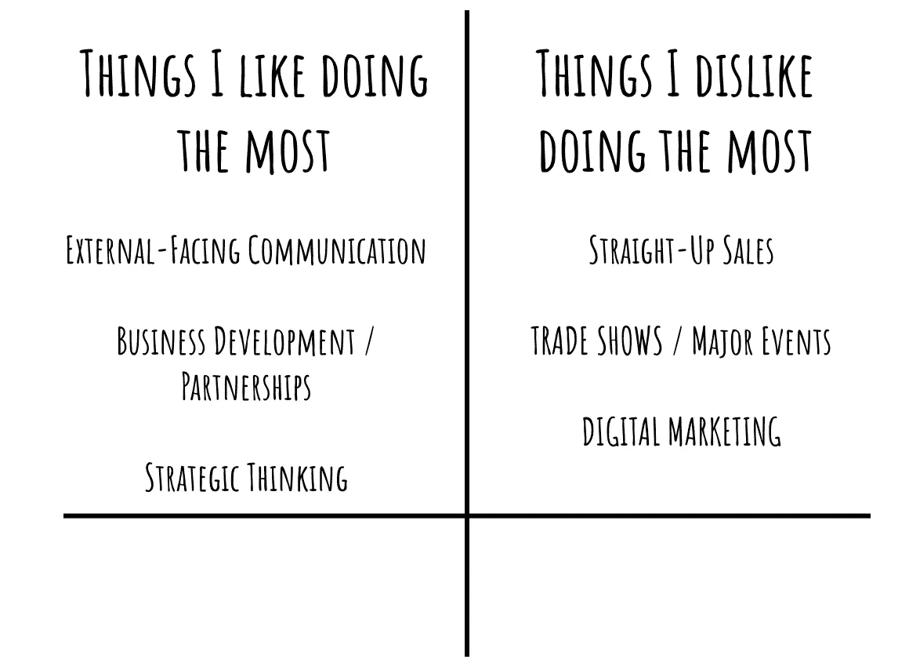
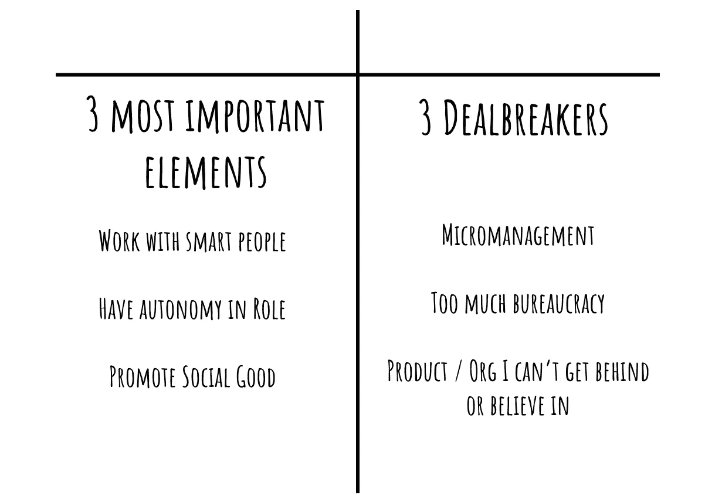

# 四格求职网格

> 原文：<https://medium.com/hackernoon/the-4-box-job-searching-grid-54827224130d>

所以你想要一份新的工作？太好了。捏着鼻子开始申请吧？

不，绝对不行。除非你在寻找恢复炼狱的最清晰的路径，以及最有可能在 18 个月后让自己重返工作岗位的选择[市场](https://hackernoon.com/tagged/market)。

找工作是一盘策略棋，如果你想赢，你必须相应地去下。这并不意味着只寻找那些愿意雇佣*你*的公司，而是深入内心，问自己*“我现在想要的是什么？”*也许更重要的是*“我不想要的是什么？”*

为了帮助我保持有条理，上次我进行个人求职时，我做了这个方便的表格来帮助我保持正轨:

## 如何使用网格

从两方面看网格。上面的两个框与你的实际工作描述和你作为一个人将要做的工作有关。

底部与公司本身有关——这是像文化、团队和你的经理以及他们会给你多少钱这样的软绵绵的东西。

在考虑一份工作时，重要的是将这些事情隔离开来，这样你就能更好地理解你想要什么以及为什么想要。

## 钻研工作资料

职称没有任何意义。让我们马上解决这个问题。因此，在你考虑在像 Indeed 或 LinkedIn 这样的网站上搜索工作时陷入关键词地狱之前，把你目前的工作分成几个组成部分是很重要的。你喜欢什么？你不喜欢什么？

从这两个问题开始你的表格:

*   我最喜欢做什么事情*(以及哪些事情需要继续做/做得更多)？*
*   哪些事情是我最不喜欢做的*(并且想停止/避免做的)？*

这是我在 2015 年看到的样子，那是我最后一次开始寻找我的下一件事:

这些都给了你一个线索，告诉你如何考虑下一次找工作。在我着手这项搜索的时候，我的头衔是*“客户幸福营销经理”在那之前，我曾在销售、营销、内容创作和咨询部门工作。我与销售、营销和产品团队一起工作。对我来说，这意味着我的可能性很大。*

在列出这个清单后，我知道我想远离某些事情(如数字营销或直接的销售/客户管理工作)，更多地关注其他事情(严重倾斜于外部关系和伙伴关系)。

我看过的工作(我看过很多工作)包括这样的头衔:

*   业务拓展经理
*   产品营销经理
*   战略家
*   伙伴关系经理
*   程序管理器
*   对外事务
*   通信专家
*   地区开发
*   雇佣经理

我指出这一点只是为了说明职称没有任何意义。每个组织对你想做的事情都有不同的名称。

除非你真的在看你想做的工作，否则你很可能找不到符合你的技能和需求的工作。

## 揭开公司的神秘面纱

一旦你弄清楚你喜欢和不喜欢你目前的工作(以及你在寻找什么样的角色)，你就可以开始考虑可能会让你从事这种工作的公司。

这通常是网格中更难完成的一半。你需要对自己诚实，知道自己想要什么。

以下是在一种文化、一家公司或一份工作中可能对你很重要的一些事情:

*   聪明的团队
*   好经理
*   高薪
*   远程/灵活的时间表
*   晋升的机会
*   工作场所的朋友
*   离家近(短途通勤)
*   管理潜力
*   大品牌
*   企业正在经历重要的成长阶段
*   已经找到产品/市场契合度
*   仍在寻找产品/市场契合度
*   筹集了一大笔风投资金

很难将范围缩小到只有三件事。但是这样做真的很重要。事实上，当我审视构成我 2015 年求职过程的所有要素时，这个框是我最难填写的。我开始有点沮丧，因为我不能在一个地方找到我的三个优先事项。但是，把它们都清楚地表达出来，让我在出现的时候更容易认识到正确的事情。

然而，同样重要的是你的交易破坏者。这些可能是你在以前的工作中经历过的事情，你想再次避免——或者它们可能只是你知道你不会成功的工作环境的元素。但是在你进入面试程序之前，阐明这些阻碍交易的因素是非常重要的。因为这些交易破坏者将帮助你弄清楚在*中该问什么问题，“你有什么问题要问我们？”*求职面试的一部分。是时候对你的理想工作进行测试了，看看它是否能通过。

还有无数其他的事情可能会让你感兴趣(或者对一家公司不感兴趣)，诚实地告诉自己你为什么想要这些，以及你将如何在面试过程中标记它们是很重要的。

作为参考，2015 年我的清单大概是这样的:

顺便说一下，就像职称没有标准化一样，公司也没有。早在 2015 年，我就在关注从企业技术和初创公司到政治活动、咨询机构，甚至风险投资的一切。

## 将这一切结合在一起

对你来说，完成这个练习可能并不有趣。但是想想看，拥有一份你真正喜欢的工作会有多有趣*。前期的努力是值得的。*

在 2015 年经历了这个思考过程后，我列出了一个名单，上面列出了一些可能会给我指明一个或多个领域正确方向的人。我的目标是那些我觉得与我在工作场所的优势有相似特征或品质的人。

我把这份名单命名为“我认识的聪明人”我有大约 20 个人在上面。然后我开始一个接一个地给他们发邮件，邀请他们喝咖啡。

需要澄清的是，我的名单是*而不是*标题为“我认识的聪明人(目前正在招聘)。”事实上，他们中的许多人根本没有能力雇用任何人。但是在我开始具体的工作之前，我想弄清楚什么样的公司、行业或一般角色可能对我最有意义。

接下来的一段时间是一个从清单上划掉事情的折磨人的过程。这其实是整个过程中最不好玩的部分。但是你必须记住，对某件事说“不”和对另一件事说“是”一样重要。

也许你不会花我那么长的时间，但可以说，这花了我很长时间。在 2015 年秋天的某个时候，我意识到我已经划掉了清单上的所有人，只剩下一件事。我对已经把其他所有可行的选择都划掉感到相当绝望，对把所有鸡蛋放在一个篮子里感到有点疯狂……但是猜猜我最后在哪里工作了？

无论你是刚刚开始还是正在找工作，也许这种网格方法会帮助你，就像我帮助我找到一份我真正喜欢的工作一样。我很想听听进展如何。