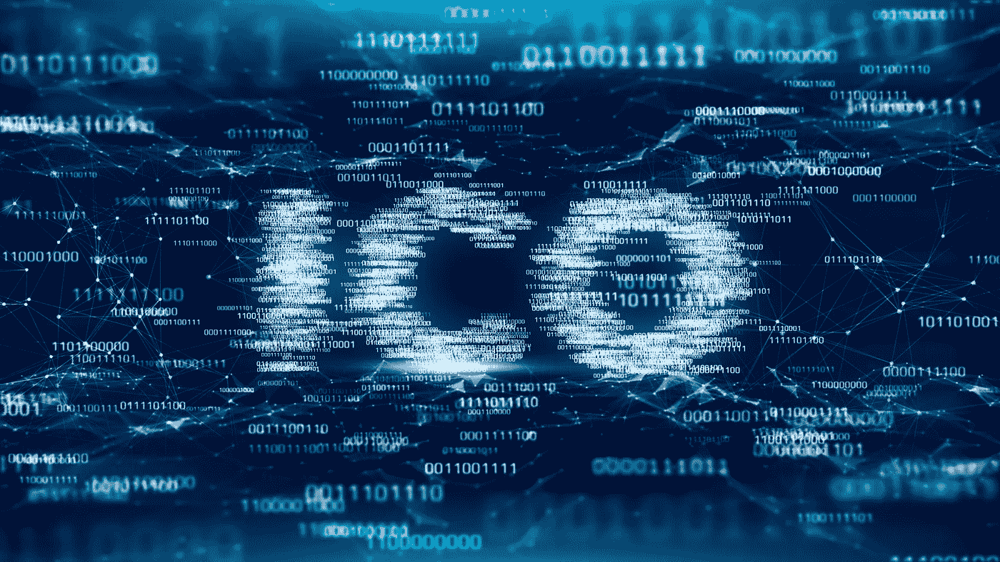

# 修复未注册的 ICO 需要采取的 4 个步骤

> 原文：<https://medium.com/hackernoon/the-4-steps-you-need-to-take-to-fix-an-unregistered-ico-3ea4f9d18f00>

上个月，美国证券交易委员会发布了关于证券发行、投资工具、交易所和经纪自营商规则以及它们如何适用于密码行业的指南。

尽管很多内容让与密码相关的企业难以消化，但[它提供的监管确定性](https://cryptolawinsider.com/regulatory-certainty/)是必需的。

SEC 发布后，我收到了几个来自 2017 年进行 ICO 的项目的询问。他们都有同样的问题:

*“如果我通过未注册的 ICO 募集资金违反了美国证券法，我该如何解决这个问题？”*

幸运的是，SEC 解决了这一点。它对两家未注册的 ico(air fox 和 Paragon)采取的行动为其他 ico 提供了一个遵循合规性的路线图:

“这两件事表明，即使发行人进行了非法未注册的数字资产证券发行，也有一条符合联邦证券法的道路。”

所以，如果你已经通过一个未注册的 ICO 筹集了资金，并想避免坐牢，请继续阅读，了解你需要采取的 4 个步骤。

# 1.支付罚金

犯罪，交罚款。

没有什么比美国司法系统对违法者实施经济处罚的愿望更能说明问题了。美国证券交易委员会也不例外。如果你完成了一个非法的 ICO，准备好支付后果。

在 AirFox 和 Paragon 两起案件中，美国证券交易委员会分别处以 25 万美元的罚款。尽管美国证券交易委员会在确定罚款金额时有很大的自由裁量权，但似乎可以肯定的是，如果你自愿遵循美国证券交易委员会规定的道路，你将面临类似的罚款。

鉴于这里可能出现的结果，25 万美元的罚款表明，SEC 希望发出信号，表明非法行为会产生严重后果，但不想让这些后果严重到没有人会自愿同意追究。

# 2.在证券交易委员会注册

所有招揽美国投资者的证券发行要么必须在美国证券交易委员会注册，要么必须符合豁免条件。注册声明为投资者提供了他们需要的信息，以了解所提供的证券、发行人的业务以及与投资相关的风险。

因此，美国证券交易委员会要求 AirFox 和 Paragon 向美国证券交易委员会追溯注册其证券产品。不幸的是，这是一项极其昂贵和繁重的任务。具有讽刺意味的是，如果你推出了一个 ICO，这可能就是你当初选择不在 SEC 注册的原因。

通过要求 AirFox 和 Paragon 登记其证券，SEC 表明传统证券发行的规则同样适用于 crypto。正如美国证券交易委员会执法部门联席主管斯蒂芬妮·阿瓦基安(Stephanie Avakian)解释的那样:

“我们已经明确表示，通过 ico 发行证券的公司必须遵守现有的证券注册法规和规则。”

因此，如果你已经通过未注册的 ICO 筹集了资金，请准备好聘请昂贵的美国证券律师和会计师来帮助向 SEC 提交文件。根据所用的专业服务公司和提供服务的规模，预计为此支付 50 万美元或以上。

# 3.向证券交易委员会提交季度和年度报告

对公司来说，可悲的是(但对他们的律师和会计师来说，令人高兴的是)证券交易委员会的报告负担并没有随着证券发行的完成而结束。

相反，即使在注册之后，你也需要**向 SEC** 提交定期报告，其中包括最新的财务报表、业务描述以及投资者继续做出“明智的投资决策”所需的其他重要信息。

如果你想知道这需要什么样的信息，只需访问 SEC [EDGAR](https://www.sec.gov/edgar/searchedgar/companysearch.html) 数据库。

AirFox 和 Paragon 今后都需要遵守这一报告框架，如果您希望遵守，您也一样。

根据您使用的专业服务公司的不同，这些备案和审计的年度合规性可能会有很大差异。在一家大的、有声望的律师事务所[，比如我曾经在](https://www.lw.com/)工作过的那家，你可以期望支付一大笔钱。

# 4.给你的投资者解约权

正如我在太浩湖 [DCG 峰会](https://cryptolawinsider.com/digital-currency-group-summit-2018/)上报道的那样，SEC 认为“解约权”是在证券发行违规后向投资者提供的一项重要补救措施。

究竟什么是解除？

解约权是一种法律补救措施，允许参与未注册证券发行的投资者解除其购买的证券。从本质上讲，投资者可以返还代币，收回他们的原始投资。

如果你已经通过未注册的 ICO 筹集了资金，请注意，你必须**向你的投资者提供解约权**，并准备好**以原始发行价**回购他们的代币。

不幸的是，你可能会认为这在经济上是不可行的，因为你筹集的大部分资金已经花在工程上了。

你并不孤单。到目前为止，这最后一个要求将是大多数公司最难遵守的，并且可能导致大量与 ICO 相关的破产。

如果你的代币价格明显低于其发行价格，而你的公司没有现金回购代币，我建议你尽快寻求法律顾问。

# 这对密码法律内部人士意味着什么？

美国证券交易委员会已经表态，我们听取意见将是明智之举。

如果你违反美国证券法，通过 ICO 筹集资金，如果你想“解决”你的情况，SEC 给了你一条清晰的道路。

这条路可能是痛苦和不愉快的，但没有太多好的选择。SEC 不会停止追究通过未注册的 ICO 筹集资金的公司。

正如美国证券交易委员会执行部门联席主管 Stephanie Avakian 所说:

“这些案件告诉那些正在考虑采取类似行动的人，我们将继续关注数字资产方面违反联邦证券法的行为。”

SEC 的执法人员已经明确表示，Airfox 和 Paragon 只是第一批被列为目标的 ico。如果你完成了一个未注册的 ICO，你可能是下一个。我强烈建议你立即联系法律顾问。在你被 SEC 盯上之前，积极主动地采取行动是值得的。

正如我们所见，尽管 AirFox 和 Paragon 遭受了财务损失，但它们仍然存在，它们的高管也没有入狱。

我以前说过这一点，但它值得重复。美国执法部门的长臂很长。非常长。生活在[楚格](https://cryptolawinsider.com/zug-the-crypto-friendly-jurisdiction-where-you-can-pay-taxes-in-bitcoin/)不会保护你。内部人士应尽快采取行动。

*原载于 2018 年 12 月 13 日*[*cryptolawinsider.com*](https://cryptolawinsider.com/fix-an-unregistered-ico/)*。*