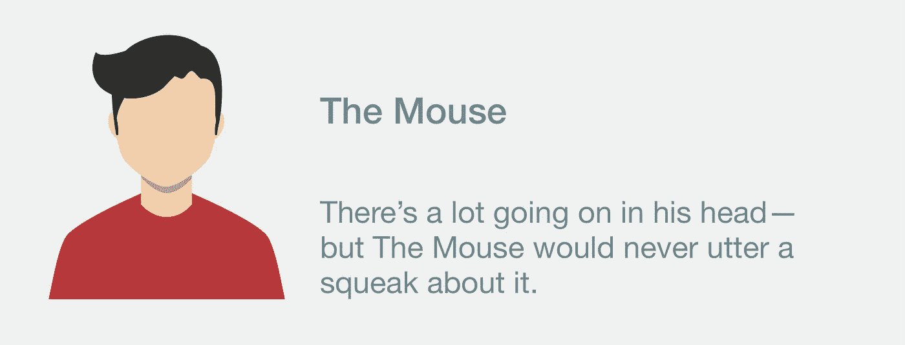

# 能完全＄% @ #你的创意会议的 5 个原型

> 原文：<https://medium.com/hackernoon/the-5-archetypes-that-can-completely-your-creative-session-911120155778>

为脸书或欧洲航天局组织一次研讨会与带领一群孩子徒步旅行穿越森林没什么不同。

我曾安全地带领高管们进行创造性的头脑风暴，带领孩子们穿越冰河国家。相信我，当你是团队领导时，技能是一样的。

每个小组都有自己独特的化学反应——即使只是为了一次冲刺或研讨会而短暂地聚在一起。**大多数团队成员最终会承担并扮演特定的、熟悉的角色**。当团队开始像头脑风暴或设计冲刺这样的活动时，这些定义的角色很容易陷入其中。

这里是问题出现的地方:**当参与者与团队互动的“典型”方式开始偏离**团队获取和提炼创意的能力。

当你在促成一个创造性的会议时，你就是荒野中的向导。你负责确保团队能够一起工作并实现他们的目标。作为主持人，你也要对团队成员之间的任何竞争、争斗、伤害感情或误解负责。

当我提供帮助时，我认为解决和检查这些行为是我的职责。即使犯罪者是巨大的/愤怒的/付钱让我主持会议的人。作为主持人，我作为局外人扮演着特殊的角色。我是向导，我来这里是为了帮助我们所有人在一起生存足够长的时间来做一些不可思议的事情。

满足 5 个原型，它们可以完全$%@#您的设计冲刺或头脑风暴。

# **支配者**

每个人都有自己的观点——但支配者认为她的观点比其他人的更重要。支配者通常先说话，而且时间最长。在头脑风暴活动中，支配者可能会不断将注意力吸引回他们的想法，或者对其他人的想法吹毛求疵。当团体必须选择一个发言人时，支配者自动要求这个角色。作为发言人，支配者可能会用自己的想法或个人观点来代替，而不是分享群体的共识。

## **你可能与支配者合作的迹象:**

*   想要谈论他们的想法，而不是吸引他人
*   自动将自己安装为群组发言人
*   用个人意见代替集体共识
*   可能会“游说”他们的解决方案，而不是寻求对团队最有利的方案

这些特征会出现在一系列不同类型的人身上。我经常在企业环境中遇到这些特征，在那里，职业成功源于负责和努力推动想法。我在建立了权力结构的团队中也看到了这一点——这种行为被“老板”容忍，因为解决这个问题可能意味着下属职业生涯的终结。

自信和主张是极好的品质——只要它们不会限制团队成功的能力。当参与者混合、融合和发展想法时，头脑风暴和创造性冲刺最成功。

## **解决支配者行为的技巧:**

*   **站着，不要坐着** —坐着讨论会让“大声说话的人”对其他人施加压力。当我进行任何形式的头脑风暴或创意会议时，我会让大家面对白板或墙壁站成半圆形。当人们并肩站在一起专注于工作时，这将使团队进入一个更加协作、解决问题的模式。
*   **更多地参与**——重申你作为辅导员的角色，将小组成员作为参与者。站在团队的最前面，召唤安静的团队成员——做手势，全神贯注于他们，带领团队的其他成员。
*   诉诸他们更好的本性——这些行为通常不是有意的。私下把这个人拉到一边，让他们帮我引出其他小组成员的专业知识/意见。如果他们需要结构，我会要求他们针对他们个人建议的每个方向，从其他团队成员那里寻求两种意见或“潜在的改进”。

# **怀疑论者**

是的，他会出现的——但是怀疑者想让你和团队中的其他人知道这都是胡说八道。怀疑论者可能会质疑你作为主持人的选择:时长、形式、参与者或采用的个人方法。经常被大声的叹息和拱起的眉毛打断，怀疑者会公开表示他们对这个过程缺乏信心。怀疑者可能会游说改变你的计划，或者提供替代方案。有时你会在走廊上发现怀疑者，试图说服其他参与者在这个过程中放弃信仰。

## **你可能与怀疑者共事的迹象:**

*   对方法提出疑问/表示怀疑
*   大声叹息或表现出轻蔑/不相信的肢体语言
*   悄悄向团队成员表达疑问
*   建议和游说替代方法

怀疑论者形形色色。有些人可能已经尝试过你过去正在做的事情并经历了失败。有些人持怀疑态度，因为他们个人采用不同的方法取得了巨大的成功。有些人可能听说过您的特殊方法(例如设计思维)就是一堆屁话，他们想被说服。有些人就是喜欢让主持人流汗。

## **解决怀疑行为的技巧:**

*   **叫出来** —初入新体验有点不服气是完全正常的。但是参与者的工作是保留足够长的判断时间来尝试它。不要害怕使用幽默。我为欧洲航天局举办了一个研讨会，通过让每个人都站起来，举起他们的右手，并承诺暂停他们的怀疑 48 小时来正面解决这个问题。每当我被拒绝时，我都会提醒参与者我离他们的承诺还有多少小时。
*   **私下和他们谈**——对你的方法论进行公开审判和辩护是在浪费每个人的时间。不要在小组环境中叫出持怀疑态度的参与者，而是把他们拉到一边，让他们知道你会尽力说服他们，如果他们需要保留足够长的时间来学习新的东西。

# **鼠标**

它的脑袋里有很多东西在想，但老鼠却一声不吭。老鼠感兴趣并跟随小组讨论，但不主动提出自己的任何想法或意见。当被问及他们的意见时，老鼠可能会给出不明确的答案，或者迅速听从另一个说话者。你可能会注意到鼠标更积极地参与更小的群体或成对的活动。

## **您可能正在使用鼠标的迹象:**

*   站在人群的后面，从不说话
*   让其他人站出来或成为志愿者
*   迅速遵从他人
*   在更小的群体中互动更舒适

通常最安静的人对这个问题有最复杂和深思熟虑的看法，因为他们在别人说话的时候一直在观察和分析。如果你能为害羞的人创造一个足够安全的分享空间，你就让这个群体从他们的参与和想法中受益。

## **关于处理鼠标行为的提示:**

*   **限制小组规模** —安静的参与者通常会发现更容易向人数较少的观众主动提供想法和建议。
*   **调整你的格式** —当我与混合小组(安静/有力)进行头脑风暴时，我通常会有“低头头脑风暴”时间，参与者在便利贴上提出想法，然后允许每个小组成员朗读并将其想法添加到墙上。
*   **帮助他们分享—** 在参与者之间穿梭，确保拜访安静的参与者。考虑给他们一个更有条理的提示来帮助他们开始——而不是仅仅拜访他们，询问他们的“想法”。
*   **使用角色** —给小组成员分配职责明确的角色可以帮助害羞的参与者对自己的贡献更有信心。即使像记录员这样的低风险角色也需要向团队总结和重复信息。

# **老师的宠物**

他正握着你的眼神——等等，现在老师的宠物正帮你拿着咖啡。老师的宠物试图与老师互动或给老师留下深刻印象，而牺牲了与团队的合作。老师的宠儿希望你认可他们是班上最好的，或者承认他们与其他参与者不同。通常在课间休息时，老师的宠物会出现在主持人身边，试图用与研讨会无关的对话来填充时间。

## **你可能正在和老师的宠物一起工作的迹象:**

*   试图与讲师互动/给讲师留下深刻印象，而不是与团队合作
*   把自己从群体中分离出来，试图在自己和群体中的其他人之间制造区别
*   跟随讲师进行半相关的对话

老师的宠物不是坏人，他们只是在积极地争取辅导员的尊重和关注。他们可能没有意识到他们的行为使得团队中的其他人更难合作。因为他们的动机是出类拔萃，只要帮助个人理解如何在团队中出类拔萃就能解决问题。

## **解决老师宠物行为的小技巧:**

*   让他们知道你在为每个人腾出时间——如果你很难从与这个人的谈话中抽身出来，就让他们知道你的部分工作是为每个参与者腾出同等的时间。试着在休息时在不同的参与者之间走动，或者把其他人拉进你和这个人的谈话中。
*   **给他们一个任务**——有时候老师的宠物和小组其他人的技能会有显著的差异。让此人重新参与团队和流程的一个方法是让他们负责执行特定的任务(例如通过在头脑风暴期间负责将相似的想法分组来帮助团队)。

# **好友系统**

这可能是任何人说过的最有趣的事情了——可惜好友系统没有让你分享这个笑话。好友系统是一个由朋友或同事组成的紧密团体，将私人笑话和帮派行为带到一群陌生人中间。有时受尴尬的驱使，伙伴系统退回到他们舒适的友谊中，而不是遇到其他小组成员或尝试新的行为或心态。

## **您可能正在使用好友系统的迹象:**

*   限制与陌生团队成员的互动，与现有朋友的互动过多
*   笑话里的引用，分享的历史，或者只有他们的朋友才熟悉的迷因
*   让团队感觉他们是在关系或对话线索之外

## **解决伙伴系统行为的技巧:**

*   **与他们交谈** —我要求关系紧密的团体在研讨会期间主动分开。卖点是，朋友或同事群体将收集独特的经验，并能够在以后分享给他们的朋友。
*   **把他们分开**——要么手动选择小组来分开伙伴，要么鼓励人们与不同/不熟悉的人组成小组，以便分享技能和学习。

## **知道其他原型吗？有处理它们的技巧吗？**

请在下面的评论中加入你的智慧！

*free pik 设计的图形。*