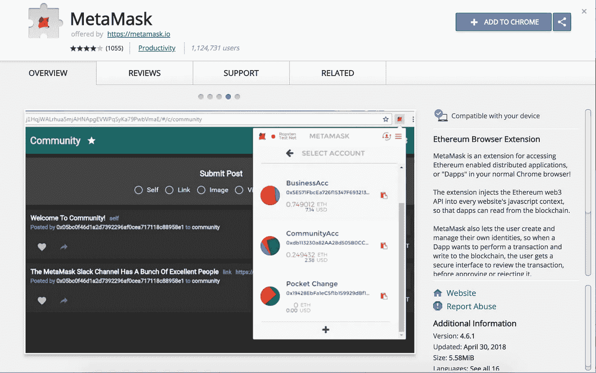
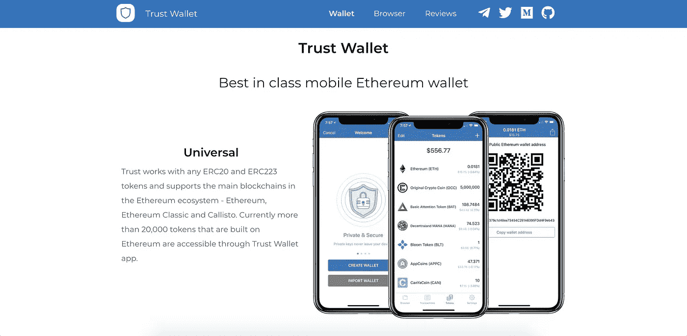

# 2018 年 5 大最佳 ERC20 兼容加密货币钱包

> 原文：<https://medium.com/hackernoon/the-5-best-erc20-compatible-cryptocurrency-wallet-in-2018-c123288f5590>

在你开始拥有加密货币之前，你需要一个安全的钱包来存储这些代币，直到你决定使用它们。有很多加密货币钱包，但并不是所有的都与 ERC20 标准令牌兼容，如 BOUNT(Bountie token)、ZIL (Zilliqa)和 EOS。

[**阅读更多:赏金令牌的多种用途**](https://bountie.io/blog/need-know-bountie-tokens-upcoming-cryptocurrency/)

在本指南中，我们将分享 2018 年五款最佳 ERC20 兼容加密货币钱包。但在我们深入研究不同的钱包之前，这里有一个简短的回顾，什么是加密货币钱包，以及如何保持它的安全。

# 什么是加密货币钱包？

它基本上是一个存放代币的钱包。一个完整的技术定义是，加密货币钱包是一个软件程序，允许你存储你的私人和公共密钥，通过区块链发送和接收令牌，并检查你的余额。

纸质钱包是包含生成私钥所需的所有数据的物理文档。你可以在一个纸钱包里存放多把钥匙。在硬件钱包之前，纸质钱包曾经是最常见的加密货币钱包，因为你可以在家中尽可能安全地保存它。

# 你是如何保证钱包安全的？

让我们从最基本的开始:你如何保证你的加密货币和钱包的安全？我们有一些建议给你。

## #1.脱机存储它

加密货币钱包最安全的形式是离线的:硬件钱包。因此，无论您日常使用的是哪种在线/桌面应用程序，都建议您离线存储大部分令牌。

**了解更多关于** [**各种加密货币钱包类型**](https://bountie.io/blog/whats-a-crypto-wallet-and-do-i-need-it-for-bountie-tokens/)

## #2.保持您的软件更新

大多数开发人员不断更新他们的软件，以便为他们的用户提供最佳体验。确保更新您的钱包、手机和计算机，以提高安全性。

既然我们已经完成了这些小技巧，让我们开始主要活动:存储您辛苦赚来的加密货币的最佳钱包。

# [我的钱包](https://www.myetherwallet.com/)

MyEtherWallet

👍易于设置
👍与脱机硬件一起工作

MyEtherWallet (MEW)是迄今为止我们最喜欢的，因为它易于使用，并且与其他软件配合良好。2018 年，MEW 是任何对初始硬币发行(ICO)感兴趣的人的首选以太坊和 ERC20 钱包。

由于 MEW 是一个在线钱包，它不是最安全的选择。2018 年初，MEW 遭到入侵，许多个人发现他们的钱包被黑了。我们鼓励每个人遵循水电部提供的指示，以确保他们的钱包安全。

***您可以在我们的指南中了解更多关于创建新钱包地址的信息:*** [***如何获取新钱包地址以换取奖励代币？***](https://bountie.io/blog/whats-a-crypto-wallet-and-do-i-need-it-for-bountie-tokens/)

或者，您可以使用 MEW 来创建您的钱包地址，并使用您的离线硬件来访问他们的帐户并提供额外的安全性。您可以从[莱杰 Nano S](https://www.ledgerwallet.com/products/ledger-nano-s?utm_source=http://tracking.trendiq.nl/tracking202/redirect/cl2.php?q=https%253A%252F%252Fwww.ledgerwallet.com%252Fr%252Fa115%253Fpath%253D%252Fproducts%252Fledger-nano-s%2526lpurl%253Dhttps%253A%252F%252Fwww.ledgerwallet.com%252Fproducts%252Fledger-nano-s&utm_medium=affiliate&utm_campaign=a115&utm_content=) 和 [TREZOR](https://trezor.io/) 中选择。

# [元掩码](https://metamask.io/)

MetaMask Plugin

👍拥有安全的身份保险库
👍不需要软件

元掩码是一座桥梁，它允许你今天在浏览器中访问明天的分布式 web。它允许您在浏览器中运行以太坊 dApps，而无需运行完整的以太坊节点。MetaMask 的伟大之处在于它不仅仅是一个钱包。MetaMask 是一个连接 dApps 和您的浏览器的接口。您可以轻松安装 MetaMask 插件并开始使用它。

您还可以将 MEW 与元掩码一起使用，以增加安全性。

# [信任钱包](https://trustwalletapp.com/)

Trust

👍易于设置
👍方便用户的

能够持有和管理 ERC20 令牌的移动钱包应用程序并不多。信任是解决这个问题的方法。有了信任，你就有了这个以太坊和任何 ERC20 代币的统一钱包地址。以太坊的 ico、空投、收发都可以用同一个地址。

移动应用程序中还有很多功能，如浏览器、书签、历史记录等。

**在**[**App Store**](https://itunes.apple.com/us/app/trust-ethereum-wallet/id1288339409)**或**[**Google Play**](https://play.google.com/store/apps/details?id=com.wallet.crypto.trustapp)**上下载信任。**

# [薄雾](https://github.com/ethereum/mist/releases)

Mist

👍支持两种钱包解决方案
👍让您完全掌控

Mist 是一个电子应用程序——一个桌面和 web 界面的混合应用程序。这允许更快地开发和更改 Mist 界面，并有助于 Mist 的浏览器部分。Mist 允许您简单地创建一个钱包，并提供一个多签名的钱包，以获得更高的安全性。

与奇偶校验类似，Mist 是一个桌面应用程序，因此您必须下载并安装到您的计算机上。你将被迫下载整个以太坊区块链才能使用钱包。

# [奇偶性](https://www.parity.io/)

Parity

👍使用方便

与 Mist 类似，奇偶校验是一个全节点钱包，您可以将区块链存储在电脑上。该钱包适用于 Ubuntu、OSX、Docker 和 Windows。您可以轻松地安装在 1-click。

这不是最容易建立的，而且已经出现了一些错误，导致[损失了价值 2 . 8 亿美元的以太坊](https://www.theregister.co.uk/2017/11/07/parity_wallet_destroys_280m_ethereum/)。然而，奇偶校验是由以太坊自己的核心开发者加文·伍德创造的。所以平价是有可信度的。

*我们希望本指南对您有用。* [*如果您喜欢我们的指南，或者您想为这一功能推荐另一款加密货币钱包，请告诉我们*](https://www.facebook.com/bountiegaming) *。*

*最初发布于*[*bountie . io*](https://bountie.io/blog/the-5-best-erc20-compatible-cryptocurrency-wallet-in-2018/)