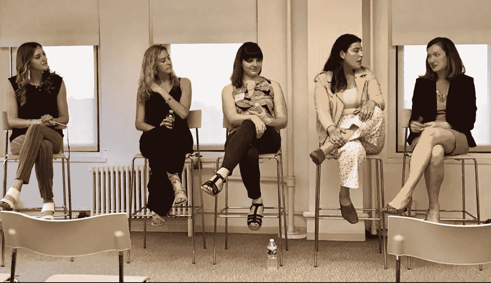

# 主持会议的 5 条基本原则

> 原文：<https://medium.com/hackernoon/the-5-cardinal-rules-of-moderating-a-panel-2593168c1605>

A snapshot from a recent panel in which I was a participant, not a moderator

所以，你被要求[主持](https://hackernoon.com/tagged/moderate)一次活动的小组讨论。太好了…你获得了第二名，而不是被选为全职演讲者。是时候列一个问题清单，然后照着稿子来了，对吧？

不对。

事实上，错上加错。首先:主持人是*而不是*小组讨论的亚军角色。事实上，它们是为观众释放价值的最重要的钥匙。第二——*而不是*照着稿子念。这只会削弱你，让所有人都感到厌烦。

如果与会者没有带着学到的东西走出那个房间，这不是发言人遴选委员会的错:这是无效调节的错。一个好的主持人会问一些迎合每个成员优点的问题；一个伟大的主持人会让每个小组成员看起来像个天才。

对我来说，在一场小众活动中，主持一场乏味的特定行业会议并不是一件无聊的事情。主持一个小组是 IRL 版本的“热座位”:你可以公开地就一件他们都关心的事情训练人们，而作为回报，你却很少分享自己的情况。

所以我想我应该花点时间来分享一下为什么主持小组讨论会很重要，以及我做好它的五条基本原则。

# 主持人很重要

多年来，我一直认为小组讨论是最糟糕的获取信息的方式。在这里，你有一群疯狂的高权力人士一起站在舞台上——然而，一次又一次，我从这些活动和对话中走出来，却什么也没有学到……绝对没有。

但是……我坚信世界上每个人都有一个你可以学习的故事。我最喜欢的聚会技巧之一是找出某人的“激情点”并深入其中。(我这样做已经很多年了，甚至几年前还做过一个关于这个的 [IGNITE 演讲](https://www.youtube.com/watch?v=Zmy5qAgOYX0)。)

一旦你深入到那个部分——某人激情点的松脆多汁的部分——事情就开始变得有点有趣了。听说有人喜欢玩桌上足球来取乐，这有点有趣。但是了解世界各地足球锦标赛错综复杂的情况真的很有意思:人们如何训练，在哪里比赛，为什么要这样做。

这和适度有什么关系？

让我们马上解决这个常见的误解。作为一名主持人，你的工作不是提出一堆不同的想法，然后让它们悬而未决。(顺便说一句，无论你在谈论什么，暗中宣传自己是主题专家也不是你的工作。)

相反，试着想想你在调节中的角色，就像在排球比赛中扔第一个球一样:你想让事情运转起来，然后尽可能长时间地把球保持在空中。一旦它掉了，你就把它送给别人，然后开始新的一轮。这是动态的，不可预测的。它让人们参与进来。

诚然，这说起来容易做起来难。如果你认为在线平台上的内容监管很难，那么当内容实时呈现在你面前时，这就更难了。

想知道*不*有什么好玩的？看着某人坐在凳子上，读一张纸上的问题。想知道什么*有意思吗？观看人们练习和演示积极倾听，并插话问你可能一直在想的后续问题。你不需要回头看你的问题清单。*

*作为一名主持人，你的注意力应该放在你面前发生的事情上，而不是你写在纸上的东西。我再说一遍:不要带问题清单上台。取而代之的是，寻找反弹的机会，更深入地探索，甚至鼓励小组成员之间的激烈辩论。如果你做到了这一点，你就可以将适度转变为有效的内容消费渠道，这也是它一直以来的初衷。*

*以下是我关于如何做好这件事的五条基本原则:*

# *[有效]小组讨论的 5 条规则*

## *规则 1:这不是关于你的。*

*如果你坐在主持人的位子上，你的自负需要马上消失。记住:人们不是来看你的:他们是来看其他人的。如果这让你难过，那就不要接这份工作。如果你更想“被关注”，那就报名参加一个小型活动的演讲，然后一步步往上爬。*

****专业建议* :** 尽量少花时间在你自己的介绍上。不要觉得每个回答都需要评论。与其加上自己的故事，不如问一个更好的问题。记住，让这些人看起来不错是你的工作。如果会议结束后，你的所有小组成员都被与会者淹没，并向他们提出一对一的问题，你就知道你做得很好。*

## *规则 2:这也不是关于他们的。*

*等等，你认为小组讨论是关于所有演讲者想要谈论的吗？我的意思是…它是…但只是一种。即使一个生物医学工程师有世界上最有趣的研究项目要讨论，如果你把她放在一群电子舞曲狂热者面前，这一点都不重要。最重要的是*了解你的受众*。如果你不知道谁在房间里，你就无法促成他们关心的讨论。句号。这方面的另一个重要提醒是:打断发言太长的小组成员是可以的(甚至是重要的)。没有什么比小组讨论更糟糕的了，让一个人讲冗长的故事，而不给其他人插话的机会。我是“被砍掉播出时间的人”糟透了。*

****专业建议* :** 作为主持人(而不是活动组织者)，你很可能对房间里的人一无所知。但是你猜怎么着？你现在负责这个房间(或者至少接下来的 25 分钟)。找出他们是谁。想办法融入房间。我喜欢让人们转向旁边的人，聊上 2 分钟。如果与会者与某件事有关联，你也可以要求他们举手，甚至号召观众分享故事。至于在开始时打断别人，寻找有效的过渡，比如:“*让我们暂停一下*”或“*有趣的观点。还有人感觉不一样吗？”**

## *规则 3:第一个问题无关紧要。(艺术在后续。)*

*是的，准备好一些你想谈论的模糊概念是很重要的。我甚至喜欢通过电子邮件提前安排小组讨论，以确保我们对我想讨论的话题和主题有集体认同。但是有效的计划对现场观众来说并不重要:重要的是有效的执行。这意味着问一些试探性的问题，深入挖掘自然出现的话题。*

*你可能会问:*“告诉我你的职业道路，让你有今天。”*有人可能会回答:*“好吧，我有一点非传统背景。我是一个军人子弟，我们在 10 个不同的国家长大。当我搬到美国时，我知道我想主修商业，在一家失败的金融科技初创公司做了第一份销售工作后，我知道我有动力开创自己的事业。* 你不应该说，*“谢谢你，夏娃”*然后继续前进。你应该问问其他人在想什么:“哇，等等。十个国家？那是什么感觉？你认为这对你的创业之旅有什么影响？”*

*专业建议 :不要把你的问题看做是一组必选的复选框，而是把它们看做是路标，如果事情变得不新鲜了，你可以回来看看。计划不要涵盖你准备讨论的所有内容。不要害怕向个人提出后续问题，更深入地探究你感兴趣的事情。你能让他们透露的例子越具体，对房间里的其他人来说就越有意义和共鸣。*

## *规则 4:每个人回答每个问题并不重要。*

*这是最糟糕的。它经常让自己陷入*“我同意……”*的陷阱，这实在是太无聊了，浪费时间，而且没有增加价值。记住:人们希望被问到与他们相关的问题。以*开始提问完全没问题。“好的，劳伦，鉴于你的营销背景，我很想知道你对脸书在网络广告上的主导地位有什么看法。”如果你感觉到小组中的其他人因为没有被邀请而变得焦躁不安，那么下一个就叫上他们。如果没有，也不用担心。记住:每个人都有麦克风。如果他们真的想说什么，他们会说的。**

*顺便说一句，当你打开版主的噩梦:来自观众的公开论坛问题的面板时，这种情况尤其成问题。一旦你把控制权交给坐在外面的人，你就邀请了一百万种可能性——让我们现实一点，大多数人不擅长问问题。你没有问这个问题并不意味着你不能缓和回答。如果你觉得有人问了一个通配符问题，等待一个小组成员回答，然后快速进入下一个问题。那个*一个人*可能不喜欢，但是其他人都会感谢你。*

****Pro Tips****:*与其纠结于说话平等的重要性，不如考虑一下被分享内容的价值。对每个人来说，和一个人走得更深比和其他人走得更浅更有价值。所以要多探索，并要求举例来说明正在讨论的概念。偶然发现一些真实的东西也有助于你从理论上的商学院术语进入真实的世界，真实的生活例子。*

## *规则 5:以高调开始和结束是很重要的。*

*当你踏上舞台的时候，你只需要把两件事情固定下来:你的开场白和退场问题。介绍是向大家介绍*为什么*你们都在台上的时候。这也是你测试*房间里的*是谁的机会。然后你可以大声说出你的意图:*“今天，我们将通过向三位专家学习来介绍构建在线社区的最佳实践，他们可以分享许多不同在线平台的成功经验和失败经验。”*一边说着那件事，一边环视房间寻找认可。人们看起来活泼吗？订婚了？无聊？你需要阅读房间，然后准备相应地改变路线。有一次，在一次冗长的采访中，我感觉到人们正在对观众失去兴趣，我暂停了讨论，并要求每个人转向他们右边的人，分享一件他们计划在接下来的一周根据他们所学到的东西做不同的事情。这种能量重置在结束对话时走了很长的路。*

*但是别忘了准备好两个书挡。我经常在小组讨论会上看到的一个问题是，当某个随机的活动组织者大声宣布我们只有时间再问一个问题时，然后某个观众就她的特殊问题提出了一个令人震惊的具体问题，而其他人都无法理解。作为一个版主，这是一个*可怕的*结局。所以不要让房间的随意性影响你的大结局。*

****专业建议* :** 在你演讲之前，想出一种吸引听众的方法和一个为谈话设定的关键意图。然后，提前准备最后一个问题——每个人都可以用一句话回答*的问题。这可能是一条建议，他们最喜欢的[在此插入任何内容]，或者其他你可以分成小块的东西。这样，小组成员以高音符结束，房间的最后印象是精致和实用。**

# *拥有体验*

*我真的相信主持深思熟虑的对话是参与现场活动的最有益的方式之一。你不仅有特权向聪明人提出聪明的问题，帮助他们与他人分享他们的专业知识，而且你还可以和其他人一起实时学习。*

*下一次你被邀请主持小组讨论时，我希望你能把握住这个机会——一个从极其聪明的人身上发现有趣的花絮、秘密和真实例子的机会。如果你有任何其他建议(或者需要一个未来活动的主持人)，请告诉我。*