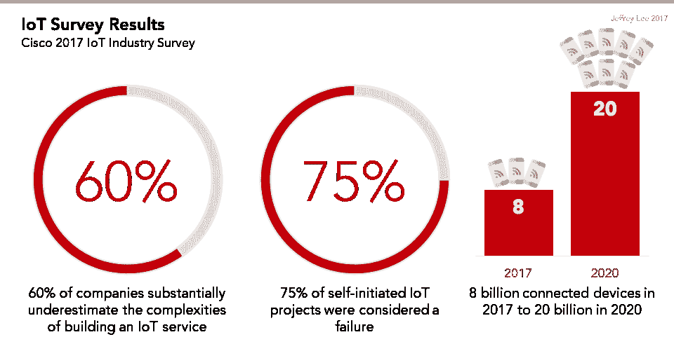
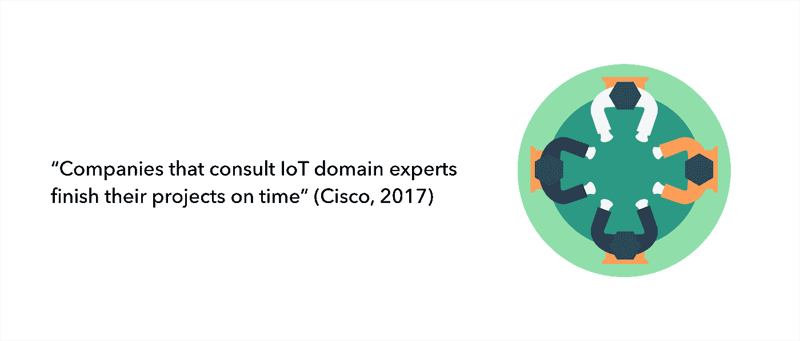

# 构建物联网设备所需的 5 位领域专家

> 原文：<https://medium.com/hackernoon/the-5-domain-experts-you-need-to-build-an-iot-device-8c030ce0ce2c>

## 了解从原型到生产构建工业物联网设备所需的基本团队构成和技能

根据思科的一项调查 (2017 年)，超过 60%的受访者承认，他们大大低估了管理自己的[物联网](https://hackernoon.com/tagged/iot)计划的复杂性。更令人担忧的是，同一项调查还发现，75%的自发物联网项目被认为是失败的。

然而，[思科](https://newsroom.cisco.com/press-release-content?articleId=1847422)也发现，在项目的整个生命周期中咨询物联网领域专家的大多数公司都按时完成了项目。单干的公司经常会超出他们最初的时间表，并且发现他们缺乏保持项目正常运行的内部专业知识。不幸的是，当公司意识到他们需要额外的专业知识时，他们通常已经深入到了开发过程中，这使得旋转成本成倍增加。

本指南的目的是帮助您评估构建物联网设备所需的领域专家，并防止您陷入产品开发流程。该指南还解释和定义了物联网产品开发周期的许多方面，以帮助您克服大规模构建物联网设备的许多复杂性。

# 五位领域专家

# 1.嵌入式固件专业知识

嵌入式固件工程师开发并实现在电子设备上运行的可重编程内容(固件)。您可以将固件视为允许嵌入式设备执行其基本功能的操作系统(OS)。当您希望对您的物联网设备进行商业扩展时，您需要一名嵌入式固件工程师，他在以下方面是专家:

*   **使用专业的固件工具链和固件语言，如 C 和 C++，构建一个稳定的固件架构**,它是可扩展的，并且有很好的文档记录。
*   **为受限系统设计**如低功耗 MCU，内存有限，无内存管理，无键盘或屏幕等直接接口。
*   **设计稳定性**和错误恢复，包括应用看门狗定时器、错误纠正和系统故障自动恢复。
*   **特别注意**输入和输出——这包括传感器数据采集、数字信号处理、本地压缩和数据存储。
*   **通过编写允许设备进入睡眠模式并消耗最低所需能量的固件，最大限度降低功耗**。
*   **优化从您的设备到云的蜂窝通信带宽**。
*   **通过 [OTA 固件更新](https://blog.particle.io/2017/12/18/over-the-air-firmware-the-critical-driver-of-iot-success-859927/)不断修改固件**以提高您车队的稳定性和功能性(这在不需要改变[硬件](https://hackernoon.com/tagged/hardware)的情况下增加了价值)。

虽然这不是一个全面的列表，但重要的一点是，您希望团队中的任何嵌入式固件专家至少应该能够做到这些。如果您有兴趣了解有关受限系统设计的更多信息，请查看这份关于物联网电源管理的白皮书。

# 2.电气工程专业知识

电气工程师设计、开发、测试和监督电气设备的制造。他们是 DFM(为制造而设计)最佳实践的专家，可以帮助您设计具有最佳性能和最便宜元件的 PCB 原型。当检查电气工程专业知识时，寻找在以下方面是专家的人:

*   **设计、开发和测试**印刷电路板。PCB 充当物联网设备的大脑和传感器接口。
*   **选择和设计**正确的硬件组件，提高精度和稳定性，同时考虑成本。
*   **通过在工作台上和现场反复测试硬件设计，识别潜在的设计问题**。这样做将允许电气工程师根据实际输入改进元件选择和电路设计。
*   **使用符合行业标准的电子设计自动化** (EDA)工具，如 Altium 和 Eagle，进行 PCB 设计。专家可以利用内置的调试和设计实践功能，以便同事和合作伙伴可以了解设计并进行协作。
*   **为移动中或部署在远程位置的物联网设备优化、生成和延长**电池寿命。
*   **实施天线**并针对射频协议进行设计，而不影响产品的连接性。物联网设备通常部署在恶劣的射频环境中，因此天线也需要足够稳定，以承受这些条件。
*   **设计物联网设备进行认证** (FCC、EMC、UL、ETL、CE 等)，让您的客户可以放心购买和使用您的产品。

总的来说，电气工程师需要跟上无线领域不断变化的技术。如果您有兴趣了解更多关于 PCB 设计流程的信息，请查看这篇关于构建第一个 PCB 原型的文章。

# 3.机械工程专业知识

您的机械工程师负责您的设备在世界上的物理功能，即它如何与其他机械系统以及潜在的人类用户进行交互。机械工程师需要成为以下领域的专家:

*   **原型设计和外壳设计**符合产品规格，使其足够坚固耐用，可持续使用数年。
*   **组装电缆和电线**，这些电缆和电线具有正确的连接器以与其他系统接口，并能根据机械和电气要求传输信号。
*   **实现开关、继电器、触发器、**和其他机械接口，以便您的物联网设备可以触发物理事件(如打开水阀或自动制动移动的车轮)。
*   **设计能够承受环境挑战的产品**:进水、天气变化、温度变化、振动、压力、冲击等等。
*   **易于安装和维护的设计**。
*   **监督机械设备的操作**以便您的产品在制造过程中和现场都能以尽可能低的成本获得支持。
*   **面向制造实践的设计**因此，成品物联网设备将具有最少的必要部件，并且可以使用最少的必要步骤在工厂进行组装，这转化为成本和时间的节约。

# 4.制造专业知识

在将物联网设备部署到市场时，您需要一位制造经理来帮助您寻找并找到轻松降低硬件成本的方法。他们需要成为以下方面的专家:

*   **监控制造合作伙伴**以确保他们符合项目要求(如成本和安全规定)。
*   **项目管理技术**这样他们可以从头到尾规划、设计和加速项目的大规模生产(即 CM 选择和 CM 管理)。
*   **采购真正的硬件部件**(相对于灰色市场或“盗版”部件)，同时协商尽可能低的成本。
*   **确保生产提前期**及时满足，并找到以协商成本采购零部件的方法。
*   **创建和管理**物料清单(BoM ),这是成品中必须包含的每个组件的主列表。(BoM 是上面提到的硬件采购的结果。BoM 必须符合 DFM 实践)。
*   **供应链管理，**即货物和服务的流动。他们需要成为跟踪序列号、其他 id 和管理物流的专家(即，如何让您的成品从工厂车间、进入仓库并到达客户手中，并确信每个物联网设备在每个阶段都是 100%可跟踪的？).
*   **法规和合规管理，**这意味着确保您的物联网设备可以在多个市场合法运输或储存。
*   **跨国家、**跨语言、跨时区联络，协调运营团队，确保多个利益相关方知情并承担责任。

# 5.制造测试专业知识

制造测试不同于制造专业知识，因为实现质量测试指标本身就是一项工作。在物联网设备上市之前，制造测试专家需要能够进行和验证以下测试:

*   **测试平台开发** —您需要构建一个产品来测试您的产品，这就是所谓的测试平台。该平台直接在装配线上与您的物联网设备对接，并证明所有功能和接口都符合要求。
*   **测试脚本开发** —这是在您的测试平台上运行的软件，可确保您的产品获得正确的设备固件。它还将所有供应信息传递给供应链管理系统。
*   **供应协调** —这与制造专家的任务相关，即确保制造的每个设备都收到正确的序列号，并存储在正确的供应链系统中。
*   **环境和认证测试** —与合作伙伴合作，确保完成的设备符合法律要求和潜在的长期惩罚性环境要求(如一天内将设备在混凝土上跌落 100 次)。
*   **EVT(工程验证测试)** —这是第一批从生产线上下来的设备。它验证了您的制造流程可以根据需要实现核心电子和机械功能，但物联网设备本身在此阶段仍未准备好发货。
*   **DVT(设计验证测试)** —这是您的制造流程的“适合和完成”测试。它证明所有部件，包括外壳和最终电缆/传感器/连接器，都可以正确组装。它还确保物联网设备具有大规模生产所需的正确外观和感觉。通过这项测试的物联网设备将看起来准备就绪，但直到 PVT，你才准备好进行大规模生产。
*   **PVT(生产验证测试)** —这是最后的大规模生产监督测试——它验证每一个特性和功能都顺利通过，并且物联网设备真正准备好大规模生产。第一个通过 PVT 的物联网设备是第一个准备发货的完全产品化的设备。
*   **集成测试** —该测试确保您的物联网设备通过测试设备和 EVT/DVT/PVT 制造步骤进行独立测试，并且在集成到您客户的最终产品中时也能进行测试。

同样，这不是一个全面的列表，而是测试物联网设备时需要做的主要事情的简短列表。

# 6.其他一切

当然，建设一个大规模生产的物联网设备需要一大批领域专家和专业技能，远远超过硬件和制造。以下是构建大规模物联网设备时需要考虑的一些其他技能:

*   项目管理——谁将监督整个项目，包括以上所有内容以及以下所有内容？
*   **工业设计** —这对于面向消费者的产品尤为重要。这包括消费品的外观、手感、合身程度和表面处理，包括颜色和质地、材料类型(塑料、金属等)。
*   **塑料加工和成型** —如果设计了塑料件，它们将如何制造？这需要金属“工具”被雕刻出来，以便熔融塑料可以被注射，这本身就是一个项目。
*   **软件/云/移动** —您将如何收集和显示关于您的物联网设备的商业情报，无论是单独收集还是大规模收集？管理员、技术人员和最终用户将如何与这些设备互动？
*   **用户界面/UX**——如果你设计并构建任何软件界面，用户将如何与这些终端交互？无论是网络还是移动？
*   **数据科学** —随着您的车队发展到大规模，您将如何“理解”不断增长的海量数据，从而为您的业务和客户提供切实可行的见解？
*   **营销** —你打算如何让世界了解你令人惊叹的物联网设备？

# 底线

嗯，这是很多领域的专家。这篇文章的目的不是让你感到气馁。实际上，花些时间来研究和理解这些需求将会在产品开发过程中节省您的时间和金钱。

首先，您应该利用自己组织的技能、专家和资源来评估这些需求。通过这样做，您将能够增加自己对组织差距的了解，并能够适当地教育利益相关者如何构建生产物联网设备。同样值得一提的是，有许多[工程服务](https://www.particle.io/particle-studios/)可以为您提供从原型到生产构建物联网设备所需的领域专家和技能。

最后，重要的是要记住，构建一个成功的物联网设备(或任何类型的产品)是非常困难的。但是你知道这个项目，所以不要让它变得比需要的更难。通过雇用或咨询领域专家，您可以大大增加按时完成项目和成功向市场推出物联网产品的机会。