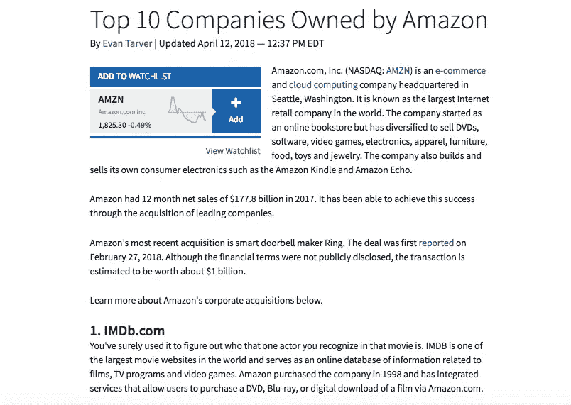
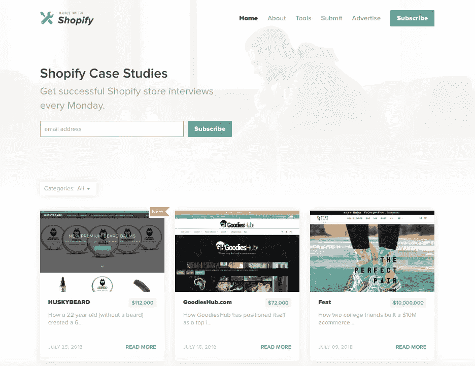
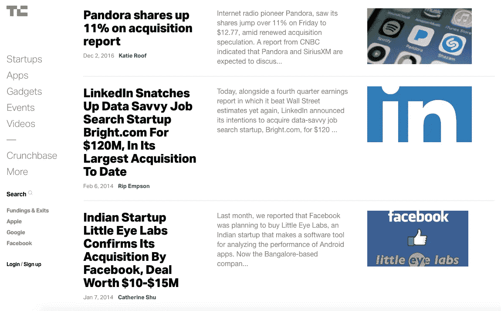
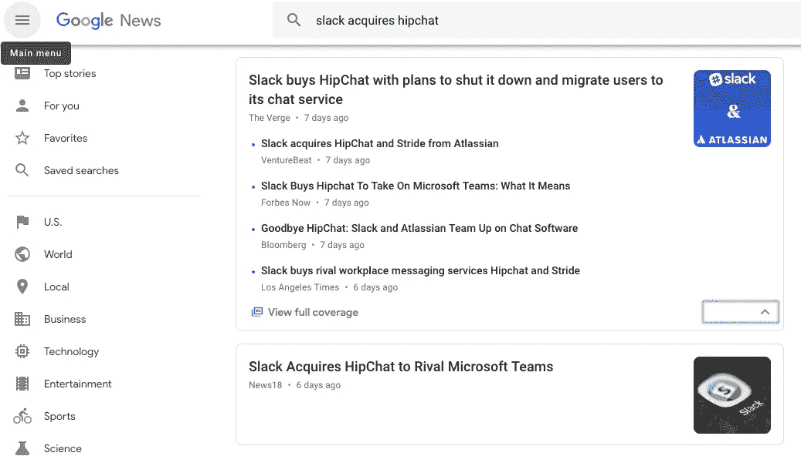

# 收购的 5 大营销优势

> 原文：<https://medium.com/hackernoon/the-5-marketing-benefits-of-acquisitions-1eeb6561549d>

最近，“为营销而收购”的想法让我着迷。这是什么意思？它指的是公司收购其他业务或资产，以此来发展他们的主要产品或改善他们的营销。

大公司总是利用收购来进行营销。大公司中这种做法的例子包括:

*   沃尔玛以 100 万美元收购 Jet.com 的 3B，这有助于沃尔玛在电子商务领域取得重大进展。
*   亚马逊收购了 [Zappos](https://techcrunch.com/2009/07/22/amazon-buys-zappos/) 、 [Quidsi](https://techcrunch.com/2010/11/08/confirmed-amazon-spends-545-million-on-diapers-com-parent-quidsi/) 和 [Whole Foods](https://www.bloomberg.com/news/articles/2017-06-16/amazon-to-acquire-whole-foods-in-13-7-billion-bet-on-groceries) ，这使得它能够将鞋、婴儿护理、家居用品和食品等产品类别添加到其投资组合中。或者，亚马逊收购了 [IMDb](https://en.wikipedia.org/wiki/IMDb#As_Amazon.com_subsidiary_(1998%E2%80%93present)) 、[票房魔咒](http://latimesblogs.latimes.com/entertainmentnewsbuzz/2008/12/online-movie-si.html)、 [Goodreads](https://techcrunch.com/2013/03/28/amazon-acquires-social-reading-site-goodreads/) 和 [Twitch.tv](https://www.businessinsider.com/amazons-970-million-purchase-of-twitch-makes-so-much-sense-now-its-all-about-the-cloud-2016-3) ，它们在关键产品类别中获得了可观的流量。
*   谷歌[收购安卓公司](https://www.cnet.com/news/google-buys-android/)，这构成了其安卓操作系统的基础。Android 现在驱动着超过 20 亿台设备，是谷歌在智能手机上预装其最重要产品的绝佳方式。
*   脸书对 Instagram 和 WhatsApp 的收购。尽管 Facebook.com 的增长已经放缓，但由于用户群迅速扩大，这两项资产使该公司保持了惊人的增长率。

正如这些例子希望说明的那样，大公司喜欢收购其他企业，以此来营销他们现有的产品并提高他们的整体价值。

我看到如此多的大型企业通过 M&A 成长，但我经常想为什么更多的创业公司不采用同样的策略。

作为回应，一个务实的人可能会提出这样一个事实，即初创公司没有资源以一种创造有意义结果的方式实践 M&A。毕竟，谷歌、脸书、苹果和其他巨头可以不费吹灰之力就支付数百万或数十亿美元收购其他公司。

但是，企业从收购中获得的好处可以转化为较小的创业公司。它们只是在较小的范围内适用。

事实上，创业生态系统中充满了通过收购来加速成长的公司。

出于这个原因，在本文中，我将分享初创公司在收购其他公司后通常会获得的具体增长和营销收益。

# 创业公司在收购其他公司时可以获得的好处

收购对创业公司营销的一些积极影响包括:

## **1。漏斗顶端的流量增加。**

亚马逊提供了一个很好的案例，说明收购如何增加漏斗顶端的流量。每个月都有数千万人访问像 [IMDb](https://www.imdb.com/) 、[票房魔咒](https://www.boxofficemojo.com/)、 [Goodreads](https://www.goodreads.com/) 和 [Twitch.tv](https://www.twitch.tv/) 这样的网站(都是亚马逊在过去 20 多年里收购的)。

Source: [https://www.investopedia.com/articles/markets/102115/top-10-companies-owned-amazon.asp](https://www.investopedia.com/articles/markets/102115/top-10-companies-owned-amazon.asp)

许多，如果不是大多数，参观这些房产的人都希望了解更多关于电影、书籍或视频游戏的知识。亚马逊是世界上最大的电影、书籍和视频游戏销售商，它可以有效地使用这些属性来链接到其网站上的产品。

这些内容密集型业务可能不会占据亚马逊的大部分流量，但它们肯定会为 Amazon.com 带来大量的目标访客。

还有很多其他的收购可以为公司的主要产品或服务带来更多的流量。

例如， [Fomo](https://www.usefomo.com/) 背后的公司收购了一个用 Shopify 构建的名为[的专注于内容的网站。](https://www.builtwithshopify.com/)

Source: [https://www.builtwithshopify.com/](https://www.builtwithshopify.com/)

《与 Shopify 一起构建》采访 Shopify 企业家，他们公布自己商店的收入。我们可以假设，该网站的病毒，搜索引擎优化友好，电子商务为重点的内容可能会创造大量的入站流量。多亏了在网站上有策略地投放广告，这次收购应该会大大增加 Fomo 的访问量。

作为最后一个案例研究，考虑一下[床垫评论行业](https://www.fastcompany.com/3065928/sleepopolis-casper-bloggers-lawsuits-underside-of-the-mattress-wars)。随着像 [Casper](https://casper.com/) 和 [Tuft & Needle](https://www.tuftandneedle.com/) 这样直接面向消费者的床垫品牌的兴起，一些有进取心的企业家开始关注这些新产品的评论网站。

通过在他们评论的床垫中加入会员链接，博客们开始大赚一笔。正如这个故事所表明的，访问量最大的床垫评论网站成为业内玩家的重要参考来源。

事实上，在[一个有争议的举动](https://www.fastcompany.com/3065928/sleepopolis-casper-bloggers-lawsuits-underside-of-the-mattress-wars)中，Casper 最终起诉并收购了 Sleepopolis，该行业最著名的评论网站之一。通过这次收购，Casper 获得了一个网站的控制权，可以用来引导更多的访问者到 Casper.com。

你能获得与你的产品相关的博客、评论网站或以内容为中心的资产(如 Instagram 或 Youtube 账户)吗？

如果是这样，你可以考虑购买一个或多个这些属性，并使用它们来增加您的主要产品的流量。

## **2。重要的公关和内容营销。**

众所周知，媒体喜欢报道并购事件。尽管价值数十亿或数亿美元的收购往往最能吸引记者的注意力，但规模较小的收购也能获得大量的青睐。

只要在谷歌新闻中搜索“[并购](https://news.google.com/search?q=mergers%20and%20acquisitions&hl=en-US&gl=US&ceid=US%3Aen)”或者在 Techcrunch 中搜索“[收购](https://techcrunch.com/search/acquisition)”，你就会看到数万篇关于这家公司如何收购那家初创公司的文章。

Source: [https://techcrunch.com/search/acquisition](https://techcrunch.com/search/acquisition)

无论是 500 万美元的交易还是 160 万美元的交易，记者们都喜欢报道收购，因为它们让人们着迷。为什么？

虽然我不能声称理解人们为什么喜欢收购背后的心理，但我想到了两个潜在的原因:

1.  收购非常罕见。每个人都知道很多企业家，但是你知道有多少人的公司被收购了呢？可能不会太多。尽管创业很受欢迎，但还是很少。但是，收购非常罕见，这意味着人们喜欢在收购发生时阅读相关报道。毕竟，我们喜欢了解那些不常发生的事情。
2.  人们喜欢把自己想象成被收购公司的一部分。创办一家成功的公司并以数百万美元的价格出售是很困难的。然而，想象你已经开了一家大公司，并以数百万美元的价格卖掉了它，这很容易。大多数人对后者感到满意，而不是投入实现前者所需的工作。这种想法可以解释为什么收购故事如此受欢迎；他们给人们一个机会去思考赚取巨额财富会是什么样子。

收购 1 万美元至 50 万美元范围内的小型产品或网站可能不会引起媒体的太多关注。但是，由于上面提到的原因，如果你在博客或媒体上写你的公司的一个小收购，很多人可能会读到它。

这是典型的不真实的陈词滥调“如果你建造(或写下)它，他们就会来”实际上听起来真实的罕见情况之一。

只需看看以下关于小规模收购的热门文章，就能感受到这类内容做得有多好，有多吸引人:

*   [我从购买、种植和销售 HitTail 中学到了什么](https://robwalling.com/2015/12/02/what-i-learned-buying-growing-and-selling-hittail/)
*   [我从销售软件业务中学到了什么](https://training.kalzumeus.com/newsletters/archive/selling_software_business)
*   [卖筛之旅](https://garrettdimon.com/2016/the-journey-of-selling-sifter/)
*   [卖掉我在 SaaS 的生意](https://tylertringas.com/selling-my-bootstrapped-saas-business/)

你不应该仅仅为了它可能带来的公关或内容营销而收购一个产品或网站。但是，请记住，这是收购的营销优势。

## **3。交叉销售您的主要产品和您已经获得的产品的机会。**

如果你收购的产品与你的部分或全部客户相关，但与你的核心业务有不同的价值主张或关注点，你可以交叉销售给他们。

类似地，你可以向你收购的公司的客户交叉销售你的核心业务产品。

在这些情况下，整体大于部分之和。怎么会？

如果你将两种创收产品合并到一家公司，并利用这些产品的受众持续交叉销售每项服务，这两种产品都会比以前增长得更快，更有价值。

当谈到这种类型的营销收购时，微软已经进行了几笔令人兴奋的收购。

微软[收购 GitHub](https://news.microsoft.com/2018/06/04/microsoft-to-acquire-github-for-7-5-billion/) 为其企业业务提供了令人兴奋的交叉销售机会。该公司现在可以有效地将其 [Azure](https://azure.microsoft.com/en-us/) 主机产品交叉销售给 [GitHub 的](https://github.com/)用户，同时鼓励其现有 Azure 用户成为 GitHub 客户。

在消费者业务方面，微软[收购《我的世界》](https://techcrunch.com/2014/09/15/microsoft-has-acquired-minecraft/)是通过交叉销售增加两家不同公司价值的另一种方式。作为[《我的世界》](https://minecraft.net/en-us/)的所有者，微软可以鼓励其现有的 Xbox 用户来看看这款游戏。而且，它现在可以免费向广大《我的世界》用户群销售 Xbox 及其相关游戏。

微软分别以 75 亿美元和 25 亿美元收购了 GitHub 和《我的世界》。然而，并非所有具有交叉销售潜力的成功收购都必须是数十亿或数百万美元的交易。

## **4。将竞争对手从市场上清除出去，并有机会让其客户购买你的产品。**

公司购买其他产品、创业公司或知识产权来吸引竞争对手的客户购买他们的产品是很常见的。最近的一个现在有点出名的例子是 Slack 对 Hipchat 的收购。

Hipchat 是 Slack 在员工聊天和交流市场的主要竞争对手之一。然而，随着 Slack 的统治地位不断上升，Hipchat 陷入了困境。

随着对 Hipchat 的收购，Slack 计划关闭这项服务，并将其现有用户转移到其产品上。

最终，这对 Slack 是有利的，因为它现在不得不应对一个更少的竞争对手，并且它可以迅速为其平台增加大量用户。此外，我不能忘记提及从交易中获得的所有 [PR Slack(参见上面的好处 1)。](https://news.google.com/search?q=slack%20acquires%20hipchat&hl=en-US&gl=US&ceid=US%3Aen)

另一家采用这种方法的公司是 [Fomo](https://www.usefomo.com/) 。在过去的一年里，Fomo [收购了一家名为 refuther](https://blog.fomo.com/fomo-acquires-refurther/)的竞争对手。就像 Slack 收购 Hipchat 一样，Fomo 收购 Refurther 有助于其营销，方法是移除一个竞争对手，并将该前竞争对手的客户带到平台上。

当谈到作为营销的收购时，如果你所在的行业有许多小的竞争对手，随着公司的发展，收购一些小的竞争对手可能是有意义的。Slack 和 Fomo 的例子说明了这种策略是多么有效。

**5。新人才和流程的全新注入。**

公司，尤其是大公司，经常收购其他企业，以此来将聪明的人才引入他们的组织。这些收购通常被称为[收购](https://en.wikipedia.org/wiki/Acqui-hiring)，可以通过引入公司推出新产品或发展现有产品所需的新技能、知识或流程来帮助营销。

有成百上千个这样的例子。其中包括:

*   2009 年，脸书收购了 FriendFeed(作为交易的一部分，FriendFeed 的联合创始人之一 Bret Taylor 成为了脸书的首席技术官)。
*   Twitter 对 AdGrok 的收购为其广告团队增加了两名天才工程师。
*   谷歌收购了凯文·罗斯的公司 Milk，将他加入了谷歌的团队。

大公司认识到，即使他们看不到初创公司的产品或基础技术的价值，某些公司的团队也可以为他们的组织增加真正的价值。

虽然脸书、Twitter 和谷歌的收购价格通常在 100 万美元到 5000 万美元以上，但小型创业公司也可以参与。

在他的优秀著作《失落的 [*和创始人*](https://www.amazon.com/dp/B074DGYVD5/ref=dp-kindle-redirect?_encoding=UTF8&btkr=1) 中，当描述不同的门生[墨子](https://moz.com/)所取得的成就时，[兰德·菲什金](https://twitter.com/randfish)写道:

> Moz 已经完成了六笔交易来实现这一目标。其中一个年轻人刚刚大学毕业，但他在学校的业余时间开发了一个有用的产品，向我和我们的团队证明了他的价值。我们支付了很少的收购价格(18，000 美元)，让他加入了 Moz，他的薪水、股票期权和影响力都超过了我们给一个只是申请职位的候选人的待遇。另一个是两个 SEO 专家，他们建立了一个成功的咨询实践，他们的技能是我们的产品和工程团队内部需要的。我们支付了 330，000 美元(加上股票期权和留任奖金)让他们来到这里，除了丰厚的薪水和福利之外，这是他们业务的一个不错的倍数。

正如这个例子所希望说明的，小规模收购，在$X0，000 到$X0，000 之间，可以帮助新生的创业公司增加他们成长所需的人才。

如果你的初创公司需要具有独特技能的人才来实现新产品或增长里程碑，收购可以帮助你实现这一目标。在这些情况下，收购可以帮助营销，只是不是以最直接的方式。

# **整合在一起**

收购任何公司或资产都有一定的风险，在收购另一家企业之前，你应该做大量的尽职调查。毕竟，历史上充斥着拙劣的收购，比如:

*   臭名昭著的 1640 亿美元的美国在线时代华纳合并案。
*   Zynga 以 2.1 亿美元收购 OMGPOP[。](https://techcrunch.com/2013/06/04/zynga-shuts-down-omgpop-one-year-after-acquiring-it-for-200m/)
*   谷歌以 125 亿美元收购摩托罗拉。

然而，我希望这篇文章已经告诉你，如果做得好，收购可以成为一个有用的营销工具。要了解更多关于 M&A 的信息，我们建议查看以下资源:

*   [CB Insights Research](https://www.cbinsights.com/research/)
*   [FE 国际博客](https://feinternational.com/blog/)
*   还有[帝国鳍脚博客](https://empireflippers.com/blog/)