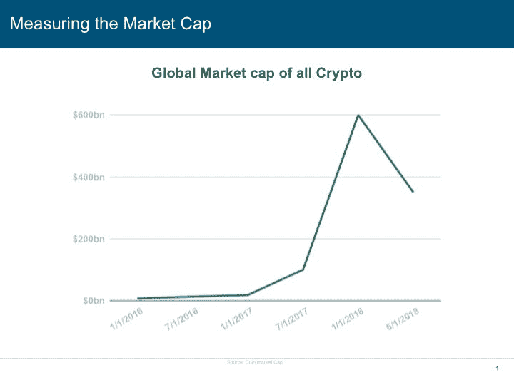
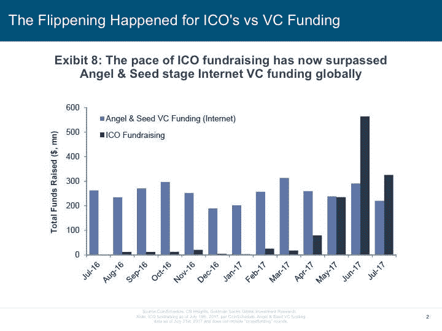
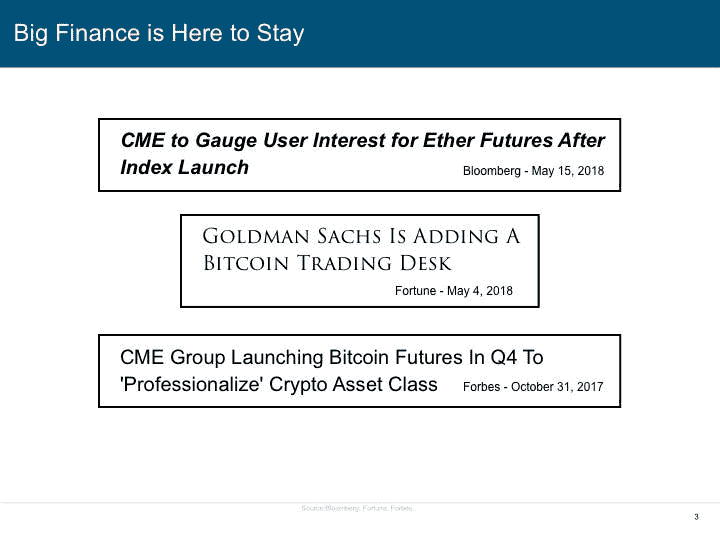
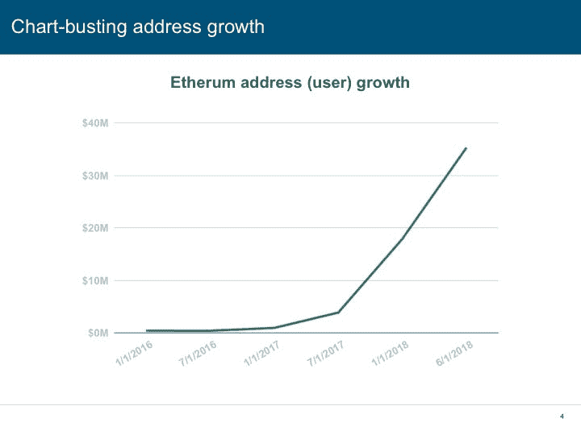
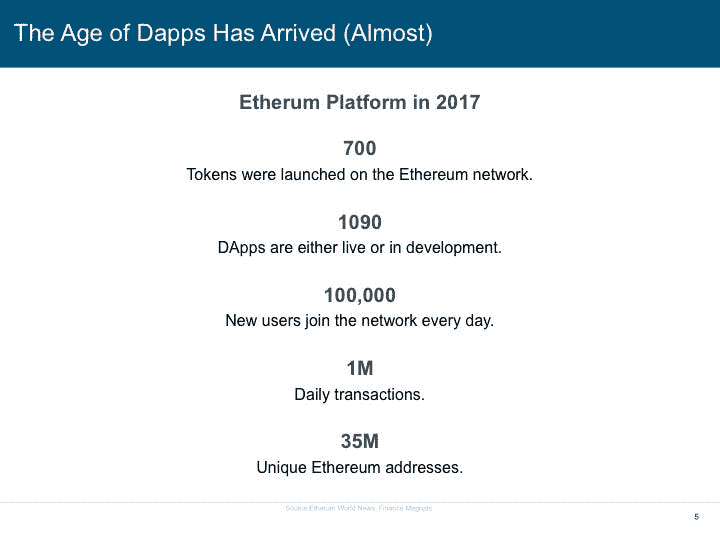

# 玛丽·米克尔“忘记”的 5 张幻灯片

> 原文：<https://medium.com/hackernoon/the-5-slides-mary-meeker-forgot-9e524e68457c>

每年，[凯鹏华盈都会发布一份由玛丽·米克尔整理的关于互联网趋势的引人入胜的报告。一如既往，2018 年的报告充满了有趣的数据点和迷人的信息。然而，有一个明显的遗漏:一个数十亿美元的寒武纪大爆发经历了看似无限增长的行业，但只给出了一张幻灯片(共 294 张)，因为它只与一家公司及其不断增长的用户群有关。](http://www.kpcb.com/internet-trends)

不管出于什么原因，米克似乎没有注意到[加密货币](https://hackernoon.com/tagged/cryptocurrency)正在改变一切，尽管有 3 张关于杂货业务的幻灯片。

所以，我想提供这份最新的互联网趋势报告中遗漏的五张幻灯片。

## **1。衡量市值**

衡量加密货币市场增长的一个简单方法是查看市值。

回到 2016 年 1 月，[根据 coinmarketcap.com 的数据，所有上市加密货币的全球市值刚刚超过 70 亿美元](https://coinmarketcap.com/charts/)，相比之下，今天的市值为令人震惊的 3450 亿美元，其中不到 40%的价值属于比特币一家。试着举出另一家公司或资产类别在短短几年内增值如此巨大——你不能！当然，加密价格有起有落，但从长期来看，它们有一个相当一致的上升趋势。

## **2。ICOs vs VC 融资发生了逆转**

几十年来，初创公司获得资金的唯一方式是卑躬屈膝地向风险投资公司求助，以换取大量股权和对公司的控制权。创业企业家必须说服一个小房间的金融兄弟，他们的革命性想法并不完全疯狂。

但这一切都在 2016 年发生了变化，当时 ICO 融资开始加速，市场在 2017 年年中爆发。那时，ico 筹集的资金是风投公司的两倍多。这种趋势似乎还在继续，几乎有无数的公司和初创公司更喜欢使用 ico 作为融资工具，以避免走风投路线。

对凯鹏华盈商业模式的威胁是加密货币和 ICO 领域的趋势在他们的最新报告中可疑地缺席的原因吗？

## **3。大金融将继续存在**

加密货币在很多方面是互联网本身的一种表现。它完全存在于互联网上，所有的交易都通过互联网处理，区块链的所有资产都将在互联网上度过它们的一生，不管谁拥有它们。

考虑到这一点，许多来自旧世界的主要金融玩家开始看到加密货币的价值(或威胁)，并吵着要加入进来。像 CMOE、CBOT、高盛和彭博这样的玩家只是投资加密的几个大人物。毫无疑问，目前金融业最大的机会在加密领域。几个月前，[币安宣布他们比德意志银行](https://hacked.com/binance-is-now-more-profitable-than-deutsche-bank/)更赚钱，尽管他们才成立一年。

## **4。突破图表的地址增长**

以太坊是第二大也是增长最快的加密货币项目和平台，经历了抛物线式的增长，但仍未停止。

根据区块链的数据，以太坊在一天之内增加了 352，888 个地址，目前唯一活跃地址的数量接近 4000 万。这很重要，因为以太坊现在为在其平台上运行的不断增长的 DApps 大军提供动力。

令人惊讶的是，活跃的以太坊地址数量已经超过了活跃的比特币地址数量。一个人可以有一个以上的以太坊地址，但来自比特币基地等提供商的数据表明，3500 万以太坊投资者可能与事实相差不远。

## **5。DApps 时代已经到来(差不多)**

根据[金融巨头](https://www.financemagnates.com/cryptocurrency/news/700-tokens-1090-dapps-launched-ethereum-network-2017/)的说法，2017 年以太坊网络上推出了 1090 个 DApps(在区块链上运行的去中心化应用)和 700 个代币。虽然很难估计，但一些 DApp 追踪网站声称至少已经有 1500 个 dapp 了。

但是什么是 DApp，我们为什么要关心呢？[dapp 是分散式应用。把它们想象成网站、软件，或者顾名思义，应用程序](https://hackernoon.com/fat-protocols-vs-dapps-creating-long-term-value-on-the-public-blockchain-565637747557)。DApps 由遍布全球的矿工大军和网络节点提供动力。DApps 灵活，强大，几乎不可能停止。

DApps 几乎可以是任何东西，从分散式银行这样的金融服务，到拥有数百万玩家的在线游戏，到几乎任何你可以想象的东西(比如完全陌生的人为了避免住在酒店而住在彼此家里的方式)。

我们仍在等待区块链第一个真正的“杀手 DApp”但是在接下来的 6-12 个月里，越来越多由 ico 资助的项目将投入运营，整个领域将开始向最终用户展示更多真正的价值。

## **区块链是下一个互联网**

未来 20 年，区块链技术和加密货币将像互联网一样具有变革性。

在接下来的几十年里，我们很可能会把当前的网络看做仅仅是一系列被围墙包围的花园和由少数过于强大的中央集权公司控制的孤立的资源。加密货币和区块链正在改变这一切，很快，未来的互联网将由我们所有人创造和推动。

所以，玛丽·米克尔，为了你自己，明年请不要忘记我们。或者我们应该说，我们知道你在这个问题上没有选择，因为这个行业的发展是不可阻挡的。

不用说，我会热切期待你的下一份报告。

基思·鲍姆瓦尔德是金融科技公司 [Celsius Network](https://celsius.network/) 的 CMO 兼首席采购官，该公司为区块链打造借贷平台。