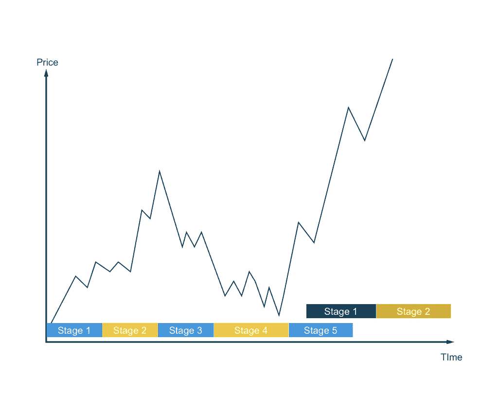

# 密码技术发展的 5 个阶段

> 原文：<https://medium.com/hackernoon/the-5-stages-of-crypto-technology-development-dd71ae31329d>

## 为什么我相信加密货币市场会再次崛起

我对加密货币市场的走势有所了解。这是基于我发现和了解加密货币的个人经历，以及对该领域过去事件的反思。

其他人会使用技术模式、情绪分析或基本面来预测市场走势，他们可能是对的。我选择使用更定性的方法，也许我们的方法在某种程度上是相关的。

Photo by [Seth Doyle](https://unsplash.com/photos/TTxHc9Os9FA?utm_source=unsplash&utm_medium=referral&utm_content=creditCopyText), Unsplash.

加密货币市场以周期性方式运行。它与区块链和分布式账本技术(DLT)的发展状况同步。是的，所有的市场都是周期性波动的，技术进步会引发价格波动。这些阶段是什么？请允许我。

## **第一阶段:发现**

第一步是当某人第一次遇到比特币或任何其他加密货币时。它通常会遇到一些困惑，大量的困惑，然后是一些怀疑。

*这是什么东西？某种形式的通用货币？省去中间人的技术？这听起来可行，但具体怎么做呢？难道只是炒作出来的？一个易变的加密货币怎么可能连货币都当钱用？*

这是一个新人被大量信息和术语轰炸的阶段，大多数人宁愿放弃。对于那些挖得更深的人来说，他们的动机可能是投资的指数回报前景。对一些人来说，这是技术的应用，但对大多数人来说，他们进展到下一个阶段，因为他们买了一些硬币。

投资者的情绪:好奇、困惑、怀疑、怀疑、贪婪

## **第二阶段:学习**

在你拥有一些加密货币后，你想了解更多关于你投资的东西。也可能是技术应用将你带到了这个阶段，在这里你将了解到为什么它被称为“区块链”，什么是采矿，或者什么是硬叉子。

你开始思考和理解这些术语——去中心化、分布式、可伸缩性、互操作性和不变性。你可能会开始告诉朋友和家人，但你会努力简单地解释这些术语，他们也会努力理解。

*分散化意味着没有集中的机构。可扩展意味着更多的人可以使用它。不变性意味着它不能被改变。诸如此类，但是告诉他们字面意思并不能帮助他们理解这整个现象到底是关于什么的！*

你对更好地学习和理解技术和不同硬币的前景感到兴奋。你意识到你知道的越多，你不知道的就越多。总会有新的发现，一些新奇的东西刺激你的学习之旅。

*投资者的心情:好奇、不知所措、兴奋、更贪婪*

## 第三阶段:平台期

你已经阅读了一份又一份白皮书。每个人都试图区块链的东西。他们使用分布式账本来省去中间人，或者他们试图以某种方式解决可伸缩性和互操作性的问题。

*一切都开始变得重复。这就是区块链炒作的目的。然后，下一步是什么？什么时候“月亮”？什么时候“蓝宝”？*

偶尔，你会遇到一种全新概念的加密货币。你会再次受到刺激，只是暂时的，因为你很快就会意识到，在加密货币实现之前，还有许多其他障碍需要克服。

*投资者的情绪:单调、无聊、习惯、失望到不受市场变化影响的程度*

## **第四阶段:创新**

停滞期并不意味着无发展期。筹集资金的公司和组织仍在做这项工作，主要是通过 ico(首次公开募股)。合作伙伴关系正在形成，新的使用案例正在试行，仍有增长。

这是大多数开发者不再关心它们与其他加密货币有多大不同的阶段。投资者也不那么担心价格波动。我们会做好自己的工作，让结果不言自明。谁在乎市场是处于上升周期还是下降周期？只有 HODL！

这个阶段可以持续到某个突破性的东西浮出水面。这是新想法被测试和实验的时候，每个人都普遍接受加密货币仍然是一项正在进行的工作。 *HODL 人，HODL 人！！我们很快就要进入梦乡了！*

*投资者的情绪:一些好奇，习得性无助，偶尔涌起的兴奋会很快消失*

## **第五阶段:突破**

经过多月的孵化，终于有了突破。一个全新的应用程序或一个主要困扰问题的解决方案已经问世，这将改变人们对加密货币的看法

对于这一发现的前景，人们有一种新发现的欣快感和新的兴奋状态。这将把我们带回第一和第二阶段，在那里将有更多的发现和学习！这是一个新周期的标志！

*投资者的情绪:惊讶、欣喜、振奋、着迷、有些谨慎*

# **阶段与市场周期的关系**

Relationship between the 5 Stages and price movements in the markets. (Hansel, 2018)

第一阶段和第二阶段:当市场面临发现和学习的兴奋状态时，它处于总体上升趋势。会有负面情绪来推迟增长，但向上的运动是不可阻挡的。

这也是机构、媒体和投资个人成为加密货币冠军的时候，告诉别人这项技术有多好，有多大。有时，他们的影响力如此之大，以至于价格飙升至月球。

第三阶段和第四阶段:随着炒作逐渐平息，市场将进入停滞甚至反转阶段。不知情的投资者开始退出市场，因为似乎没有进一步增长的迹象。消息灵通的交易者可能已经做了一些战略性的有利可图的退出。

随着下跌势头持续下去，更多的投资者直接退出。另一方面，操纵者保持低价，以便在他们可以再次进入时将价格带到新低。一些小的创新可能会引发情绪和市场的轻微逆转，但在下一次突破之前，不会大到引发重大上涨。

**第 5 阶段(以及下一阶段 1):** 开创性的举动会比之前的上升更大。这是一个极端的变化，会带来更多积极的情绪，并在现有投资者的基础上吸引一批全新的投资者。这就是为什么市场周期比以往任何时候都长，而“泡沫”继续膨胀。

DLT 的技术在不断发展和进步。同样，市场仅仅是这种模式的反映，不断地在这 5 个阶段中循环。从历史价格模式中可以明显看出这一点。

*2009 年至 2015 年:当比特币(BTC)最初被设想为一种“点对点电子现金转移”时，需要一些时间才能把代码弄出来。吸引矿工、用 1 万 BTC 买下头两个披萨、比特币在华尔街的推出和传播都花了一些时间。随后炒作逐渐平息，BTC 价格从 2013 年的近 1200 美元跌至 2015 年的 200 美元。*

*2016–2018:下一个重大突破是以太坊(ETH)因其智能合约功能而广受欢迎。当事情还在被弄清楚的时候，价格在开始的时候没有那么疯狂。在与以太坊经典(ETC)的硬分叉之后不久，比特币现金(BCH)的硬分叉在加密货币领域产生了很大的兴趣和势头。ico 的大量增加进一步推动了这一趋势。ETH 从 2017 年 1 月的 10 美元涨到 2018 年 1 月的 1200 美元，然后在 2018 年 4 月回落到 400 美元的水平。*

# **以史为鉴**

每次有突破性的东西被引入这个领域，市场都会伴随着近乎疯狂的炒作和兴奋。你可以辩称，做市商利用这些情绪来获利，往往过度夸大加密货币的前景，结果却扼杀了创下历史新高的势头。

这一点从他们如何利用 BCH 硬分叉，芝加哥商品交易所和 CBOE 期货合约，以及新系绳的铸造中显而易见。或者你可以对此持乐观态度，将它们视为真正的创新，淘汰那些盲目跟风或跟风的人。

我们现在正处于平台期和创新期。市场情绪疲软，但这并不是市场的终结。如果你密切关注这个空间，你会看到它在不断发展。

我认为下一次起义有三个潜在的突破。

1.  加密货币成为一种可用的货币形式。
    其可用性提高，价格波动性降低，在全球范围内越来越被接受或采用。然而，如果突破之后会出现价格上涨，那么加密货币的波动性不会降低。如果价格继续大幅波动，加密货币不太可能被广泛采用或接受。我相信稳定迟早会到来，但不是很快。
    *关注这次起义的硬币:BTC、瑞士联邦理工学院、BCH、纳米、XRP。*
2.  **作为神谕的加密货币。**
    神谕的概念源于预测结果，并根据这些预测优化行动。想象一种全新的方式，收集大量数据，将这些数据转化为有意义的信息，并让数据为我们服务。然而，这个领域还处于起步阶段。有巨大的潜力，但开发和试验仍在进行，所以它可能不会很快到来。
    *关注这次起义的硬币:AE，IOTA。*
3.  真正去中心化机构的兴起。
    尽管人们正在拥抱去中心化，但具有讽刺意味的是，我们仍然在中央交易所购买、存储和交易加密货币。分散化交易所(DEX)已经开始运作并取得成果。虽然它们可能不能完全互操作，但它们确实服务于主要硬币，并可能显著降低市场上的价格波动。
    *值得关注的硬币:ZRX、KNC、WAVES、BNB。*

还有许多其他具有可行商业模式的实用工具。为了资本增值而投资它们是有意义的，我确实持有其中一些代币。然而，我觉得必须有一个重大的实施，如结构性或根本性的变化，才能引发加密货币市场的下一次上涨。

涨潮抬高了所有的船。我相信许多其他加密货币代币将跟随潮流，并产生良好的回报。只要看看 2017 年 12 月 XRP、阿达、XLM 的价格上涨，你就会看到他们是如何沿着这波浪潮前进的。

在关注加密货币市场和 DLT 发展的同时，我也在寻找能够推动潮流的突破。我们希望找到并加入能够创造指数价格增长的革命，比如 BTC 从 10 美元涨到 1200 美元(在跌回 200 美元之前)，ETH 从 10 美元涨到 1400 美元(在跌回 400 美元之前)。

正如在我之前的许多人所说的，我们仅仅处于这项技术的初级阶段。DLT 及其应用仍将增长，加密货币市场也将增长。这只是时间问题。

我定期写关于加密货币的文章。当我在写一本名为 [*在分散经济*](https://www.herzigansel.com/blog/book-preview-1) 中繁荣的书时，这些文章有助于巩固我的想法。如果你想阅读更多这样的文章，请跟我来，或者如果你想成为第一个阅读我的书的人，请注册我的邮件列表，谢谢！

**其他文章:**

 [## 我最大化替代硬币回报的秘密策略

### 如何让你的钱比投资比特币或以太坊更快地增值

medium.com](/@h.ansel/the-surefire-strategy-to-maximising-your-altcoin-returns-42729bc2155e)