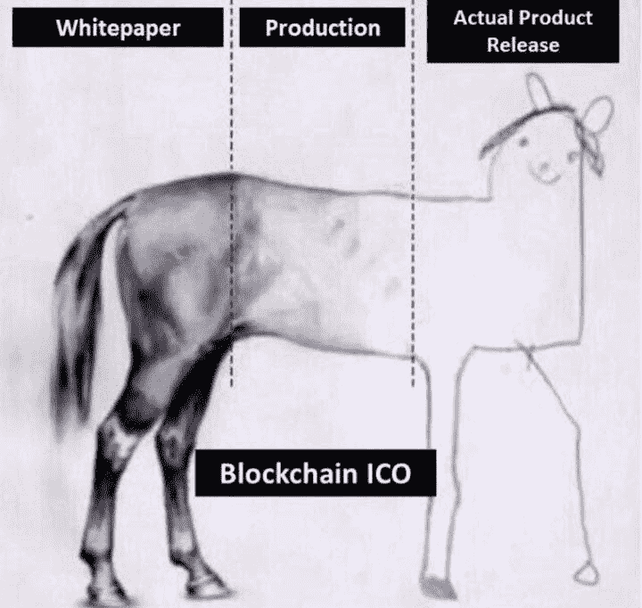

# 每家区块链公司需要推向市场的 5 件事

> 原文：<https://medium.com/hackernoon/the-5-things-that-every-blockchain-company-needs-to-get-to-market-fdf5ce9abc51>

由 [**劳伦·李·安德森**](/@moonshot_us) & [**亚斯米恩·图雷希**](/@yasmeenturayhi)
*品牌说书&产品营销人员*

Source: [https://bit.ly/2sxy63u](https://bit.ly/2sxy63u)

如果 2017 年是首次发行硬币(ICO)和区块链首次进入主流(主要通过比特币)的一年，那么 2018 年应该是发货年——交付价值和兑现承诺。ICO 作为一种围绕一个想法筹集资金的革命性方式迅速获得了关注，我们看到成千上万的公司吵着要大量的美元和聚光灯。但明显缺乏的——但绝对重要的——是进入市场、教育消费者并与他们沟通的能力。在这篇文章中，我们想分享去年的一些教训，并思考严肃的区块链公司如何找到自己的优势，并在全球观众中捍卫一个行业。

## **#1 招聘合适的团队。**

诚信对于任何在区块链生态系统中工作的人来说都非常重要。随着 ico 的兴起，越来越多的公司无法实现他们承诺的愿景，再加上糟糕的用户界面/UX、客户服务和直接的骗局，公众对这个领域的看法充满了怀疑和沮丧。虽然几乎任何公司都可以对“短期收益”充满诗意，但长期成功是通过信任和尊重获得的。如果公司领导不雇用正直的员工(或者他们自己也不正直)，他们的公司长期存在的可能性几乎为零。

虽然开发人员和产品愿景者是开发产品路线图的关键人物，但雇佣合适的人来实际执行和传达愿景也是至关重要的。许多公司正在招聘从未涉足科技公司、从未推出过产品或从未在营销、销售或运营等特定职能部门工作过的人来领导跨职能团队。更糟糕的是，这些新人中的许多人负责在新的生态系统中领导公司的战略，而不是为了成功而设立的。你不用在 LinkedIn 上看太远就能注意到有多少人从非技术角色和行业变成了“ICO/区块链专家”。

更糟糕的是，很多公司除了开发人员或技术团队，还没招到人。

在这个领域中，最大的差距存在于开发者和其他人之间，双方都想知道为什么他们会迷失在翻译中。虽然我们知道关于生态系统的高级对话对生态系统的发展很重要，但不要认为人们会自然理解 3.0 对话，如果你在 1.0 上失去了它们。

过度复杂的信息传递和使用技术术语意味着只有很少的人会加入你的行列。如果你的目标是向开发者推销你的产品，这很好，但是如果你是与消费者和企业一起工作，我们可以保证，如果你创造了一个过于技术性和缺乏关联性的信息，你将会失去一些人，并在这个过程中产生困惑和沮丧。

公司需要招聘项目经理、产品经理、产品营销人员、品牌营销人员，根据他们的产品版本，还需要招聘需求挖掘营销人员、运营、销售、客户成功线索或多面手，他们都有在科技公司和初创公司担任多种职务的经验。

## **#2 GTM 策划&执行，执行，执行**。

虽然大多数 ICO 支持的公司已经筹集了足够的资金，让任何非 ICO 创业公司都羡慕不已，但这些公司中的绝大多数并没有按照他们承诺的路线图执行。后 ICO 时代，公司似乎从网络上消失了。虽然这与平均创业失败率(95%)没有太大区别，但区块链领域的公司拥有的是资本——这也让许多投资者和消费者想知道他们是如何配置资本的。

当然，私营公司不必分享他们的财务状况，但如果没有任何系统或基础设施来监督资金是如何分配和支出的——特别是对于许多第一次创业的人来说——挪用资金的可能性是存在的。生态系统需要的是经过深思熟虑的产品路线图和具有里程碑意义的执行/上市计划，以便在一致和定期的基础上与客户分享，类似于大多数通过投资者和股东强制问责的技术公司。幸运的是，生态系统创造了 SAFT 和其他法律协议，如[按资产支付的象征性债务(DPA)](https://bitcoinexchangeguide.com/republic-crypto-token-dpa-debt-payable-by-assets/) ，这些协议通过仅在公司达到特定里程碑时向其提供资本来保护投资者。执行是展示正直的最直接、最简单的途径。投资者和客户都应该提出正确的问题，让公司对自己的使命负责。

## 不要等到第 5 版才推出你的产品。

虽然一些公司确实需要更多时间来执行他们的路线图，特别是因为区块链是不可改变和不可逆的，这使得精益初创公司“快速失败模式”难以执行，但许多公司属于两个阵营之一:1)他们要么没有产品展示，没有合适的团队或技能来执行他们的愿景，陷入停滞和缓慢消亡；2)他们一直在建设，但要等到第 5 版可用后才能与世界分享消息。虽然这在某些情况下可能是有意义的，但大多数公司没有分享他们产品的早期版本，因此没有得到他们需要的反馈。向你的客户和投资者展示你的进展。一家公司所能做的最糟糕的事情就是什么都不做，什么都不交流，这是我们在过去 6-9 个月中从该领域的大多数公司中注意到的一种趋势。

## 你讲的故事很重要。

区块链是如此新颖和具有颠覆性，不仅该领域的参与者需要教育市场了解一个全新的事物，而且他们必须在持续面临不确定性(即监管)、扩大神话差距(即区块链让罪犯和黑暗网络成为可能)、怀疑论者和直截了当的仇恨者的情况下这样做。该领域的公司必须平衡与两极分化严重的受众、热情的技术社区、成群的虚假和欺诈性垃圾邮件发送者以及仍在为“比特币”挠头的主流群体的沟通。也就是说，定位和营销区块链的产品和服务是困难的。但这也是它的本质。

许多更杰出、更有前途的区块链公司都是由技术人员组建的，开发人员与其他开发人员交流并不困难。这是以一种对其他人都有意义的方式来定位价值和承诺，这就带来了问题。其他每个人都是在大规模上创造真正的采纳和真正的颠覆所需要的，至少是 Satoshi 所想象的那种规模。

要在开发人员或密码爱好者社区之外进行有效的定位，需要雇佣能够首先翻译和解释潜在价值，然后说服市场的人。他们的任务是说服人们走出根深蒂固的中央集权式信任体系，进入新的信任体系。如果我们不能传达正确的故事，革命性的技术就无法改变世界。区块链可能会颠覆我们与世界交易和信任的方式，但我们讲述的故事是让人们参与进来的工具。区块链公司需要清楚他们的产品，关心这个故事，并找到合适的人来解码和教育他们的市场。

## **#5 在你的品牌识别中要避免什么。**

一旦你清楚你在建造什么，为谁建造，为什么建造，你如何讲述你的故事就是下一个关键部分。因为我们去年看到了很多 ico，而不是很多发货承诺，所以有几个要点在定位、营销和品牌形象方面非常突出。

你的白皮书不是营销材料。但是你应该能够提取、翻译并清楚地传达技术提案的价值。较长的白皮书并不等同于成熟，营销白皮书和技术白皮书是有区别的。长篇大论和白皮书通常(但不总是)意味着信息混乱。少说话其实就是在你推出产品的时候多说话。要在这个领域受到重视，需要深思熟虑，并了解如何将想法推向市场。

**如果你的外表和声音都和其他人一样，你就无法脱颖而出。在区块链，流行语的使用和视觉同质化现象非常普遍。访问 15 大市值代币/公司的网站，你就会明白我们的意思。这不是一个品牌战略黎明相同的区块链审美和其他人一样(太空，未来，几何)并相信人们会得到你。如果你想与众不同，那就进行一次真正的品牌自我发现，打造一个独特的、可拥有的、最重要的是真实的身份。品牌是外部世界与你的关系——因此，当你深刻了解自己时，世界其他地方也能了解你。一旦达到这种自我意识的程度，你就准备好创造品牌的所有可能的表达方式，从你的标志到你的网站，到你发布的每一条信息。**

今年上半年，资本流动和该领域的炒作程度令人清醒。对于那些想轻松赚钱的人来说，这是个坏消息，但对于那些认真对待他们正在建造的东西的人来说，这是个好消息。因为区块链是不可变的、不可逆的和开源的，所以公司需要在发布产品功能和向客户和投资者传达他们的进展之间找到正确的平衡。简单地什么都不说会延续围绕区块链/ICO 产业的负面宣传。

教育市场从来没有像现在这样重要，当区块链吃掉世界时，那些以诚信和真实性出现并把它与产品推向市场结合起来的人将是赢家。

[**Yasmeen Turayhi**](/@yasmeenturayhi)**是产品营销者、梦想家、讲故事者&电影编剧。痴迷于推出产品。过度活跃的想象力。终身学生。密码爱好者。
*推特:*[*@ Yasmeen _ BT*](https://twitter.com/Yasmeen_BT)**

**劳伦·李·安德森(Lauren Lee Anderson)是 [Moonshot](http://moonshot.us/) 的创始人，这是一家为那些试图在破坏中建立信任的公司带来创造性故事和战略品牌的机构。关注超越现状的人、技术和想法，它们塑造了我们未来的元叙事。
*推特:*[*@ moon shot _ us*](https://twitter.com/moonshot_us)**

**我们将于 2018 年 9 月 19 日在旧金山联合举办为期 1/2 天的密集研讨会。来加入我们吧！**

## **我的书”[产品营销被揭穿。亚马逊上有重要的上市指南"](https://www.amazon.com/dp/1718968124/ref=sr_1_44?ie=UTF8&qid=1535685326&sr=8-44&keywords=product+marketing)！**

****