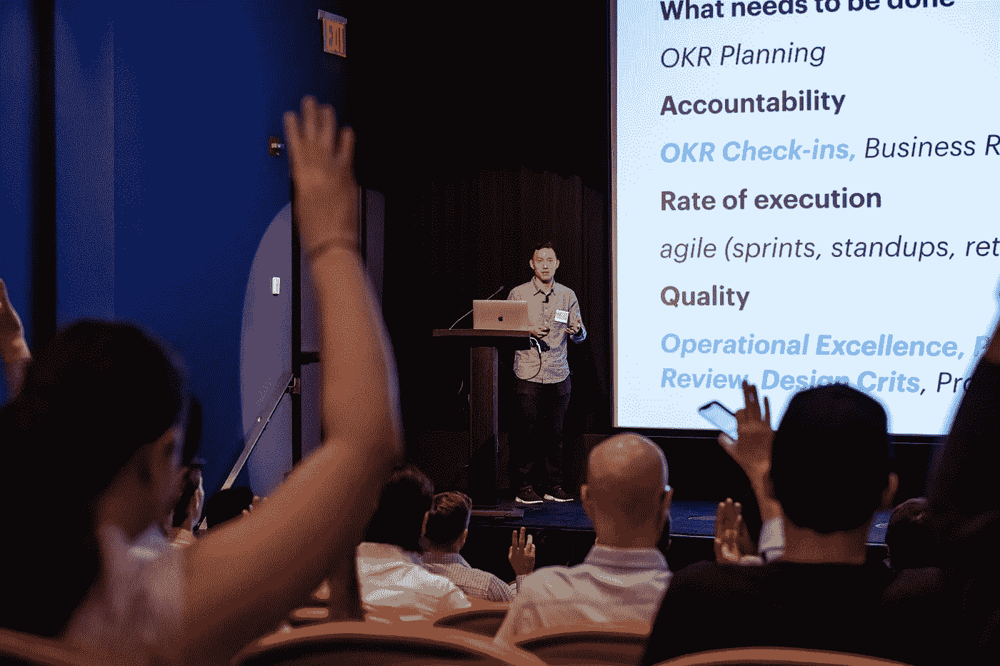
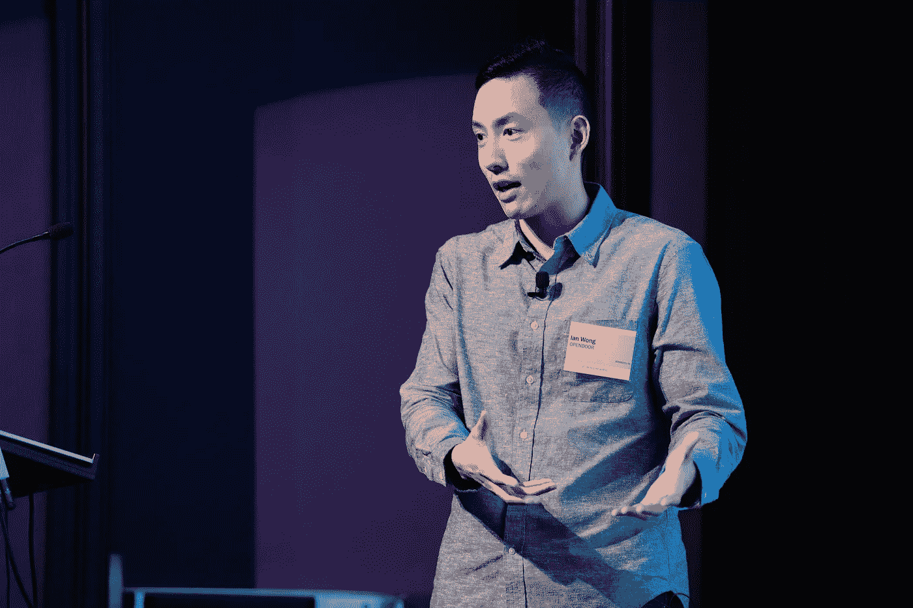

# 支持工程团队扩展的 6 种机制

> 原文：<https://medium.com/hackernoon/the-6-best-mechanisms-to-put-in-place-when-scaling-your-company-856bbcbd8f49>

Photo by Shane Aldendorff (Unsplash)

## 良好的意图不会扩展，机制会

在早期，任何初创公司的目标都很明确:让业务向前发展——理想情况下，向右上方发展。

因为团队是如此的精干，并且紧紧围绕着少数几个目标，所以每个员工都明白谁拥有什么，需要做什么工作，以及工作的质量应该是怎样的。现有的流程(如果有)都是基本的。

**也没关系。**

年轻的公司不需要过于复杂的系统来阻碍早期的发展势头。

但是，当这家年轻的公司开始扩大规模时，会发生什么呢？随着五人团队变成五十人？随着您的客户群从 20 增长到 20，000？正如一家公司成熟一样，它的运营机制也必须成熟。

在 first mark 2018 年首席技术官峰会上， [Opendoor](http://opendoor.com/) 的联合创始人兼首席技术官 Ian Wong 分享了六个关键机制，这些机制帮助他的团队在短短四年内从 4 名员工扩展到 650 多名员工。

> ***好心没好报**——**机制做**。*你很快就会意识到，这不仅仅是你召集的人的问题，不仅仅是市场的问题，不仅仅是你的想法的问题，这实际上是作为领导者的元工作的问题，是让伟大工作得以发生的工作的问题。”**

**

*Ian Wong, Co-Founder and CTO of Opendoor*

# *让你的计划走上正轨*

*伊恩分享的第一个机制是一个适当的计划系统，它可以让你的公司走上正轨。这创造了效率和责任。*

*许多人熟悉并接触过 OKR 框架。由安迪·格罗夫开发，OKR 代表:目标和结果。目标是你希望实现的目标，关键结果是你计划如何实现目标。*

*例如，一个目标可能是“取悦我们的客户”，而一个关键结果可能是“实现 NPS 每月 30%的增长”*

*在他实现 okr 之后，Ian 意识到它们绝不是一个完美的解决方案。“一开始，我们按月实施 OKRs，后来改为每六周一次，现在是每季度一次。当我们第一次实现它们的时候，我们拥有全部的能量。我们说，‘嘿，我们要做这五件事。’但是六个星期后，我们入住时，一半的 okr 是红色的，另一半不再适用。"*

*那么是哪里出了问题呢？Ian 分享了他调整 OKR 框架的两个小方法，为 Opendoor 创建一个更加优化和现实的规划机制。*

***1|创造‘抱负’&‘承诺’关键成果***

*Ian 建议将关键结果分为两类:期望的(AKRs)和承诺的(CKRs)关键结果。这是一种简单有效的方法，可以增加清晰度，为团队成员设定更清晰的期望，并创建更健康、更灵活的计划流程。*

*一个**期望的关键结果**是“你希望团队*真正*追求的”——这是一个很大的转变。但是，从商业的角度来看，团队只实现 70-80%的目标是可以接受的。例如，将网站流量提高 10 倍是有抱负的，而达到这个目标的一小部分仍然被认为是成功的。当然，并非所有的关键结果都如此令人振奋。*

*确定**承诺的关键结果**也很重要——这些通常在本质上更具有二元性(例如运送产品)，并且 100%完成是不可协商的。*

*想知道设置多少 okr？Ian 说神奇的数字是每个团队大约 3-5 个 okr，每个 okr 包含一个目标和大约三个关键结果。*

***2|围绕 OKR 签到建立严密性***

*Ian 还针对每个 OKR 实现了围绕计划、问题和进展的轻量级模板化讨论。这创造了跨团队和领导层的透明度。*

*几经反复后，Ian 决定每两周 30 分钟与 OKRs 进行一次检查。这种频率足以促进持续的进展和消除障碍，同时不会产生太多的管理开销。更频繁的讨论也使动态和灵活的规划过程成为可能，这对于目标可能会随着时间的推移而变化的规模公司来说是至关重要的。*

*健康规划过程的最后一个方面是突出你的团队目前没有优先考虑的任何目标——对于任何资源稀缺的初创公司来说，这是一个同样重要的区别。*

**

*Ian Wong, Co-Founder and CTO of Opendoor, at the FirstMark CTO Summit on June 13th, 2018*

# ***保持轨道稳定***

*随着 Opendoor 规模的不断扩大，越来越多的高层领导加入团队，Ian 意识到，为了保持组织的稳定，他需要关注两个非常明确的领域:(1)卓越的运营和(2)事后分析流程。*

***3|批判性地思考你的监控过程***

*帮助 Ian 团队的另一个过程调整是实施一个监控过程……针对他们的监控过程。当团队的新工程副总裁开始工作的同一周发生两个意外的 Sev0s 时，他第一次意识到需要改变，这使他重新审视他当前的 bug 监控流程是否有效:*

> **我们了解到，我们没有部署适当的监控人员来了解我们的事件响应质量，或者我们的监控流程是否有效。**

*虽然这听起来是递归的，但这是在扩展时保持流程健康的重要一步。*

*通过反思团队的监控过程，Ian 发现了一些产生重大影响的简单调整。一个具体的例子是以更细的粒度跟踪 bug:bug 的性质、严重性级别、违反了哪些 SLA、谁在待命，以及其他因素。*

*这使得团队能够轻松地对 bug 队列进行可操作的分析。它还为领导层提供了一个高级仪表板，有助于提高卓越运营会议的效率和效果。*

***4|实施事后分析模板以确保一致性***

*除了更强大的 bug 跟踪系统之外，Ian 说，随着组织的扩展，规范的事后分析过程对于保持稳定性是必不可少的。*

*在早期，当一个较小的工程师小组进行事后分析时，您可以假设团队对哪里出了问题以及需要补救什么的理解是完全覆盖和一致的。然而，随着规模的扩大，这种假设不再成立。Ian 和他的团队再次求助于一个正式的模板来确保整个组织的一致性。*

*最重要的是，模板的开头是这样一句话:“不管我们发现了什么，我们理解并真诚地相信，每个人都尽了自己最大的努力，以他们当时所知道的，他们的技能和能力，可用的资源，以及手头的情况。”这种共同的愿景促进了整个团队的开放性和成长心态。*

*该模板包括以下几个部分:发生了什么，受到了什么影响，时间表，五个“为什么”，防止未来发生类似问题的想法，以及最后产生的行动项目，这些行动项目将被发送给吉拉，以确保根本问题得到解决。*

**

*Ian Wong, Co-Founder and CTO of Opendoor, at the FirstMark CTO Summit on June 13th, 2018*

# ***保持质量在正轨上***

*当一家公司扩大规模时，第三个也是最后一个不可避免的问题是工作质量。伊恩分享了他降低这种风险的两种方法。*

*第一种方法是采取更主动的姿态，例如，定义质量在你的公司意味着什么。第二是在你公司生活的早期努力养成更好的习惯。*

***5|定义质量对*你的*组织**意味着什么*

*随着公司规模的扩大，确保一致质量的最简单方法之一是主动定义质量本身，而不是被动地解决质量问题。*

*对 Ian 来说，质量的定义是在设计文档模板中编写的。该模板为工程师提供了一种结构化的方式来思考和记录新功能是如何设计的，例如，阐明“对其他利益相关者的潜在影响”除了让工程师的生活变得更容易，它还天生增加了跨团队设计的一致性。*

> **我们中的许多人在扩大规模时都在为质量而奋斗，原因是我们对当前的需求反应太快，我们没有后退一步，主动思考如何提高质量。**

*6|不要低估良好习惯的力量*

*Ian 还补充说，在小组中进行简单的设计评论对早期形成正确的习惯非常有帮助。如果这些习惯在一家公司还年轻的时候就已经根深蒂固，那么随着公司规模的不断扩大，这些习惯只会增加它们的积极影响。*

*虽然许多评审过程可能会感觉沉重和自上而下，但轻量级的 crits 使设计师和工程师能够感受到对他们工作质量的真正所有权和责任。*

*最后，“良好的意图不重要，重要的是机制。”虽然这听起来很简单，但有时对内部流程最简单的改变可能是成功扩大公司规模或眼睁睁看着公司无法应对增长的区别。*

# *总结*

1.  *创造“期望的”和“承诺的”关键成果*
2.  *围绕 OKR 登机手续建立严密性*
3.  *批判性地思考你的监控过程*
4.  *实施事后分析模板以确保一致性*
5.  *定义质量对*你的*组织意味着什么*
6.  *不要低估良好习惯的力量*

*在推特上关注伊恩，点击 [@ihat。](http://twitter.com/ihat)*