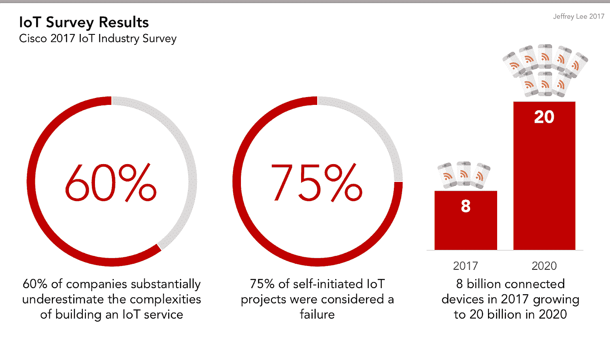
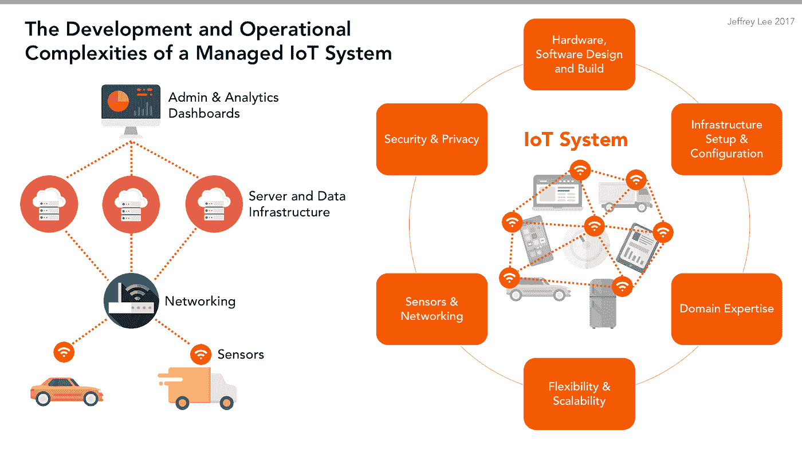

# 构建托管物联网平台的 6 大复杂性

> 原文：<https://medium.com/hackernoon/the-6-complexities-of-hosting-a-managed-iot-service-b7696eea52ba>

## 为什么低估复杂性会导致 75%的自发物联网项目失败

[IoT](https://hackernoon.com/tagged/iot) (物联网)行业正处于一个快速增长的时代，[行业专家](http://www.gartner.com/newsroom/id/3598917)预测联网设备的数量将从 80 亿台(2017 年)增长到 200 亿台(2020 年)。随着越来越多的公司寻求进入物联网领域，他们在构建和部署物联网项目时面临着前所未有的挑战。

根据[思科调查(2017)](https://www.slideshare.net/CiscoBusinessInsights/journey-to-iot-value-76163389) ，超过 60%的受访者承认他们大大低估了管理自己的物联网计划的复杂性。更令人担忧的是，同一项调查还发现，75%的自发物联网项目被认为是失败的。

是什么让这些物联网计划如此复杂？嗯，当谈到管理自己的物联网服务时，你基本上是在构建一个[软件](https://hackernoon.com/tagged/software)和硬件生态系统，比标准的 web 应用程序复杂得多。这个生态系统需要多种工程学科的专业知识:计算机、电气、硬件、网络、devo PS……不胜枚举。

为了推出成功的物联网系统，您必须首先了解设计、构建和维护此类系统的内在复杂性，并决定是构建定制平台还是购买托管物联网解决方案更好。

# 什么是托管物联网平台？

从根本上说，它是一种完全集成的服务，可以提供连接和部署物联网设备所需的一切。它需要能够支持数以百万计的同时设备连接，并允许消费者轻松配置他们的设备进行机器对机器的通信。这意味着受管物联网服务必须通过实时事件流建立双向通信协议(如 [pub/sub](https://realtimeapi.io/hub/publishsubscribe-pattern/) 消息模式)。

尽管如此，许多公司往往忽略了远程管理成千上万台同时运行的设备、在它们之间建立连接的复杂性，以及构建能够处理所有这些和更多内容的云基础架构的基础。

# 创建和托管受管物联网平台有哪些复杂性？

## 1.设计、构建和测试软件和硬件

就像任何自我管理的服务一样，您必须花费大量的时间(几周或几个月)来确定运行这种服务的硬件、软件、网络和服务器要求。这通常意味着你需要雇佣新的资源和/或重新利用现有的资源来进入开发阶段。此外，您还需要构建专门针对物联网系统和硬件管理的开发、部署和测试基础设施。这包括配置网络，规划连通性和冗余策略，以便其他设备可以轻松连接到该网络。

## 2.基础设施设置和成本

据 Gartner 称，2017 年终端基础设施和服务的总支出将达到近 2 万亿美元。对于受管物联网服务，除了纯 web 应用程序所需的普通服务器架构之外，还有更大的前期成本。公司需要建立自己的托管云服务、事件 API 基础设施和容错实时通信渠道。这些服务中的大部分需要从多个第三方供应商处购买，随着项目的进一步发展，这会产生大量未知的支出和资源。

## 3.领域专业知识

开发物联网服务需要广泛的专业知识:嵌入式技术、电气工程、DevOps 实践、服务器基础设施、制造、安全等等。事实上，[思科(2017)](https://newsroom.cisco.com/press-release-content?articleId=1847422) 发现，在项目的整个生命周期中咨询物联网领域专家的大多数公司都能按时完成。单干的公司经常会超出他们最初的时间表，并且发现他们缺乏保持项目正常运行的内部专业知识。不幸的是，当公司意识到他们需要额外的专业知识时，他们通常已经深入到了开发过程中，这使得旋转成本成倍增加。

## 4.灵活性/可扩展性

每个项目都面临可扩展性问题，但是想象一下从 100 个扩展到 10，000 或 100 万个连接设备。如果您没有正确扩展，您的成本将会飙升，您的系统将会失败。当扩展物联网时，你不是扩展单个技术或产品，而是扩展整个流程。您必须扩展业务运营、数据流程、产品基础设施和 API 基础设施。

适应不断发展的客户和市场需求很难，增加新的物联网设备产品更是难上加难。即使在创建自托管解决方案时，网络架构师也需要依赖许多供应商来提供传感器硬件、无线电技术和云平台。如果你选择了错误的供应商，你可能会发现自己被一个不兼容的硬件或软件所困。

## 5.物联网传感器和网络复杂性

根据[英特尔(2016)](http://r-stylelab.com/company/blog/iot/internet-of-things-how-much-does-it-cost-to-build-iot-solution) 的数据，85%的小工具没有配置为相互通信或连接到互联网。这意味着受管物联网服务需要中间件来打开设备传感器及其应用层之间的网关连接。你不仅要集成这种类型的中间件，而且网络工程师也需要测量和维护它们。当您集成物联网传感器和数据流时，您现在可以同时处理万亿字节的数据。您的组织突然变成了一家大数据公司，必须处理可能包含敏感信息的海量数据集。

## 6.安全/隐私问题

有了物联网，就不缺安全顾虑。基本上，您需要创建一个服务来保护设备连接、云连接、API 连接以及连接到托管服务的任何其他东西。这也不是一次性设置，受管物联网服务需要一个动态流机制，以满足监控、检测、访问控制和其他安全需求。这不仅需要顶尖的加密专业知识，还需要由领域专家编写的特定固件。许多项目需要遵守 HIPPA 和其他行业特定的联邦指导方针。这些法规不断发展，要求您更新软件和固件。

# 底线

总之，这 6 个复杂性使得在维护您当前产品的基础设施的同时托管您自己的物联网解决方案变得困难。这样做的目的不是让你感到气馁。事实上，您可以采取许多解决方案和步骤来成功完成自己的物联网计划。

# 克服这些复杂性

公司可以采取两种选择:建立一个定制的物联网平台或购买一个托管的物联网平台。对于构建路线，您必须研究、规划和咨询领域专家，以帮助您确定物联网项目的范围。首先，这里有一些物联网[白皮书](https://www.particle.io/white-papers/all)，帮助您了解更多关于基本物联网基础设施、安全性、供应链管理和电源管理的信息。请记住，在您的规划和资源估计中，要彻底解决六个复杂性中的每一个。

第二种选择是构建托管物联网平台，提供部署物联网产品所需的硬件、软件和连接。当您使用像 [Particle](https://www.particle.io/) 这样的预建平台进行构建时，您还可以获得物联网专家、支持服务和[工程服务](https://www.particle.io/particle-studios/#architecture-review)来帮助您完成物联网开发周期的每个阶段。

# 总而言之

本文的目的是向您介绍托管托管物联网服务的复杂性。通过预先解决这些复杂性，您可以大大增加推出成功物联网解决方案的机会。总而言之，您必须决定构建自己的物联网系统是否值得花费时间、成本和风险，或者购买预构建的解决方案来帮助减轻这些复杂性。