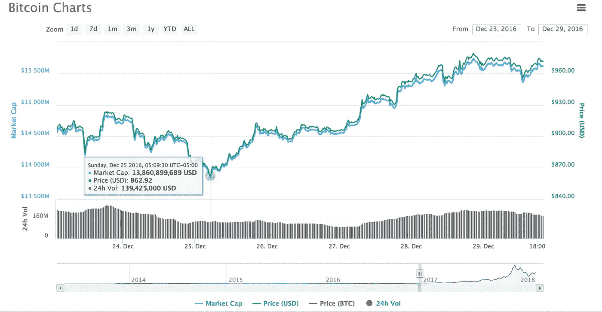

# 人们在场外交易比特币时犯的 6 个最昂贵的错误

> 原文：<https://medium.com/hackernoon/the-6-costliest-mistakes-people-make-when-trading-bitcoin-otc-d975d4acda25>

机构投资者和高净值个人(HNI)在想要购买或出售大量加密货币时，通常会使用**场外交易(OTC)** 交易。

这是因为，虽然 99%想要购买或出售加密货币的人可以直接在交易所进行，但在交易所下巨额订单可能是一项成本高昂的任务。

假设你是一个机构投资者，试图购买价值 100 万美元的比特币，或者你是一家加密货币初创公司，试图出售通过 ICO 筹集的价值 100 万美元的比特币。如果你试图在加密货币交易所下这么大的买卖订单，订单可能会推动整个市场上涨或下跌，让你损失一大笔钱。

**Large market orders typically go deep into the order book, leading to poor price execution.**

在上面的例子中，100 BTC 的卖出会吃掉订单的买入，从 13，036 美元一直到 12，936 美元甚至更低。在大订单完全执行后，价格将大大低于每 BTC 13，000 美元。想要出售大量比特币的一方需要降低价格。避免这样的情况是投资者进行场外交易的主要原因。场外交易不是在普通交易所进行，而是在交易双方之间直接进行。场外经纪人要么为交易提供流动性，要么找到愿意接手交易的人。因为这是在常规市场之外发生的，交易量是隐藏的，不会被交易所登记。

场外交易场所主要有两种:

1.  **交易商间经纪人**，一家作为中间人撮合买卖双方的公司。交易商间经纪人通常会向交易双方公布撮合服务的固定费用。
2.  **主要场外交易公司**，作为直接交易对手并承担交易风险的公司。主要的场外交易公司将根据市场需求和他们管理风险的能力收取与交易商间经纪人相同或更高的费用。例如，如果你要求购买 100 BTC，他们会查看市场上可用的流动性，以计算他们多快可以对冲自己，并增加一个额外的利差来安全地覆盖他们的风险。

虽然这在原则上听起来不错，但加密场外交易确实不透明。在交易所，你可以在订单簿上看到所有的买卖订单。当你在场外交易时，你不一定知道市场是什么样子，也不知道场外经纪人收取的差价有多大。场外交易提供了匿名性和价格稳定性，但不一定便宜。如果你盲目地进行场外交易，你可能会比在交易所交易时被玩得更惨。如果你不知道这个游戏是怎么玩的，场外经纪人可以也将会从你身上获利。

在本文中，我们将揭示交易者玩的游戏，并为你提供最小化交易成本和市场操纵的策略。

# 场外交易时避免这些错误

通过在交易所下大单，你向市场展示了你的底牌，市场通常会[做出反应并利用你](https://blog.sfox.com/hare-hopping-over-front-running-on-crypto-exchanges-815e0c92dd0b)。场外交易也是如此。虽然场外交易对市场来说是隐藏的，但你可能会无意中把你的手暴露给经纪人，他们可以利用这些信息为自己谋利。

交易是零和游戏。场外经纪人给你的利率越低，他们赚的钱就越多。场外交易经纪人可以采用许多策略来扭曲你对市场的看法，并从你身上获利。

假设你想卖出 1000 个比特币，比特币目前的兑换价格是 10000 美元。

你打电话给几个经纪人询问价格，并告诉他们你的交易细节:

*   经纪人 1:每 BTC 9750 美元
*   经纪人 2:每 BTC 9700 美元
*   经纪人 3:每 BTC 9650 美元

当你给第一个经销商回电话时，市场已经下跌，他已经把愿意支付的价格降到了每 BTC 9720 美元。对于这笔交易，你要比交易价格高出 28 万美元！

事先掌握了你交易的数量、时间和规模，你与之交谈的场外经纪人可能已经做了许多事情来从你的交易中获利。知道交易会推动市场，他们可以抢先调整自己的比特币持有量。他们可能操纵了订单簿，扭曲了你对市场的看法，同意了一个低价格。他们本可以与他们网络中的交易对手分享你的交易细节。他们甚至可以同时做以上所有的事情。

让我们深入探讨一下人们在场外交易时最常犯的错误。我们将解释场外交易者如何从这些错误中获利，以及你能做些什么。

# 错误 1:你货比三家

当试图执行场外交易时，人们通常认为找到一笔好交易的最好方法是通过打电话给多个经纪人并询问价格来货比三家。这样他们可以选择最便宜的。问题是，你告诉越多的人你的交易，他们就越有可能利用这些信息来对付你。

例如，假设你找的一个经纪人是一个交易商间的经纪人。在你给他们打电话询问报价后，他们会告诉他们认识的人来寻找交易对手。现在网络知道有一个非常积极的卖家。交易对手可以从市场上删除他们的购买订单，使比特币的价格看起来更低，这样他们就可以获得更优惠的利率。

关键是避免为了价格而货比三家。虽然你可能认为货比三家有助于你找到最好的交易，但你最终还是摊牌了，经纪人可能会利用这些信息对你不利。

**怎么办反而:**不要货比三家求费率。打电话给不超过一两个场外经纪人，并且只有当你准备好执行交易的时候。

# 错误 2:你摊牌了

即使你只给一个经纪人打电话，告诉他你的交易细节，这也给了他足够的信息来操纵市场，操纵价格。假设你打电话给个人经纪人，说你想在一天内卖出 1000 BTC。你刚刚向市场表明了你的立场，而这些信息可能会对你不利。

你一挂电话，经纪人就抢着卖自己的一些比特币。如果你真的去找那个经纪人，他们可以简单地以较低的价格从你那里买回他们的比特币。即使你选择了不同的经纪人，由于你的 1000 BTC 交易会导致市场下跌，你联系的经纪人可以简单地以更低的价格从市场上买回比特币。无论哪种情况，经纪人都占上风，因为你在交易中泄露了秘密。

**怎么办:**当你给一个场外经纪人打电话时，让他们提供 1000 BTC、500 BTC 和 100 BTC 的买入和卖出汇率。这样，你就能让经纪人亮出他们的牌，而不是暴露你自己的牌。你可以通过买卖差价来估算经纪人的利润率。

# 错误 3:你是可预测的

人们在 OTC 上犯的另一个常见错误是行为可预测。经纪人可以利用行为模式为自己谋利。

比方说，每次你想做场外交易，你就打电话给同一对经纪人，问费率。在一个月的时间里，你每周都这样做。

场外的经纪人并不傻。他们会记录你的行为，他们会知道当你打电话时，你是在和其他经纪人交谈，寻找最有竞争力的价格。为了锁定你的生意，你第一次打电话时，场外交易经纪人可能会给你一个非常有吸引力的窗口价格。在你和其他经纪人谈过之后，你会回去，因为第一个经纪人给了你最有竞争力的价格。这时，他们会让你接受实际利率，不用说，实际利率要高得多。由于这个经纪人最初给出了最好的价格，即使最终价格更高，你也更有可能和他进行交易。

**怎么办:**不要预测你的场外交易。如果一个场外经纪人给你一个听起来好得难以置信的价格，它很可能是真的。向他们摊牌，让他们为你锁定价格。

# 错误 4:你买入或卖出了全部金额

如果你想买或卖 1000 股 BTC 场外交易股票，不要犯把全部金额塞进一次交易的错误。你卖出 10 个 BTC 的回报率会比你卖出 10，000 个 BTC 的回报率高得多。对于大宗交易，市场波动和价格下跌的风险总是存在的。场外经纪人将这种风险计入他们给你的利率中。以每 BTC 10，000 美元的价格卖出 10，000 个 BTC 的订单，价格上涨 10%就会损失数百万美元。

为了调整这种风险，经纪人会深入到订单簿中为你提供一个不利的价格。

**改做什么:**不要在单笔场外交易中买入或卖出全部数量的 crypto。把你的订单分成几个小的交易，每个 10 BTC。

# 错误 5:在缓慢的市场中进行场外交易

仅仅因为场外经纪人为你提供价格保证，并不意味着你的交易完全不受市场波动的影响。场外交易的另一个常见错误是试图在一个缓慢的市场进行交易。

*The chart above shows a sharp dip in 24-hour volume for Bitcoin on Christmas Day, 2016*

假设你想在圣诞节进行场外交易。因为这是一个假期，市场上的交易量会比一年中的任何一天都要少。为了执行你的交易，场外交易经纪人将不得不比正常市场更深入地进入订单簿，导致更低的价格。

**取而代之的是什么:**在进行场外交易之前，确保市场上有一个合理的交易水平。

# 错误 6:不稳定市场中的场外交易

同样，人们犯的另一个常见错误是在价格波动很大的动荡市场中进行场外交易。理论上，市场在高波动时期会更强劲，因为有更高水平的活动。但请记住，场外经纪人在为交易定价时会收取风险溢价。如果市场波动，就更难知道交易的执行价格，场外交易者将相应收取更高的风险溢价。

**改做什么:**在市场剧烈波动时避免场外交易。等待价格稳定下来，然后再执行交易。

# 把你的牌放在胸前

虽然场外交易帮助你保护你的投资利益不受市场影响，但你不能完全隐藏这种利益，因为你是在和活跃在市场上的中间人打交道。当你进行场外交易时，你需要考虑支付给经纪人的显性费用，以及通过与活跃的市场参与者分享信息而获得的隐性费用。尽量减少你分享的信息，以减少你被操纵的风险。

最重要的是，记住场外交易的三个基本规则:

1.  总的来说，不要被预测。
2.  不要透露你想交易的确切时间，或者全部数量。
3.  只有当你准备好交易时才购物，我们建议不要和超过 1-2 个经纪人交谈。

最后，市场上有许多工具，使得交易者可以更容易地自行买卖加密 OTC。在接下来的文章中，我们将教你如何做。敬请期待！

*以上内容仅代表一种观点，仅供参考。它不是投资建议，也不构成投资建议，也不是购买或出售任何加密货币、证券、产品、服务或投资的要约或要约邀请。找一个有正式执照的专业人士寻求投资建议。此处或包含本网站链接的任何通信中提供的信息不打算分发给任何司法管辖区或国家的任何个人或实体，也不打算由他们使用，因为这种分发给或使用会违反法律或法规，或者会使 SFOX，Inc .或其附属公司受到该司法管辖区或国家的任何注册要求。本网站包含的信息或任何意见均不构成 SFOX，Inc .或其附属公司购买或出售任何加密货币、证券、期货、期权或其他金融工具或提供任何投资建议或服务的邀约或要约。*